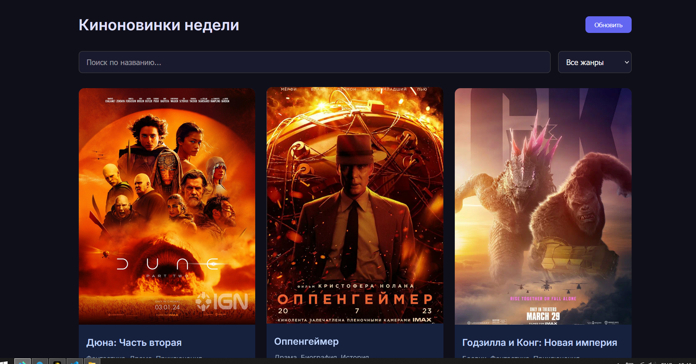

# Министерство образования Республики Беларусь

Учреждение образования

“Брестский Государственный технический университет”

Кафедра ИИТ

      

<strong>Лабораторная работа №3</strong>

<strong>По дисциплине:</strong> “Веб-технологии”

<strong>Тема:</strong> Асинхронность и HTTP‑кэш (fetch, AbortController, ретраи)

      

<strong>Выполнил:</strong>

Студент 4 курса

Группы АС-65

Кужир В. В.

<strong>Проверил:</strong>

Несюк А.Н.

     

<strong>Брест 2025</strong>

---

## Цель работы

Закрепить работу с промисами и async/await, обработкой ошибок, таймаутами и отменой запросов.
Понять основы HTTP‑кэширования и увидеть эффект в DevTools.

---

### Вариант № 36

## Ход выполнения работы

### 1. Структура проекта

- `index.html` — основная страница
- `styles.css` — стилизация и медиазапросы
- `main.js` — основной скрипт

### 2. Реализованные элементы

    - Использовать async/await, try/catch/finally.
    - Управлять конкурентными запросами: отменять предыдущее при новом поиске.
    - Не блокировать UI: skeleton/spinner.
    - Семантика/UX
    - Функциональность (загрузка, поиск/пагинация, retry/timeout/abort)
    - Качество интерфейса (loading/error/empty, skeleton)
    - Качество кода
    - Публикация и отчёт — 10

### 3. Скриншоты выполненой лабораторной работы

---

desktop:

tablet:

mobile:

---

## Таблица критериев

| Критерий                                                          | Выполнено |
| ----------------------------------------------------------------- | --------- |
| Семантика/UX                                                      | ✅        |
| Функциональность (загрузка, поиск/пагинация, retry/timeout/abort) | ✅        |
| Качество интерфейса (loading/error/empty, skeleton)               | ✅        |
| Качество кода                                                     | ✅        |
| Оформление кода/структура проекта                                 | ✅        |
| Публикация и отчёт                                                | ✅        |

### Дополнительные бонусы

| Бонус                                                            | Выполнено |
| ---------------------------------------------------------------- | --------- |
| ETag‑клиентский кэш с If‑None‑Match (на контролируемом сервере). | ❌        |
| Дебаунс ввода, отмена устаревших запросов                        | ❌        |
| Prefetch при прокрутке (инфинит‑скролл).                         | ❌        |

---

## Ссылкы(если требует задание)

https://subtle-wisp-a428d.netlify.app/

## Вывод

Освоил семантическую разметку HTML5 (landmarks, заголовки, alt/label/aria).
Реализовал адаптивную вёрстку по схеме mobile-first с 2+ брейкпоинтами.
Повысил качество интерфейса и доступности (Lighthouse/валидаторы).
