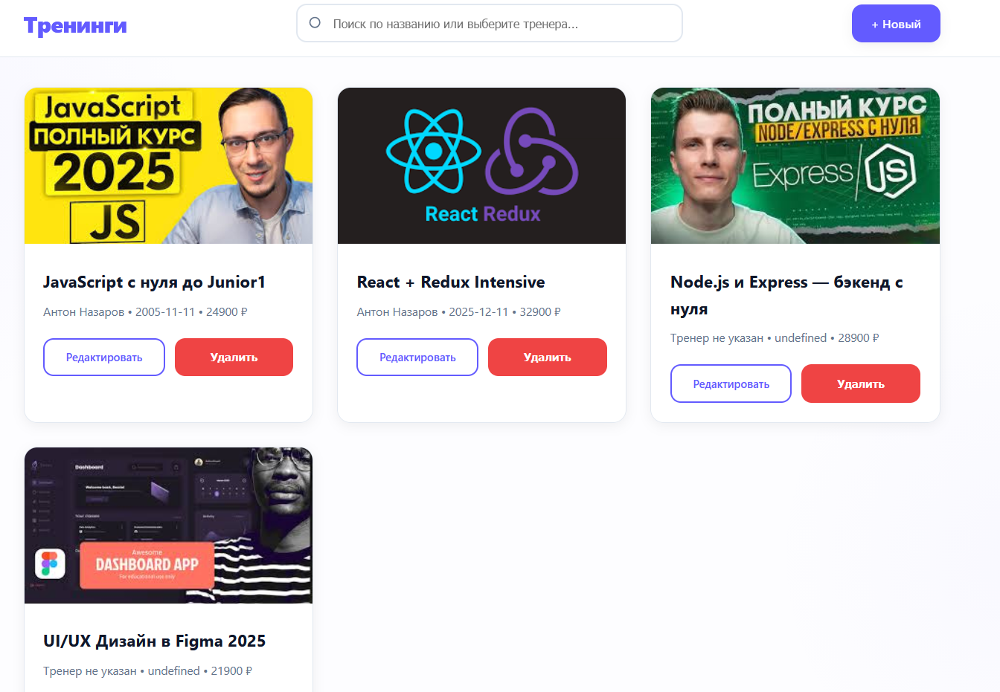
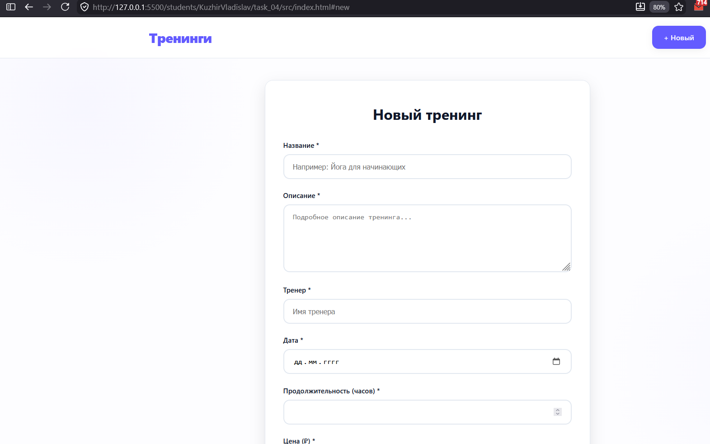

# Министерство образования Республики Беларусь

Учреждение образования

“Брестский Государственный технический университет”

Кафедра ИИТ

      

<strong>Лабораторная работа №4</strong>

<strong>По дисциплине:</strong> “Веб-технологии”

<strong>Тема:</strong> REST‑клиент SPA: список/детализация/CRUD, маршрутизация (без фреймворков)

      

<strong>Выполнил:</strong>

Студент 4 курса

Группы АС-64

Кужир В.В.

<strong>Проверил:</strong>

Несюк А.Н.

     

<strong>Брест 2025</strong>

---

## Цель работы

Реализовать простой SPA без фреймворков с маршрутизацией и состояниями загрузки/ошибок.
Выполнить CRUD к учебному API (реальному или mock).

---

### Вариант №36

## Ход выполнения работы

### 1. Структура проекта

- `app.js` — роуты и скрипты
- `db.json` — json для json server
- `index.html` — основная страница
- `package.json` — npm модули (json server)
- `styles.css` — стилизация и медиазапросы

### 2. Реализованные элементы

- Маршруты (hash): #/items, #/items/:id, #/new, #/items/:id/edit.
- Состояния: loading/error/empty на всех экранах; уведомления об успехе операций.
- CRUD: GET список/деталь, POST создание, PATCH/PUT обновление, DELETE удаление.
- UX: подтверждение удаления; блокировка submit во время отправки; валидация форм; сохранение параметров поиска в hash.
- Маршрутизатор на основе событий hashchange/load и сопоставления маршрутов.
- Разделение на модули: router, api, views.
- Адаптивная вёрстка списка и форм.

### 3. Скриншоты выполненой лабораторной работы

---

## Таблица критериев

👉 Для удобства проверки и выполнения вашей лабораторной работы составьте таблицу критериев опираясь на задание (обычно task_xx/readme.md)

<strong>Пример таблицы критериев: </strong>
_(можно использовать для Лабораторной работы №1)_

| Критерий                            | Выполнено |
| ----------------------------------- | --------- |
| Семантика/структура и UX‑основы     | ✅        |
| Функциональность/CRUD/маршрутизация | ✅        |
| Качество интерфейса                 | ✅        |
| Качество кода/модульность           | ✅        |
| Тесты/валидность                    | ✅        |
| Публикация и отчёт                  | ✅        |

### Дополнительные бонусы

| Бонус                                                               | Выполнено |
| ------------------------------------------------------------------- | --------- |
| Сохранение фильтров/поиска в hash и восстановление при перезагрузке | ❌        |
| Предзагрузка данных (prefetch) при наведении/фокусе.                | ❌        |
| Простая клиентская авторизация (token в header) — если есть сервер  | ❌        |

---

## Ссылкы

https://fancy-boba-6008d2.netlify.app/#

## Вывод

Реализовал простой SPA без фреймворков с маршрутизацией и состояниями загрузки/ошибок.
Выполнил CRUD к учебному API (реальному или mock).
