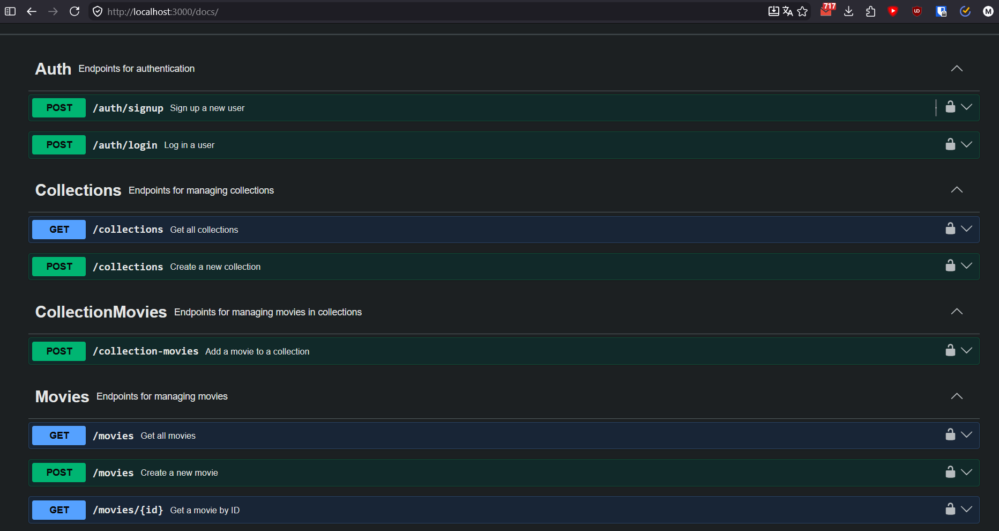

# Министерство образования Республики Беларусь

Учреждение образования

“Брестский Государственный технический университет”

Кафедра ИИТ

      

<strong>Лабораторная работа №6</strong>

<strong>По дисциплине:</strong> “Веб-технологии”

<strong>Тема:</strong> Базы данных и авторизация (SQLite/PostgreSQL + ORM + JWT)

      

<strong>Выполнил:</strong>

Студент 4 курса

Группы АС-64

Кужир В.В.

<strong>Проверил:</strong>

Несюк А.Н.

     

<strong>Брест 2025</strong>

---

## Цель работы

Настроить ORM и схему данных (SQLite/PostgreSQL).
Реализовать регистрацию/логин, выдачу JWT, middleware защиты и доступ к задачам только владельца.

---

### Вариант №36

## Ход выполнения работы

### 1. Структура проекта

├── src 
│ ├── controllers 
│ │ ├── auth.controller.ts 
│ │ ├── collection.controller.ts 
│ │ ├── collectionMovie.controller.ts 
│ │ └── movie.controller.ts 
│ ├── middleware 
│ │ └── auth.middleware.ts 
│ ├── prisma 
│ │ ├── migrations 
│ │ ├── dev.db 
│ │ └── schema.prisma 
│ └── routes 
│ ├── auth.routes.ts 
│ ├── collection.routes.ts 
│ ├── collectionMovie.routes.ts 
│ └── movie.routes.ts 
├── .env.example 
├── index.ts 
├── package-lock.json 
├── package.json 
├── prisma.ts 
├── README.md 
├── seed.ts 
└── tsconfig.json 

### 2. Реализованные элементы

- ORM и схема: Prisma/TypeORM/Sequelize; сущности User и Task с ownerId.
- Миграции/синхронизация схемы. Перенести CRUD tasks на БД.
- Авторизация: /api/auth/signup, /api/auth/login, middleware auth с Bearer‑токеном.
- Безопасность: CORS, ограничения размеров тел, хранение секретов в .env; rate limit по желанию.
- Дополнительно добавил сваггер для удобства

### 3. Скриншоты выполненой лабораторной работы

---

Схема БД/миграции — 20
CRUD + связь с пользователем — 25
Безопасность (хеши, JWT, защита маршрутов, CORS) — 20
Качество кода/архитектуры — 15
Тесты/валидность — 10
Документация/инструкция — 10
Бонусы (+ до 10)
Refresh‑токены и обновление access‑токена.
Роли/права (admin/user).
Password reset flow (email‑заглушка).

## Таблица критериев

👉 Для удобства проверки и выполнения вашей лабораторной работы составьте таблицу критериев опираясь на задание (обычно task_xx/readme.md)

<strong>Пример таблицы критериев: </strong>
_(можно использовать для Лабораторной работы №1)_

| Критерий                                         | Выполнено |
| ------------------------------------------------ | --------- |
| Схема БД/миграции                                | ✅        |
| CRUD + связь с пользователем                     | ✅        |
| Безопасность (хеши, JWT, защита маршрутов, CORS) | ✅        |
| Качество кода/архитектуры                        | ✅        |
| Тесты/валидность                                 | ✅        |
| Документация/инструкция                          | ✅        |

### Дополнительные бонусы

| Бонус                                     | Выполнено |
| ----------------------------------------- | --------- |
| Refresh‑токены и обновление access‑токена | ❌        |
| Роли/права                                | ❌        |
| Password reset flow (email‑заглушка)      | ❌        |

---

## Ссылкы

## Вывод

Настроил ORM и схему данных (SQLite/PostgreSQL).
Реализовал регистрацию/логин, выдачу JWT, middleware защиты и доступ к задачам только владельца.
