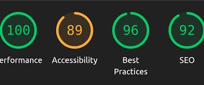

# Министерство образования Республики Беларусь

Учреждение образования

“Брестский Государственный технический университет”

Кафедра ИИТ

      

<strong>Лабораторная работа №8</strong>

<strong>По дисциплине:</strong> “Веб-технологии”

<strong>Тема:</strong> Качество и деплой: тесты, Docker, CI/CD, Lighthouse

      

<strong>Выполнил:</strong>

Студент 4 курса

Группы АС-64

Кужир В.В.

<strong>Проверил:</strong>

Несюк А.Н.

     

<strong>Брест 2025</strong>

---

## Цель работы

Настроить unit/integration/e2e тесты (по мере необходимости).
Подготовить Dockerfile и docker‑compose для локального запуска.
Собрать базовый pipeline в GitHub Actions.

---

### Вариант №36

## Ход выполнения работы

### 1. Структура проекта

. 
├── .github 
│ └── workflows 
│ └── ci.yml 
├── assets 
│ └── style.css 
├── components 
│ ├── Button.jsx 
│ ├── ErrorMessage.jsx 
│ ├── FormInput.jsx 
│ ├── Loader.jsx 
│ └── Nav.jsx 
├── e2e 
│ ├── add-museum.spec.js 
│ └── login.spec.js 
├── node_modules 
├── pages 
│ ├── Login.jsx 
│ ├── MuseumDetail.jsx 
│ ├── MuseumForm.jsx 
│ ├── MuseumsList.jsx 
│ ├── NotFound.jsx 
│ └── Register.jsx 
├── store 
│ ├── apiSlice.js 
│ ├── favoritesSlice.js 
│ └── store.js 
├── tests 
│ ├── Button.test.jsx 
│ ├── favoritesSlice.test.js 
│ └── MuseumsList.test.js 
├── .env 
├── .env.example 
├── App.jsx 
├── db.json 
├── docker-compose.yml 
├── Dockerfile 
├── index.html 
├── main.jsx 
├── package-lock.json 
├── package.json 
├── README.md 
├── router.jsx 
└── vite.config.js 

### 2. Реализованные элементы

- Тестирование: 2–3 unit, 1–2 integration/RTL или e2e (Cypress/Playwright).
- Docker: многостадийный Dockerfile; docker‑compose при наличии БД.
- CI/CD: workflow install → lint → test → build;
- опционально — сборка Docker‑образа и публикация.
- Качество: прогон Lighthouse (Performance/Accessibility/Best Practices/SEO) и скриншоты.

### 3. Скриншоты выполненой лабораторной работы

---

## Таблица критериев

👉 Для удобства проверки и выполнения вашей лабораторной работы составьте таблицу критериев опираясь на задание (обычно task_xx/readme.md)

<strong>Пример таблицы критериев: </strong>
_(можно использовать для Лабораторной работы №1)_

| Критерий                                  | Выполнено |
| ----------------------------------------- | --------- |
| Тесты                                     | ✅        |
| Контейнеризация                           | ✅        |
| CI (сборка/тесты)                         | ✅        |
| Качество интерфейса/показатели Lighthouse | ✅        |
| Качество кода/конфигураций                | ✅        |
| Документация/инструкции                   | ✅        |

### Дополнительные бонусы

| Бонус                                                | Выполнено |
| ---------------------------------------------------- | --------- |
| CD: автодеплой в Pages/Netlify/Vercel/Render/Fly.io. | ❌        |
| Мониторинг ошибок (Sentry) или логирование запросов. | ❌        |
| Проверка типов (TypeScript, strict).                 | ❌        |

---

## Вывод

Настроил unit/integration/e2e тесты (по мере необходимости).
Подготовил Dockerfile и docker‑compose для локального запуска.
Собрал базовый pipeline в GitHub Actions.
