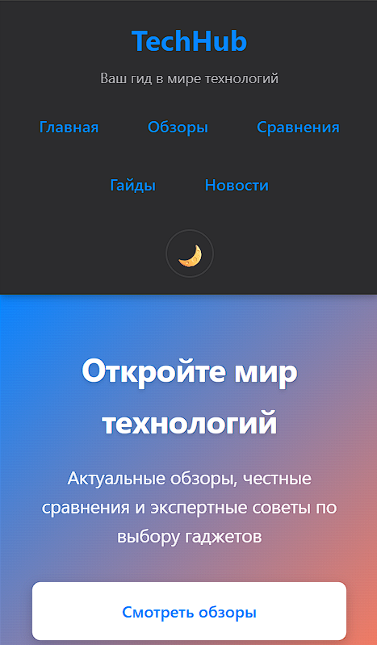
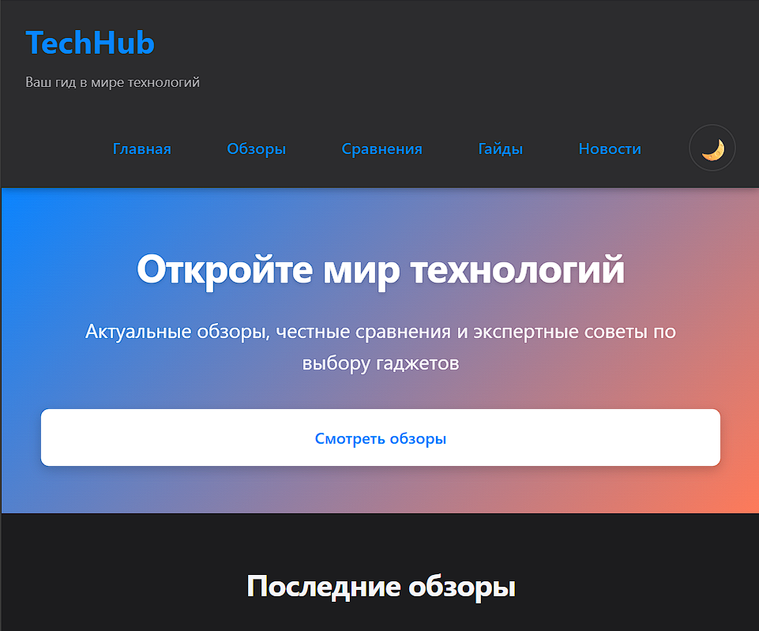
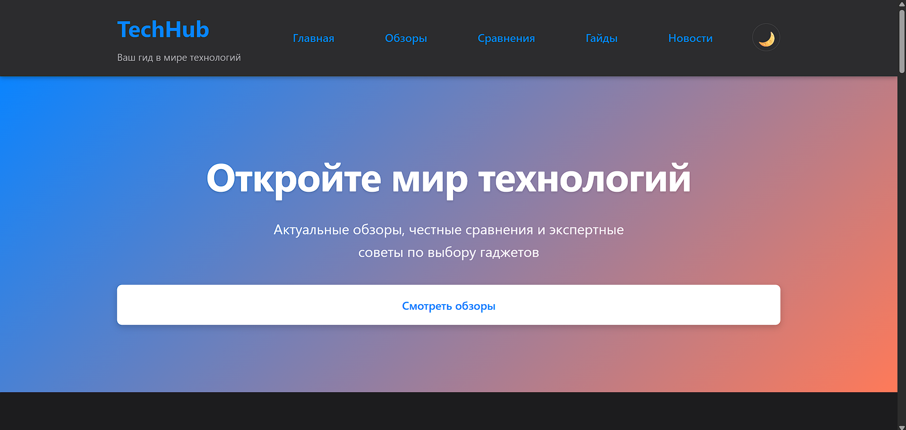
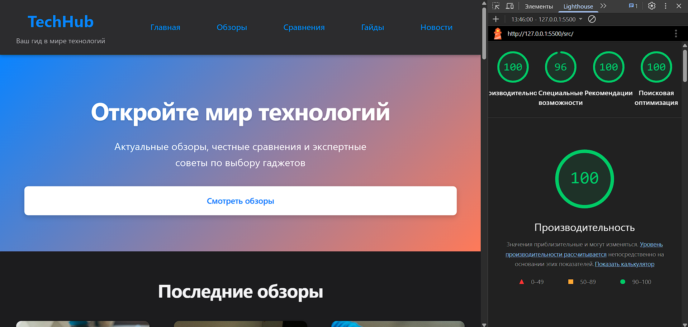

# TechHub — Адаптивный веб-сайт о технологиях

**Студент:** Логинов Глеб (АС-63)  
**Тема:** HTML/CSS: семантика, адаптивность, доступность

**Демо:** [gleb7499.github.io/WT-AC-2025/task_01](https://gleb7499.github.io/WT-AC-2025/task_01/)

---

## 📱 Демонстрация адаптивности

### Mobile (375px)



### Tablet (768px)



### Desktop (1920px)



### Desktop white theme (1920px)


---

## ✨ Основные характеристики

### HTML & Семантика

- Полная структура: `<header>`, `<nav>`, `<main>`, `<section>`, `<article>`, `<footer>`
- Правильная иерархия заголовков: `<h1>` → `<h2>` → `<h3>`
- ARIA roles и labels для доступности
- Семантические теги: `<time>`, `<picture>`, `<form>`
- Meta-теги: Open Graph, theme-color, preconnect

### Адаптивная верстка

- **6 брейкпоинтов:** 481px, 601px, 769px, 1025px, 1441px
- **CSS Grid:** 6 сеток (reviews, comparisons, news, footer, guides, container)
  - Reviews: 1 → 2 → 3 колонки
  - Comparisons: 1 → 2 колонки
  - News: 1 → 2 → 3 колонки
  - Footer: 1 → 2 → 4 колонки
  - Guides: flex → 2-колоночный grid на 769px+

- **Flexbox:** 10+ компонентов
  - Header, navigation, cards, forms, social links
  - Адаптивные направления: column → row

### Доступность

- Контраст текста: 16.1:1 (AAA)
- Видимый focus через `:focus-visible`
- Поддержка клавиатурной навигации
- Alt-атрибуты для всех изображений
- Адаптивные изображения через `<picture>`

### Оптимизация производительности

- `content-visibility: auto` (LCP)
- `contain: layout` (CLS)
- `aspect-ratio` для изображений
- `lazy loading` для картинок
- Поддержка `prefers-reduced-motion`, `prefers-contrast`, `prefers-reduced-data`

### Дизайн системы

- 40+ CSS переменных для цветов, отступов, типографики
- **Темная тема:** автоматическая (prefers-color-scheme) + ручная (кнопка в header)
- Кнопка переключения темы с анимированными иконками ☀️/🌙
- Сохранение выбора темы в localStorage
- Консистентные размеры и промежутки

## 🏗️ Архитектура CSS

### Grid-зоны (адаптивные)

| Компонент | Mobile | Tablet | Desktop | Desktop Large |
|-----------|--------|--------|---------|---------------|
| Reviews | 1 col | 2 col | 3 col | 3 col |
| Comparisons | 1 col | 2 col | 2 col | 2 col |
| News | 1 col | 2 col | 2 col | 3 col |
| Footer | 1 col | 2 col | 4 col | 4 col |
| Guides | flex | flex | 2 col | 2 col |

### Flex-компоненты

- `.header-content`: column → row (выравнивание)
- `.main-nav ul`: горизонтальное меню (flex-wrap)
- `.review-card`: вертикальное распределение (flex: 1)
- `.newsletter-form`: column → row на 601px+
- `.social-links`: горизонтальное выравнивание (flex-wrap)

### Медиазапросы

```css
@media (width >= 481px) { /* Mobile Large */ }
@media (width >= 601px) { /* Tablet Portrait */ }
@media (width >= 769px) { /* Tablet Landscape */ }
@media (width >= 1025px) { /* Desktop */ }
@media (width >= 1441px) { /* Desktop Large */ }
```

---

## ✅ Качество

### Lighthouse результаты



### Валидация

- ✓ HTML5: W3C Validator (0 ошибок)
- ✓ CSS3: W3C Validator (0 ошибок)

---

## 📁 Структура проекта

```text
task_01/
├── src/
│   ├── index.html
│   ├── styles.css
│   └── assets/images/
├── doc/
│   ├── README.md
│   └── screenshots/
```

---

## 🎯 Реализованные функции

- ✓ Семантическая HTML5 структура
- ✓ Mobile-first адаптивный дизайн (6 брейкпоинтов)
- ✓ CSS Grid и Flexbox для компоновки
- ✓ WCAG 2.1 Level AA доступность
- ✓ Темная/светлая тема с кнопкой переключения
- ✓ Автоматическая тема (prefers-color-scheme) + ручное управление
- ✓ Адаптивные изображения через `<picture>`
- ✓ Web Vitals оптимизации (LCP, CLS)
- ✓ Open Graph meta-теги для SEO
- ✓ JavaScript для переключения темы (сохранение в localStorage)
