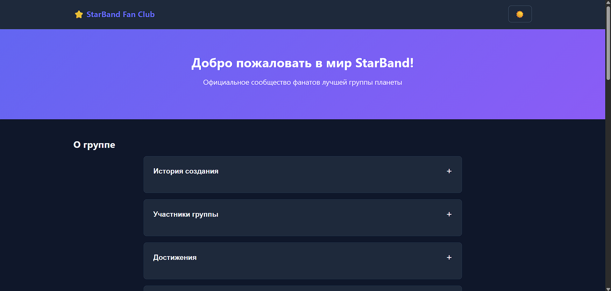
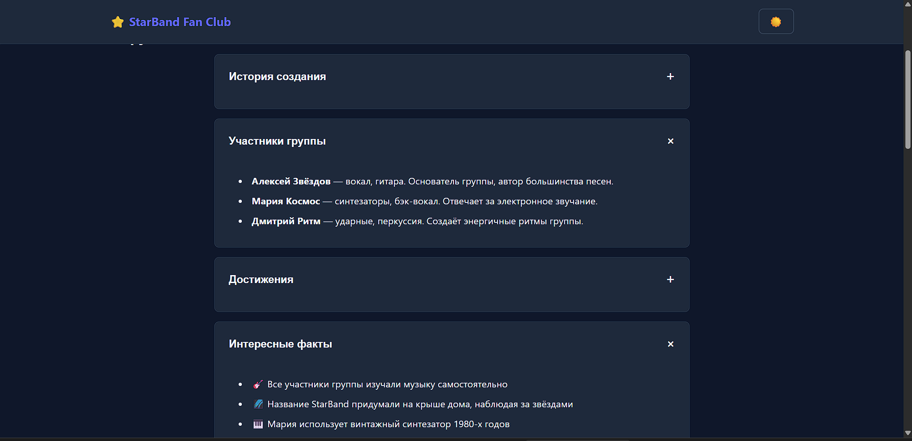
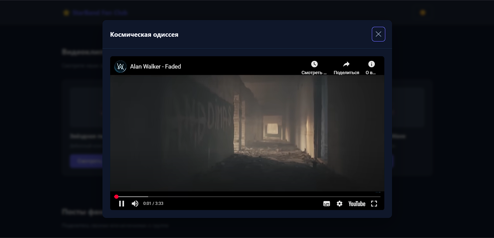
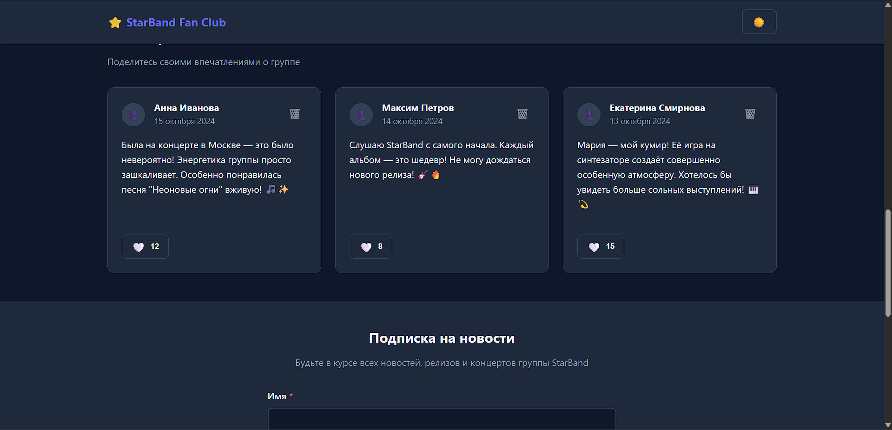
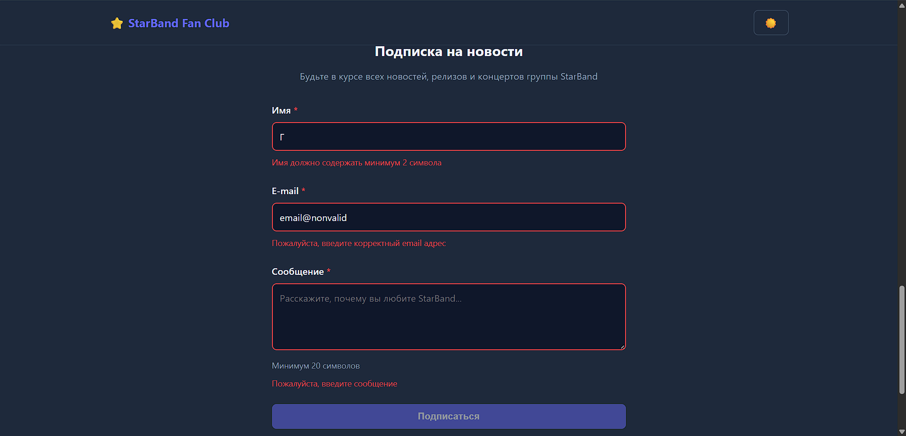
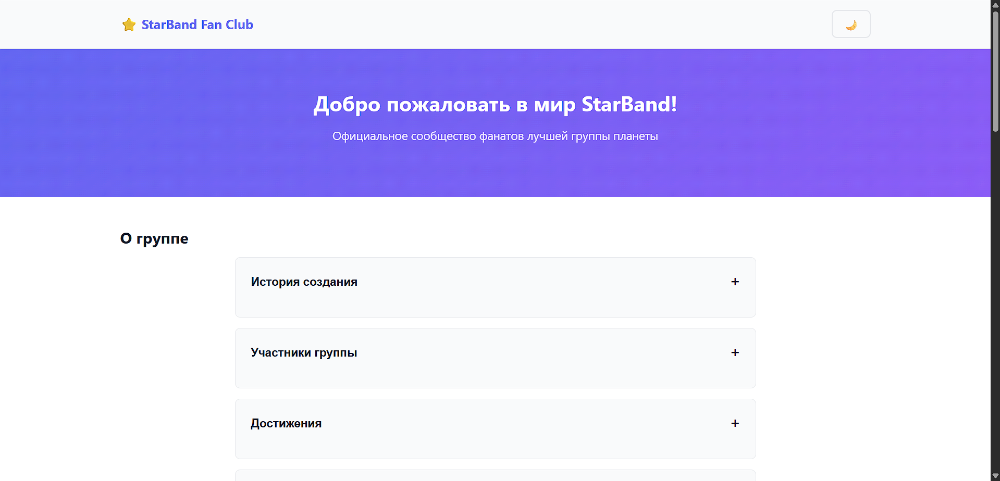
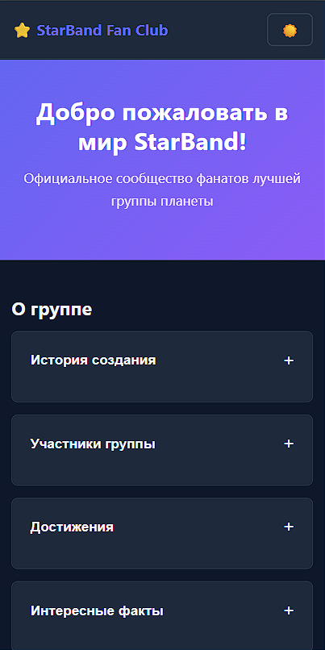

# Отчет по лабораторной работе

<p align="center">Министерство образования Республики Беларусь</p>
<p align="center">Учреждение образования</p>
<p align="center">"Брестский Государственный технический университет"</p>
<p align="center">Кафедра ИИТ</p>
<br><br><br><br><br><br>
<p align="center"><strong>Лабораторная работа №02</strong></p>
<p align="center"><strong>По дисциплине:</strong> "Веб-технологии"</p>
<p align="center"><strong>Тема:</strong> DOM и события: интерактивные компоненты и формы (JavaScript)</p>
<br><br><br><br><br><br>
<p align="right"><strong>Выполнил:</strong></p>
<p align="right">Студент 4 курса</p>
<p align="right">Группы АС-63</p>
<p align="right">Логинов Г. О.</p>
<p align="right"><strong>Проверил:</strong></p>
<p align="right">Несюк А. Н.</p>
<br><br><br><br><br>
<p align="center"><strong>Брест 2025</strong></p>

---

## Цель работы

Освоить работу с DOM: добавление, удаление и изменение элементов интерфейса. Научиться обрабатывать события, использовать делегирование, работать с клавиатурной доступностью. Реализовать дружелюбную клиентскую валидацию форм.

---

### Вариант №1 — Сайт фан-клуба музыкальной группы

## Ход выполнения работы

### 1. Структура проекта

```taxt
task_02/
├── doc/
│   ├── README.md           — отчёт по лабораторной работе
│   └── screenshots/        — скриншоты работы приложения
│       ├── 01-hero.png
│       ├── 02-accordion.png
│       ├── 03-modal.png
│       ├── 04-posts.png
│       ├── 05-form.png
│       ├── 06-light-theme.png
│       └── 07-mobile.png
├── src/
│   ├── index.html          — основная HTML-страница
│   ├── styles.css          — стили и медиазапросы
│   └── scripts/
│       ├── main.js         — точка входа, инициализация компонентов
│       ├── accordion.js    — логика аккордеона
│       ├── modal.js        — модальное окно для видео
│       ├── confirmModal.js — модалка подтверждения удаления
│       ├── form.js         — валидация формы подписки
│       ├── posts.js        — посты с лайками и удалением
│       └── theme.js        — переключатель темы
├── tests/
│   ├── form.test.js        — unit-тесты валидации формы
│   └── integration.test.js — интеграционные тесты компонентов
├── package.json            — конфигурация npm, скрипты и зависимости
├── .eslintrc.json          — конфигурация ESLint
└── .gitignore              — игнорируемые файлы
```

### 2. Реализованные элементы

#### Интерактивные компоненты (4 из 3 требуемых)

1. **Аккордеон** — раздел «О группе» с секциями: История создания, Участники группы, Достижения, Интересные факты
2. **Модальное окно для видео** — просмотр YouTube-видео с встраиванием iframe
3. **Модальное окно подтверждения** — кастомная модалка для подтверждения удаления постов (заменяет блокирующий `confirm()`)
4. **Переключатель темы** — светлая/тёмная тема с сохранением в localStorage

#### Форма с валидацией

- **Поля:** Имя (обязательное, минимум 2 символа, только буквы), E-mail (обязательный, валидный формат), Сообщение (обязательное, минимум 20 символов)
- **Валидация:** происходит при вводе (`input`) и при потере фокуса (`blur`)
- **Кнопка отправки:** неактивна, если форма невалидна
- **Отправка:** предотвращается стандартное поведение, результат выводится на странице

#### Делегирование событий

- Посты фанатов с кнопками «Лайк» и «Удалить»
- Обработчики событий повешены на контейнер `#posts-container`
- Лайки и удаления работают через делегирование

#### Доступность (Accessibility)

- **Клавиатурная навигация:** Tab/Shift+Tab, Enter/Space, Esc, стрелки в аккордеоне
- **ARIA-атрибуты:** `aria-expanded`, `aria-controls`, `aria-modal`, `aria-pressed`, `aria-invalid`, `aria-live`, `aria-labelledby`, `aria-describedby`
- **Семантика:** `<header>`, `<main>`, `<section>`, `<article>`, `<footer>`, `<nav>`
- **Фокус-менеджмент:** Focus trap в модалках, возврат фокуса при закрытии
- **Визуальная доступность:** заметные стили фокуса, достаточный контраст, поддержка `prefers-reduced-motion`

### 3. Скриншоты выполненной лабораторной работы

Скриншоты расположены в папке `doc/screenshots/`:

| Скриншот | Описание |
|----------|----------|
|  | Главная секция Hero с названием фан-клуба |
|  | Аккордеон с информацией о группе |
|  | Модальное окно для просмотра видео |
|  | Секция постов фанатов с лайками |
|  | Форма подписки с валидацией |
|  | Вид в светлой теме |
|  | Адаптивная мобильная версия |

---

## Таблица критериев

| Критерий | Баллы | Выполнено |
|----------|-------|-----------|
| **Семантика/структура и UX-основы** | 20 / 20 | ✅ |
| — Семантическая разметка (header/main/section/article/footer) | | ✅ |
| — Корректная иерархия заголовков (h1-h3) | | ✅ |
| — Навигация с `<nav>` и `aria-label` | | ✅ |
| **Функциональность/бизнес-логика** | 25 / 25 | ✅ |
| — Аккордеон с клавиатурной навигацией | | ✅ |
| — Модальное окно для видео | | ✅ |
| — Модальное окно подтверждения (вместо confirm()) | | ✅ |
| — Форма с валидацией при вводе и отправке | | ✅ |
| — Делегирование событий для постов | | ✅ |
| **Качество интерфейса: адаптивность/стили/поведение** | 20 / 20 | ✅ |
| — Mobile-first подход | | ✅ |
| — Брейкпоинты (640px, 768px, 1024px) | | ✅ |
| — CSS Grid и Flexbox | | ✅ |
| — Плавные анимации и переходы | | ✅ |
| **Качество кода: читаемость, структура, модули** | 15 / 15 | ✅ |
| — ES6+ модули с четким разделением | | ✅ |
| — JSDoc комментарии | | ✅ |
| — Единый стиль кода | | ✅ |
| **Тесты/валидность/качество** | 10 / 10 | ✅ |
| — Unit-тесты валидации (50 тестов) | | ✅ |
| — Интеграционные тесты DOM-компонентов | | ✅ |
| — ESLint конфигурация и проверка | | ✅ |
| **Публикация и отчёт** | 10 / 10 | ✅ |
| — README по шаблону | | ✅ |
| — GitHub Pages публикация | | ✅ |

### Итого: 100 / 100

### Дополнительные бонусы

| Бонус | Баллы | Выполнено |
|-------|-------|-----------|
| Сохранение состояния в localStorage | +3 | ✅ |
| — Состояние аккордеона | | ✅ |
| — Лайки постов | | ✅ |
| — Выбранная тема | | ✅ |
| Тёмная тема (prefers-color-scheme) | +4 | ✅ |
| — Автоматическое определение системной темы | | ✅ |
| — Переключатель темы | | ✅ |
| — Плавный переход между темами | | ✅ |
| Юнит-тесты на чистые функции | +3 | ✅ |
| — Тесты валидации полей формы | | ✅ |
| — Тесты статуса кнопки отправки | | ✅ |
| — Интеграционные тесты DOM | | ✅ |

### Бонусные баллы: 10 / 10

### Общий итог: 110 / 110

---

## Ссылки

- **GitHub Pages:** [https://gleb7499.github.io/WT-AC-2025/task_02/](https://gleb7499.github.io/WT-AC-2025/task_02/)
- **Репозиторий:** [https://github.com/gleb7499/WT-AC-2025](https://github.com/gleb7499/WT-AC-2025)

## Как запустить проект локально

1. Клонируйте репозиторий и перейдите в папку `task_02/src`
2. Запустите локальный сервер (например, Live Server в VS Code)
3. Откройте `index.html` через сервер (не файловым путём, т.к. используются ES-модули)

### Запуск тестов и линтера

```bash
cd task_02
npm install          # Установить зависимости
npm run lint:check   # Проверка кода линтером
npm run test         # Запуск unit-тестов
npm run validate     # Линтер + тесты
```

## Вывод

В ходе выполнения лабораторной работы были освоены следующие навыки:

- **Работа с DOM:** создание, изменение и удаление элементов через JavaScript
- **Обработка событий:** использование делегирования для оптимизации обработчиков
- **Клавиатурная доступность:** реализация навигации с клавиатуры для всех интерактивных элементов
- **ARIA-атрибуты:** правильное использование для обеспечения доступности
- **Клиентская валидация:** реализация валидации формы с пользовательскими сообщениями об ошибках
- **Модульная архитектура:** разделение кода на независимые ES6-модули
- **Тестирование:** написание unit и интеграционных тестов с Jest
- **Качество кода:** настройка и использование ESLint для поддержания единого стиля

Особое внимание было уделено замене блокирующего `confirm()` на кастомную модалку подтверждения, что улучшает UX и упрощает тестирование приложения.
