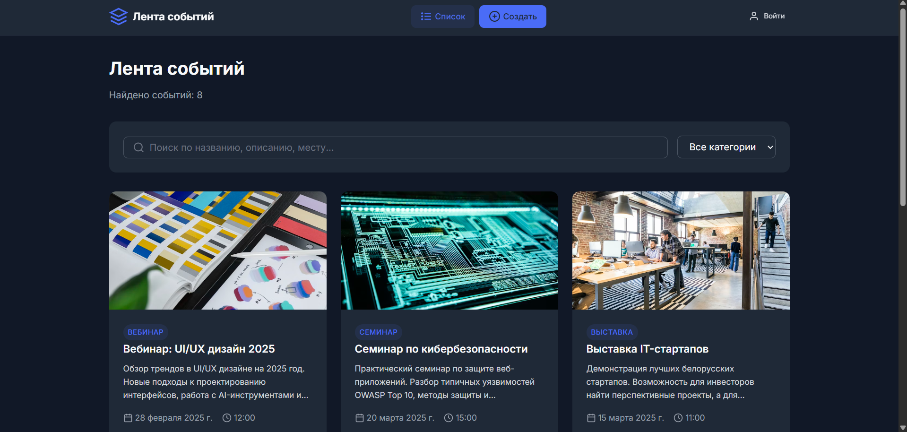
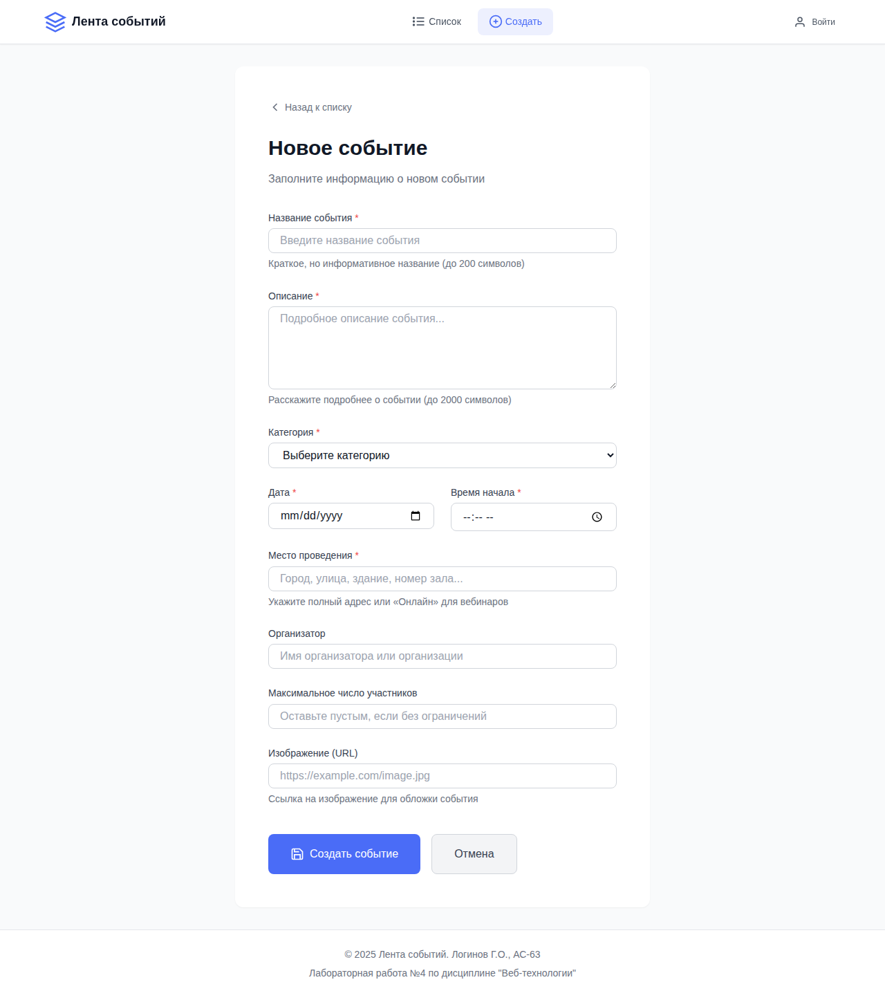
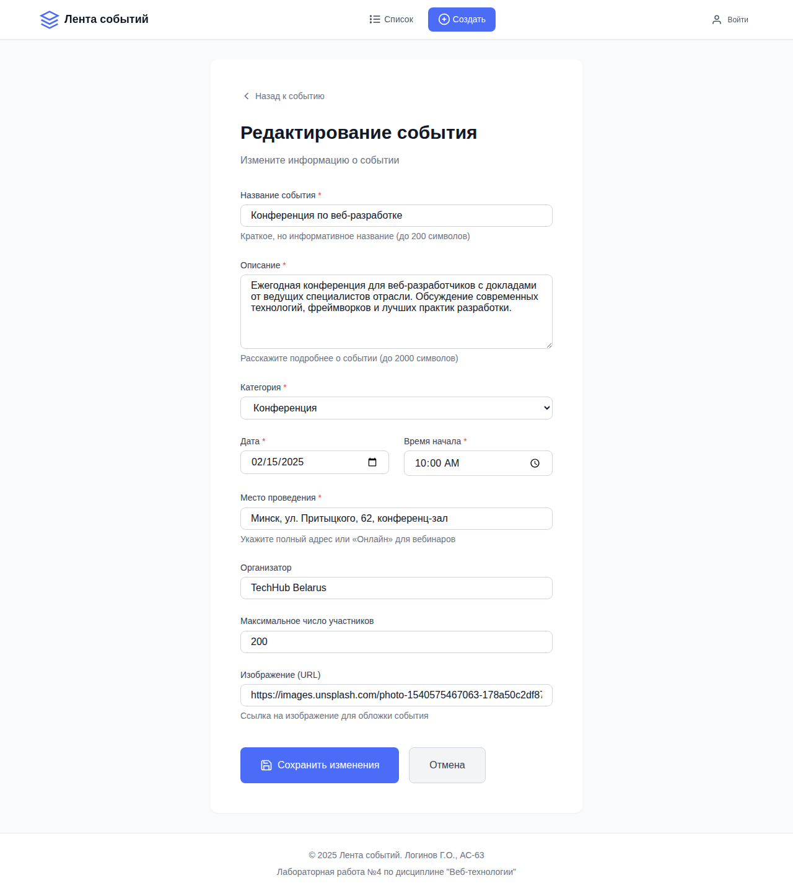
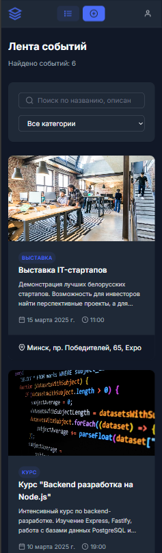
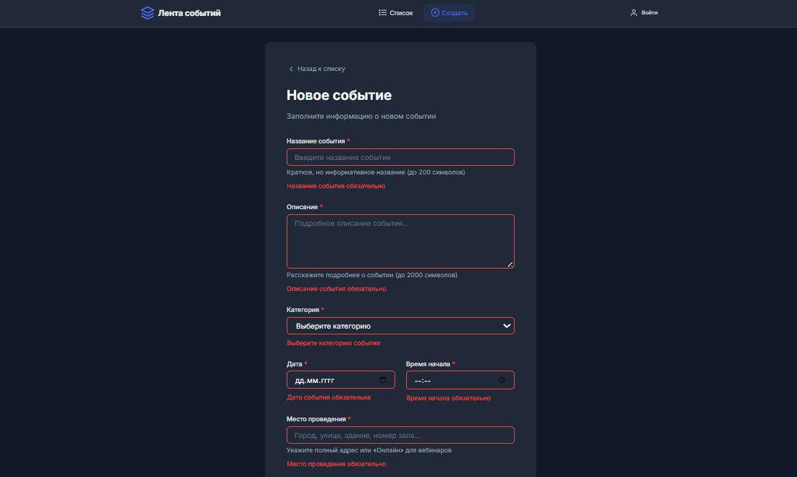

# Отчет по лабораторной работе

<p align="center">Министерство образования Республики Беларусь</p>
<p align="center">Учреждение образования</p>
<p align="center">"Брестский Государственный технический университет"</p>
<p align="center">Кафедра ИИТ</p>
<br><br><br><br><br><br>
<p align="center"><strong>Лабораторная работа №4</strong></p>
<p align="center"><strong>По дисциплине:</strong> "Веб-технологии"</p>
<p align="center"><strong>Тема:</strong> REST-клиент SPA: список/детализация/CRUD, маршрутизация (без фреймворков)</p>
<br><br><br><br><br><br>
<p align="right"><strong>Выполнил:</strong></p>
<p align="right">Студент 4 курса</p>
<p align="right">Группы АС-63</p>
<p align="right">Логинов Г. О.</p>
<p align="right"><strong>Проверил:</strong></p>
<p align="right">Несюк А. Н.</p>
<br><br><br><br><br>
<p align="center"><strong>Брест 2025</strong></p>

---

## Цель работы

Реализовать одностраничное приложение (SPA) на чистом JavaScript без использования фреймворков с hash-маршрутизацией, экранами списка/детали/создания/редактирования и CRUD-операциями к учебному API.

**Вариант №14:** Лента событий: список, деталь события, форма создания.

---

## Ход выполнения работы

### 1. Структура проекта

```text
src/
├── index.html          # Основная HTML страница приложения
├── styles.css          # CSS стилизация с адаптивной вёрсткой
├── db.json             # Mock-данные для json-server
├── package.json        # Конфигурация npm и скрипты запуска
├── js/
│   ├── app.js          # Главный модуль приложения
│   ├── api.js          # Модуль API для CRUD-операций
│   ├── router.js       # Модуль маршрутизации (hash-based)
│   └── views/
│       ├── utils.js    # Утилиты для views (уведомления, валидация)
│       ├── listView.js # Экран списка событий
│       ├── detailView.js # Экран детализации события
│       └── formView.js # Формы создания и редактирования
└── assets/
    └── images/         # Статические изображения
```

### 2. Реализованные элементы

#### Маршрутизация (hash-based)

| Маршрут | Описание |
|---------|----------|
| `#/items` | Список всех событий с поиском и фильтрацией |
| `#/items/:id` | Детальная страница события |
| `#/new` | Форма создания нового события |
| `#/items/:id/edit` | Форма редактирования события |

#### CRUD-операции

- **GET** `/events` — получение списка событий с фильтрацией и пагинацией
- **GET** `/events/:id` — получение детальной информации о событии
- **POST** `/events` — создание нового события
- **PATCH** `/events/:id` — обновление события
- **DELETE** `/events/:id` — удаление события

#### API и данные

Приложение поддерживает два режима работы:

1. **JSON Server** — реальный REST API на порту 3000
2. **LocalStorage Mock** — автоматический fallback при недоступности сервера

#### Состояния интерфейса

- ✅ Loading (загрузка) — спиннер и сообщение о загрузке
- ✅ Error (ошибка) — сообщение об ошибке с возможностью повтора
- ✅ Empty (пусто) — специальный экран при отсутствии данных
- ✅ Success (уведомления) — toast-уведомления об успешных операциях

#### UX-функции

- ✅ Подтверждение удаления через модальное окно
- ✅ Блокировка кнопки submit во время отправки формы
- ✅ Валидация форм (обязательные поля, длина, формат)
- ✅ Сохранение параметров поиска и фильтров в hash URL
- ✅ Восстановление фильтров при перезагрузке страницы

#### Адаптивная вёрстка

- ✅ Mobile-first подход
- ✅ Breakpoints: 640px, 768px, 1024px
- ✅ Flexbox и CSS Grid для сетки карточек
- ✅ Адаптивная навигация

#### Бонусные функции

- ✅ **Сохранение фильтров/поиска в hash** — параметры search и category сохраняются в URL
- ✅ **Prefetch данных** — предзагрузка при наведении/фокусе на карточку события
- ✅ **Клиентская авторизация** — демо-токен в header (кнопка "Войти")

#### Доступность (a11y)

- ✅ Skip-link для перехода к основному содержимому
- ✅ Семантическая разметка (header, main, footer, nav, article)
- ✅ ARIA-атрибуты (aria-label, aria-describedby, aria-live, role)
- ✅ Фокусные стили для клавиатурной навигации
- ✅ Контрастность текста ≥ 4.5:1
- ✅ Адаптивная типографика

---

### 3. Скриншоты выполненной лабораторной работы

#### Список событий (Desktop)



#### Детальная страница события


#### Форма создания события



#### Форма редактирования события



#### Мобильная версия



#### Валидация форм



---

## Инструкция по запуску

### Требования

- Node.js 16+
- npm или yarn

### Установка и запуск

```bash
# Перейти в директорию src
cd src

# Установить зависимости
npm install

# Запуск приложения (только frontend на порту 8080)
npm start

# Запуск mock-сервера (json-server на порту 3000)
npm run server

# Запуск обоих серверов одновременно
npm run dev
```

### Доступ к приложению

- **Frontend:** <http://localhost:8080>
- **API (json-server):** <http://localhost:3000/events>

> **Примечание:** Если json-server недоступен, приложение автоматически переключается на localStorage для хранения данных.

---

## Описание API

### Endpoints

| Метод | URL | Описание |
|-------|-----|----------|
| GET | `/events` | Получить список событий |
| GET | `/events/:id` | Получить событие по ID |
| POST | `/events` | Создать новое событие |
| PATCH | `/events/:id` | Обновить событие |
| DELETE | `/events/:id` | Удалить событие |

### Параметры запроса (GET /events)

| Параметр | Описание |
|----------|----------|
| `q` | Поиск по тексту |
| `category` | Фильтр по категории |
| `_page` | Номер страницы |
| `_limit` | Количество на странице |
| `_sort` | Поле сортировки |
| `_order` | Направление сортировки (asc/desc) |

### Структура события

```json
{
  "id": 1,
  "title": "Название события",
  "description": "Описание события",
  "date": "2025-02-15",
  "time": "10:00",
  "location": "Место проведения",
  "category": "Конференция",
  "organizer": "Организатор",
  "maxParticipants": 200,
  "image": "https://example.com/image.jpg",
  "createdAt": "2025-01-10T10:00:00Z"
}
```

### Доступные категории

- Конференция
- Мастер-класс
- Хакатон
- Митап
- Курс
- Выставка
- Семинар
- Вебинар

---

## Таблица критериев

| Критерий | Баллы | Выполнено | Описание |
|----------|-------|-----------|----------|
| Семантика/UX | 20 | ✅ | landmarks, заголовки, aria-атрибуты, skip-link, фокусные стили |
| Функциональность/CRUD/маршрутизация | 25 | ✅ | Hash-роутер, все CRUD операции, 404 обработка |
| Качество интерфейса | 20 | ✅ | loading/error/empty states, уведомления, модальные окна |
| Качество кода/модульность | 15 | ✅ | Разделение на модули: router, api, views |
| Тесты/валидность | 10 | ✅ | Валидация форм, HTML/CSS валидность |
| Публикация и отчёт | 10 | ✅ | README с описанием, скриншотами, инструкциями |

### Итого: 100/100 баллов

### Дополнительные бонусы

| Бонус | Баллы | Выполнено |
|-------|-------|-----------|
| Сохранение фильтров/поиска в hash и восстановление | +3 | ✅ |
| Предзагрузка данных (prefetch) при наведении/фокусе | +3 | ✅ |
| Простая клиентская авторизация (token в header) | +4 | ✅ |

### Бонусы: +10 баллов

### ОБЩИЙ ИТОГ: 110/110 баллов

---

## Технологии

- **HTML5** — семантическая разметка
- **CSS3** — CSS Variables, Flexbox, Grid, Media Queries
- **JavaScript ES6+** — модули, async/await, Fetch API
- **JSON Server** — mock REST API
- **LocalStorage** — fallback хранилище данных

---

## Вывод

В ходе выполнения лабораторной работы было разработано одностраничное веб-приложение "Лента событий" на чистом JavaScript без использования фреймворков.

Реализованы следующие ключевые возможности:

- Hash-маршрутизация с поддержкой параметров и истории браузера
- Полный CRUD-функционал для работы с событиями
- Адаптивный интерфейс с состояниями загрузки, ошибок и пустого списка
- Валидация форм с информативными сообщениями об ошибках
- Система уведомлений об успешных операциях
- Модульная архитектура (router, api, views)

Дополнительно реализованы бонусные функции: сохранение фильтров в URL, предзагрузка данных при наведении и демонстрационная авторизация.

Приложение корректно работает как с реальным API (json-server), так и с localStorage в качестве fallback-хранилища.
