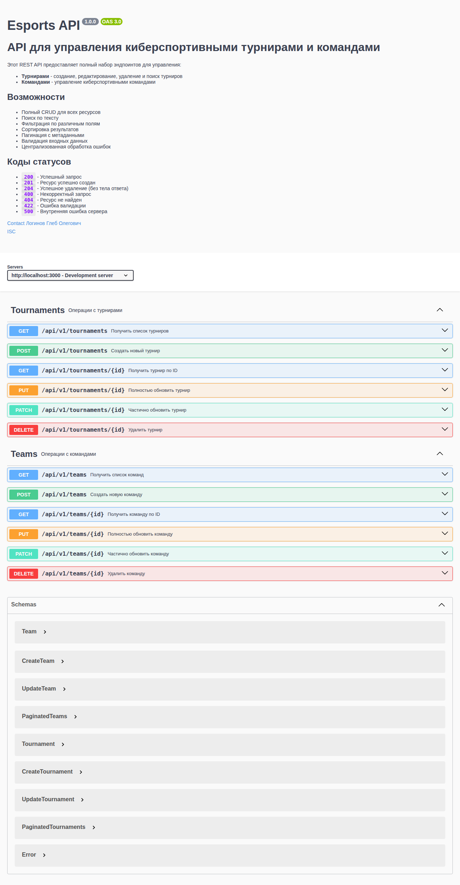
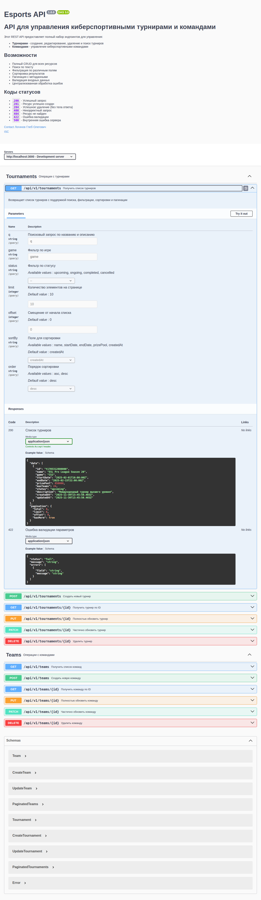
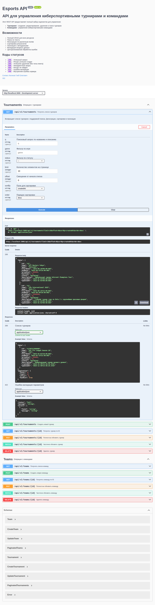

# Отчет по лабораторной работе

<p align="center">Министерство образования Республики Беларусь</p>
<p align="center">Учреждение образования</p>
<p align="center">"Брестский Государственный технический университет"</p>
<p align="center">Кафедра ИИТ</p>
<br><br><br><br><br><br>
<p align="center"><strong>Лабораторная работа №05</strong></p>
<p align="center"><strong>По дисциплине:</strong> "Веб-технологии"</p>
<p align="center"><strong>Тема:</strong> Серверное REST API на Node.js + Express (валидация, ошибки, Swagger)</p>
<br><br><br><br><br><br>
<p align="right"><strong>Выполнил:</strong></p>
<p align="right">Студент 4 курса</p>
<p align="right">Группы АС-63</p>
<p align="right">Логинов Г. О.</p>
<p align="right"><strong>Проверил:</strong></p>
<p align="right">Несюк А. Н.</p>
<br><br><br><br><br>
<p align="center"><strong>Брест 2025</strong></p>

---

## Цель работы

Создание полноценного REST API для управления киберспортивными турнирами и командами на Express с:

- Валидацией входных данных (Zod)
- Централизованной обработкой ошибок
- Документацией OpenAPI/Swagger UI
- Поддержкой фильтрации, поиска, сортировки и пагинации

---

### Вариант №14

#### API киберспорт-турниров/команд

---

## Ход выполнения работы

### 1. Структура проекта

```text
src/
├── data/
│   └── storage.js          # Хранилище данных (JSON-файл + in-memory)
├── middleware/
│   ├── errors.js           # Кастомные классы ошибок
│   ├── errorHandler.js     # Централизованный обработчик ошибок
│   └── validate.js         # Middleware для валидации
├── routes/
│   ├── tournaments.js      # CRUD эндпоинты для турниров
│   └── teams.js            # CRUD эндпоинты для команд
├── tests/
│   ├── tournaments.test.js # Тесты для турниров
│   └── teams.test.js       # Тесты для команд
├── validators/
│   ├── tournamentValidator.js  # Zod-схемы для турниров
│   └── teamValidator.js        # Zod-схемы для команд
├── index.js                # Точка входа приложения
├── swagger.js              # Конфигурация Swagger
├── package.json
├── OpenAPI.json            # Сгенерированная OpenAPI спецификация
├── .env                    # Переменные окружения (не коммитится)
└── .env.example            # Пример переменных окружения
```

### 2. Реализованные элементы

#### 2.1 Базовая структура Express-приложения

- ✅ npm-проект с корректным `package.json`
- ✅ Скрипты `dev` (nodemon) и `start` (node)
- ✅ Middleware: `express.json()`, `cors`, `morgan`
- ✅ Переменные окружения через `.env` и `dotenv`

#### 2.2 Ресурсы API

**Турниры (`/api/v1/tournaments`):**

- `GET /` — список турниров с параметрами `q`, `game`, `status`, `limit`, `offset`, `sortBy`, `order`
- `GET /:id` — получение турнира по ID
- `POST /` — создание нового турнира
- `PUT /:id` — полное обновление турнира
- `PATCH /:id` — частичное обновление турнира
- `DELETE /:id` — удаление турнира

**Команды (`/api/v1/teams`):**

- `GET /` — список команд с параметрами `q`, `game`, `country`, `isActive`, `limit`, `offset`, `sortBy`, `order`
- `GET /:id` — получение команды по ID
- `POST /` — создание новой команды
- `PUT /:id` — полное обновление команды
- `PATCH /:id` — частичное обновление команды
- `DELETE /:id` — удаление команды

#### 2.3 Валидация (Zod)

Реализованы схемы валидации для:

- Создания турнира (name 1-100, game 1-50, startDate/endDate ISO-8601, prizePool ≥ 0, maxTeams 2-128, status enum)
- Обновления турнира (частичная валидация)
- Создания команды (name 1-100, tag 2-10 alphanumeric, country, game, rating 0-10000, isActive boolean)
- Обновления команды (частичная валидация)
- Query-параметров для списков

#### 2.4 Обработка ошибок

- ✅ Кастомные классы ошибок: `ApiError`, `BadRequestError`, `NotFoundError`, `ValidationError`, `ConflictError`, `InternalServerError`
- ✅ Централизованный error handler
- ✅ Корректные HTTP статус-коды: 200, 201, 204, 400, 404, 422, 500
- ✅ Защита от утечки stack trace в production

#### 2.5 Документация Swagger

- ✅ swagger-jsdoc + swagger-ui-express
- ✅ Доступна по адресу `/docs`
- ✅ OpenAPI JSON по адресу `/api/openapi.json`
- ✅ Полное описание всех эндпоинтов, параметров, схем и ответов

#### 2.6 Бонусные функции

- ✅ **Фильтрация** по полям (game, status, country, isActive)
- ✅ **Поиск** по тексту (name, description)
- ✅ **Сортировка** по различным полям с выбором направления (asc/desc)
- ✅ **Пагинация** с метаданными (`total`, `limit`, `offset`, `hasMore`)
- ✅ **Версионирование API** (`/api/v1`)
- ✅ **Тесты** с использованием Jest и Supertest

### 3. Инструкция по запуску

#### Установка зависимостей

```bash
cd src
npm install
```

#### Настройка окружения

```bash
cp .env.example .env
# Отредактируйте .env при необходимости
```

#### Запуск в режиме разработки

```bash
npm run dev
```

#### Запуск в production

```bash
npm start
```

#### Запуск тестов

```bash
npm test
```

После запуска сервер будет доступен по адресу `http://localhost:3000`.

Документация API: `http://localhost:3000/docs`

### 4. Скриншоты выполненой лабораторной работы

#### Swagger UI — главная страница документации



#### Получение списка турниров с параметрами



#### Выполнение запроса и получение ответа



### 5. Примеры запросов

#### Получить все турниры

```bash
curl http://localhost:3000/api/v1/tournaments
```

#### Получить турниры по игре CS2 с сортировкой по призовому фонду

```bash
curl "http://localhost:3000/api/v1/tournaments?game=CS2&sortBy=prizePool&order=desc"
```

#### Создать новый турнир

```bash
curl -X POST http://localhost:3000/api/v1/tournaments \
  -H "Content-Type: application/json" \
  -d '{
    "name": "Major Championship 2025",
    "game": "CS2",
    "startDate": "2025-05-01T10:00:00Z",
    "endDate": "2025-05-15T20:00:00Z",
    "prizePool": 1000000,
    "maxTeams": 32
  }'
```

#### Получить команды по стране

```bash
curl "http://localhost:3000/api/v1/teams?country=Ukraine"
```

#### Обновить рейтинг команды

```bash
curl -X PATCH http://localhost:3000/api/v1/teams/tm1 \
  -H "Content-Type: application/json" \
  -d '{"rating": 3000}'
```

---

## Таблица критериев

| Критерий                                | Баллы | Выполнено | Комментарий |
|-----------------------------------------|-------|-----------|-------------|
| Структура/семантика API                 | 20    | ✅        | Чёткая RESTful структура, версионирование /api/v1 |
| Функциональность CRUD                   | 25    | ✅        | Полный CRUD для tournaments и teams |
| Качество интерфейса API (валидация, ошибки, статус-коды) | 20 | ✅ | Zod-валидация, централизованный error handler, коды 200/201/204/400/404/422/500 |
| Качество кода/архитектуры               | 15    | ✅        | Модульная структура, раздельные роутеры, валидаторы, middleware |
| Тесты/проверки (supertest)              | 10    | ✅        | 47 тестов с покрытием ~88%, Jest + Supertest |
| Документация/инструкция                 | 10    | ✅        | Swagger UI, OpenAPI.json, README с примерами |
| **Итого**                               | **100** | ✅      |             |

### Дополнительные бонусы (+10)

| Бонус                                    | Баллы | Выполнено | Комментарий |
|------------------------------------------|-------|-----------|-------------|
| Фильтрация/поиск/сортировка              | +3    | ✅        | Параметры q, game, status, country, sortBy, order |
| Пагинация с метаданными (total, limit, offset) | +3 | ✅ | Полная пагинация с hasMore |
| Версионирование API (/api/v1)            | +4    | ✅        | Все эндпоинты через /api/v1 |
| **Итого бонусов**                        | **+10** | ✅     |             |

### Общий балл: 110/110

---

## Технологии

- **Node.js** — среда выполнения JavaScript
- **Express.js** — веб-фреймворк
- **Zod** — валидация данных
- **swagger-jsdoc** — генерация OpenAPI спецификации
- **swagger-ui-express** — интерактивная документация
- **Morgan** — логирование HTTP-запросов
- **CORS** — поддержка кросс-доменных запросов
- **Jest + Supertest** — тестирование
- **Nodemon** — автоматический перезапуск в dev-режиме

---

## Вывод

В ходе выполнения лабораторной работы было создано полноценное REST API для управления киберспортивными турнирами и командами. Реализованы все требования задания:

1. **Базовая структура** — создан Express-проект с необходимыми middleware (json, cors, morgan) и скриптами запуска.

2. **CRUD-операции** — полный набор операций для обоих ресурсов (tournaments, teams) с поддержкой GET, POST, PUT, PATCH, DELETE.

3. **Валидация** — все входные данные валидируются с помощью Zod-схем с детальными сообщениями об ошибках.

4. **Обработка ошибок** — реализована централизованная система с кастомными классами ошибок и корректными HTTP-кодами (200/201/204/400/404/422/500).

5. **Документация** — интерактивная документация Swagger UI доступна по адресу /docs с полным описанием API.

6. **Бонусные функции** — реализованы фильтрация, поиск, сортировка, пагинация с метаданными и версионирование API.

7. **Тестирование** — написаны 65 тестов с использованием Jest и Supertest:
   - Общее покрытие кода: 91.5%
   - Покрытие routes: 100%
   - Покрытие validators: 100%

Освоены навыки создания REST API, работы с валидацией данных, документирования API и написания тестов.
