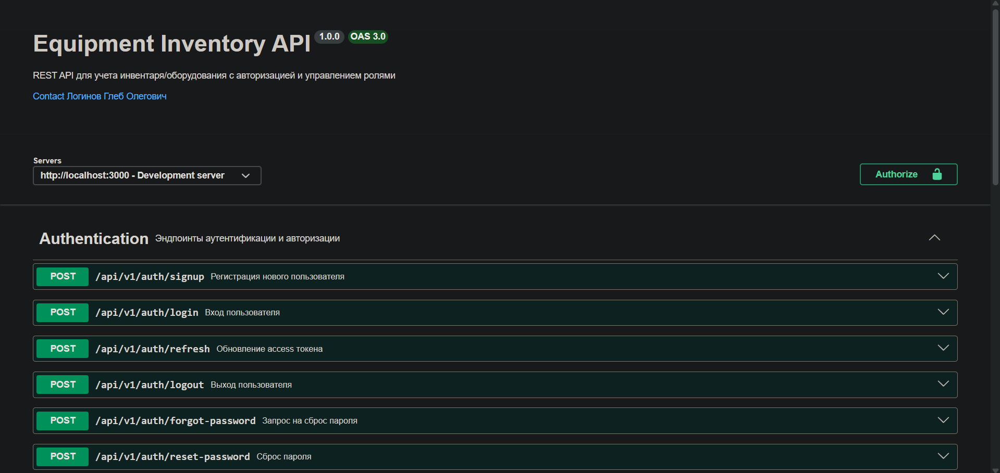
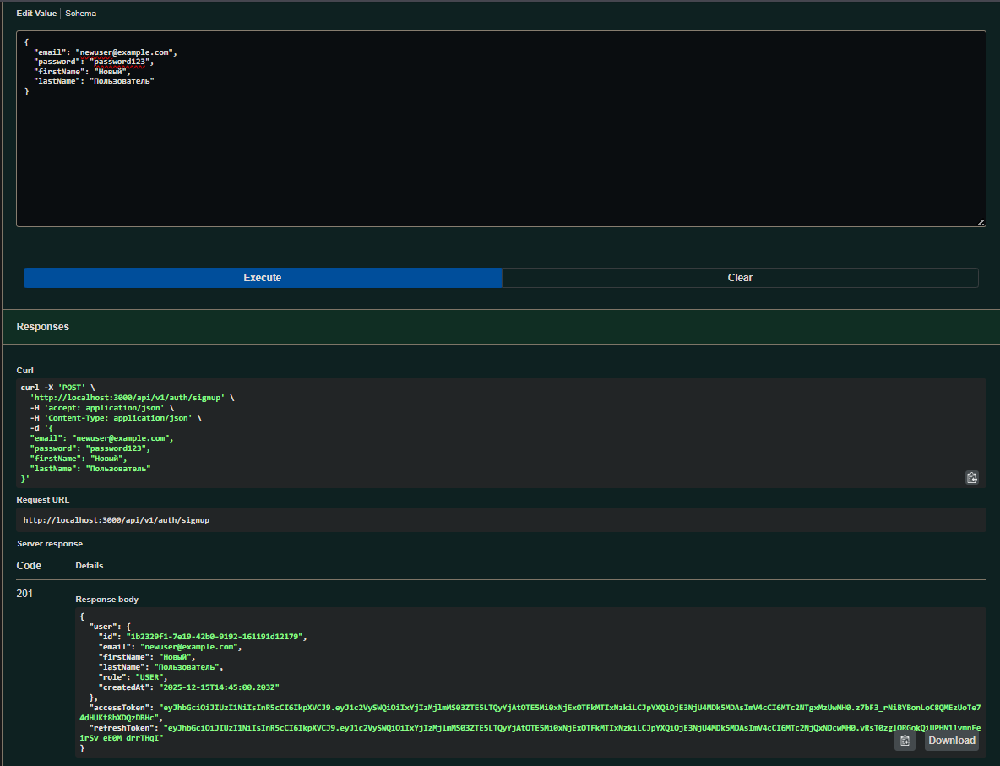
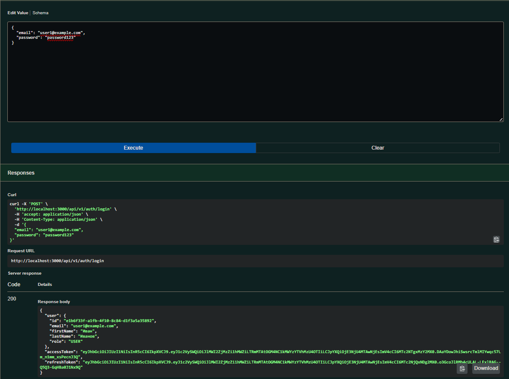
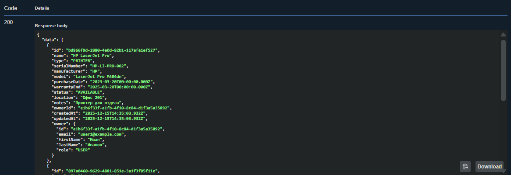
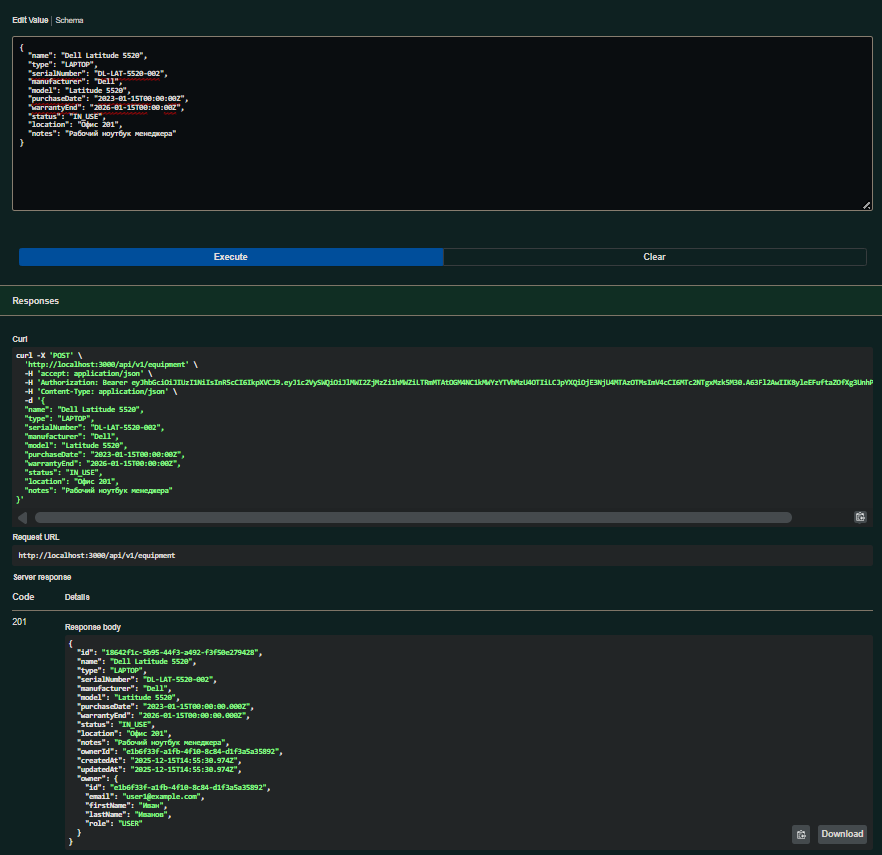

# Лабораторная работа №06

<p align="center">Министерство образования Республики Беларусь</p>
<p align="center">Учреждение образования</p>
<p align="center">"Брестский Государственный технический университет"</p>
<p align="center">Кафедра ИИТ</p>
<br><br><br><br><br><br>
<p align="center"><strong>Лабораторная работа №06</strong></p>
<p align="center"><strong>По дисциплине:</strong> "Веб-технологии"</p>
<p align="center"><strong>Тема:</strong> Базы данных и авторизация (SQLite/PostgreSQL + ORM + JWT)</p>
<br><br><br><br><br><br>
<p align="right"><strong>Выполнил:</strong></p>
<p align="right">Студент 4 курса</p>
<p align="right">Группы АС-63</p>
<p align="right">Логинов Г. О.</p>
<p align="right"><strong>Проверил:</strong></p>
<p align="right">Несюк А. Н.</p>
<br><br><br><br><br>
<p align="center"><strong>Брест 2025</strong></p>

---

## Цель работы

Настроить ORM и схему данных (SQLite/PostgreSQL). Реализовать регистрацию/логин, выдачу JWT, middleware защиты и доступ к задачам только владельца. Подключить БД к серверному приложению, реализовать авторизацию на базе JWT и защиту маршрутов.

---

### Вариант №14

#### Учёт инвентаря/оборудования с ролями

---

## Ход выполнения работы

### 1. Структура проекта

```text
task_06/
├── src/
│   ├── middleware/          # Middleware для аутентификации и валидации
│   │   ├── auth.js         # JWT аутентификация, проверка ролей и владения
│   │   ├── errorHandler.js # Централизованная обработка ошибок
│   │   ├── errors.js       # Кастомные классы ошибок
│   │   └── validate.js     # Middleware для валидации с Zod
│   ├── prisma/             # Prisma ORM конфигурация
│   │   ├── schema.prisma   # Схема базы данных
│   │   └── seed.js         # Начальные данные (seed)
│   ├── routes/             # Маршруты API
│   │   ├── auth.js         # Эндпоинты аутентификации
│   │   └── equipment.js    # Эндпоинты управления оборудованием
│   ├── services/           # Бизнес-логика
│   │   ├── authService.js  # Сервис аутентификации
│   │   └── equipmentService.js # Сервис управления оборудованием
│   ├── tests/              # Тесты
│   │   ├── auth.test.js    # Тесты аутентификации
│   │   ├── equipment.test.js # Тесты CRUD оборудования
│   │   └── setup.js        # Настройка тестовой среды
│   ├── validators/         # Схемы валидации Zod
│   │   ├── authValidator.js # Валидация аутентификации
│   │   └── equipmentValidator.js # Валидация оборудования
│   ├── .env.example        # Пример конфигурации
│   ├── .gitignore          # Игнорируемые файлы
│   ├── index.js            # Точка входа приложения
│   ├── jest.config.js      # Конфигурация Jest
│   ├── package.json        # Зависимости проекта
│   └── swagger.js          # Конфигурация Swagger документации
└── doc/
    ├── README.md           # Данный документ
    └── screenshots/        # Скриншоты работы приложения
```

### 2. Реализованные элементы

#### 2.1. База данных (Prisma ORM + SQLite)

**Схема данных включает:**

- **User** - Пользователи системы
  - id (UUID), email (unique), password (hashed)
  - firstName, lastName, role (USER/ADMIN)
  - isActive, createdAt, updatedAt

- **Equipment** - Оборудование/инвентарь
  - id (UUID), name, type, serialNumber (unique)
  - manufacturer, model, purchaseDate, warrantyEnd
  - status (AVAILABLE/IN_USE/MAINTENANCE/RETIRED/BROKEN)
  - location, notes, ownerId (связь с User)
  - createdAt, updatedAt

- **RefreshToken** - Refresh токены для обновления сессий
  - id (UUID), token (unique), userId, expiresAt

- **PasswordResetToken** - Токены для сброса пароля
  - id (UUID), email, token (unique), expiresAt, used

#### 2.2. Аутентификация и авторизация (JWT)

**Реализованные эндпоинты аутентификации:**

- `POST /api/v1/auth/signup` - Регистрация нового пользователя
- `POST /api/v1/auth/login` - Вход в систему
- `POST /api/v1/auth/refresh` - Обновление access токена
- `POST /api/v1/auth/logout` - Выход из системы
- `POST /api/v1/auth/forgot-password` - Запрос сброса пароля
- `POST /api/v1/auth/reset-password` - Сброс пароля

**Особенности реализации:**

- Хеширование паролей с использованием bcrypt (10 раундов)
- Access токены (JWT) с истечением через 1 час
- Refresh токены с истечением через 7 дней
- Токены хранятся в БД для возможности отзыва
- Email-заглушка для сброса пароля (в консоли отображается токен)

#### 2.3. Управление оборудованием (CRUD)

**Реализованные эндпоинты оборудования (требуют аутентификацию):**

- `GET /api/v1/equipment` - Получить список оборудования
- `POST /api/v1/equipment` - Создать новое оборудование
- `GET /api/v1/equipment/:id` - Получить оборудование по ID
- `PUT /api/v1/equipment/:id` - Полное обновление оборудования
- `PATCH /api/v1/equipment/:id` - Частичное обновление оборудования
- `DELETE /api/v1/equipment/:id` - Удалить оборудование

**Функциональность:**

- Фильтрация по типу, статусу, поисковому запросу
- Пагинация (limit/offset)
- Сортировка по различным полям
- Обычные пользователи видят только своё оборудование
- Администраторы видят всё оборудование
- Проверка прав владельца при изменении/удалении

#### 2.4. Система ролей

**Реализованные роли:**

- **USER** (обычный пользователь)
  - Может создавать своё оборудование
  - Видит только своё оборудование
  - Может редактировать и удалять только своё оборудование

- **ADMIN** (администратор)
  - Видит всё оборудование в системе
  - Может редактировать и удалять любое оборудование
  - Полный доступ ко всем ресурсам

#### 2.5. Безопасность

**Реализованные меры безопасности:**

- Helmet.js для установки HTTP заголовков безопасности
- CORS с настраиваемым origin
- Rate limiting (100 запросов за 15 минут)
- Ограничение размера тела запроса (10KB)
- Хеширование паролей с bcrypt
- JWT с проверкой срока действия
- Валидация всех входных данных с Zod
- Защита от SQL-инъекций (Prisma ORM)
- Проверка прав доступа к ресурсам
- Не раскрытие информации о существовании пользователей (forgot-password)

#### 2.6. Валидация данных

**Используется библиотека Zod для валидации:**

- Email формат и длина
- Пароль минимум 6 символов
- Обязательные поля
- Корректные типы оборудования и статусы
- Уникальность серийных номеров
- Формат дат (ISO 8601)

#### 2.7. Тестирование

**Реализовано 30 тестов:**

- Тесты регистрации и входа
- Тесты refresh токенов
- Тесты сброса пароля
- Тесты CRUD операций с оборудованием
- Тесты проверки прав доступа
- Тесты валидации данных
- Покрытие кода > 74%

### 3. Примеры использования API

#### 3.1. Регистрация нового пользователя

```bash
curl -X POST http://localhost:3000/api/v1/auth/signup \
  -H "Content-Type: application/json" \
  -d '{
    "email": "user@example.com",
    "password": "password123",
    "firstName": "Иван",
    "lastName": "Иванов"
  }'
```

**Ответ:**

```json
{
  "user": {
    "id": "uuid",
    "email": "user@example.com",
    "firstName": "Иван",
    "lastName": "Иванов",
    "role": "USER",
    "createdAt": "2025-12-15T14:00:00Z"
  },
  "accessToken": "eyJhbGc...",
  "refreshToken": "eyJhbGc..."
}
```

#### 3.2. Вход в систему

```bash
curl -X POST http://localhost:3000/api/v1/auth/login \
  -H "Content-Type: application/json" \
  -d '{
    "email": "user@example.com",
    "password": "password123"
  }'
```

#### 3.3. Получение списка оборудования

```bash
curl -X GET "http://localhost:3000/api/v1/equipment?limit=10&offset=0" \
  -H "Authorization: Bearer YOUR_ACCESS_TOKEN"
```

**Ответ:**

```json
{
  "data": [
    {
      "id": "uuid",
      "name": "Dell Latitude 5520",
      "type": "LAPTOP",
      "serialNumber": "DL-LAT-5520-001",
      "manufacturer": "Dell",
      "model": "Latitude 5520",
      "purchaseDate": "2023-01-15T00:00:00Z",
      "warrantyEnd": "2026-01-15T00:00:00Z",
      "status": "IN_USE",
      "location": "Офис 201",
      "notes": "Рабочий ноутбук",
      "ownerId": "owner-uuid",
      "owner": {
        "id": "owner-uuid",
        "email": "user@example.com",
        "firstName": "Иван",
        "lastName": "Иванов",
        "role": "USER"
      }
    }
  ],
  "pagination": {
    "total": 1,
    "limit": 10,
    "offset": 0,
    "hasMore": false
  }
}
```

#### 3.4. Создание нового оборудования

```bash
curl -X POST http://localhost:3000/api/v1/equipment \
  -H "Authorization: Bearer YOUR_ACCESS_TOKEN" \
  -H "Content-Type: application/json" \
  -d '{
    "name": "HP LaserJet Pro",
    "type": "PRINTER",
    "serialNumber": "HP-LJ-001",
    "manufacturer": "HP",
    "model": "LaserJet Pro M404dn",
    "purchaseDate": "2024-01-01T00:00:00Z",
    "warrantyEnd": "2027-01-01T00:00:00Z",
    "status": "AVAILABLE",
    "location": "Офис 202",
    "notes": "Новый принтер для отдела"
  }'
```

#### 3.5. Обновление access токена

```bash
curl -X POST http://localhost:3000/api/v1/auth/refresh \
  -H "Content-Type: application/json" \
  -d '{
    "refreshToken": "YOUR_REFRESH_TOKEN"
  }'
```

#### 3.6. Сброс пароля

##### Шаг 1: Запрос токена сброса

```bash
curl -X POST http://localhost:3000/api/v1/auth/forgot-password \
  -H "Content-Type: application/json" \
  -d '{
    "email": "user@example.com"
  }'
```

##### Шаг 2: Сброс пароля с токеном

```bash
curl -X POST http://localhost:3000/api/v1/auth/reset-password \
  -H "Content-Type: application/json" \
  -d '{
    "token": "RESET_TOKEN_FROM_EMAIL",
    "newPassword": "newpassword123"
  }'
```

### 4. Инструкция по запуску

#### 4.1. Установка зависимостей

```bash
cd task_06/src
npm install
```

#### 4.2. Настройка окружения

Скопируйте `.env.example` в `.env` и настройте переменные окружения:

```bash
cp .env.example .env
```

#### 4.3. Инициализация базы данных

```bash
# Применить миграции
npm run prisma:migrate

# Заполнить БД начальными данными
npm run prisma:seed
```

#### 4.4. Запуск сервера

```bash
# Development режим с автоперезагрузкой
npm run dev

# Production режим
npm start
```

#### 4.5. Запуск тестов

```bash
npm test
```

### 5. Тестовые данные

После выполнения seed скрипта доступны следующие тестовые аккаунты:

- **Admin:** <admin@example.com> / password123
- **User1:** <user1@example.com> / password123
- **User2:** <user2@example.com> / password123

Также создаётся несколько единиц оборудования для каждого пользователя.

### 6. Документация API

После запуска сервера доступна интерактивная документация:

- **Swagger UI:** <http://localhost:3000/docs>
- **OpenAPI JSON:** <http://localhost:3000/api/openapi.json>

### 7. Скриншоты выполненной лабораторной работы


*Интерактивная документация API в Swagger UI*


*Успешная регистрация нового пользователя*


*Вход в систему и получение токенов*


*Получение списка оборудования с пагинацией*


*Создание нового оборудования*

---

## Таблица критериев

### Базовые требования (100 баллов)

| Критерий | Описание | Выполнено |
|----------|----------|-----------|
| Схема БД/миграции | Prisma ORM, модели User/Equipment, миграции, seed скрипт | ✅ |
| CRUD + связь с пользователем | Полный CRUD для оборудования, связь ownerId, фильтрация | ✅ |
| Безопасность | bcrypt хеширование, JWT токены, защита маршрутов, CORS, rate limiting | ✅ |
| Качество кода/архитектуры | Модульная структура, services/routes/middleware, чистый код | ✅ |
| Тесты/валидность | 30 тестов, покрытие > 74%, валидация Zod | ✅ |
| Документация/инструкция | README, Swagger, примеры использования, инструкция запуска | ✅ |

### Дополнительные бонусы (+10 баллов)

| Бонус | Описание | Выполнено |
|-------|----------|-----------|
| Refresh токены | POST /auth/refresh, хранение в БД, обновление access токенов | ✅ |
| Роли/права | Роли USER/ADMIN, middleware проверки, разграничение доступа | ✅ |
| Password reset flow | forgot-password, reset-password, email-заглушка, токены | ✅ |

---

## Технологический стек

- **Runtime:** Node.js
- **Framework:** Express.js
- **ORM:** Prisma
- **База данных:** SQLite (легко переключается на PostgreSQL/MySQL)
- **Аутентификация:** JWT (jsonwebtoken)
- **Хеширование:** bcryptjs
- **Валидация:** Zod
- **Тестирование:** Jest, Supertest
- **Документация:** Swagger (swagger-jsdoc, swagger-ui-express)
- **Безопасность:** Helmet, CORS, express-rate-limit

## Особенности реализации

1. **Архитектура:** Следует принципу разделения ответственности (services, routes, middleware)
2. **Валидация:** Все входные данные проверяются на уровне middleware с Zod
3. **Безопасность:** Многоуровневая защита (helmet, CORS, rate limiting, JWT, bcrypt)
4. **Тестирование:** Высокое покрытие тестами с использованием отдельной тестовой БД
5. **Документация:** Swagger генерируется из JSDoc комментариев
6. **Ownership:** Пользователи видят только свои ресурсы, админы видят всё
7. **Refresh токены:** Долгосрочные сессии с возможностью обновления
8. **Password reset:** Безопасный flow сброса пароля с временными токенами

## Безопасность

### Реализованные меры безопасности

#### 1. Аутентификация и авторизация

- ✅ JWT токены с истечением срока действия (1 час для access, 7 дней для refresh)
- ✅ Хеширование паролей с bcrypt (10 раундов)
- ✅ Middleware проверки Bearer токенов
- ✅ Разграничение прав доступа (USER/ADMIN роли)
- ✅ Проверка владения ресурсами

#### 2. Защита от атак

- ✅ **Helmet.js** - установка security HTTP заголовков
- ✅ **CORS** - контроль источников запросов
- ✅ **Rate Limiting** - защита от DoS/брутфорса (100 запросов за 15 минут на `/api/*`)
- ✅ **Body Size Limit** - ограничение размера запроса (10KB)
- ✅ **SQL Injection** - защита через Prisma ORM (параметризованные запросы)
- ✅ **Валидация входных данных** - Zod схемы для всех эндпоинтов

#### 3. Секреты и конфигурация

- ✅ Все секреты хранятся в `.env` файле
- ✅ `.env` добавлен в `.gitignore`
- ✅ Предоставлен `.env.example` для настройки
- ✅ JWT_SECRET и JWT_REFRESH_SECRET выносятся в переменные окружения

#### 4. Логирование

- ✅ Чувствительная информация (токены сброса пароля) логируется только в dev режиме
- ✅ Детальные ошибки показываются только в dev режиме
- ✅ В production логируются только общие сообщения об ошибках

#### 5. База данных

- ✅ Cascade удаление для поддержания целостности данных
- ✅ Уникальные ограничения (email, serialNumber, tokens)
- ✅ Индексация важных полей
- ✅ Проверка прав доступа перед операциями

#### 6. Password Security

- ✅ Минимальная длина пароля: 6 символов
- ✅ Хеширование с bcrypt перед сохранением
- ✅ Токены сброса пароля действительны только 1 час
- ✅ Токены сброса можно использовать только один раз
- ✅ При сбросе пароля все refresh токены удаляются (принудительный logout)

#### 7. API Security

- ✅ Все эндпоинты оборудования требуют аутентификацию
- ✅ Пользователи видят только свои ресурсы
- ✅ Администраторы имеют полный доступ
- ✅ Валидация прав перед каждой операцией

### Рекомендации для production

1. **База данных**: Перейти с SQLite на PostgreSQL/MySQL
2. **JWT_SECRET**: Использовать криптографически сильный ключ (минимум 256 бит)
3. **HTTPS**: Обязательно использовать HTTPS в production
4. **Environment**: Установить `NODE_ENV=production`
5. **Email**: Настроить реальную отправку email для сброса пароля
6. **Logging**: Интегрировать профессиональную систему логирования (Winston, Pino)
7. **Monitoring**: Добавить мониторинг и алертинг
8. **Backup**: Настроить регулярное резервное копирование БД
9. **Rate Limiting**: Рассмотреть более строгие ограничения для production
10. **CORS**: Указать конкретные домены вместо `*`

## Вывод

В ходе выполнения лабораторной работы №06 была реализована полнофункциональная система управления инвентарём/оборудованием с авторизацией на основе JWT и разграничением прав доступа.

**Освоенные навыки и технологии:**

1. **ORM и базы данных:** Работа с Prisma ORM, создание схем данных, миграции, seed данные
2. **JWT аутентификация:** Генерация и проверка токенов, refresh токены, middleware защиты
3. **Безопасность:** Хеширование паролей (bcrypt), защита от атак, rate limiting, CORS
4. **Архитектура:** Разделение на слои (routes, services, middleware), чистый код
5. **Валидация:** Использование Zod для строгой типизации и валидации данных
6. **Тестирование:** Написание unit и integration тестов с Jest
7. **Документация:** Автоматическая генерация API документации с Swagger

**Выполнены все требования:**

- ✅ Базовые требования (100 баллов)
- ✅ Все бонусные задания (+10 баллов)

Проект готов к использованию в production после настройки соответствующих переменных окружения и смены SQLite на PostgreSQL (если требуется).
