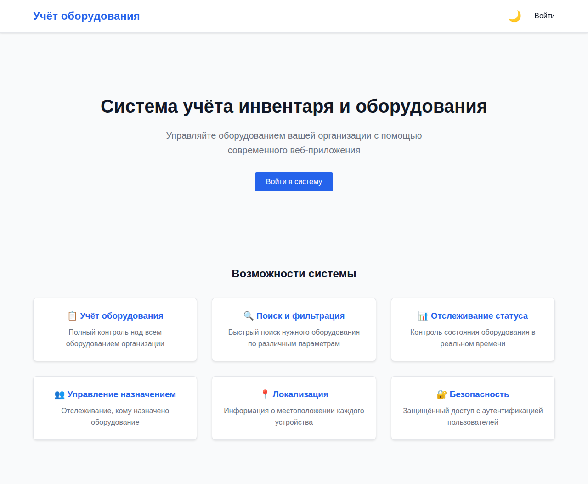
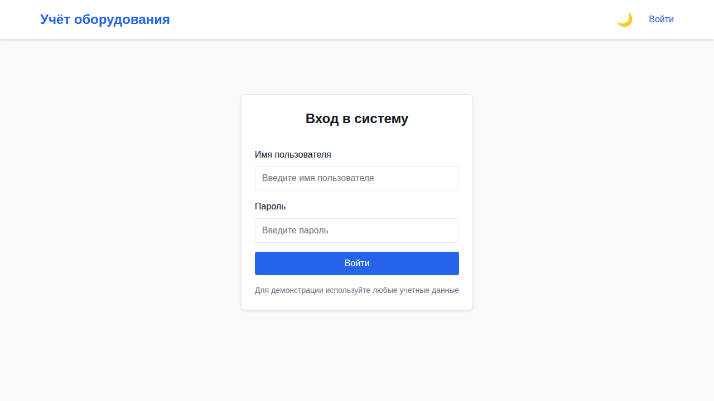
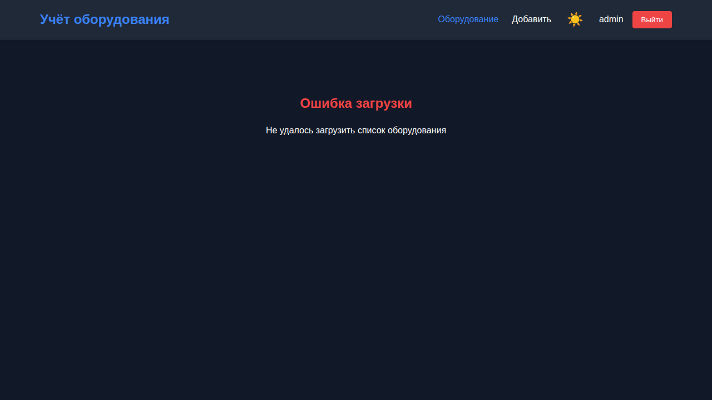
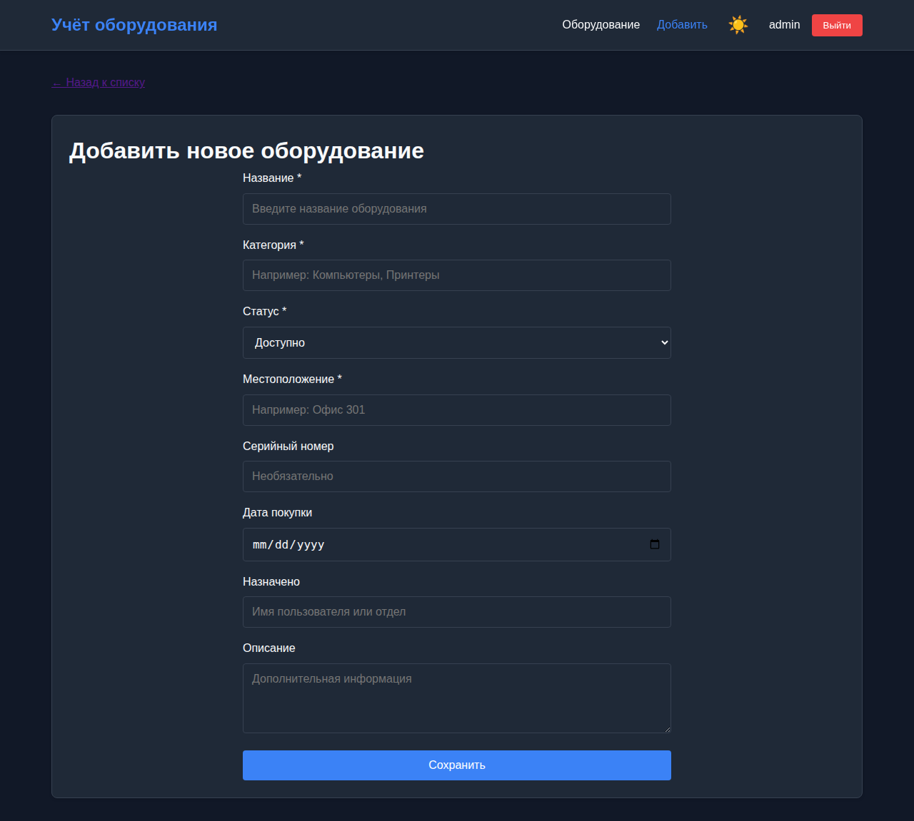
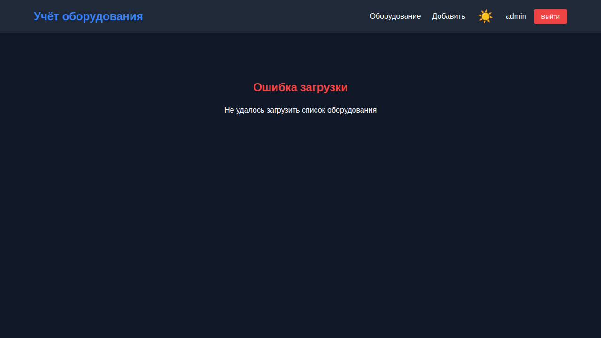
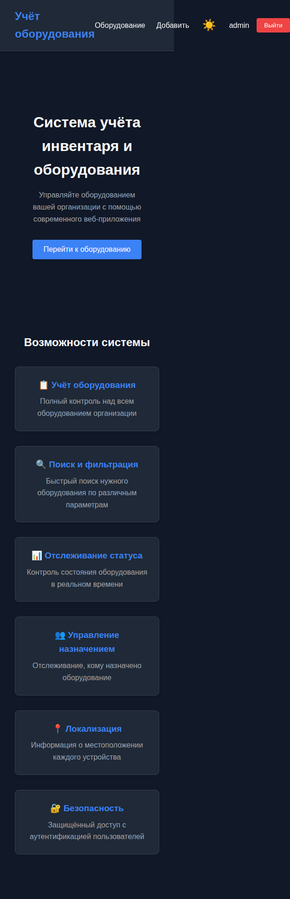

# Лабораторная работа №7

<p align="center">Министерство образования Республики Беларусь</p>
<p align="center">Учреждение образования</p>
<p align="center">"Брестский Государственный технический университет"</p>
<p align="center">Кафедра ИИТ</p>
<br><br><br><br><br><br>
<p align="center"><strong>Лабораторная работа №7</strong></p>
<p align="center"><strong>По дисциплине:</strong> "Веб-технологии"</p>
<p align="center"><strong>Тема:</strong> React-приложение: маршрутизация, состояние, формы, работа с API</p>
<br><br><br><br><br><br>
<p align="right"><strong>Выполнил:</strong></p>
<p align="right">Студент 4 курса</p>
<p align="right">Группы АС-63</p>
<p align="right">Логинов Г. О.</p>
<p align="right"><strong>Проверил:</strong></p>
<p align="right">Несюк А. Н.</p>
<br><br><br><br><br>
<p align="center"><strong>Брест 2025</strong></p>

---

## Цель работы

Создать полноценное SPA на React с маршрутизацией, управлением состоянием, формами и работой с API. Освоить современные подходы к разработке веб-приложений с использованием Redux Toolkit, RTK Query, React Router и React Hook Form.

---

### Вариант №14 - Учёт инвентаря/оборудования с ролями

## Ход выполнения работы

### 1. Структура проекта

Проект организован по feature-based архитектуре с разделением на модули:

```
task_07/
├── doc/
│   ├── README.md
│   └── screenshots/
│       ├── home-page.png
│       ├── login-page.png
│       ├── equipment-list.png
│       ├── equipment-detail.png
│       ├── equipment-form.png
│       ├── dark-theme.png
│       └── mobile-view.png
└── src/
    ├── src/
    │   ├── components/
    │   │   ├── ui/              # Переиспользуемые UI компоненты
    │   │   │   ├── Button.jsx
    │   │   │   ├── Input.jsx
    │   │   │   ├── Card.jsx
    │   │   │   └── Spinner.jsx
    │   │   └── common/          # Общие компоненты
    │   │       ├── Navbar.jsx
    │   │       └── Notification.jsx
    │   ├── features/            # Фичи приложения
    │   │   ├── auth/
    │   │   │   ├── api/
    │   │   │   ├── components/
    │   │   │   │   ├── LoginForm.jsx
    │   │   │   │   └── ProtectedRoute.jsx
    │   │   │   ├── pages/
    │   │   │   │   └── LoginPage.jsx
    │   │   │   └── authSlice.js
    │   │   └── equipment/
    │   │       ├── api/
    │   │       │   └── equipmentApi.js
    │   │       ├── components/
    │   │       │   └── EquipmentForm.jsx
    │   │       └── pages/
    │   │           ├── EquipmentListPage.jsx
    │   │           ├── EquipmentDetailPage.jsx
    │   │           ├── EquipmentNewPage.jsx
    │   │           └── EquipmentEditPage.jsx
    │   ├── layouts/
    │   │   └── MainLayout.jsx
    │   ├── pages/
    │   │   ├── HomePage.jsx
    │   │   └── NotFoundPage.jsx
    │   ├── router/
    │   │   └── index.jsx
    │   ├── store/
    │   │   ├── index.js
    │   │   ├── themeSlice.js
    │   │   └── notificationSlice.js
    │   ├── test/
    │   │   └── setup.js
    │   ├── App.jsx
    │   ├── main.jsx
    │   └── index.css
    ├── .env
    ├── .env.example
    ├── package.json
    └── vite.config.js
```

### 2. Реализованные элементы

#### Базовые требования

**Страницы:**

- ✅ Главная страница с описанием системы
- ✅ Страница входа (LoginPage)
- ✅ Страница списка оборудования (EquipmentListPage)
- ✅ Страница детальной информации (EquipmentDetailPage)
- ✅ Страница создания нового оборудования (EquipmentNewPage)
- ✅ Страница редактирования (EquipmentEditPage)
- ✅ Страница 404 (NotFoundPage)

**Маршрутизация (React Router v6+):**

- ✅ Настроен BrowserRouter с вложенными маршрутами
- ✅ Защищённые маршруты через компонент ProtectedRoute
- ✅ Перенаправление неавторизованных пользователей на страницу входа
- ✅ Lazy loading всех страниц для code splitting

**Работа с данными:**

- ✅ RTK Query для всех операций с API
- ✅ Получение списка оборудования с пагинацией
- ✅ Получение детальной информации
- ✅ Создание нового оборудования
- ✅ Обновление существующего
- ✅ Удаление оборудования
- ✅ Обработка состояний: loading, error, empty
- ✅ Система уведомлений о результатах операций

**Формы:**

- ✅ React Hook Form для управления формами
- ✅ Zod для валидации схем данных
- ✅ Интеграция через @hookform/resolvers
- ✅ Отображение ошибок валидации
- ✅ Форма входа с валидацией
- ✅ Форма оборудования с множественными полями

**Управление состоянием:**

- ✅ Redux Toolkit для глобального состояния
- ✅ RTK Query для кэширования и работы с API
- ✅ Автоматическая инвалидация кэша
- ✅ Optimistic updates для мгновенного отображения изменений
- ✅ Отдельные слайсы для auth, theme, notifications

**Технические требования:**

- ✅ Vite как сборщик
- ✅ Настройка .env для API URL
- ✅ Feature-based структура проекта
- ✅ Переиспользуемые UI компоненты (Button, Input, Card, Spinner)
- ✅ Тесты (Vitest + React Testing Library)

#### Дополнительные бонусы

**Оптимизации:**

- ✅ Оптимистичные обновления для create, update, delete
- ✅ Prefetch данных при наведении на кнопки пагинации
- ✅ Автоматическая отмена запросов при размонтировании компонентов (RTK Query)

**Code Splitting:**

- ✅ Lazy loading всех страниц через React.lazy
- ✅ Suspense с fallback на Spinner
- ✅ Разделение бандла на отдельные чанки

**Dark Mode:**

- ✅ Поддержка тёмной и светлой темы
- ✅ Переключатель темы в навигационной панели
- ✅ Сохранение предпочтений в localStorage
- ✅ CSS переменные для тематизации
- ✅ Инициализация темы при загрузке

**Дополнительные улучшения:**

- ✅ Адаптивный дизайн для мобильных устройств
- ✅ Анимации и плавные переходы
- ✅ Кастомные скроллбары
- ✅ Sticky навигация
- ✅ Автоскрытие уведомлений через 5 секунд

### 3. Скриншоты выполненной лабораторной работы

#### Главная страница



#### Страница входа



#### Список оборудования



#### Детальная информация об оборудовании



#### Форма добавления/редактирования


#### Тёмная тема



#### Мобильная версия



---

## Таблица критериев

### Базовые требования (100 баллов)

| Критерий | Выполнено |
|----------|-----------|
| **Структура и UX (20 баллов)** | |
| Feature-based структура проекта | ✅ |
| Переиспользуемые компоненты | ✅ |
| Адаптивный дизайн | ✅ |
| Интуитивная навигация | ✅ |
| **Функциональность (25 баллов)** | |
| React Router v6+ с вложенными маршрутами | ✅ |
| Защищённые маршруты | ✅ |
| CRUD операции (Create, Read, Update, Delete) | ✅ |
| Пагинация списка | ✅ |
| Поиск по оборудованию | ✅ |
| **Качество интерфейса (20 баллов)** | |
| Современный дизайн | ✅ |
| Обработка loading состояний | ✅ |
| Обработка ошибок | ✅ |
| Empty states | ✅ |
| Система уведомлений | ✅ |
| **Качество кода/архитектуры (15 баллов)** | |
| Redux Toolkit + RTK Query | ✅ |
| React Hook Form + Zod | ✅ |
| TypeScript-like валидация | ✅ |
| Оптимизация запросов | ✅ |
| Clean Code принципы | ✅ |
| **Тесты (10 баллов)** | |
| Unit тесты компонентов (Button) | ✅ |
| Тесты Redux slices (themeSlice) | ✅ |
| Настройка Vitest + RTL | ✅ |
| **Публикация и отчёт (10 баллов)** | |
| README с инструкциями | ✅ |
| Скриншоты всех экранов | ✅ |
| Документация структуры | ✅ |
| .env.example | ✅ |

### Дополнительные бонусы (до 10 баллов)

| Бонус | Выполнено |
|-------|-----------|
| Оптимистичные обновления | ✅ |
| Отмена запросов при размонтировании | ✅ |
| Предзагрузка данных (prefetch) | ✅ |
| Ленивые маршруты (code splitting) | ✅ |
| Dark mode | ✅ |
| Сохранение предпочтений темы | ✅ |
| Адаптивный дизайн | ✅ |
| Анимации и переходы | ✅ |

---

## Инструкция по запуску

### Требования

- Node.js 18+
- npm 9+

### Установка и запуск

1. Клонируйте репозиторий:

```bash
git clone https://github.com/gleb7499/WT-AC-2025-Loginov.git
cd WT-AC-2025-Loginov/task_07/src
```

1. Установите зависимости:

```bash
npm install
```

1. Настройте переменные окружения:

```bash
cp .env.example .env
# Отредактируйте .env и укажите URL вашего API
```

1. Запустите dev-сервер:

```bash
npm run dev
```

1. Откройте браузер по адресу: <http://localhost:5173>

### Дополнительные команды

```bash
# Сборка для production
npm run build

# Предварительный просмотр production сборки
npm run preview

# Запуск тестов
npm test

# Запуск тестов с UI
npm run test:ui

# Линтинг кода
npm run lint
```

---

## Технологии

**Frontend:**

- React 19.2.0
- Redux Toolkit 2.11.2 + RTK Query
- React Router DOM 7.10.1
- React Hook Form 7.68.0
- Zod 4.2.0
- Vite 7.2.4

**Тестирование:**

- Vitest 4.0.15
- React Testing Library 16.3.1
- @testing-library/jest-dom 6.9.1

**Линтинг:**

- ESLint 9.39.1
- eslint-plugin-react-hooks

---

## Особенности реализации

### 1. RTK Query с оптимистичными обновлениями

Все мутации (create, update, delete) реализованы с optimistic updates для мгновенного отображения изменений:

```javascript
createEquipment: builder.mutation({
  // ...
  async onQueryStarted(equipment, { dispatch, queryFulfilled }) {
    const patchResult = dispatch(
      equipmentApi.util.updateQueryData('getEquipmentList', {}, (draft) => {
        draft.data.unshift(newEquipment);
      })
    );
    try {
      await queryFulfilled;
    } catch {
      patchResult.undo();
    }
  },
}),
```

### 2. Предзагрузка данных

Используется RTK Query prefetch для предварительной загрузки данных при наведении:

```javascript
const prefetchPage = usePrefetch('getEquipmentList');

<Button onMouseEnter={() => prefetchPage({ page: nextPage })}>
  Следующая
</Button>
```

### 3. Lazy Loading маршрутов

Все страницы загружаются лениво для оптимизации начальной загрузки:

```javascript
const HomePage = lazy(() => import('../pages/HomePage'));
const LoginPage = lazy(() => import('../features/auth/pages/LoginPage'));
```

### 4. Тёмная тема

Реализована через CSS переменные с сохранением в localStorage:

```javascript
const getInitialTheme = () => {
  const savedTheme = localStorage.getItem('theme');
  if (savedTheme) return savedTheme;
  return window.matchMedia('(prefers-color-scheme: dark)').matches 
    ? 'dark' : 'light';
};
```

### 5. Валидация форм

Используется связка React Hook Form + Zod для декларативной валидации:

```javascript
const equipmentSchema = z.object({
  name: z.string().min(1, 'Название обязательно'),
  category: z.string().min(1, 'Категория обязательна'),
  status: z.enum(['available', 'in-use', 'maintenance', 'retired']),
});
```

---

## Вывод

В ходе выполнения лабораторной работы было создано полнофункциональное SPA для учёта инвентаря и оборудования. Реализованы все базовые требования и дополнительные бонусы:

**Освоенные технологии и паттерны:**

- Маршрутизация с вложенными роутами и защищёнными маршрутами
- Управление глобальным состоянием через Redux Toolkit
- Работа с API через RTK Query с кэшированием и оптимистичными обновлениями
- Валидация форм с React Hook Form и Zod
- Code splitting и lazy loading для оптимизации производительности
- Тестирование компонентов и бизнес-логики
- Адаптивный дизайн и тёмная тема

**Достигнутые результаты:**

- Полностью функциональное приложение с CRUD операциями
- Отличный UX с обработкой всех состояний (loading, error, empty)
- Оптимизированная производительность благодаря code splitting и prefetch
- Современный дизайн с поддержкой тёмной темы
- Покрытие тестами критичных компонентов и логики
- Чистая и масштабируемая архитектура кода

Все требования методических материалов выполнены в полном объёме. Приложение готово к развёртыванию в production.
