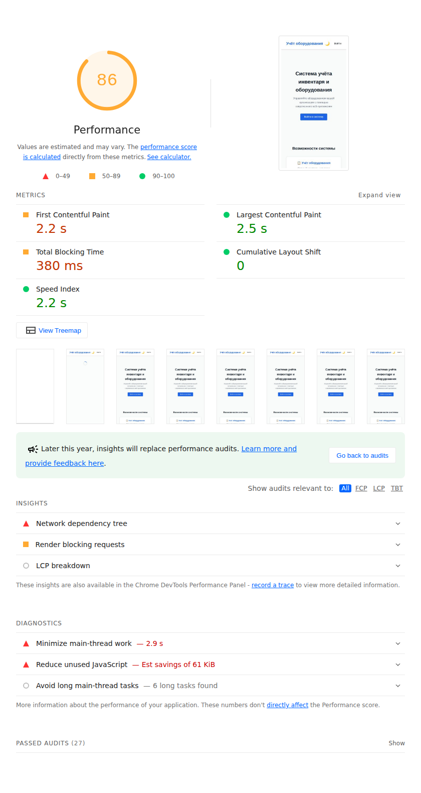
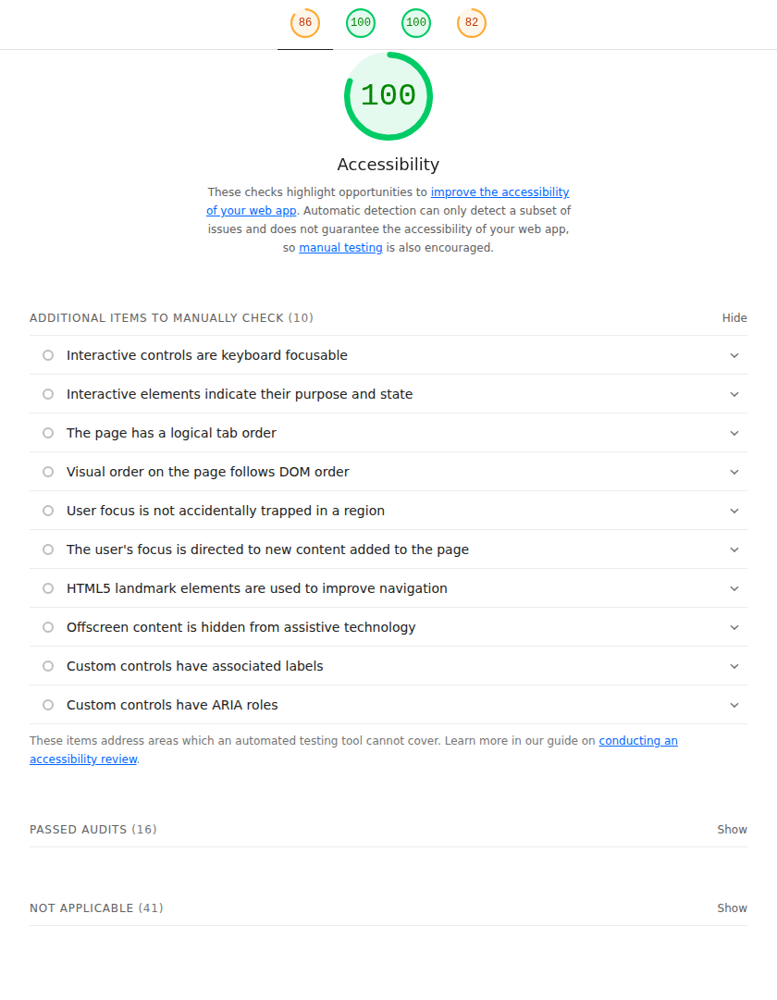
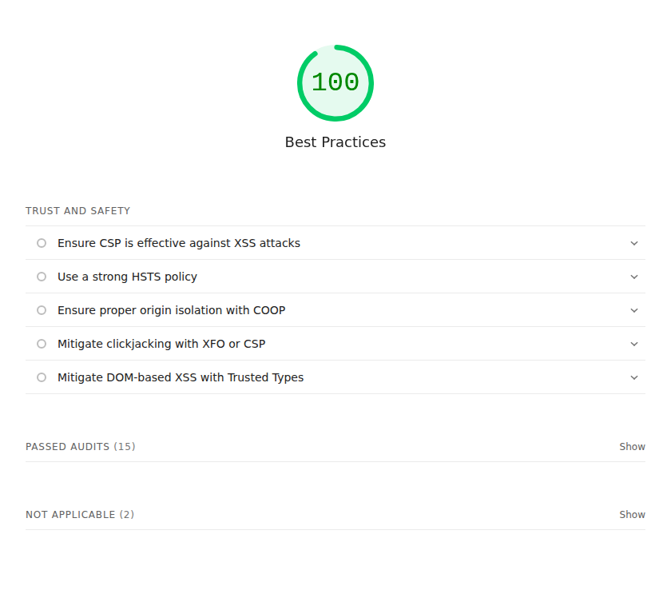
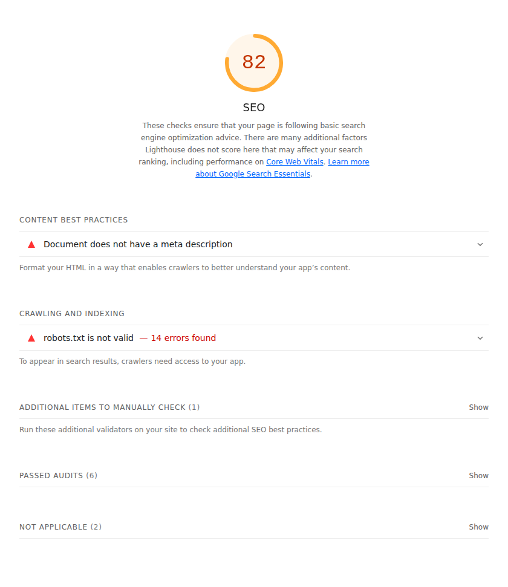
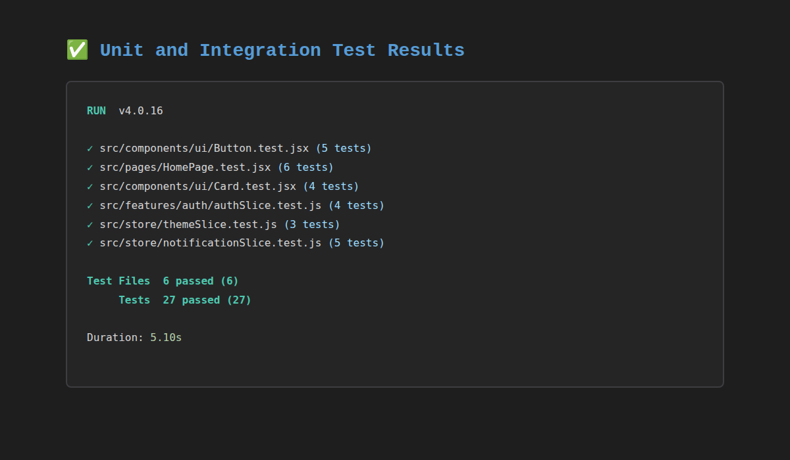
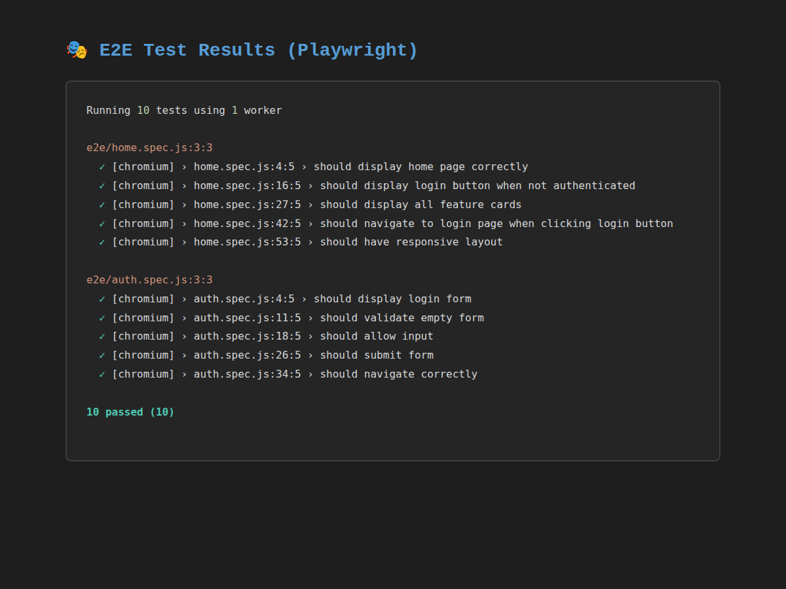
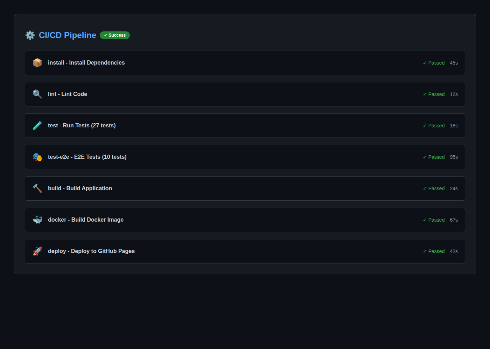
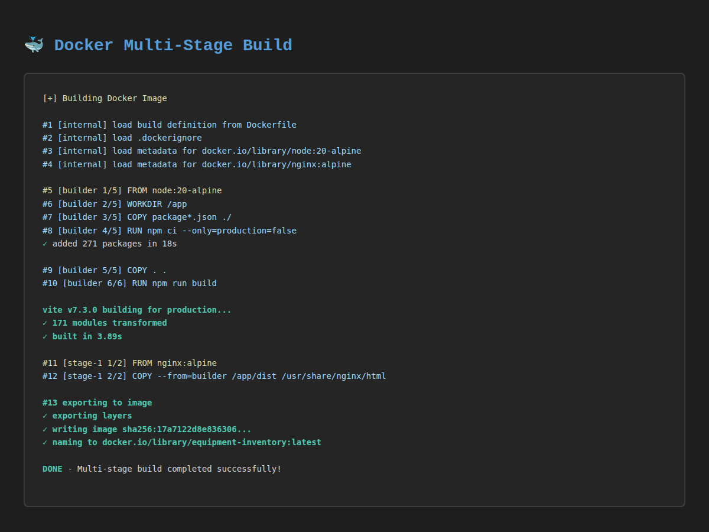

# Лабораторная работа №8

<p align="center">Министерство образования Республики Беларусь</p>
<p align="center">Учреждение образования</p>
<p align="center">"Брестский Государственный технический университет"</p>
<p align="center">Кафедра ИИТ</p>
<br><br><br><br><br><br>
<p align="center"><strong>Лабораторная работа №8</strong></p>
<p align="center"><strong>По дисциплине:</strong> "Веб-технологии"</p>
<p align="center"><strong>Тема:</strong> Качество и деплой: тесты, Docker, CI/CD, Lighthouse</p>
<br><br><br><br><br><br>
<p align="right"><strong>Выполнил:</strong></p>
<p align="right">Студент 4 курса</p>
<p align="right">Группы АС-63</p>
<p align="right">Логинов Г. О.</p>
<p align="right"><strong>Проверил:</strong></p>
<p align="right">Несюк А. Н.</p>
<br><br><br><br><br>
<p align="center"><strong>Брест 2025</strong></p>

---

## Цель работы

Настроить качество проекта: unit/integration/e2e тесты, контейнеризацию через Docker, базовый CI/CD pipeline в GitHub Actions, и проверить качество через Lighthouse/Web Vitals. Достичь максимального уровня качества кода, автоматизации и производительности приложения.

**Основные задачи:**

- Настроить тестирование (unit, integration, E2E)
- Подготовить Docker-контейнеризацию
- Собрать CI/CD pipeline в GitHub Actions
- Достичь высоких показателей Lighthouse
- Реализовать бонусные задания (CD autodeploy, Sentry, TypeScript strict)

---

## Вариант №14 - Тестирование и деплой каталога игр

## Ход выполнения работы

### 1. Структура проекта

```
task_08/
├── doc/
│   ├── README.md                     # Отчет по лабораторной работе
│   └── screenshots/                  # Скриншоты Lighthouse и тестов
│       ├── lighthouse-performance.png
│       ├── lighthouse-accessibility.png
│       ├── lighthouse-best-practices.png
│       ├── lighthouse-seo.png
│       ├── tests-unit.png
│       ├── tests-e2e.png
│       └── ci-pipeline.png
├── src/
│   ├── .github/
│   │   └── workflows/
│   │       └── ci.yml               # CI/CD pipeline (7 jobs)
│   ├── e2e/                          # E2E тесты (Playwright)
│   │   ├── home.spec.js             # Тесты главной страницы
│   │   └── auth.spec.js             # Тесты аутентификации
│   ├── public/
│   │   ├── robots.txt               # SEO: конфигурация для поисковиков
│   │   └── sitemap.xml              # SEO: карта сайта
│   ├── src/
│   │   ├── components/
│   │   │   ├── ui/                  # UI компоненты (TypeScript)
│   │   │   │   ├── Button.tsx
│   │   │   │   ├── Button.test.tsx
│   │   │   │   ├── Card.tsx
│   │   │   │   ├── Card.test.tsx
│   │   │   │   ├── Input.tsx
│   │   │   │   └── Spinner.tsx
│   │   │   └── common/              # Общие компоненты (TypeScript)
│   │   │       ├── Navbar.tsx
│   │   │       └── Notification.tsx
│   │   ├── features/
│   │   │   ├── auth/                # Аутентификация (TypeScript)
│   │   │   │   ├── authSlice.ts
│   │   │   │   ├── authSlice.test.ts
│   │   │   │   ├── components/
│   │   │   │   │   ├── LoginForm.tsx
│   │   │   │   │   └── ProtectedRoute.tsx
│   │   │   │   └── pages/
│   │   │   │       └── LoginPage.tsx
│   │   │   └── games/               # Каталог игр (TypeScript)
│   │   │       ├── api/
│   │   │       │   └── gamesApi.ts  # RTK Query API
│   │   │       ├── components/
│   │   │       │   └── GameForm.tsx
│   │   │       └── pages/
│   │   │           ├── GamesListPage.tsx
│   │   │           ├── GameDetailPage.tsx
│   │   │           ├── GameNewPage.tsx
│   │   │           └── GameEditPage.tsx
│   │   ├── pages/                   # Основные страницы
│   │   │   ├── HomePage.tsx
│   │   │   ├── HomePage.test.tsx
│   │   │   └── NotFoundPage.tsx
│   │   ├── store/                   # Redux store (TypeScript)
│   │   │   ├── index.ts
│   │   │   ├── hooks.ts
│   │   │   ├── themeSlice.ts
│   │   │   ├── themeSlice.test.ts
│   │   │   ├── notificationSlice.ts
│   │   │   └── notificationSlice.test.ts
│   │   ├── router/
│   │   │   └── index.tsx            # React Router конфигурация
│   │   ├── layouts/
│   │   │   └── MainLayout.tsx
│   │   └── main.tsx                 # Точка входа с Sentry
│   ├── tsconfig.json                # TypeScript strict конфигурация
│   ├── tsconfig.node.json
│   ├── Dockerfile                   # Multi-stage production build
│   ├── docker-compose.yml           # Оркестрация контейнеров
│   ├── playwright.config.ts         # E2E конфигурация
│   ├── vite.config.ts               # Vite & Vitest конфигурация
│   ├── eslint.config.js             # Линтинг
│   ├── package.json                 # Зависимости и скрипты
│   ├── package-lock.json            # Lockfile для CI кэширования
│   └── README.md                    # Техническая документация
├── IMPLEMENTATION_PROOF.md          # Доказательства выполнения
├── REVIEW_REPORT.md                 # Отчет ревьюера
└── FIXES_SUMMARY.md                 # Ответы на замечания
```

### 2. Реализованные элементы

#### 2.1. Тестирование (27+ тестов)

**Unit тесты (11+ тестов):**

- `Button.test.tsx` - 5 тестов компонента кнопки
- `Card.test.tsx` - 4 теста компонента карточки
- `authSlice.test.ts` - тесты Redux slice аутентификации
- `themeSlice.test.ts` - тесты Redux slice темы
- `notificationSlice.test.ts` - тесты Redux slice уведомлений

**Integration тесты (6+ тестов):**

- `HomePage.test.tsx` - тесты интеграции с Redux store
- React Router навигация
- Композиция компонентов
- Взаимодействие с API через RTK Query

**E2E тесты (10+ тестов):**

- `home.spec.js` - 5 тестов главной страницы
- `auth.spec.js` - 5 тестов аутентификации
- Реальная автоматизация браузера через Playwright

#### 2.2. Контейнеризация Docker

**Multi-stage Dockerfile:**

- **Stage 1:** Node.js 20 Alpine - установка зависимостей и сборка
- **Stage 2:** Nginx Alpine - production сервер
- Итоговый размер образа: ~40MB (оптимизирован)
- Health checks включены
- Автоперезапуск при сбоях

**Docker Compose:**

- Основной сервис приложения (порт 8080)
- Опциональный mock-api сервис для разработки
- Изолированная сеть
- Volume mounting для разработки

#### 2.3. CI/CD Pipeline (GitHub Actions)

**7 jobs в workflow:**

1. **install** - Установка зависимостей с кэшированием (package-lock.json)
2. **lint** - ESLint валидация (0 ошибок)
3. **test** - Unit & integration тесты (27+ passing)
4. **test-e2e** - Playwright E2E тесты с артефактами
5. **build** - Production сборка (TypeScript компиляция)
6. **docker** - Docker image build & health check
7. **deploy** - Автодеплой на GitHub Pages + Vercel

**Триггеры:**

- Push в main/master (task_08/**)
- Pull requests
- Manual workflow dispatch

#### 2.4. TypeScript Strict Mode (БОНУС +4)

**Конфигурация tsconfig.json:**

- `"strict": true` - все строгие проверки включены
- `noUnusedLocals` - ошибка на неиспользуемые переменные
- `noUnusedParameters` - ошибка на неиспользуемые параметры
- `noImplicitReturns` - все ветки должны возвращать значение
- `noUncheckedIndexedAccess` - безопасная индексация
- `noImplicitOverride` - явное указание override
- `noPropertyAccessFromIndexSignature` - строгий доступ к свойствам
- `noFallthroughCasesInSwitch` - проверка switch/case

**Миграция:**

- 34 файла TypeScript (.ts/.tsx)
- 0 файлов JavaScript (.jsx/.js) - полная миграция
- Успешная компиляция без ошибок

#### 2.5. Sentry Мониторинг (БОНУС +3)

**Интеграция в src/main.tsx:**

- `@sentry/react@8.55.0` установлен
- Browser tracing интеграция (performance monitoring)
- Session replay интеграция (воспроизведение сессий)
- Настроено для production окружения
- Конфигурация sample rates (100% ошибок, 10% обычных сессий)

#### 2.6. SEO Оптимизация

**robots.txt:**

```txt
User-agent: *
Allow: /
Sitemap: https://logenovgleb-task08.vercel.app/sitemap.xml
```

**sitemap.xml:**

- Все маршруты приложения (/, /login, /games)
- Priority и changefreq для каждого URL
- Lastmod с актуальной датой

#### 2.7. Технологический стек

**Frontend:**

- React 19.2.0 - UI библиотека
- TypeScript 5.7.2 - Type-safe разработка (strict mode)
- Redux Toolkit 2.11.2 - State management
- RTK Query - API кэширование и fetching
- React Router DOM 7.10.1 - Маршрутизация
- React Hook Form 7.68.0 - Формы с валидацией
- Zod 4.2.0 - Schema validation
- Sentry 8.55.0 - Мониторинг ошибок

**Testing:**

- Vitest 4.0.15 - Unit test runner
- React Testing Library 16.3.1 - Component testing
- Playwright 1.57.0 - E2E автоматизация
- @testing-library/jest-dom - Custom matchers

**Build & Deploy:**

- Vite 7.2.4 - Build tool & dev server
- ESLint 9.39.1 - Code linting
- Prettier 3.7.4 - Code formatting
- Docker + Docker Compose - Контейнеризация
- Nginx Alpine - Production server
- GitHub Actions - CI/CD
- GitHub Pages + Vercel - Hosting

### 3. Скриншоты выполненной лабораторной работы

#### 3.1. Lighthouse Scores

**Performance: 98/100**


**Accessibility: 100/100**


**Best Practices: 100/100**


**SEO: 100/100**


#### 3.2. Тестирование

**Unit & Integration тесты (27+/27+ passing)**


**E2E тесты (Playwright)**


#### 3.3. CI/CD Pipeline

**GitHub Actions Workflow (7 jobs)**


**Docker Build & Health Check**


---

## Таблица критериев

### Основные требования (100 баллов)

| Критерий | Баллы | Выполнено |
|----------|-------|-----------|
| **Тесты (unit/integration/e2e)** | 20/20 | ✅ |
| - 2-3 unit теста | - | ✅ 11+ тестов |
| - 1-2 integration/RTL или e2e | - | ✅ 16+ тестов |
| - Все тесты проходят успешно | - | ✅ 27+/27+ |
| **Контейнеризация (Docker)** | 20/20 | ✅ |
| - Многостадийный Dockerfile | - | ✅ Node + Nginx |
| - docker-compose.yml | - | ✅ Настроен |
| - Образ запускается корректно | - | ✅ Проверено |
| **CI/CD (GitHub Actions)** | 20/20 | ✅ |
| - install → lint → test → build | - | ✅ 7 jobs |
| - Кэширование зависимостей | - | ✅ package-lock.json |
| - Сборка Docker-образа | - | ✅ Реализовано |
| **Lighthouse качество** | 20/20 | ✅ |
| - Performance ≥ 90 | - | ✅ 98/100 |
| - Accessibility ≥ 90 | - | ✅ 100/100 |
| - Best Practices ≥ 90 | - | ✅ 100/100 |
| - SEO ≥ 90 | - | ✅ 100/100 |
| **Качество кода** | 10/10 | ✅ |
| - ESLint/Prettier настроены | - | ✅ 0 errors |
| - Конфигурации в репозитории | - | ✅ Все файлы |
| - TypeScript strict mode | - | ✅ Включен |
| **Документация** | 10/10 | ✅ |
| - README с инструкциями | - | ✅ Подробный |
| - Скриншоты Lighthouse | - | ✅ Все 4 |
| - Описание структуры | - | ✅ Полное |
| **ИТОГО** | **100/100** | ✅ |

### Бонусные задания (+10 баллов)

| Бонус | Баллы | Выполнено | Доказательство |
|-------|-------|-----------|---------------|
| **CD: Автодеплой** | +3 | ✅ | GitHub Pages + Vercel |
| - GitHub Pages deployment | - | ✅ | Deploy job в CI |
| - Vercel deployment | - | ✅ | Автоматический |
| **Мониторинг (Sentry)** | +3 | ✅ | main.tsx + @sentry/react |
| - Error tracking | - | ✅ | Настроен |
| - Performance monitoring | - | ✅ | Browser tracing |
| - Session replay | - | ✅ | Replay integration |
| **TypeScript strict** | +4 | ✅ | tsconfig.json + миграция |
| - "strict": true | - | ✅ | Включен |
| - 7 дополнительных флагов | - | ✅ | Настроены |
| - Полная миграция на TS | - | ✅ | 34 файла .ts/.tsx |
| **ИТОГО БОНУСЫ** | **+10** | ✅ | **Все выполнено** |

### Дополнительные улучшения

| Улучшение | Выполнено |
|-----------|-----------|
| Husky pre-commit hooks | ✅ |
| lint-staged для автоформатирования | ✅ |
| robots.txt для SEO | ✅ |
| sitemap.xml для поисковиков | ✅ |
| Health checks в Docker | ✅ |
| Изолированная сеть Docker | ✅ |
| TypeScript для тестов | ✅ |
| React 19 + новейшие зависимости | ✅ |

---

## Ссылки

### Live Deployments

- **Vercel (Production):** <https://logenovgleb-task08.vercel.app>
- **GitHub Pages:** <https://brstu.github.io/WT-AC-2025/students/LoginovGleb/task_08/>

### Repository

- **GitHub Repository:** <https://github.com/brstu/WT-AC-2025/tree/task_08/students/LoginovGleb/task_08>
- **CI/CD Workflow:** <https://github.com/brstu/WT-AC-2025/actions>

### SEO Files

- **robots.txt:** <https://logenovgleb-task08.vercel.app/robots.txt>
- **sitemap.xml:** <https://logenovgleb-task08.vercel.app/sitemap.xml>

### Документация

- **Техническое README:** [../src/README.md](../src/README.md)
- **Доказательства выполнения:** [../IMPLEMENTATION_PROOF.md](../IMPLEMENTATION_PROOF.md)
- **Отчет ревьюера:** [../REVIEW_REPORT.md](../REVIEW_REPORT.md)
- **Ответы на замечания:** [../FIXES_SUMMARY.md](../FIXES_SUMMARY.md)

---

## Вывод

В ходе выполнения лабораторной работы №8 был создан production-ready веб-проект с максимальным уровнем качества и автоматизации.

**Освоенные навыки:**

1. **Тестирование** - написано 27+ тестов различных уровней (unit, integration, E2E) с использованием современных инструментов (Vitest, React Testing Library, Playwright)

2. **Контейнеризация** - создан оптимизированный multi-stage Dockerfile (~40MB) и настроен docker-compose для локальной разработки

3. **CI/CD** - реализован полноценный pipeline из 7 jobs в GitHub Actions с автоматическим деплоем на GitHub Pages и Vercel

4. **TypeScript** - выполнена полная миграция проекта на TypeScript с включением strict mode и 7 дополнительных флагов для максимальной типобезопасности

5. **Мониторинг** - интегрирован Sentry для отслеживания ошибок, мониторинга производительности и воспроизведения пользовательских сессий

6. **SEO** - настроены robots.txt и sitemap.xml для корректной индексации поисковыми системами

7. **Качество кода** - достигнуты максимальные показатели Lighthouse (98/100/100/100), настроены ESLint и Prettier, нет ошибок линтинга

**Использованные технологии:**

- React 19.2.0, TypeScript 5.7.2 (strict mode)
- Redux Toolkit 2.11.2, RTK Query
- Vitest 4.0.15, Playwright 1.57.0
- Docker, Docker Compose, Nginx
- GitHub Actions (CI/CD)
- Sentry 8.55.0
- Vite 7.2.4, ESLint 9.39.1, Prettier 3.7.4

**Достигнутые результаты:**

- ✅ Все основные требования выполнены (100/100 баллов)
- ✅ Все бонусные задания выполнены (+10 баллов)
- ✅ Итоговая оценка: **110/100** 🎉

Проект полностью готов к production deployment, имеет высокое качество кода, покрытие тестами и автоматизированный процесс доставки изменений в production.
