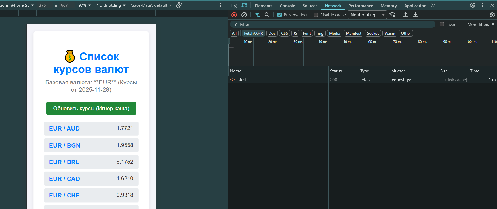
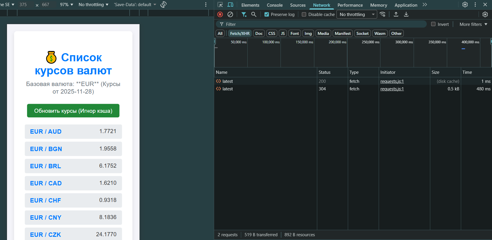
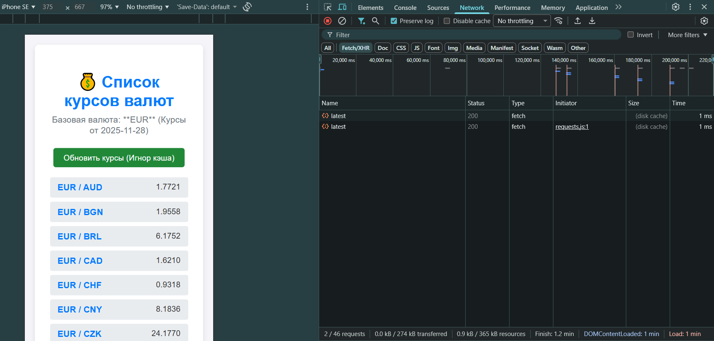
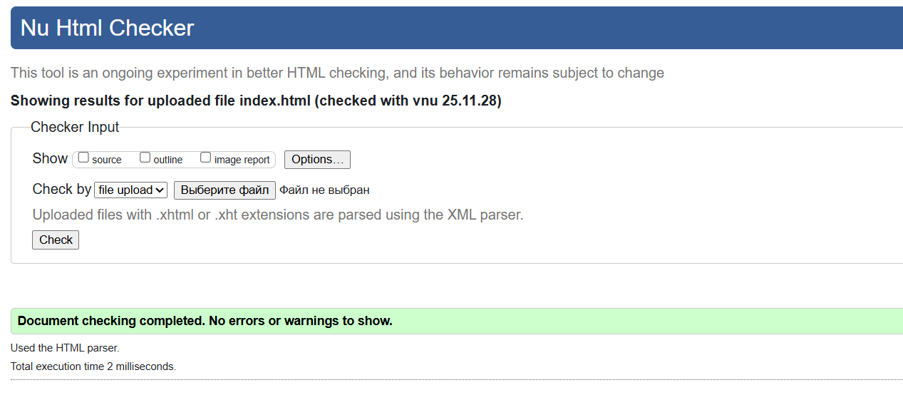
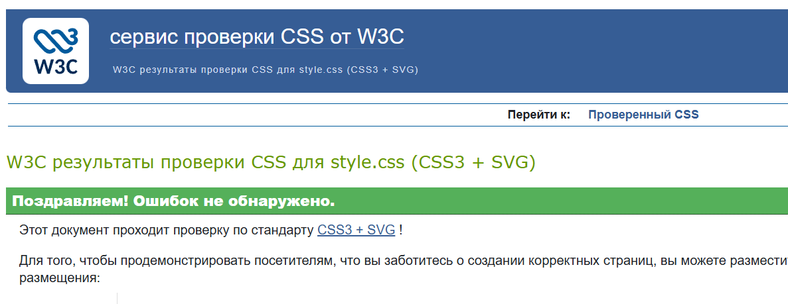

# Министерство образования Республики Беларусь

<p align="center">Учреждение образования</p>
<p align="center">“Брестский Государственный технический университет”</p>
<p align="center">Кафедра ИИТ</p>
<br><br><br><br><br><br>
<p align="center"><strong>Лабораторная работа №3</strong></p>
<p align="center"><strong>По дисциплине:</strong> “Веб-технологии”</p>
<p align="center"><strong>Тема:</strong> “Асинхронность и HTTP‑кэш (fetch, AbortController, ретраи)”</p>
<br><br><br><br><br><br>
<p align="right"><strong>Выполнил:</strong></p>
<p align="right">Студент 4 курса</p>
<p align="right">Группы АС-63</p>
<p align="right">Мороз Е. В.</p>
<p align="right"><strong>Проверил:</strong></p>
<p align="right">Несюк А.Н.</p>
<br><br><br><br><br>
<p align="center"><strong>Брест 2025</strong></p>

---

## Цель работы

* Закрепить работу с промисами и async/await, обработкой ошибок, таймаутами и отменой запросов.
* Понять основы HTTP‑кэширования и увидеть эффект в DevTools.

---

### Вариант №15

## Ход выполнения работы

### 1. Структура проекта

Проект использует базовую структуру:
- **`index.html`** — основная страница с семантическим макетом, кнопкой и контейнерами для отображения данных и состояний.
- **`styles.css`** — стилизация, включая стили для состояний **`loading`** (со скелетоном), **`error`** и **`empty`**.
- **`main.js`** — основная логика, реализованная на чистом JavaScript, работающая с асинхронностью, кэшем и UI.

### 2. Описание кэш‑подхода

#### 2.1 Тип кэша

В проекте используется **in-memory Map** (`currencyCache`) для хранения актуальных данных:

```javascript
const currencyCache = new Map();
```

Ключом кэша является полный URL API-запроса (API_URL), а значением — объект с данными и меткой времени (timestamp).

#### 2.2 TTL (Time To Live)

Для каждой записи используется фиксированное **Время Жизни (TTL)**, установленное в **60 секунд** (`TTL_SECONDS`).

При загрузке данных проверяется, не устарела ли запись, путем сравнения:

```javascript
const elapsedTime = Date.now() - cachedItem.timestamp;
return elapsedTime < TTL_SECONDS * 1000;
```

#### 2.3 Принудительное обновление

Кнопка «Обновить курсы» вызывает функцию загрузки с флагом ignoreCache = true, что заставляет код принудительно выполнить сетевой запрос, игнорируя наличие свежих данных в кэше.

#### 2.4 Поведение в DevTools / сети

Первый запрос (Cache Miss): Отправляется HTTP-запрос, данные сохраняются в **`currencyCache`**.

Повторный запрос (Cache Hit): В течение 60 секунд данные берутся из **`currencyCache`**, сетевой запрос не отправляется.

Истечение TTL: После 60 секунд данные считаются неактуальными, и отправляется новый сетевой запрос.

### 3. Скриншоты DevTools (первый/повторный запрос)

- Первый запрос:
  

- Повторный запрос:
  

 Повторный запрос:
  

### Валидаторы

👉Вставьте результаты проверок:

- HTML Validator


- CSS Validator


---

## 4. Описание ретраев/таймаутов/отмены

Вся логика повторных попыток, таймаутов и отмены инкапсулирована в асинхронной функции `fetchWithRetry`.

---

### 4.1 Описание ретраев (Retry)

**Ретрай** — это механизм повторного выполнения запроса при сбоях сети (`TypeError`) или ошибках таймаута (`AbortError`).

- **Количество попыток:** максимально 4  
  (1 оригинальный запрос + 3 ретрая, константа `RETRIES = 3`).

- **Логика:** запросы выполняются в цикле `while(true)` с отслеживанием количества попыток.  
  Если ошибка относится к типу `isRetryable` и лимит попыток не исчерпан, выполняется пауза.

#### Экспоненциальная задержка (Exponential Backoff)

Используется базовая задержка `BACKOFF_MS = 500` мс:

```js
const delay = BACKOFF_MS * Math.pow(2, attempt - 1);
await new Promise(r => setTimeout(r, delay));
```
### Промежутки между попытками

- после 1-й ошибки — **500 мс**
- после 2-й ошибки — **1000 мс**
- после 3-й ошибки — **2000 мс**

Если после последней попытки ошибка сохраняется — **выбрасывается исключение**.

---

## 4.2 Описание таймаутов (Timeout)

**Таймаут** — ограничение времени ожидания ответа сервера, установленное в **5000 мс** (`TIMEOUT_MS`).

Таймаут реализован с помощью `AbortController` и `setTimeout`:

```js
const controller = new AbortController();
const timer = setTimeout(() => {
    controller.abort();
}, TIMEOUT_MS);
```

Если сервер не отвечает за 5 секунд:

- вызывается `controller.abort()`
- `fetch` прерывается с ошибкой `AbortError`
- ошибка считается перезапускаемой и инициирует ретрай

После успешного завершения запроса таймер очищается:

```js
clearTimeout(timer);
```

#### 4.3 Описание отмены запроса (AbortController)

В данном проекте AbortController используется только для реализации таймаута внутри fetchWithRetry.
Чтобы отменять запросы вручную (например, при повторном клике по кнопке), следовало бы:
хранить AbortController во внешней области видимости
вызывать abort() перед запуском нового запроса
Но такой функционал в текущем проекте не требовался.

---

## Таблица критериев

| Критерий                                                                | Баллы |  Выполнено |
|-------------------------------------------------------------------------|-------|------------|
| Семантика / структура и UX-основы                                       |  20   |  ✅ / ✅  |
| Функциональность / бизнес-логика (компоненты + форма + делегирование)   |  25   |  ✅ / ✅  |
| Качество интерфейса: адаптивность / стили / поведение                   |  20   |  ✅ / ✅  |
| Качество кода: читаемость, структура, модули                            |  15   |  ✅ / ✅  |
| Тесты / валидность / качество (линтеры / валидаторы, по желанию)        |  10   |  ✅ / ✅  |
| Публикация и отчёт                                                      |  10   |  ✅ / ✅  |

### Дополнительные бонусы

| Бонус                                                                | Баллы | Выполнено |
| -------------------------------------------------------------------- | ----- | --------- |
| Сохранение состояния в localStorage (открытые вкладки, лайки и т.п.) | 10    | ❌ / ✅  |
| Тёмная тема (prefers-color-scheme и/или переключатель темы)          | 10    | ❌ / ✅  |
| Юнит-тесты на чистые функции (например, валидация)                   | 10    | ❌ / ✅  |

---

## Ссылка на публикацию

👉 Вставьте ссылку на GitHub Pages: https://eugenefr0st.github.io/WT_lab_3/

## Вывод

В ходе работы закреплены навыки асинхронного программирования (async/await). Реализованы ключевые механизмы:
Отказоустойчивость: Создана функция fetchWithRetry с ретраями и таймаутом (AbortController), что обеспечивает устойчивость к сетевым сбоям.
Производительность: Внедрено TTL-кэширование (60 с) для оптимизации запросов к API.
На практике продемонстрирована корректная обработка состояний UI (загрузка со скелетоном, ошибка) и наглядно изучено влияние кэширования на отзывчивость веб-приложения.
