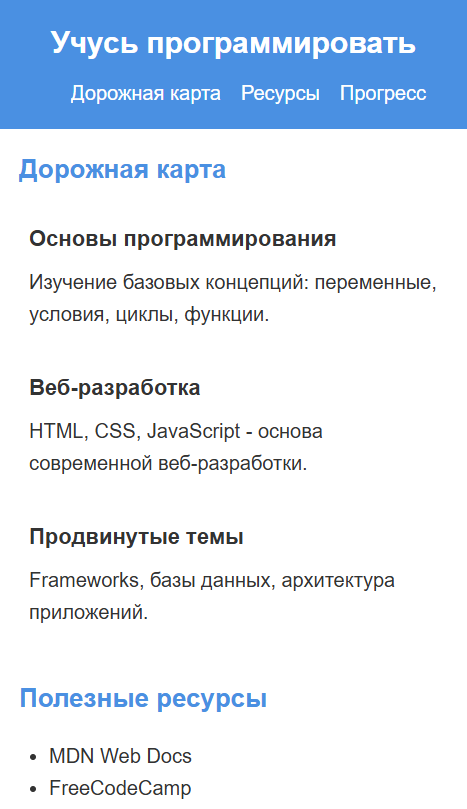
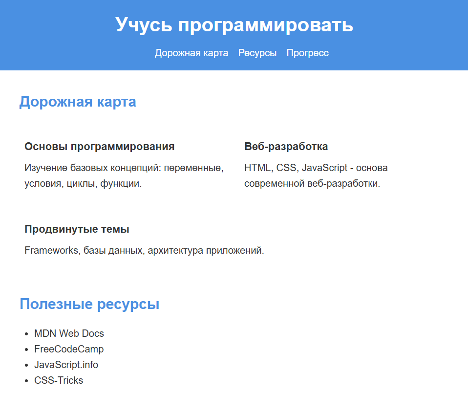
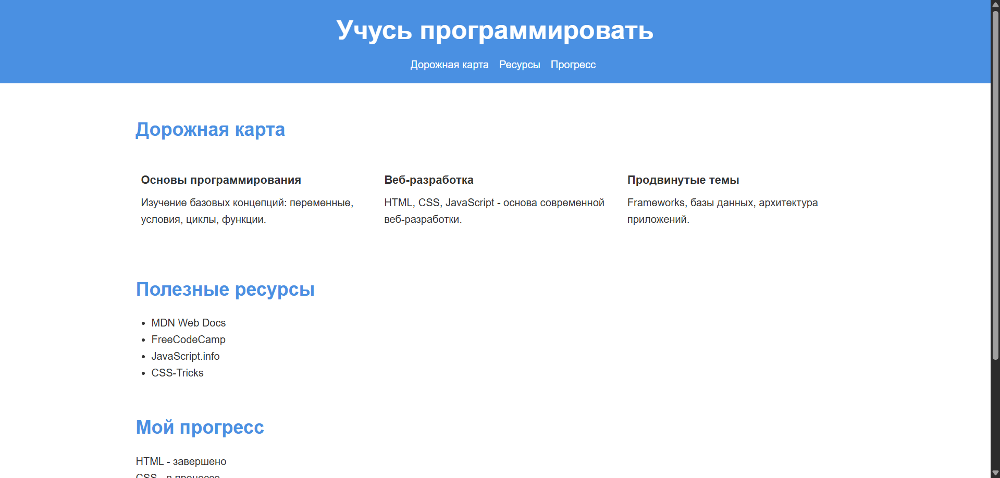
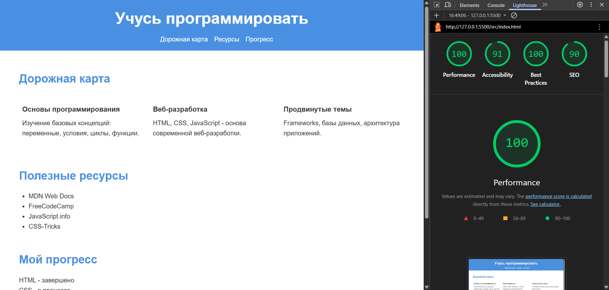

# Лабораторная работа №01

Министерство образования Республики Беларусь

Учреждение образования

"Брестский Государственный технический университет"

Кафедра ИИТ

      

<strong>Лабораторная работа №1</strong>

<strong>По дисциплине:</strong> "Веб-технологии"

<strong>Тема:</strong> "HTML/CSS: семантика, адаптивность и доступность"

      

<strong>Выполнил:</strong>

Студент 4 курса

Группы АС-64

Немирович Д.А.

<strong>Проверил:</strong>

Несюк А.Н.

     

<strong>Брест 2025</strong>

---

## Цель работы

Освоить основы семантической вёрстки HTML5, реализовать адаптивную структуру веб-страницы по принципу **mobile-first** и обеспечить её доступность в соответствии с современными стандартами.

---

### Вариант №37. Лэндинг «Учусь программировать» — дорожная карта, ресурсы, прогресс

## Ход выполнения работы

### 1. Структура проекта

- `index.html` — основная страница  
- `styles.css` — стилизация и медиазапросы  
- `img/` — изображения (при наличии)  

### 2. Реализованные элементы

- Семантическая разметка HTML5: использованы теги `<header>`, `<nav>`, `<main>`, `<section>`, `<article>`, `<footer>`
- Flexbox для построения адаптивной сетки элементов
- Mobile-first медиазапросы с брейкпоинтами 601px и 1025px
- Базовая структура навигации
- Простая иерархия заголовков (h1, h2, h3)

### 3. Скриншоты работы сайта

👉 Вставьте сюда 3 скриншота:  

- Мобильная версия (≤600px):  
  

- Планшетная версия (601–1024px):  
  

- Десктопная версия (>1024px):  
  

---

## Проверка качества

### Lighthouse

👉 Вставьте результаты проверки Lighthouse (Accessibility, Best Practices ≥ 90):  

### Валидаторы

👉 Вставьте результаты проверок:  

- *HTML Validator* - ошибок не обнаружено!

- *CSS Validator* - ошибок не обнаружено!  

---

## Таблица критериев

| Критерий                                | Выполнено |
|------------------------------------------|-----------|
| Семантика/структура (landmarks, заголовки) | ✅ |
| Адаптивная вёрстка (2+ брейкпоинта, Flex/Grid) | ✅ |
| Доступность (alt/label, фокус, контраст, клавиатура) | ❌ |
| Качество и валидность (Lighthouse ≥ 90, валидаторы) | ✅ |
| Оформление кода/структура проекта        | ✅ |
| Публикация и отчёт                       | ✅ |

### Дополнительные бонусы

| Бонус                                     | Выполнено |
|-------------------------------------------|-----------|
| Тёмная тема (prefers-color-scheme)        | ❌ |
| Адаптивные изображения (picture/srcset)   | ❌ |
| Улучшения Web Vitals (CLS/LCP/INP)        | ❌ |
| Другие улучшения (указать свои)           | ❌ |

---

## Ссылка на публикацию

👉 Вставьте ссылку на GitHub Pages: <https://goryachiy-ugolek.github.io/WT-AC-2025/task_01/>

## Вывод

В ходе выполнения лабораторной работы была создана базовая одностраничная веб-страница с использованием семантической разметки HTML5. Реализована адаптивная вёрстка по принципу mobile-first с использованием медиазапросов и Flexbox. Освоены базовые принципы структурирования веб-страниц с использованием современных HTML5 тегов (`<header>`, `<nav>`, `<main>`, `<section>`, `<article>`, `<footer>`). Код прошёл валидацию HTML и CSS валидаторами.
