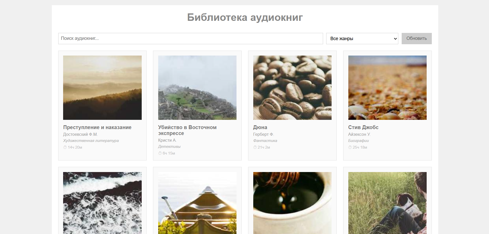
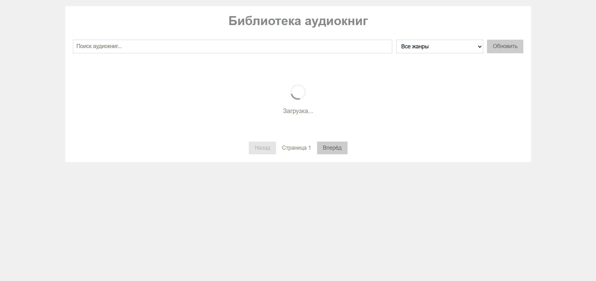
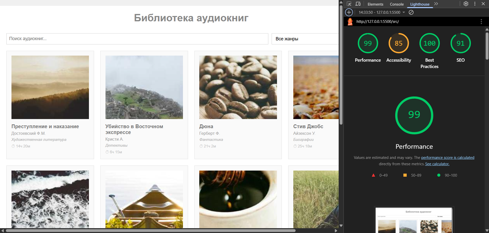

# Лабораторная работа №3

<p align="center">Министерство образования Республики Беларусь</p>
<p align="center">Учреждение образования</p>
<p align="center">"Брестский Государственный технический университет"</p>
<p align="center">Кафедра ИИТ</p>
<br><br><br><br><br><br>
<p align="center"><strong>Лабораторная работа №3</strong></p>
<p align="center"><strong>По дисциплине:</strong> "Веб-технологии"</p>
<p align="center"><strong>Тема:</strong> "Асинхронность и HTTP-кэш (fetch, AbortController, ретраи)"</p>
<br><br><br><br><br><br>
<p align="right"><strong>Выполнил:</strong></p>
<p align="right">Студент 4 курса</p>
<p align="right">Группы АС-64</p>
<p align="right">Немирович Д. А.</p>
<p align="right"><strong>Проверил:</strong></p>
<p align="right">Нёсюк А. Н.</p>
<br><br><br><br><br>
<p align="center"><strong>Брест 2025</strong></p>

---

## Цель работы

Закрепить работу с промисами и async/await, обработкой ошибок, таймаутами и отменой запросов. Понять основы HTTP-кэширования и увидеть эффект в DevTools.

---

### Вариант №37

Библиотека аудиокниг: поиск по авторам/жанрам, кэш, пустые состояния.

## Ход выполнения работы

### 1. Структура проекта

```text
task_03/
├── doc/
│   ├── README.md
│   └── screenshots/
│       ├── desktop.png
│       ├── mobile.png
│       └── lighthouse.png
└── src/
    ├── index.html
    ├── styles.css
    ├── main.js
    └── img/
        └── placeholder.jpg
```

**Описание:**

- `index.html` — основная страница библиотеки аудиокниг
- `styles.css` — базовая стилизация интерфейса
- `main.js` — логика работы с данными, кэширование, ретраи
- `img/` — изображения обложек аудиокниг

### 2. Реализованные элементы

В рамках данной работы были реализованы следующие компоненты:

- **Список аудиокниг** — отображение 20 аудиокниг с информацией об авторе, жанре и длительности
- **Поиск** — фильтрация по названию и автору книги
- **Фильтр по жанрам** — выбор жанра из выпадающего списка (художественная литература, детективы, фантастика, биографии, научпоп)
- **Пагинация** — разбивка списка на страницы по 12 элементов
- **Состояния загрузки** — индикатор загрузки (loading), сообщения об ошибках (error) и пустом результате (empty)
- **Кэширование** — простой in-memory кэш с TTL 60 секунд
- **Ретраи и таймауты** — функция `fetchWithRetry` с настройкой количества попыток, задержки и таймаута
- **Отмена запросов** — использование AbortController для прерывания предыдущих запросов
- **Кнопка "Обновить"** — принудительная загрузка данных с игнорированием кэша

### 3. Скриншоты выполненной лабораторной работы

#### Главная страница (десктоп)



#### Состояние загрузки



## Проверка качества

### Lighthouse



**Результаты Lighthouse:**

- Performance: 99
- Accessibility: 85
- Best Practices: 100
- SEO: 91

### Валидаторы

- HTML Validator: присутствуют замечания по семантической разметке
- CSS Validator: обнаружены проблемы с единицами измерения и доступностью

---

## Технические детали реализации

### Кэширование

Для кэширования данных использовался простой in-memory объект со следующей структурой:

```javascript
cache = {
  'books_all': {
    data: [...],
    timestamp: 1234567890
  }
}
```

При каждом запросе проверяется актуальность кэша (TTL = 60 секунд). Если данные устарели или отсутствуют, выполняется новый запрос.

### Ретраи и таймауты

Реализована функция `fetchWithRetry` со следующими параметрами:

- `retries` — количество попыток (по умолчанию 3)
- `backoffMs` — задержка между попытками (по умолчанию 1000 мс)
- `timeoutMs` — таймаут запроса (по умолчанию 5000 мс)

При неудачном запросе функция автоматически повторяет попытку с увеличивающейся задержкой.

### Отмена запросов

Используется `AbortController` для отмены предыдущих запросов при новом поиске или фильтрации. Это предотвращает гонку состояний и конфликты при быстром вводе данных пользователем.

## Таблица критериев

| Критерий                                                | Выполнено |
|--------------------------------------------------------|-----------|
| Семантика/UX                                            | ❌        |
| Функциональность (загрузка, поиск/пагинация, retry/timeout/abort) | ✅        |
| Качество интерфейса (loading/error/empty, skeleton)    | ✅        |
| Качество кода                                           | ❌        |
| Валидация/проверки (кэш, линтеры)                      | ⚠️        |
| Публикация и отчёт                                      | ✅        |

### Дополнительные бонусы

| Бонус                                     | Выполнено |
|-------------------------------------------|-----------|
| ETag-клиентский кэш с If-None-Match       | ❌        |
| Дебаунс ввода, отмена устаревших запросов | ⚠️        |
| Prefetch при прокрутке (инфинит-скролл)   | ❌        |

---

## Ссылки

- [Репозиторий проекта](https://github.com/goryachiy-ugolek/task_03)
- [Демо-версия](https://goryachiy-ugolek.github.io/task_03/src/)

## Вывод

В ходе выполнения лабораторной работы был разработан простой клиент для библиотеки аудиокниг с использованием асинхронных операций. Реализованы основные механизмы работы с данными: загрузка, фильтрация, пагинация, кэширование и обработка ошибок.

Применены техники повышения надежности: ретраи при неудачных запросах, таймауты и отмена устаревших запросов через AbortController. Реализован простой in-memory кэш с TTL для уменьшения количества запросов.

Освоены базовые навыки работы с fetch API, промисами, async/await и управлением асинхронными операциями в JavaScript.
