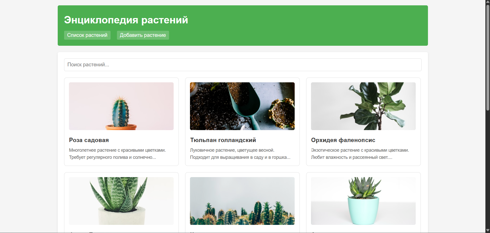
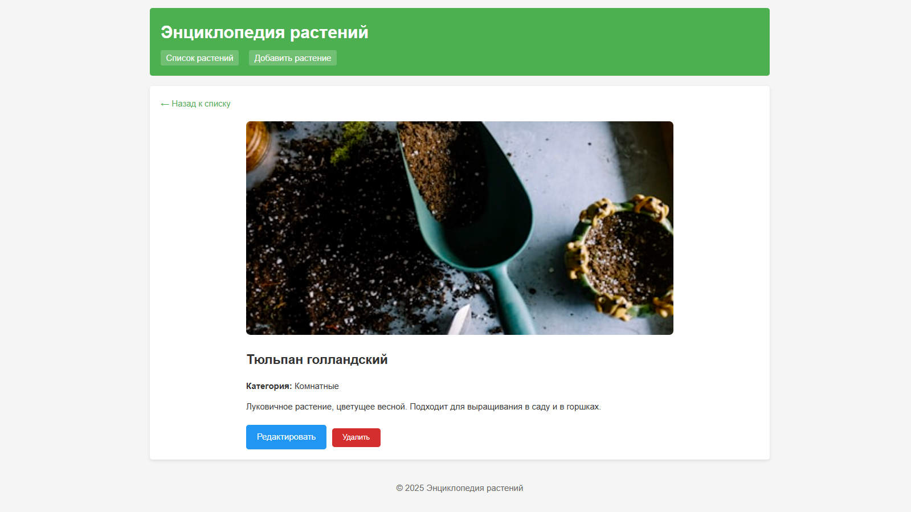
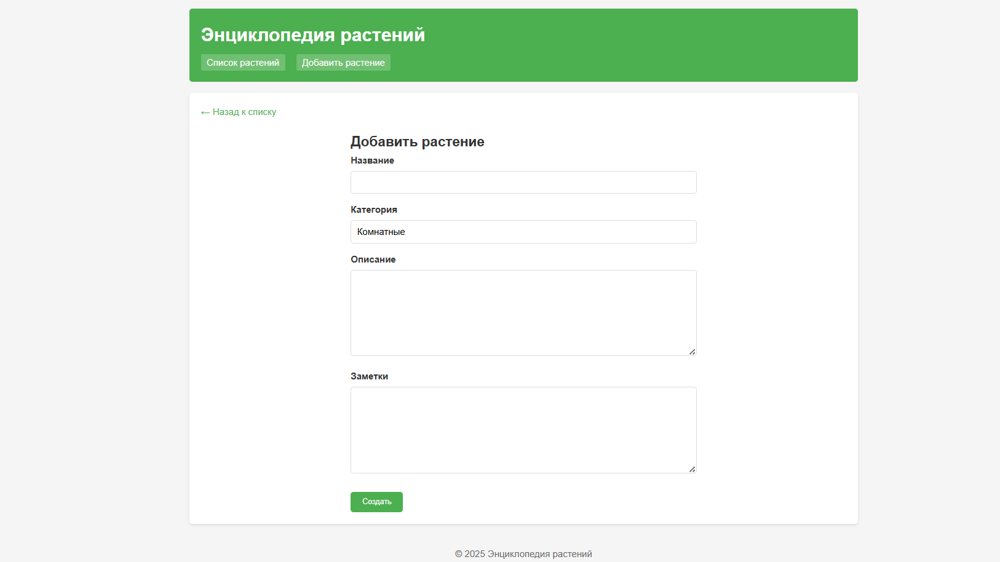
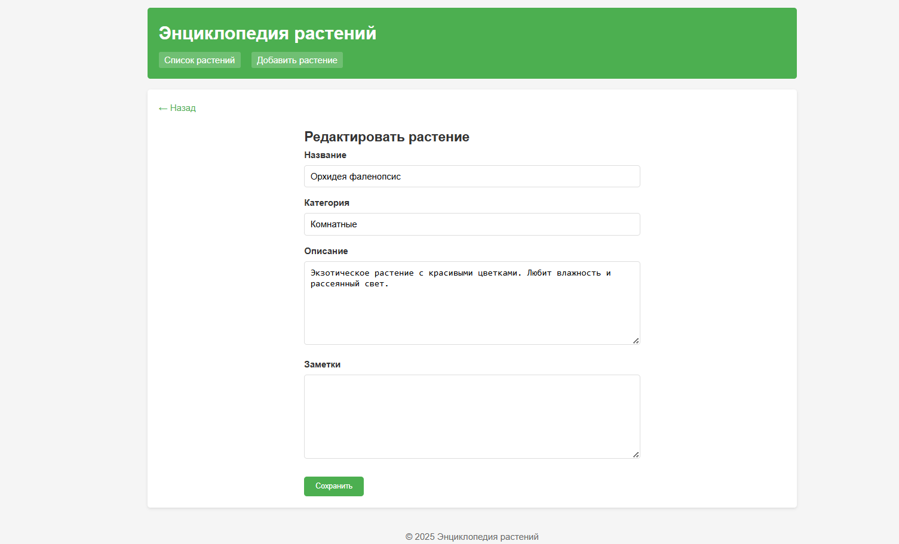
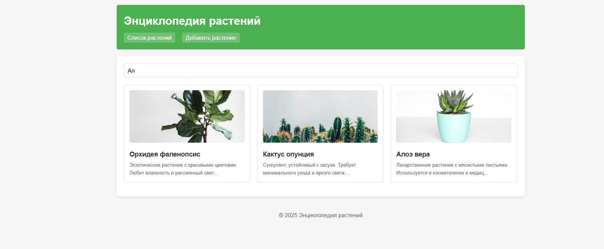
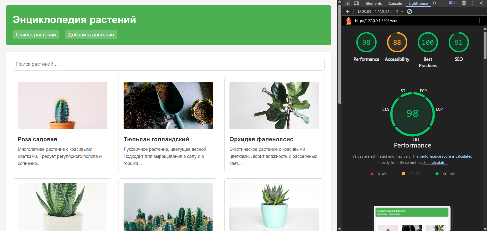

# Лабораторная работа №04

<p align="center">Министерство образования Республики Беларусь</p>
<p align="center">Учреждение образования</p>
<p align="center">"Брестский Государственный технический университет"</p>
<p align="center">Кафедра ИИТ</p>
<br><br><br><br><br><br>
<p align="center"><strong>Лабораторная работа №04</strong></p>
<p align="center"><strong>По дисциплине:</strong> "Веб-технологии"</p>
<p align="center"><strong>Тема:</strong> REST‑клиент SPA: список/детализация/CRUD, маршрутизация</p>
<br><br><br><br><br><br>
<p align="right"><strong>Выполнил:</strong></p>
<p align="right">Студент 4 курса</p>
<p align="right">Группы АС-64</p>
<p align="right">Немирович Д. А.</p>
<p align="right"><strong>Проверил:</strong></p>
<p align="right">Несюк А. Н.</p>
<br><br><br><br><br>
<p align="center"><strong>Брест 2025</strong></p>

---

## Цель работы

Реализовать простой SPA без фреймворков с маршрутизацией и состояниями загрузки/ошибок. Выполнить CRUD к учебному API.

---

### Вариант №37

Энциклопедия растений: список, деталь, CRUD заметок.

## Ход выполнения работы

### 1. Структура проекта

```
+---doc
|   |   README.md
|   |
|   \---screenshots
|           (скриншоты работы приложения)
|
\---src
    |   index.html
    |   styles.css
    |
    +---img
    |       (изображения)
    |
    \---js
            api.js
            app.js
            router.js
            views.js
```

- `index.html` — основная страница SPA
- `styles.css` — стилизация и медиазапросы
- `js/api.js` — модуль для работы с API
- `js/router.js` — модуль маршрутизации
- `js/views.js` — модуль представлений
- `js/app.js` — главный модуль приложения

### 2. Реализованные элементы

- Hash-маршрутизация (`#/items`, `#/items/:id`, `#/new`, `#/items/:id/edit`)
- Состояния загрузки и ошибок на всех экранах
- CRUD операции (создание, чтение, обновление, удаление)
- Поиск растений с сохранением параметров в hash
- Подтверждение удаления
- Блокировка кнопки отправки во время сохранения
- Адаптивная вёрстка (2 брейкпоинта)
- Уведомления об успешных операциях

### 3. Маршруты приложения

| Маршрут | Описание |
|---------|----------|
| `#/items` | Список всех растений |
| `#/items?search=query` | Поиск растений |
| `#/items/:id` | Детальная страница растения |
| `#/new` | Форма создания нового растения |
| `#/items/:id/edit` | Форма редактирования растения |

### 4. API

Приложение использует mock-данные, имитирующие работу с REST API:

- `GET /items` — получение списка растений
- `GET /items/:id` — получение растения по ID
- `POST /items` — создание нового растения
- `PATCH /items/:id` — обновление растения
- `DELETE /items/:id` — удаление растения

### 5. Как запустить

1. Откройте файл `src/index.html` в браузере
2. Или используйте локальный сервер (например, Live Server в VS Code)

### 6. Скриншоты выполненой лабораторной работы

**Список растений (главная страница):**


**Детальная страница растения:**


**Форма создания нового растения:**


**Форма редактирования растения:**


**Поиск растений:**


**Мобильная версия:**


## Проверка качества

### Lighthouse



**Результаты Lighthouse:**

- Performance: 98
- Accessibility: 88
- Best Practices: 100
- SEO: 91

### Валидаторы

- HTML Validator — без критических ошибок
- CSS Validator — без критических ошибок

---

## Таблица критериев

| Критерий                                | Выполнено |
|------------------------------------------|-----------|
| Семантика/UX | ✅ |
| Функциональность/CRUD/маршрутизация | ✅ |
| Качество интерфейса | ✅ |
| Качество кода/модульность | ✅ |
| Тесты/валидность | ❌ |
| Публикация и отчёт | ✅ |

### Дополнительные бонусы

| Бонус                                     | Выполнено |
|-------------------------------------------|-----------|
| Сохранение фильтров/поиска в hash | ✅ |
| Предзагрузка данных (prefetch) | ❌ |
| Клиентская авторизация | ❌ |

---

## Вывод

В ходе выполнения лабораторной работы было создано одностраничное приложение (SPA) "Энциклопедия растений" на чистом JavaScript без использования фреймворков. Реализована hash-маршрутизация, CRUD операции, поиск с сохранением параметров в URL. Приложение разделено на модули: router, api, views. Освоены навыки создания SPA-приложений с нуля.
