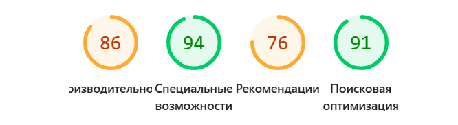
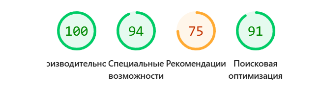
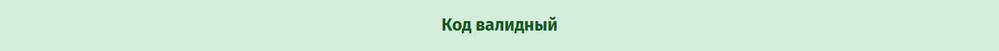
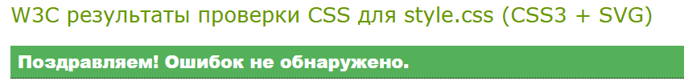

# Архитектура вёрстки сайта о волонтёрстве

## Общий подход
- **Mobile First**: вёрстка реализована по принципу "сначала мобильные устройства" с последующим усложнением для планшетов и десктопов
- **CSS Grid + Flexbox**: комбинированное использование современных технологий раскладки
- **Адаптивный дизайн**: плавное изменение интерфейса для разных размеров экранов

## Ключевые структурные элементы

### Flexbox контейнеры:
- **Навигация**: `nav ul` - горизонтальное меню с центрированием
- **Шапка**: `.header-btns` - выравнивание кнопок призыва к действию
- **Социальные ссылки**: `.social-links` - равномерное распределение иконок
- **Статистика**: `.about-stats` - сетка статистических данных
- **Шаги**: `.steps-grid` - горизонтальное расположение этапов

### CSS Grid области:
- **О нас**: `.content-grid` - двухколоночный макет (текст + изображение)
- **Проекты**: `.projects-grid` - адаптивная сетка карточек проектов
- **Отзывы**: `.experience-grid` - сетка testimonials
- **Галерея**: `.gallery-grid` - сетка фотографий
- **Контакты**: `.contact-grid` - двухколоночная форма и информация
- **Футер**: `.footer-content` - трёхколоночная структура

## Медиазапросы

### Мобильные устройства (≤600px)
```css
@media (max-width: 600px)
```
- **Вертикальная навигация** - меню превращается в колонку
- **Одноколоночные сетки** - все Grid-контейнеры перестраиваются в 1 колонку
- **Уменьшенные отступы** - адаптивные padding и margin
- **Гибкая типографика** - уменьшенные размеры шрифтов

### Планшеты (601–1024px)
```css
@media (max-width: 1024px)
```
- **Двухколоночные сетки** - проекты, отзывы и галерея по 2 колонки
- **Адаптивные шаги** - `.steps-grid` 2 колонки вместо 4
- **Упрощённый футер** - 2 колонки вместо 3

### Десктопы (>1024px)
- **Много колоночные сетки** - проекты (2), отзывы (3), галерея (4 колонки)
- **Полноценная навигация** - горизонтальное меню
- **Максимальная ширина** - контент ограничен 1200px

## Особенности доступности
- **Семантические теги** - правильная HTML5 разметка (header, nav, main, section, article, footer)
- **Контрастность** - соблюдение соотношения 4.5:1 для текста
- **Фокус-индикаторы** - визуальное выделение активных элементов (`:focus`)
- **Плавная прокрутка** - `scroll-behavior: smooth` для навигации по якорям
- **Alt-тексты** - описательные атрибуты для изображений

## CSS Переменные
Используется система CSS-переменных для единообразного управления дизайн-системой:

```css
:root {
    --primary-color: #4CAF50;      /* Основной брендовый цвет */
    --primary-dark: #388E3C;       /* Тёмный вариант основного цвета */
    --secondary-color: #2196F3;    /* Вторичный акцентный цвет */
    --accent-color: #FF9800;       /* Цвет для призывов к действию */
    --text-color: #333;            /* Основной цвет текста */
    --light-gray: #f5f5f5;         /* Фоновый светлый цвет */
    --white: #ffffff;              /* Чистый белый */
    --shadow: 0 2px 5px rgba(0,0,0,0.1); /* Стандартная тень */
    --border-radius: 8px;          /* Базовое скругление углов */
}
```

## Принципы адаптивности
1. **Прогрессивное улучшение** - от простой мобильной вёрстки к сложной десктопной
2. **Гибкие изображения** - `max-width: 100%` и `object-fit: cover`
3. **Относительные единицы** - использование rem, em и % вместо фиксированных пикселей
4. **Модульная сетка** - последовательное уменьшение колонок при сужении экрана

## Lighthouse

### Mobile



### Desktop




## Валидаторы HTML/CSS

### HTML



### CSS




[Site](https://github.com/woQhy/WebLab1)