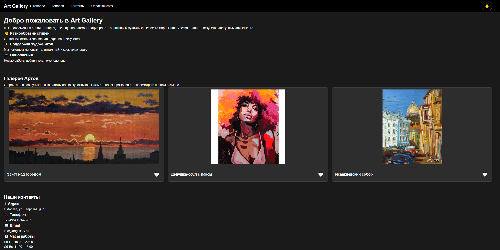
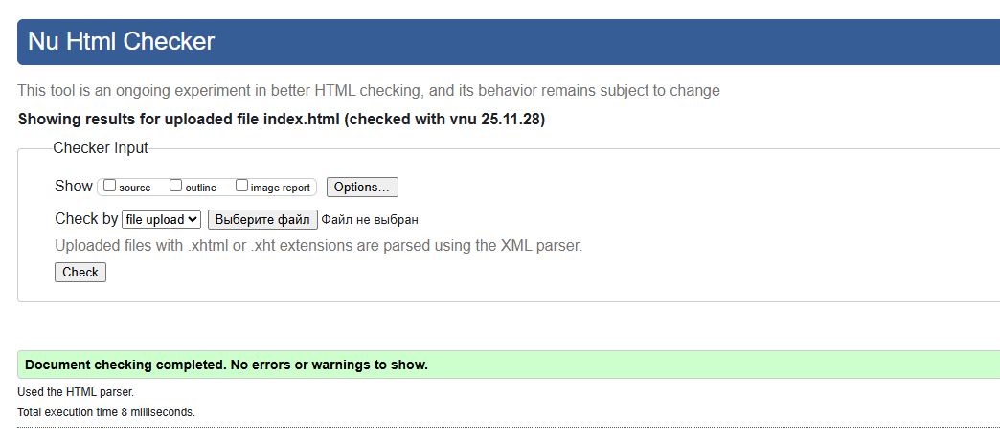
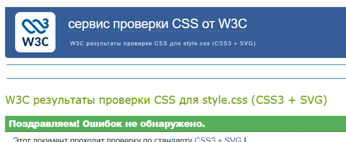
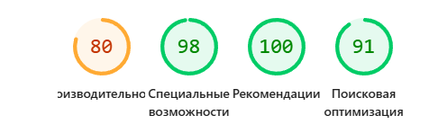

# Отчет по лабораторной работе №2

Вариант 16: Галерея артов

## О проекте

Галерея артов с современным интерфейсом, реализованная на чистом JavaScript, позволяет просматривать художественные работы, изучать детальную информацию об артах и оставлять обратную связь через валидируемую форму.

## Функциональность

### Навигационная система

- **Адаптивное бургер-меню** для мобильных устройств
- Плавные анимации открытия/закрытия
- Клавиатурная навигация между разделами
- Плавная прокрутка к якорным ссылкам

### Карточки артов

- Визуальные карточки с изображением, названием и информацией
- Система лайков
- Интерактивные подсказки при наведении на изображения
- Цветовая индикация лайков (серый/красный)

### Детальная информация

- Модальное окно с полноэкранным просмотром артов
- Анимации появления и плавные переходы
- Доступное управление с клавиатуры
- Ловушка фокуса внутри модального окна

### Форма обратной связи

- Валидация в реальном времени всех полей
- Умная блокировка кнопки отправки при ошибках
- Пользовательские сообщения об ошибках
- Поддержка минимальной длины сообщений

## Технические особенности

### Архитектура

- **Чистый JavaScript ES6+** без сторонних библиотек
- Функциональный подход к организации кода
- Модульная структура компонентов
- Делегирование событий

### Доступность (a11y)

- Полная клавиатурная навигация (Tab, Enter, Space, Escape)
- ARIA-атрибуты для скринридеров
- Семантическая разметка (header, main, section, article, nav, footer)
- Ловушки фокуса в модальных окнах
- Визуальные индикаторы фокуса

### Адаптивность

- Mobile-first подход
- Гибкая сетка карточек (1 колонка на мобильных, 3 на десктопе)
- Оптимизированные интерфейсы для мобильных устройств
- Правильное масштабирование изображений

## Компоненты системы

### ThemeManager

Управление переключением светлой и темной темы

**Функции:**

- Автоопределение системных предпочтений
- Переключатель темы в хедере
- Плавные переходы между темами
- Сохранение выбора в localStorage

### ModalController

Контроллер модальных окон для просмотра артов

**Функции:**

- Открытие/закрытие модальных окон
- Ловушка фокуса внутри модалки
- Обработка клавиши ESC
- Блокировка скролла body

### FormValidator

Система валидации формы обратной связи

**Функции:**

- Проверка полей в реальном времени
- Показ понятных сообщений об ошибках
- Контроль состояния кнопки отправки
- Валидация email и минимальной длины

### TooltipManager

Управление всплывающими подсказками

**Функции:**

- Позиционирование подсказок над элементами
- Плавные анимации появления
- Поддержка фокуса и ховера
- Стрелки-указатели

## Валидация и стандарты

### HTML Validator (W3C)

Код файла `index.html` прошёл проверку через валидатор без ошибок и предупреждений.

### CSS Validator (W3C)

Код файла `styles.css` прошёл проверку через валидатор и соответствует стандартам.

### Проверка на доступность и современные веб стандарты

На странице проведена проверка на доступность и лучшие практики - все критерии выполнены.

## Бонусные задания

### ✅ Бонус 1: Сохранение состояния в localStorage

- **Сохранение темы** - выбранная светлая/тёмная тема сохраняется между сессиями

### ✅ Бонус 2: Тёмная тема

- Полная поддержка светлой и темной темы
- CSS-переменные для легкого переключения
- Плавные переходы между темами
- Сохранение выбора темы в localStorage

## Проверка работы

### Тестирование навигации

- **Бургер-меню** - кликните по кнопке меню на мобильных устройствах
- **Клавиатура** - используйте Tab для навигации, Enter/Space для активации
- **Модальные окна** - откройте детали арта и попробуйте закрыть разными способами
- **Tooltip** - наведите на изображения для просмотра информации

### Проверка валидации

- **Пустые поля** - попробуйте отправить форму без данных
- **Некорректный email** - введите невалидный адрес (test@example)
- **Короткое сообщение** - проверьте ограничение минимальной длины (менее 20 символов)
- **Валидные данные** - убедитесь, что форма отправляется при корректном заполнении

### Тестирование доступности

- **Screen readers** - проверьте с NVDA или VoiceOver
- **Клавиатура** - пройдите весь интерфейс без мыши
- **Увеличение масштаба** - убедитесь в сохранении функциональности при 200% zoom
- **Цветовой контраст** - проверьте соответствие стандартам WCAG

### Тестирование темы

- **Переключение темы** - нажмите на кнопку в правом верхнем углу
- **Сохранение состояния** - перезагрузите страницу для проверки сохранения темы
- **Системные предпочтения** - проверьте автоматическое определение темы ОС

## 📁 Файлы проекта

- `index.html` - Главная страница.
- `styles.css` - Стили проекта.
- `main.js` - Основная логика.
- `assets/` - Папка с изображениями артов
- `README.md` - Документация
