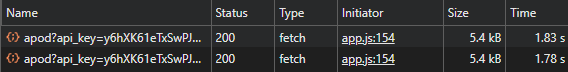

# Министерство образования Республики Беларусь

<p align="center">Учреждение образования</p>
<p align="center">“Брестский Государственный технический университет”</p>
<p align="center">Кафедра ИИТ</p>

<p align="center"><strong>Лабораторная работа №3</strong></p>
<p align="center"><strong>По дисциплине:</strong> “Веб-технологии”</p>
<p align="center"><strong>Тема:</strong> “Асинхронность и HTTP‑кэш (fetch, AbortController, ретраи)”</p>

<p align="right"><strong>Выполнил:</strong></p>
<p align="right">Студент 4 курса</p>
<p align="right">Группы АС-63</p>
<p align="right">Поплавский В.В.</p>
<p align="right"><strong>Проверил:</strong></p>
<p align="right">Несюк А.Н.</p>

<p align="center"><strong>Брест 2025</strong></p>

---

## Цель работы

Закрепить работу с промисами и async/await, обработкой ошибок, таймаутами и отменой запросов. Понять основы HTTP‑кэширования и увидеть эффект в DevTools.

---

### Вариант 17 — "Галерея NASA APOD с клиентским кэшированием и кнопкой «Обновить»"

---

## Ход выполнения работы

## Описание проекта

Приложение — галерея NASA Astronomy Picture of the Day (APOD) с поиском по датам,
клиентским кэшированием, ретраями, таймаутами и отменами запросов.\
Клиент обращается к NASA API (`api.nasa.gov/planetary/apod`) и отображает
астрономические изображения дня по выбранному диапазону дат.\
Реализованы состояния:

- `loading`
- `error`
- `empty`
- `success`

Основной объём данных: 10 элементов на страницу (пагинация).

---

## Архитектура клиента

### Основные функции и компоненты

- **fetchWithRetry** — повторные попытки, таймаут, экспоненциальный backoff
- **getAPODImages** — загрузка данных, проверка кэша, отмена запросов
- **in-memory кэш Map + localStorage** с TTL 24 часа
- **Скелетоны** при загрузке
- **Фильтрация по датам** (вместо пагинации)
- **Кнопка «Обновить»** — принудительный обход кэша
- **AbortController** для отмены в реальном времени
- **Индикация статуса**: загрузка, пусто, ошибка, статистика кэша

---

## Кэш-подход

Использован гибридный кэш (in-memory + localStorage):

const apodCache = new Map();
const CACHE_TTL = 24*60*60*1000; // 24 часа

### Структура записи

apodCache.set(cacheKey, {
  data: images,
  timestamp: Date.now()
});

### Логика работы кэша

1. **Ключ кэша** формируется как `nasa_${full_url_with_params}`
2. **Проверка актуальности**: если запись есть и не истек TTL (24 часа) → данные берутся из кэша
3. **При промахе кэша**: выполняется запрос к NASA API
4. **Кнопка "Обновить"**: игнорирует кэш, выполняет принудительный запрос
5. **Автоматическая очистка**: устаревшие записи удаляются при проверке
6. **Сохранение между сессиями**: кэш сохраняется в localStorage

### Логика

1. Ключ формируется как `"query-page"`\
2. Если есть актуальная запись (не вышла TTL) → данные берутся **из
    кэша**\
3. Если нет → делается запрос к API\
4. При нажатии «Обновить» кэш **игнорируется принудительно**\
5. Кэш очищается автоматически при истечении TTL

---

## Скриншоты DevTools

 
 

---

## Ретраи, таймауты и отмена запросов

### Ретраи

Реализованы в функции `fetchWithRetry`:

- число повторов: `retries`

- задержка между повторами: `backoffMs`

- экспоненциальный рост задержки:

 delay = backoffMs * 2^attempt

### Таймаут

Реализован через выделенный `AbortController`:

``` js

const timeoutId = setTimeout(() => timeoutController.abort(), timeoutMs);

```

### Отмена запросов

``` js

if (currentAbortController) {
  currentAbortController.abort();
}
currentAbortController = new AbortController();

```

---

## UX-улучшения

- Скелетоны во время загрузки\
- Информация о кэше\
- Кнопка «Обновить»\
- Обработка ошибок\
- Плавный UX-поток

---

## Структура проекта

/
├── index.html              # Главная страница
├── styles.css              # Стили приложения
├── app.js                  # Основная логика
├── README.md               # Документация
└── screenshots/            # Скриншоты для отчёта
    ├── network-first.png   # Первый запрос
    ├── network-cached.png  # Повторный запрос

---

## Сценарии тестирования

1. **Выполнить загрузку** (выбрать даты → "Загрузить") — показываются скелетоны, затем данные
2. **Повторить загрузку** — мгновенный показ данных из кэша
3. **Нажать «Обновить»** — обход кэша, новый запрос к API
4. **Изменить диапазон дат** — автоматическая загрузка новых данных
5. **Дождаться истечения TTL** (24 часа) — автоматическая инвалидация кэша
6. **Прервать запрос** — быстрая смена параметров во время загрузки
7. **Тест ошибок сети** — отключение интернета, показ ошибки с кнопкой повтора
8. **Проверка ретраев** — искусственное создание ошибок сервера
9. **Очистка кэша** — кнопка "Очистить кэш", проверка обнуления статистики
10. **Тест отладки** — кнопки просмотра/экспорта/импорта кэша

---

## Итоги

В ходе выполнения лабораторной работы успешно реализован клиент для NASA APOD API со всеми требуемыми функциями:

1. **Устойчивый к ошибкам клиент** с ретраями и таймаутами
2. **Эффективное кэширование** с сохранением между сессиями
3. **Удобный UX** с адаптивным дизайном и интерактивными элементами
4. **Корректная работа** с отменой запросов, обработкой ошибок и состояниями интерфейса
5. **Демонстрация работы HTTP-кэша** через DevTools
6. **Реализация всех требований** лабораторной работы №3
