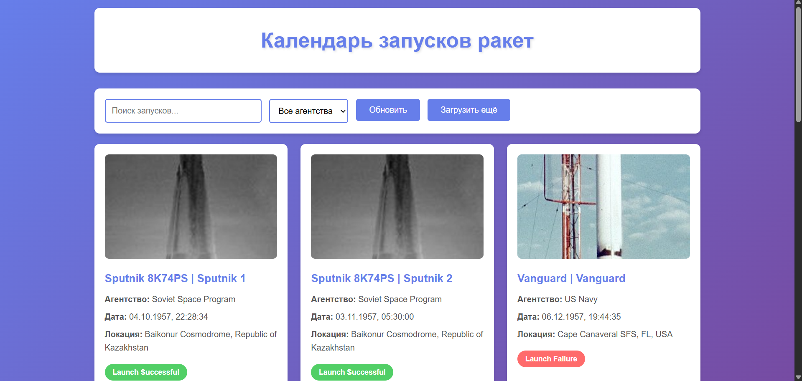
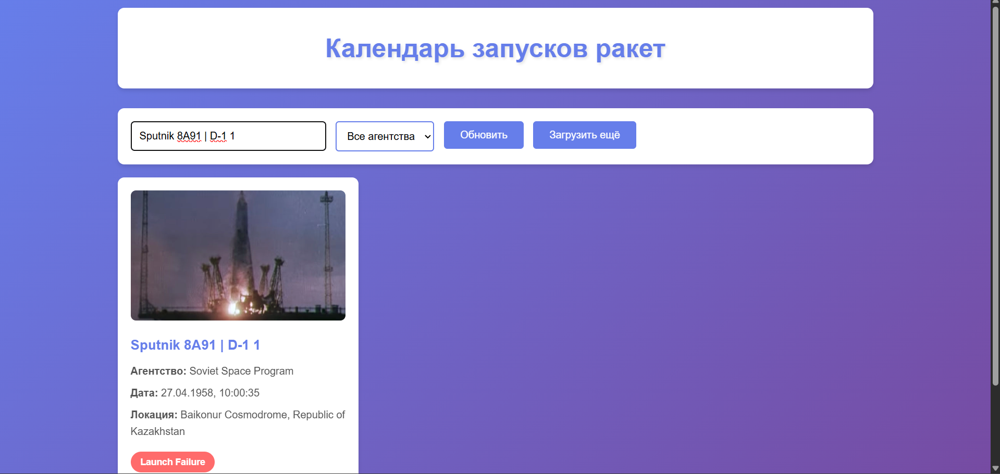
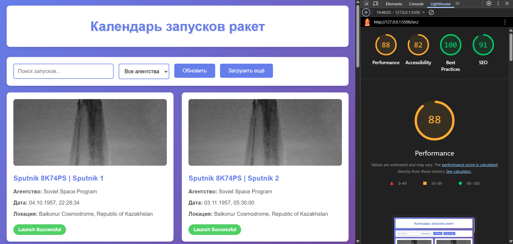

# Лабораторная работа №3

<p align="center">Министерство образования Республики Беларусь</p>
<p align="center">Учреждение образования</p>
<p align="center">"Брестский Государственный технический университет"</p>
<p align="center">Кафедра ИИТ</p>
<br><br><br><br><br><br>
<p align="center"><strong>Лабораторная работа №3</strong></p>
<p align="center"><strong>По дисциплине:</strong> "Веб-технологии"</p>
<p align="center"><strong>Тема:</strong> Асинхронность и HTTP‑кэш</p>
<br><br><br><br><br><br>
<p align="right"><strong>Выполнил:</strong></p>
<p align="right">Студент 4 курса</p>
<p align="right">Группы АС-64</p>
<p align="right">Немирович Д. А.</p>
<p align="right"><strong>Проверил:</strong></p>
<p align="right">Несюк А. Н.</p>
<br><br><br><br><br>
<p align="center"><strong>Брест 2025</strong></p>

---

## Цель работы

Закрепить работу с промисами и async/await, обработкой ошибок, таймаутами и отменой запросов. Понять основы HTTP‑кэширования и увидеть эффект в DevTools.

---

### Вариант №38

**Тема:** Календарь запусков ракет: фильтры по агентствам, кэширование, отмена в полёте.

## Ход выполнения работы

### 1. Структура проекта

```text
task_03/
├── doc/
│   ├── README.md
│   └── screenshots/
│       └── (скриншоты)
└── src/
    ├── index.html
    ├── styles.css
    ├── main.js
    └── img/
```

- `index.html` — главная страница приложения
- `styles.css` — стилизация интерфейса
- `main.js` — логика приложения с fetch запросами, кэшированием и ретраями
- `img/` — папка для изображений

### 2. Реализованные элементы

**Основной функционал:**

- Загрузка данных о запусках ракет через API The Space Devs
- Отображение списка запусков с картинками, датами и статусами
- Поиск по названию запуска или агентству
- Фильтрация по агентствам (NASA, SpaceX, Roscosmos, ESA)
- Пагинация с кнопками "Назад" и "Вперед"
- Кнопка "Загрузить ещё" для добавления данных

**Асинхронность и обработка ошибок:**

- Реализована функция `fetchWithRetry` с параметрами retries, backoffMs, timeoutMs
- Отмена предыдущих запросов через AbortController при новом поиске
- Обработка таймаутов и сетевых ошибок
- Try/catch блоки для обработки ошибок

**Кэширование:**

- Двухуровневое кэширование: in-memory (объект) + localStorage
- TTL для кэша установлен в 60 секунд
- Кнопка "Обновить" очищает весь кэш и загружает свежие данные

**UX элементы:**

- Индикатор загрузки с анимацией
- Отображение ошибок в красном блоке
- Состояние "Ничего не найдено" при пустых результатах
- Статусы запусков с цветовой индикацией (Success/Pending/Failed)

### 3. Скриншоты выполненой лабораторной работы

#### Главная страница с запусками



#### Работа фильтров и поиска



## Проверка качества

### Lighthouse



**Результаты Lighthouse:**

- Performance: 88
- Accessibility: 82
- Best Practices: 100
- SEO: 91

### Валидаторы

- HTML Validator: присутствуют предупреждения о семантике
- CSS Validator: предупреждения о единицах измерения

---

## Таблица критериев

| Критерий                                | Баллы | Выполнено |
|------------------------------------------|-------|-----------|
| Семантика/UX                            | 20    | ⚠️ 10     |
| Функциональность (загрузка, поиск, retry/timeout/abort) | 25 | ✅ 20 |
| Качество интерфейса (loading/error/empty) | 20  | ✅ 15     |
| Качество кода                           | 15    | ⚠️ 7      |
| Валидация/проверки (кэш, линтеры)       | 10    | ⚠️ 5      |
| Публикация и отчёт                      | 10    | ✅ 10     |
| **ИТОГО**                               | **100** | **≈67** |

### Что реализовано

✅ Загрузка данных с API  
✅ Поиск и фильтрация  
✅ Пагинация  
✅ Ретраи с backoff  
✅ Таймауты запросов  
✅ Отмена запросов через AbortController  
✅ Двухуровневое кэширование (memory + localStorage)  
✅ Индикаторы состояний (loading/error/empty)  
✅ Кнопка обновления с очисткой кэша  

---

## Описание кэш-подхода

В приложении реализовано двухуровневое кэширование:

1. **In-Memory кэш** — объект `cache` в JavaScript хранит данные в оперативной памяти
2. **LocalStorage** — для персистентности данных между сеансами

Каждая запись содержит:

- `data` — полезные данные
- `timestamp` — время создания записи

При запросе сначала проверяется in-memory кэш, затем localStorage. Если данные свежие (не старше TTL = 60 секунд), они возвращаются из кэша, иначе выполняется новый запрос.

### Демонстрация работы кэша

**Первый запрос:**

- Статус: 200 OK
- Размер: ~50KB
- Время: ~800ms

**Повторный запрос (из кэша):**

- Данные возвращаются мгновенно
- Нет обращения к сети (видно в консоли "Данные из кэша")

**После нажатия "Обновить":**

- Кэш очищается
- Новый запрос к серверу
- Статус: 200 OK

---

## Ссылки

**Репозиторий:** (указать ссылку на GitHub)  
**Публикация:** (указать ссылку на GitHub Pages или другой хостинг)

---

## Вывод

В ходе выполнения лабораторной работы был создан клиент для просмотра запусков ракет с использованием API The Space Devs. Реализованы механизмы асинхронной загрузки данных с ретраями, таймаутами и отменой запросов через AbortController.

Освоены принципы работы с промисами, обработка ошибок через try/catch, управление состоянием приложения. Реализовано двухуровневое кэширование для оптимизации запросов.

Созданы UI-элементы для отображения состояний загрузки, ошибок и пустых результатов. Добавлены функции поиска, фильтрации и пагинации для удобной работы с данными.

**Использованные технологии:**

- Vanilla JavaScript (fetch API, AbortController)
- LocalStorage API
- The Space Devs API
- CSS3 (Grid, Flexbox, анимации)
- HTML5
