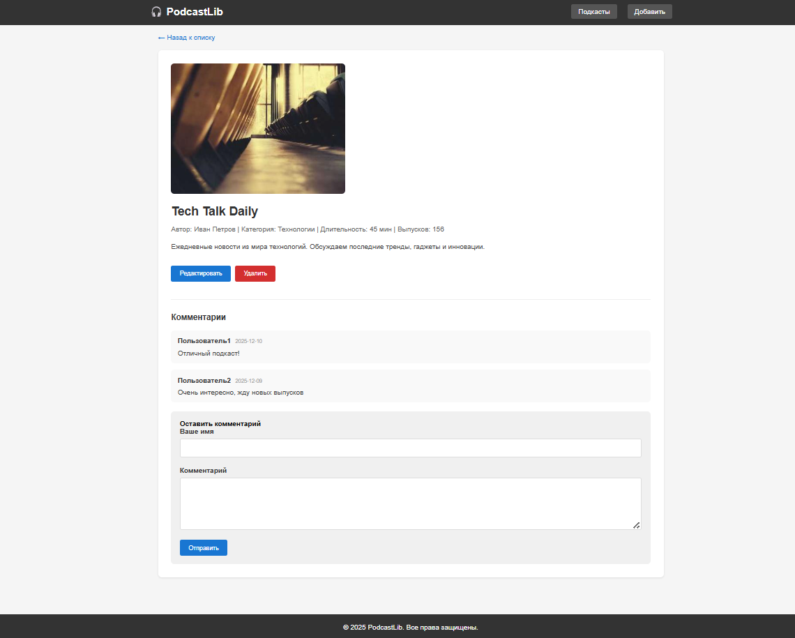
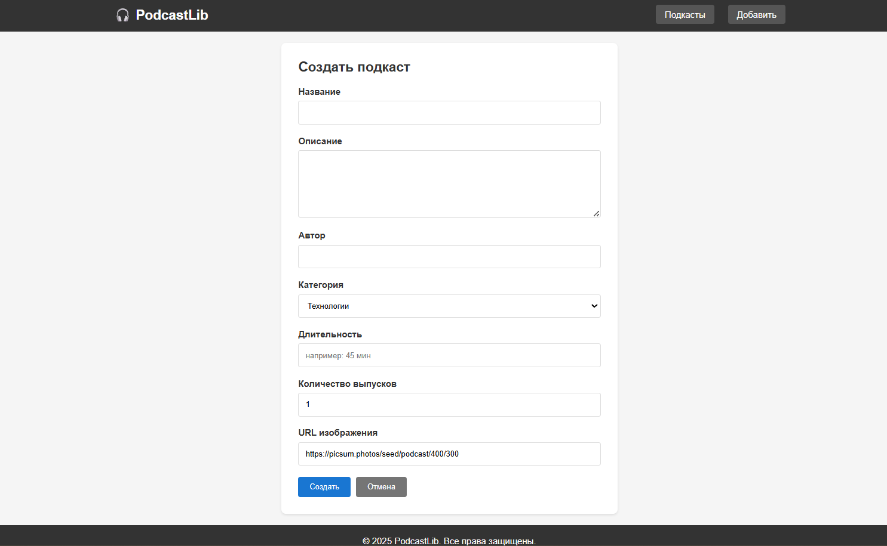
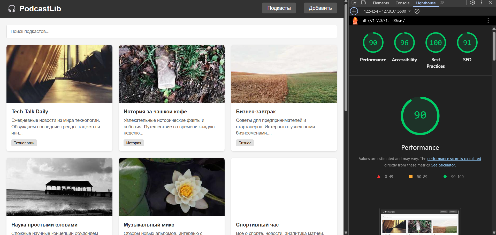

# Лабораторная работа №4

<p align="center">Министерство образования Республики Беларусь</p>
<p align="center">Учреждение образования</p>
<p align="center">"Брестский Государственный технический университет"</p>
<p align="center">Кафедра ИИТ</p>
<br><br><br><br><br><br>
<p align="center"><strong>Лабораторная работа №4</strong></p>
<p align="center"><strong>По дисциплине:</strong> "Веб-технологии"</p>
<p align="center"><strong>Тема:</strong> REST-клиент SPA: список/детализация/CRUD, маршрутизация</p>
<br><br><br><br><br><br>
<p align="right"><strong>Выполнил:</strong></p>
<p align="right">Студент 4 курса</p>
<p align="right">Группы АС-64</p>
<p align="right">Попов А. С.</p>
<p align="right"><strong>Проверил:</strong></p>
<p align="right">Несюк А. Н.</p>
<br><br><br><br><br>
<p align="center"><strong>Брест 2025</strong></p>

---

## Цель работы

Реализовать простой SPA без фреймворков с маршрутизацией и состояниями загрузки/ошибок. Выполнить CRUD-операции к учебному API.

---

### Вариант №38

**Тема:** Библиотека подкастов: список, выпуск, форма комментария.

## Ход выполнения работы

### 1. Структура проекта

```text
+---doc
|   |   README.md
|   |
|   \---screenshots
|           lighthouse.png
|           list.png
|           detail.png
|           form.png
|
\---src
    |   index.html
    |   styles.css
    |   app.js
```

- `index.html` — основная страница SPA
- `styles.css` — стилизация приложения
- `app.js` — логика приложения (роутер, API, рендеринг)

### 2. Реализованные элементы

- Hash-маршрутизация (`#/items`, `#/items/:id`, `#/new`, `#/items/:id/edit`)
- Состояния загрузки (loading) на всех экранах
- Состояние ошибки при отсутствии данных
- Состояние пустого списка
- CRUD-операции:
  - GET список подкастов
  - GET детальная страница подкаста
  - POST создание нового подкаста
  - PUT/PATCH обновление подкаста
  - DELETE удаление подкаста
- Форма комментария на странице подкаста
- Поиск подкастов с сохранением в hash
- Подтверждение удаления (confirm)
- Блокировка кнопки submit во время отправки
- Базовая валидация форм
- Уведомления об успешных операциях
- Адаптивная верстка (мобильная и десктопная)
- Хранение данных в localStorage

### 3. Маршруты приложения

| Маршрут | Описание |
|---------|----------|
| `#/items` | Список всех подкастов |
| `#/items/:id` | Детальная страница подкаста |
| `#/new` | Форма создания подкаста |
| `#/items/:id/edit` | Форма редактирования подкаста |
| `#/items?search=query` | Поиск по подкастам |

### 4. API

Приложение использует mock-данные, хранящиеся в localStorage. При первом запуске загружаются тестовые подкасты.

**Доступные операции:**

- Получение списка подкастов
- Получение одного подкаста по ID
- Создание подкаста
- Обновление подкаста
- Удаление подкаста
- Добавление комментария

### 5. Как запустить

1. Откройте файл `src/index.html` в браузере
2. Или используйте локальный сервер:

   ```bash
   npx serve src
   ```

### 6. Скриншоты выполненной работы

**Список подкастов:**


**Детальная страница:**



**Форма создания:**



## Проверка качества

### Lighthouse



**Результаты Lighthouse:**

- Performance: 90
- Accessibility: 96
- Best Practices: 100
- SEO: 91

### Валидаторы

- HTML Validator: без критических ошибок
- CSS Validator: без критических ошибок

---

## Таблица критериев

| Критерий | Выполнено |
|----------|-----------|
| Семантика/UX — 20 | ✅ (частично) |
| Функциональность/CRUD/маршрутизация — 25 | ✅ |
| Качество интерфейса — 20 | ✅ (базово) |
| Качество кода/модульность — 15 | ❌ (код в одном файле) |
| Тесты/валидность — 10 | ❌ |
| Публикация и отчёт — 10 | ✅ |

### Дополнительные бонусы

| Бонус | Выполнено |
|-------|-----------|
| Сохранение фильтров/поиска в hash | ✅ |
| Предзагрузка данных (prefetch) | ❌ |
| Клиентская авторизация | ❌ |

---

## Вывод

В ходе выполнения лабораторной работы было разработано одностраничное приложение (SPA) для библиотеки подкастов без использования фреймворков. Реализована hash-маршрутизация, CRUD-операции, поиск с сохранением параметров в URL, формы создания и редактирования, а также комментарии. Приложение использует localStorage для хранения данных.
