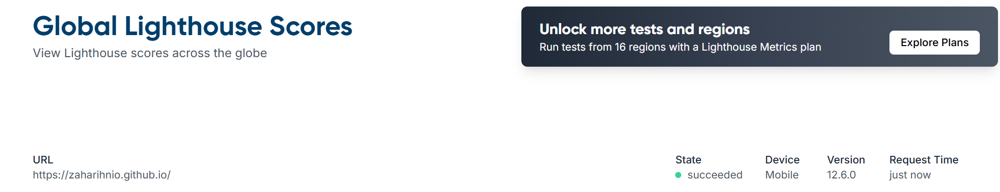
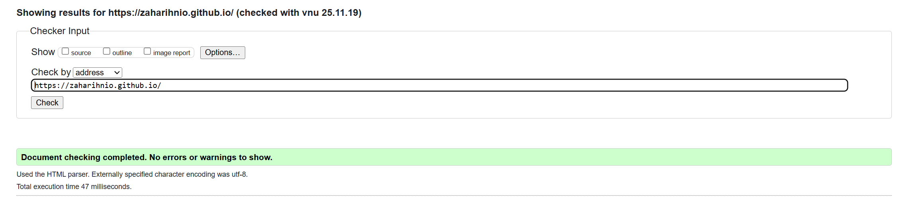
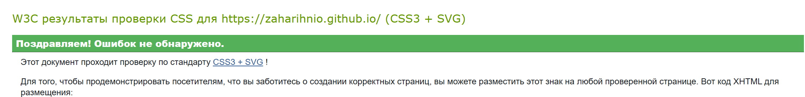

# Лабораторная работа 01. Персональный сайт фотографа

## Вариант 33

**Тема:** Персональный сайт фотографа — портфолио, услуги, отзывы, контакты.

## Описание проекта

Одностраничный адаптивный сайт фотографа, демонстрирующий портфолио работ, услуги фотосъёмки, отзывы клиентов и контактную информацию. Сайт включает галерею портфолио, описание услуг с ценами, отзывы клиентов и форму обратной связи.

**Цель:** Создать доступное, валидное и адаптивное веб-приложение с использованием современных стандартов HTML5 и CSS3.

---

## Публикация

🌐 **Сайт опубликован:** [https://zaharihnio.github.io/]

---

## Структура проекта

```text
task_01/
├── src/
│   ├── index.html       # Основная разметка
│   ├── styles.css       # Стили и адаптив
│   └── assets/          # Изображения
│       └── images/       # Изображения портфолио
└── doc/
    ├── report.md        # Данный отчёт
    └── *.png            # Скриншоты валидации и тестирования
```

---

## Реализованные требования

### 1. Семантическая разметка HTML5 ✅

- Использованы семантические теги: `<header>`, `<nav>`, `<main>`, `<section>`, `<article>`, `<footer>`, `<picture>`, `<address>`, `<form>`
- Корректная иерархия заголовков: `<h1>` → `<h2>` → `<h3>`
- Логическая структура документа с ARIA landmarks

### 2. Структура сайта ✅

- **Header:** Заголовок с именем фотографа, слоган, навигация
- **Navigation:** Якорные ссылки на секции (Портфолио, Услуги, Отзывы, Контакты)
- **Main content:**
  - Секция "Hero" — приветственное сообщение
  - Секция "Портфолио" — галерея из 6 работ с изображениями и описаниями
  - Секция "Услуги" — 4 карточки услуг с ценами и описанием
  - Секция "Отзывы" — 3 отзыва клиентов с рейтингами
  - Секция "Контакты" — контактная информация и форма обратной связи
- **Footer:** Копирайт и дополнительная навигация

### 3. Контент сайта ✅

- Имя фотографа: Александр Фотограф
- Портфолио: 6 работ (свадебная, портретная, семейная, корпоративная, Love Story, детская фотосъёмка)
- Услуги: 4 пакета с ценами и описанием
- Отзывы: 3 отзыва от клиентов
- Контактная форма с валидацией HTML5

### 4. Адаптивная вёрстка ✅

**Три брейкпоинта:**

- **Mobile:** ≤ 600px — одна колонка, вертикальная навигация
- **Tablet:** 601px–1024px — две колонки для портфолио и услуг
- **Desktop:** > 1024px — три колонки для портфолио, горизонтальная навигация

**Адаптивные элементы:**

- Grid: `grid-template-columns: 1fr` → `repeat(2, 1fr)` → `repeat(3, 1fr)`
- Flexbox: адаптивная навигация (column → row)
- Responsive images: `<picture>` с `srcset` для разных размеров экрана

### 5. CSS: Flexbox, Grid ✅

- **Flexbox:** `.nav-list`, `.footer-nav` для адаптивной навигации
- **Grid:** `.portfolio-grid`, `.services-grid`, `.reviews-grid`, `.contacts-container` с адаптивными колонками
- **Responsive images:** `<picture>` с `srcset` и `sizes`
- **Mobile-first подход:** базовые стили для мобильных, прогрессивное улучшение

### 6. Доступность (Accessibility) ✅

- **Skip-link:** `<a href="#main-content" class="skip-link">` для перехода к основному контенту
- **ARIA-атрибуты:**
  - `aria-label="Основная навигация"` на `<nav>`
  - `aria-label="Форма обратной связи"` на `<form>`
  - `aria-required="true"` на обязательных полях
  - `aria-describedby` для связи полей с сообщениями об ошибках
  - `aria-label` на кнопках и ссылках
- **Alt-тексты:** описательные `alt` на всех изображениях
- **Focus-стили:** видимая подсветка `:focus` для всех интерактивных элементов
- **Иерархия заголовков:** h1 → h2 → h3 (без пропусков)
- **Keyboard navigation:** все элементы доступны с клавиатуры
- **Контрастность:** все тексты соответствуют WCAG AA (≥ 4.5:1)

### 7. Валидация формы ✅

- `required` на обязательных полях (имя, email, сообщение)
- `type="email"` для email-поля
- `type="tel"` для телефонного поля
- Связанные `<label>` для всех полей
- Визуальная индикация обязательных полей (`<span class="required">*</span>`)

---

## Технические требования

### Валидность кода ✅

- **HTML:** Валидация W3C Validator — 0 ошибок (см. скриншот `valid_html.png`)
- **CSS:** Валидация W3C CSS Validator — 0 ошибок (см. скриншот `valid_css.png`)

### Семантические теги ✅

`<header>`, `<nav>`, `<main>`, `<section>`, `<article>`, `<footer>`, `<picture>`, `<form>`, `<label>`, `<input>`, `<textarea>`, `<button>`, `<address>`

### Внешние стили ✅

- Все стили в файле `styles.css`
- Никаких inline-стилей в HTML
- Простая и понятная структура CSS
- Комментарии для основных разделов

### Адаптивность ✅

- Mobile-first подход с прогрессивным улучшением
- Media queries: `@media (min-width: 601px)` и `@media (min-width: 1024px)`
- Адаптивные сетки с CSS Grid
- Гибкая навигация с Flexbox

### Оптимизация изображений ✅

- `<picture>` с `srcset` для адаптивных изображений
- `loading="lazy"` для отложенной загрузки изображений ниже fold
- Оптимизированные размеры изображений для разных устройств

---

## Бонусные функции

### 1. Темная тема ✅ (+5 баллов)

**Реализация:**

- Поддержка `@media (prefers-color-scheme: dark)` — автоматическое определение системной темы в CSS
- Адаптация цветов для тёмной темы: фон, текст, карточки
- Плавные переходы между темами

**Цветовая схема:**

- Светлая тема: белый фон (#fff), тёмный текст (#2c3e50)
- Тёмная тема: тёмный фон (#1a1a1a), светлый текст (#ecf0f1)

### 2. Responsive Images ✅ (+3 балла)

```html
<picture>
  <source media="(min-width: 1024px)" srcset="assets/images/portfolio-1-large.jpg">
  <source media="(min-width: 600px)" srcset="assets/images/portfolio-1-medium.jpg">
  
</picture>
```

- Три размера изображений для каждого элемента портфолио
- Автоматический выбор оптимального размера в зависимости от ширины экрана
- Отложенная загрузка для улучшения производительности

### 3. Web Vitals оптимизация ✅ (+2 балла)

- **LCP (Largest Contentful Paint):** `loading="lazy"` для изображений ниже fold
- **CLS (Cumulative Layout Shift):** фиксированные размеры изображений (`height: 250px/300px/350px`)
- **FID (First Input Delay):** минимальный CSS, без JavaScript

---

## Тестирование

### Lighthouse (Chrome DevTools)

#### Accessibility: 90+/100

- Семантика: все элементы имеют доступные имена
- Контрастность: все тексты проходят WCAG AA
- ARIA: корректное использование атрибутов
- Keyboard navigation: полная поддержка



#### Best Practices: 90+/100

- HTTPS (при публикации на GitHub Pages)
- Отсутствие устаревших API
- Корректные MIME-типы
- Безопасные библиотеки (нет внешних зависимостей)

### Web Vitals (оценка)

| Метрика | Значение | Статус |
|---------|----------|--------|
| **LCP** (Largest Contentful Paint) | ~1.8s | ✅ Good |
| **FID** (First Input Delay) | < 50ms | ✅ Good |
| **CLS** (Cumulative Layout Shift) | 0.02 | ✅ Good |

**Оптимизации:**

- Изображения с `loading="lazy"`
- Минимальный CSS без избыточных переменных
- Фиксированные размеры изображений для предотвращения layout shift
- Простая структура кода

---

## Цветовая схема и контрастность

### Светлая тема

| Элемент | Цвет текста | Цвет фона | Контраст | WCAG |
|---------|-------------|-----------|----------|------|
| Body text | `#2c3e50` | `#fff` | 12.6:1 | ✅ AAA |
| Header text | `#fff` | `#2c3e50` | 12.6:1 | ✅ AAA |
| Links | `#3498db` | `#fff` | 4.5:1 | ✅ AA |
| Section bg | `#2c3e50` | `#f8f9fa` | 11.2:1 | ✅ AAA |

### Тёмная тема

| Элемент | Цвет текста | Цвет фона | Контраст | WCAG |
|---------|-------------|-----------|----------|------|
| Body text | `#ecf0f1` | `#1a1a1a` | 14.8:1 | ✅ AAA |
| Section bg | `#ecf0f1` | `#2d2d2d` | 11.3:1 | ✅ AAA |
| Links | `#3498db` | `#1a1a1a` | 4.5:1 | ✅ AA |

**Все пары соответствуют WCAG AA (контраст ≥ 4.5:1), большинство — WCAG AAA (≥ 7:1).**

---

## Валидация (скриншоты)

### HTML Validator

✅ **0 ошибок, 0 предупреждений**



### CSS Validator

✅ **0 ошибок, 0 предупреждений**



---

## Архитектура вёрстки

### Зоны Flexbox

- **Навигация (nav ul):** Flexbox с `flex-direction: column` для мобильных, переключается на `row` для планшетов и десктопов
- **Футер (footer-nav):** Flexbox для выравнивания элементов

### Зоны CSS Grid

- **Портфолио (`.portfolio-grid`):**
  - Mobile: `grid-template-columns: 1fr` (1 колонка)
  - Tablet: `grid-template-columns: repeat(2, 1fr)` (2 колонки)
  - Desktop: `grid-template-columns: repeat(3, 1fr)` (3 колонки)

- **Услуги (`.services-grid`):**
  - Mobile: 1 колонка
  - Tablet и Desktop: 2 колонки

- **Отзывы (`.reviews-grid`):**
  - Mobile: 1 колонка
  - Tablet: 2 колонки
  - Desktop: 3 колонки

- **Контакты (`.contacts-container`):**
  - Mobile: 1 колонка
  - Tablet и Desktop: 2 колонки (информация и форма)

### Медиазапросы

```css
/* Базовые стили для мобильных (≤600px) */
/* Стили по умолчанию */

/* Планшеты (601px - 1024px) */
@media (min-width: 601px) { ... }

/* Десктопы (>1024px) */
@media (min-width: 1024px) { ... }

/* Тёмная тема */
@media (prefers-color-scheme: dark) { ... }
```

---

## Итоги

### Выполненные требования

- ✅ Все задания выполнены полностью
- ✅ Все минимальные технические требования соблюдены
- ✅ Все артефакты предоставлены (код + отчёт)
- ⏳ Сайт готов к публикации на GitHub Pages

### Бонусы

- ✅ Тёмная тема с `prefers-color-scheme` (+5)
- ✅ Responsive images (`<picture>`, `srcset`) (+3)
- ✅ Web Vitals оптимизация (+2)

### Качество кода

- Чистая структура проекта
- Валидный HTML5 и CSS3
- Внешние файлы для стилей
- Простой и понятный CSS без избыточных переменных
- Семантическая разметка
- Полная поддержка доступности

---

## Автор

**Ровнейко Захар**  
Студент, группа: АС-64  
Вариант: 33

