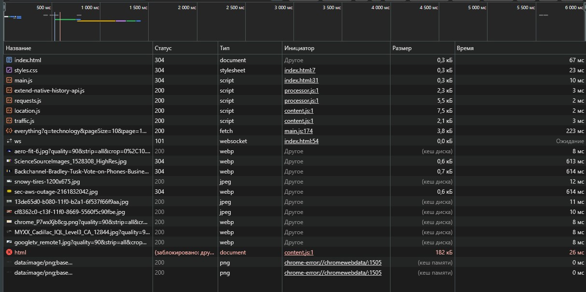

# Министерство образования Республики Беларусь

<p align="center">Учреждение образования</p>
<p align="center">“Брестский Государственный технический университет”</p>
<p align="center">Кафедра ИИТ</p>

<p align="center"><strong>Лабораторная работа №3</strong></p>
<p align="center"><strong>По дисциплине:</strong> “Веб-технологии”</p>
<p align="center"><strong>Тема:</strong> “Асинхронность и HTTP‑кэш (fetch, AbortController, ретраи)”</p>

<p align="right"><strong>Выполнил:</strong></p>
<p align="right">Студент 4 курса</p>
<p align="right">Группы АС-63</p>
<p align="right">Савко П.С.</p>
<p align="right"><strong>Проверил:</strong></p>
<p align="right">Несюк А.Н.</p>

<p align="center"><strong>Брест 2025</strong></p>

---

## Цель работы

Закрепить работу с промисами и async/await, обработкой ошибок, таймаутами и отменой запросов. Понять основы HTTP‑кэширования и увидеть эффект в DevTools.

---

### Вариант №18 — “Агрегатор новостей по ключевому слову с отменой устаревших запросов.”

---

## Ход выполнения работы

## Описание проекта

Приложение ― новостной агрегатор с поиском, пагинацией, кэшированием,
ретраями, таймаутами и отменой запросов.\
Клиент обращается к API (`newsapi.org`) и отображает список новостей по
запросу пользователя.\
Реализованы состояния:

-   `loading`
-   `error`
-   `empty`
-   `success`

Основной объём данных: 10 элементов на страницу (пагинация).

------------------------------------------------------------------------

## Архитектура клиента

### Основные функции и компоненты

-   **fetchWithRetry** ― повторные попытки, таймаут, экспоненциальный
    backoff\
-   **fetchNews** ― загрузка данных, проверка кэша, отмена запросов\
-   **in-memory кэш Map** + TTL\
-   **Скелетоны** при загрузке\
-   **Пагинация**\
-   **Кнопка «Обновить»** ― принудительный обход кэша\
-   **AbortController** для отмены в реальном времени\
-   **Индикация статуса**: загрузка, пусто, ошибка

------------------------------------------------------------------------

## Кэш-подход

Использован простой in-memory кэш:

``` js

const newsCache = new Map();

```

Структура записи:

``` js

newsCache.set(cacheKey, {
  articles,
  totalResults,
  timestamp: Date.now()
});

```

TTL указывается в конфигурации:

``` js

cacheTTL: 5 * 60 * 1000

```

### Логика:

1.  Ключ формируется как `"query-page"`\
2.  Если есть актуальная запись (не вышла TTL) → данные берутся **из
    кэша**\
3.  Если нет → делается запрос к API\
4.  При нажатии «Обновить» кэш **игнорируется принудительно**\
5.  Кэш очищается автоматически при истечении TTL

------------------------------------------------------------------------

## Скриншоты DevTools

    

------------------------------------------------------------------------

## Ретраи, таймауты и отмена запросов

### Ретраи

Реализованы в функции `fetchWithRetry`:

-   число повторов: `retries`

-   задержка между повторами: `backoffMs`

-   экспоненциальный рост задержки:

        delay = backoffMs * 2^attempt

### Таймаут

Реализован через выделенный `AbortController`:

``` js

const timeoutId = setTimeout(() => timeoutController.abort(), timeoutMs);

```

### Отмена запросов

``` js

if (currentAbortController) {
  currentAbortController.abort();
}
currentAbortController = new AbortController();

```

------------------------------------------------------------------------

## UX-улучшения

-   Скелетоны во время загрузки\
-   Информация о кэше\
-   Кнопка «Обновить»\
-   Обработка ошибок\
-   Плавный UX-поток

------------------------------------------------------------------------

## Структура проекта

    /
    ├── index.html
    ├── main.js
    ├── styles.css
    ├── README.md
    └── screenshots/
          └── 1try.jpg

------------------------------------------------------------------------

## Сценарии тестирования

1.  Выполнить поиск (например, `technology`)\
2.  Повторить поиск --- загрузка из кэша\
3.  Нажать «Обновить» ― обход кэша\
4.  Перейти на страницу 2\
5.  Дождаться TTL\
6.  Прервать запрос

------------------------------------------------------------------------

## Итоги

Реализован:

-   устойчивый к ошибкам клиент\
-   кэширование с TTL\
-   удобный UX\
-   корректная работа с пагинацией, отменой и повторными запросами
