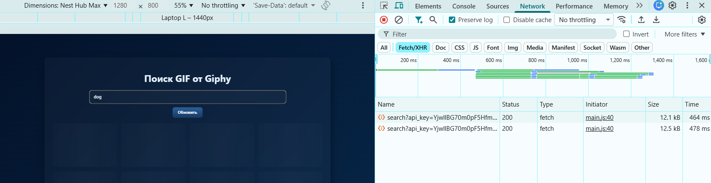

# Лабораторная работа 03. Асинхронность и HTTP‑кэш (fetch, AbortController, ретраи)

Министерство образования Республики Беларусь

Учреждение образования: "Брестский Государственный технический университет"

Кафедра: ИИТ

Вариант: 19

Выполнил(а): Соколова М. А.

Группа: АС-63

Проверил: Несюк А.Н.

Брест, 2025

## Описание

Небольшой клиент к API с загрузкой списка/деталей, управлением состояниями (loading / error / empty), ретраями и таймаутами, отменой запросов через `AbortController` и демонстрацией простого кэширования (in‑memory Map / TTL и поведение с ETag при контролируемом сервере).

## Цели

- Закрепить работу с промисами и `async/await`, обработкой ошибок, таймаутами и отменой запросов.
- Научиться управлять конкурентными запросами: отменять предыдущие при новом поиске.
- Понять основы HTTP‑кэширования и увидеть эффект в DevTools (304 / cached).

## Структура проекта

- `index.html` — интерфейс поиска и списка.
- `styles.css` — стили и темы.
- `main.js` — логика fetch/retry/cache/abort, инфинит‑скролл.
- `db.json` — пример локального mock (если используется `json-server`).

## Как запустить локально

1) Быстрая проверка — открыть `index.html` (иногда ломаются относительные запросы).

2) Рекомендуемый способ — локальный сервер (PowerShell):

```powershell
Set-Location -LiteralPath "D:\Предметы и литература\Веб-технологии\WEB-2025\lab_3"
py -3 -m http.server 3000
```

Откройте: `http://localhost:3000`

1) Mock API через `json-server` (если хотите использовать `db.json`):

```powershell
Set-Location -LiteralPath "D:\Предметы и литература\Веб-технологии\WEB-2025\lab_3"
npx json-server --watch db.json --port 3000
```

- Пример URL: `http://localhost:3000/gifs` (в `main.js` установите `IS_MOCK = true` и `API_URL = 'http://localhost:3000/gifs'`).

## Кэш‑подход

- Подход: используется клиентский кэш в памяти на основе `Map` с TTL (время жизни записи). Ключом служит комбинация запроса и смещения — например, `${query}_${offset}`.
- Поведение при запросе: при каждом запросе сначала проверяется кэш; если запись найдена и её возраст меньше `CACHE_TIME`, данные используются напрямую. Если доступен `etag` для записи, клиент отправляет заголовок `If-None-Match` и ждёт ответа сервера. При ответе `304 Not Modified` используются данные из кэша без повторной загрузки тела ответа.
- Force refresh: кнопка «Обновить» или параметр `force=true` игнорирует кэш и запрашивает данные у сервера заново.
- Mock / local fallback: при работе с локальным mock (`db.json` + `json-server`) приложение может отображать локальные данные мгновенно, а затем объединять (merge) их с данными от API — это удобно для демонстрации и оффлайн‑фолбэка.
- Нахождение в коде: кэш реализован в `main.js` (переменная `cache = new Map()`), TTL задаётся константой `CACHE_TIME`, отправка `If-None-Match` и обработка `304` происходит в `fetchRetry` / `getData`.

## Скриншоты DevTools (первый / повторный запрос)

Вставьте сюда скриншоты из DevTools: первый запрос (получение ресурса) и повторный запрос (проверка кэша / If‑None‑Match). Ниже — шаблон, который можно скопировать и заменить пути к файлам на ваши.

```markdown


](screen/network_2.png)


## Ретраи, таймауты и отмена (реализация)

- Ретраи: в `main.js` реализована функция `fetchRetry` (или аналог) — она выполняет запрос с несколькими попытками (обычно 2–3), использует экспоненциальный backoff между попытками и возвращает `null` / выбрасывает ошибку после исчерпания попыток. Это позволяет устойчиво работать при временных проблемах сети.
- Таймаут: каждый сетевой запрос оборачивается в `AbortController` и таймаут (например, 5 секунд). Если время ожидания превышено, запрос отменяется через `controller.abort()` и считается ошибкой/перезапуском по логике ретраев.
- Отмена конкурентных запросов: при вводе пользователем нового поиска предыдущий активный запрос отменяется (через `AbortController`) — это предотвращает race‑conditions и ненужную обработку устаревших ответов.
- Force refresh / игнор кэша: при необходимости отправляется запрос без заголовка `If-None-Match` и/или с параметром `force`, чтобы явно получить свежие данные с сервера.

Примечание по тестированию: для демонстрации ретраев и таймаутов можно временно указывать в `main.js` малый timeout или симулировать задержку на mock‑сервере (например, middleware в `json-server` или `setTimeout` на сервере).
