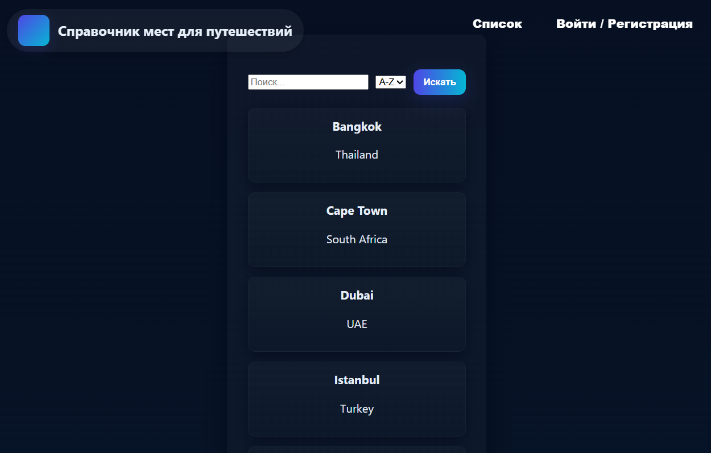
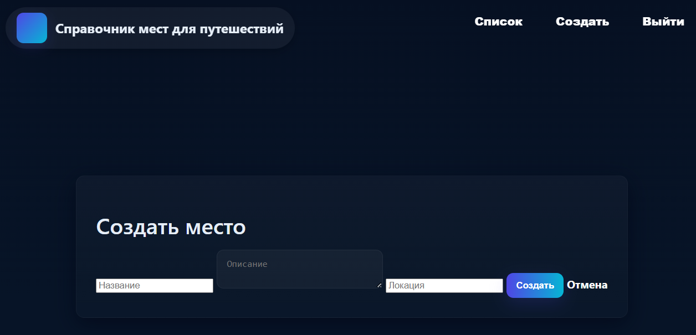
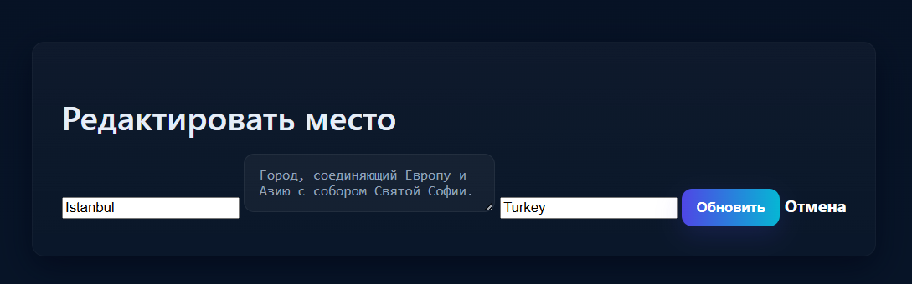
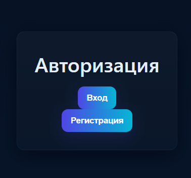
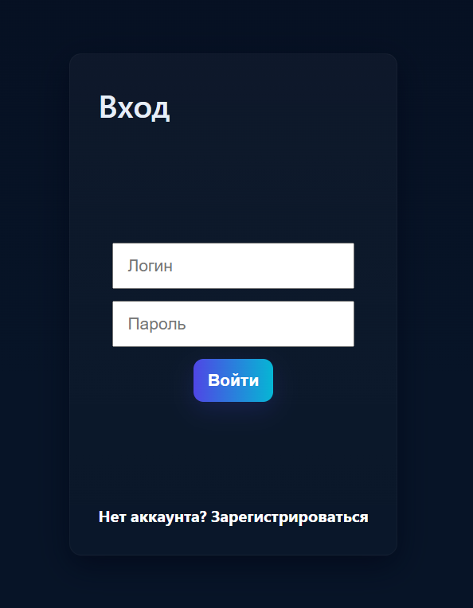
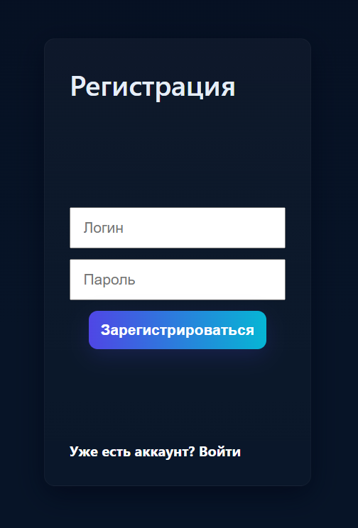
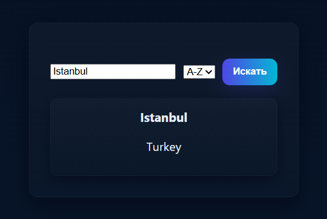

# Лабораторная работа 04. REST-клиент SPA: список/детализация/CRUD, маршрутизация (без фреймворков)

Министерство образования Республики Беларусь

Учреждение образования: "Брестский Государственный технический университет"

Кафедра: ИИТ

Вариант: 19

Выполнил(а): Соколова М. А.

Группа: АС-63

Проверил: Несюк А.Н.

Брест, 2025

## Описание

Одностраничное приложение на чистом JS с hash-маршрутизацией, экранами списка/детали/создания/редактирования и CRUD-операциями к учебному API.

## Реализованные фичи

- Сохранение параметров поиска/фильтров в hash (пример: `#/destinations?search=Europe&sort=asc`).
- Предзагрузка данных (prefetch) при наведении на ссылку.
- Простая клиентская авторизация: форма логина/регистрации, token в `localStorage`, отправка заголовка `Authorization` (симулировано; mock‑сервер может проверять наличие).

## Цели

Реализовать простой SPA без фреймворков с маршрутизацией и состояниями загрузки/ошибок.
Выполнить CRUD к учебному API (реальному или mock).

## Структура проекта

- `index.html` — точка входа, подключение стилей и скриптов.
- `styles.css` — стили приложения.
- `js/router.js` — простой hash‑роутер.
- `js/views.js` — представления (list, detail, form, auth, login, register).
- `js/api.js` — клиент для взаимодействия с API (fetch).
- `db.json` — mock‑данные для `json-server` (содержит `destinations` и `users`).

## Как запустить (локально)

Рекомендуется запускать через `json-server` (для полноценного CRUD):

1. Установите Node.js LTS и npm.
2. Установите `json-server` глобально:

```powershell
npm install -g json-server
```

1. В папке `task_04` убедитесь, что есть `db.json` (в репозитории уже есть пример).
2. Запустите mock‑сервер:

```powershell
json-server --watch db.json --port 4000
```

1. Запустите статический сервер для фронтенда (например, Python http.server или Live Server в VS Code):

```powershell
cd 'Путь\к\task_04'
python -m http.server 4000
# затем откройте http://localhost:4000 в браузере
```

API будет доступен по `http://localhost:4000`.

Если вы не запускаете `json-server`, в `js/api.js` реализован локальный fallback для чтения `db.json` — приложение будет работать в режиме demo (из файла), но изменения не сохранятся.

## Маршруты (hash)

- `#/destinations` — список мест (поиск и сортировка).
- `#/destinations/:id` — детали места.
- `#/new` — форма создания нового места.
- `#/destinations/:id/edit` — редактирование.
- `#/auth` — выбор вход/регистрация.
- `#/login` — форма входа.
- `#/register` — форма регистрации.

## API (json-server)

- `GET /destinations` — получить список; поддерживаются query‑параметры, например `?q=term&_sort=name&_order=asc`.
- `GET /destinations/:id` — получить деталь.
- `POST /destinations` — создать (body: `{ name, description, location }`).
- `PATCH /destinations/:id` — частичное обновление.
- `DELETE /destinations/:id` — удалить.
- `GET /users?username=...` — поиск пользователя.
- `POST /users` — регистрация (body: `{ username, password }`).

Для авторизации используется заголовок `Authorization: Bearer <token>` — в демо реализовано упрощённо.

## Скриншоты

Список мест (десктоп):

Детальная страница:

Форма создания/редактирования:


Страница авторизации (выбор вход/регистрация):

Форма входа:

Форма регистрации:

Поиск:

