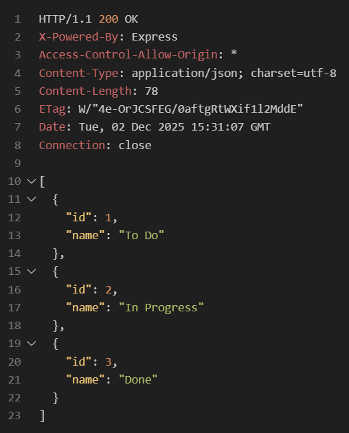
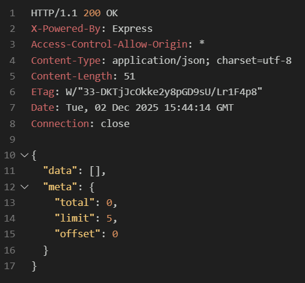
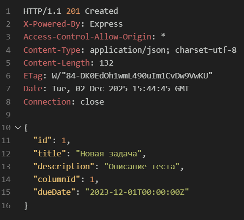
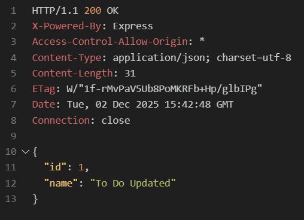
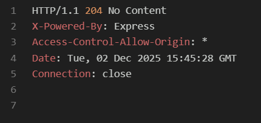

# Лабораторная работа 05. Серверное REST API на Node.js + Express (валидация, ошибки, Swagger)

Министерство образования Республики Беларусь

Учреждение образования: "Брестский Государственный технический университет"

Кафедра: ИИТ

Вариант: 19

Выполнил(а): Соколова М. А.

Группа: АС-63

Проверил: Несюк А.Н.

Брест, 2025

## Описание

Проект реализует серверное REST API на Node.js + Express для управления задачами в стиле Kanban (колонки + задачи). Данные хранятся в памяти (массивы) — это соответствует условию лабораторной работы. Валидация выполняется с помощью Zod, ошибки обрабатываются централизованно, документация API доступна через Swagger (OpenAPI).

## Ключевые возможности

- Базовая структура Express‑приложения с маршрутизацией и разделением ответственности.
- CRUD‑эндпоинты для колонок и задач (`/api/v1/columns`, `/api/v1/tasks`).
- Валидация входных данных через Zod (title, description, columnId, dueDate и пр.).
- Централизованная обработка ошибок (ApiError) с корректными HTTP‑статусами.
- Документация OpenAPI + Swagger UI (доступно по `/docs`).
- Бонусы: фильтрация, поиск, сортировка, пагинация с метаданными, версионирование API (`/api/v1`).

## Цели работы

- Научиться реализовывать REST API на Express.
- Добавить валидацию и централизованную обработку ошибок.
- Подготовить документацию API (Swagger/OpenAPI).
- Соблюсти минимальные технические требования: хранение данных в памяти, корректные статус‑коды, использование `.env` для конфигурации.

## Ресурсы API (основные)

- `GET  /api/v1/columns` — список колонок.
- `GET  /api/v1/columns/:id` — деталь колонки.
- `POST /api/v1/columns` — создать колонку.
- `PATCH /api/v1/columns/:id` — обновить колонку.
- `DELETE /api/v1/columns/:id` — удалить колонку.

- `GET  /api/v1/tasks` — список задач с параметрами фильтрации/поиска/пагинации.
- `GET  /api/v1/tasks/:id` — деталь задачи.
- `POST /api/v1/tasks` — создать задачу.
- `PATCH /api/v1/tasks/:id` — обновить задачу.
- `DELETE /api/v1/tasks/:id` — удалить задачу.

Версия API: все пути находятся под префиксом `/api/v1`.

## Валидация (кратко)

- `title`: строка, длина 1–100 символов.
- `description`: строка, до 500 символов (опционально).
- `columnId`: положительное целое (id существующей колонки).
- `dueDate`: ISO 8601 дата/время (например, `2023-12-01T00:00:00Z`).

Ошибки валидации возвращаются с кодом `422 Unprocessable Entity` и телом с деталями ошибок.

## Фильтрация, поиск и пагинация (GET /api/v1/tasks)

Поддерживаемые query параметры:

- `q` — текстовый поиск по `title` и `description`.
- `columnId` — фильтр по колонке (число).
- `limit` — размер страницы (по умолчанию 10).
- `offset` — смещение (по умолчанию 0).
- `sortBy` — `title` или `dueDate` (можно указывать порядок через `sortBy=dueDate:desc`).

Ответ содержит массив задач и объект `meta` с информацией о пагинации (total, limit, offset).

## Обработка ошибок и статус‑коды

Централизованный обработчик ошибок возвращает корректные коды и человеко‑читаемые сообщения:

- `200 OK` — успешный GET/PATCH.
- `201 Created` — успешный POST.
- `204 No Content` — успешный DELETE без тела.
- `400 Bad Request` — неверные параметры запроса (например, недопустимый id).
- `404 Not Found` — ресурс не найден.
- `422 Unprocessable Entity` — ошибка валидации входных данных (Zod).
- `500 Internal Server Error` — непредвиденная ошибка на сервере.

В production‑режиме в ответе не возвращается стек‑трейс.

## Установка и запуск (локально через REST Client)

1. Склонируйте репозиторий или скопируйте проект в папку.
2. Установите зависимости:

```bash
npm install
```

1. (Опционально) установите `nodemon` для разработки:

```bash
npm install --save-dev nodemon
```

1. Создайте `.env` в корне проекта и укажите `PORT` (например, `8080`).

1. Скрипты в `package.json`:

- `npm run dev` — запуск в dev‑режиме с `nodemon`.
- `npm start` — запуск production.

1. Запуск примера (dev):

```bash
npm run dev
# или
npm start
```

Сервер будет доступен по `http://localhost:8080` (или по порту из `.env`). Swagger UI — `http://localhost:8080/docs`.

## Структура проекта (пример)

- `index.js` — Основной файл с кодом сервера (Express, роуты, валидация, ошибки, Swagger).
- `package.json` — Зависимости и скрипты.
- `.env` — Переменные окружения (PORT).
- `OpenAPI.json` — Статическая спецификация API для сдачи.

## Примеры запросов

Все примеры используют базовый URL `http://localhost:8080`.

- Получить все колонки:

```http
GET http://localhost:8080/api/v1/columns
```

Ответ: `200 OK` и массив колонок.


- Создать колонку:

```http
POST http://localhost:8080/api/v1/columns
Content-Type: application/json

{ "name": "Backlog" }
```

Ответ: `201 Created` и тело новой колонки.


- Получить задачи с фильтрацией и пагинацией:

```http
GET http://localhost:8080/api/v1/tasks?q=test&limit=5&offset=0&columnId=1&sortBy=title
```

Ответ: `200 OK` и JSON `{ data: [...], meta: { total, limit, offset } }`.


- Создать задачу:

```http
POST http://localhost:8080/api/v1/tasks
Content-Type: application/json

{
  "title": "Новая задача",
  "description": "Краткое описание",
  "columnId": 1,
  "dueDate": "2025-12-01T00:00:00Z"
}
```

Ответ: `201 Created` и тело созданной задачи.


- Обновить колонку:

```http
PATCH http://localhost:8080/api/v1/columns/1
Content-Type: application/json

{ "title": "Обновлённое название" }
```

Ответ: `200 OK` и тело обновлённой задачи.


- Удалить колонку:

```http
DELETE http://localhost:8080/api/v1/columns/1
```

Ответ: `204 No Content`.


## Тестирование ошибок (примеры)

- Неверный `columnId` при создании задачи → `400 Bad Request` (или `422` при валидации).
- Пустой `title` → `422 Unprocessable Entity` с деталями в теле.
- Запрос к несуществующему ресурсу → `404 Not Found`.

## Документация

Swagger UI доступен по `http://localhost:8080/docs`. Спецификация описывает все эндпоинты, схемы запросов/ответов и возможные коды ошибок.
