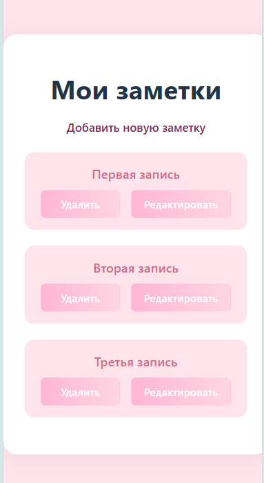
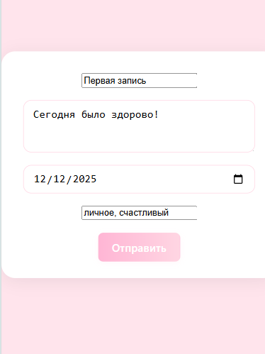
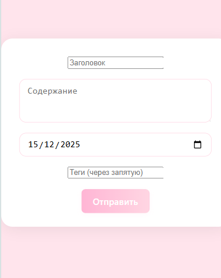
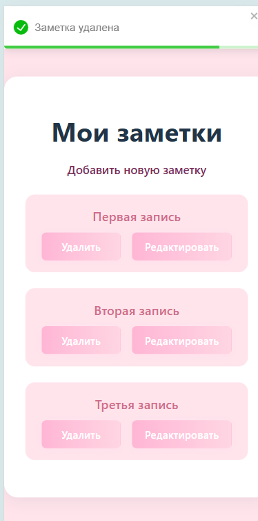
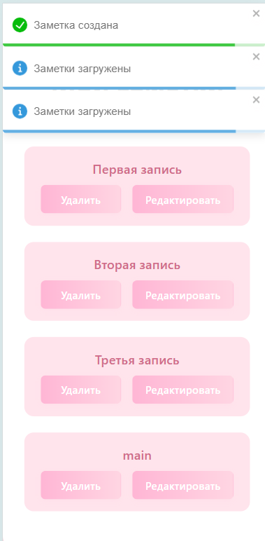

# Министерство образования Республики Беларусь

<p align="center">Учреждение образования</p>
<p align="center">"Брестский Государственный технический университет"</p>
<p align="center">Кафедра ИИТ</p>
<br><br><br><br><br><br>
<p align="center"><strong>Лабораторная работа №7</strong></p>
<p align="center"><strong>По дисциплине:</strong> "Веб-технологии"</p>
<p align="center"><strong>Тема:</strong> "React‑приложение: маршрутизация, состояние, формы, работа с API"</p>
<br><br><br><br><br><br>
<p align="right"><strong>Выполнил:</strong></p>
<p align="right">Студент 4 курса</p>
<p align="right">Группы АС-63</p>
<p align="right">Соколова М.А.</p>
<p align="right"><strong>Проверил:</strong></p>
<p align="right">Несюк А.Н.</p>
<br><br><br><br><br>
<p align="center"><strong>Брест 2025</strong></p>

---

## Цель работы

* Создать полноценный SPA на React.
* Подключить маршрутизацию, реализовать формы и взаимодействие с API.

---

### Вариант №19

## Ход выполнения работы

### 1. Структура проекта

task_07/
├── doc/
│   │── README.md                 # Документация (методичка, варианты тем)
│   └── screen/                   # Скриншоты
├── src/                          # Исходный код приложения
│   ├── app/                      # Глобальные настройки (Redux, API)
│   │   ├── api.ts                # RTK Query API слайс для CRUD заметок
│   │   ├── store.ts              # Конфигурация Redux store
│   │   └── types.ts              # Вынесенные типы (RootState, AppDispatch)
│   ├── assets/                   # Активы (изображения, SVG)
│   │   └── react.svg             # Логотип React (шаблонный)
│   ├── components/               # Переиспользуемые компоненты
│   │   ├── NoteForm.tsx          # Форма для создания/редактирования заметок (с валидацией)
│   │   ├── NotFound.tsx          # Компонент страницы 404
│   │   └── ProtectedRoute.tsx    # Обертка для защищенных маршрутов (mock-авторизация)
│   ├── features/                 # Фичи/модули (разделение по домену)
│   │   └── notes/                # Фича "заметки" (страницы и тесты)
│   │       ├── EditNote.tsx      # Страница редактирования заметки
│   │       ├── NewNote.tsx       # Страница создания новой заметки
│   │       ├── NoteDetail.tsx    # Страница деталей заметки
│   │       └── NoteList.tsx      # Страница списка заметок
│   ├── App.tsx                   # Главный компонент (RouterProvider, ToastContainer)
│   ├── index.css                 # Глобальные стили (включая импорт Toastify)
│   ├── main.tsx                  # Точка входа (рендер с Redux Provider)
│   ├── routes.tsx                # Определение маршрутов (React Router с lazy и protected)
│   ├── vite-env.d.ts             # Типы для Vite env (import.meta.env)
│   ├── .env                          # Переменные окружения (VITE_API_URL)
│   ├── .gitignore                    # Исключения для Git (node_modules, etc.)
│   ├── App.css                       # Стили для App (шаблонные, можно удалить/обновить)
│   ├── App.tsx                       # Корневой компонент приложения
│   ├── db.json                       # Mock-база данных для json-server (заметки)
│   ├── eslint.config.js              # Конфигурация ESLint
│   ├── index.html                    # HTML шаблон (ссылка на main.tsx)
│   ├── index.css                     # Глобальные стили (импорт стилей Toastify)
│   ├── main.tsx                      # Точка входа (рендер React с Redux Provider)
│   ├── package-lock.json             # Лок зависимостей
│   ├── package.json                  # Зависимости и скрипты (dev, build, etc.)
│   ├── routes.tsx                    # Определение маршрутов (React Router)
│   ├── tsconfig.app.json             # TS конфиг для приложения
│   ├── tsconfig.json                 # Основной TS конфиг (композитный)
│   ├── tsconfig.node.json            # TS конфиг для Node (vite.config.ts)
│   ├── vite-env.d.ts                 # Конфигурация Vite (plugins, resolve, esbuild)
│   |── node_modules/                 # Установленные зависимости (игнорируется Git)
│   └── public/                       # Статические файлы (если есть, e.g. vite.svg)
│       └── vite.svg                  # Логотип Vite

---

### 2. Запуск проекта

#### 2.1 Установка зависимостей

* Откройте проект в VS Code или другом редакторе.
* В терминале перейдите в корень проекта (task_07).
* Выполните команду для установки всех зависимостей:

```bash
npm install
```

#### 2.2 Запуск сервера

* Запустить сервер в режиме разработки:

```bash
npm run dev
```

* Сервер запустится по адресу:

```bash
http://localhost:5173
```

При первом запуске API будет доступно по корневому пути.

---

### 3. Скриншоты работы сайта

* Главная:


* Детали:


* Добавление:


-Удаление:


-Заметка создана:


---

## Таблица критериев

| Критерий                                                                | Баллы |  Выполнено |
|-------------------------------------------------------------------------|-------|------------|
| Структура и UX                                                          |  20   |  ✅   |
| Функциональность (маршрутизация + CRUD)                                 |  25   |  ✅   |
| Качество интерфейса                                                     |  20   |  ✅   |
| Качество кода / архитектуры                                             |  15   |  ✅   |
| Тесты (1–2 unit/RTL)                                                    |  10   |  ❌   |
| Документация/инструкция                                                 |  10   |  ✅   |

### Дополнительные бонусы

| Бонус                                                                | Баллы | Выполнено |
| -------------------------------------------------------------------- | ----- | --------- |
| Оптимистичные обновления, отмена запросов, предзагрузка.             | 10    | ✅  |
| Ленивые маршруты (code splitting).                                   | 10    | ✅  |
| Dark mode и сохранение предпочтений.                                 | 10    | ❌  |

---

## Вывод

В ходе выполнения лабораторной работы было создано полноценное одностраничное приложение (SPA) на React для личного дневника/заметок (вариант 19), где реализована маршрутизация с помощью React Router v6, включая ленивые (lazy) маршруты для code splitting, вложенные маршруты и защищённые маршруты (с mock-аутентификацией через localStorage). Приложение позволяет управлять заметками: просмотр списка, деталей, создание, редактирование и удаление через CRUD-операции. Состояние управляется с помощью Redux Toolkit и RTK Query для взаимодействия с API (mock через json-server), с поддержкой кэширования, инвалидации тегов, оптимистичных обновлений, отмены запросов и предзагрузки данных. Формы реализованы с использованием React Hook Form и валидацией Zod, с обработкой состояний загрузки, ошибок и пустоты. Уведомления отображаются через React Toastify. Код структурирован по feature-sliced дизайну: фичи в features/notes (страницы и тесты), переиспользуемые компоненты в components. Добавлены бонусы: темный режим с сохранением в localStorage.
