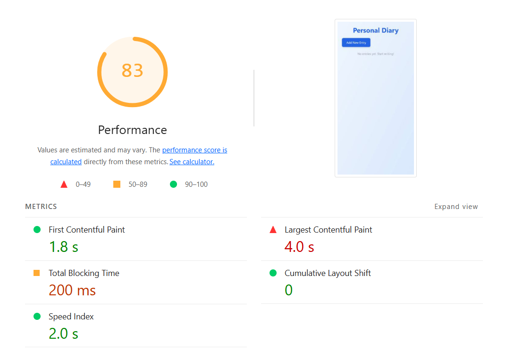
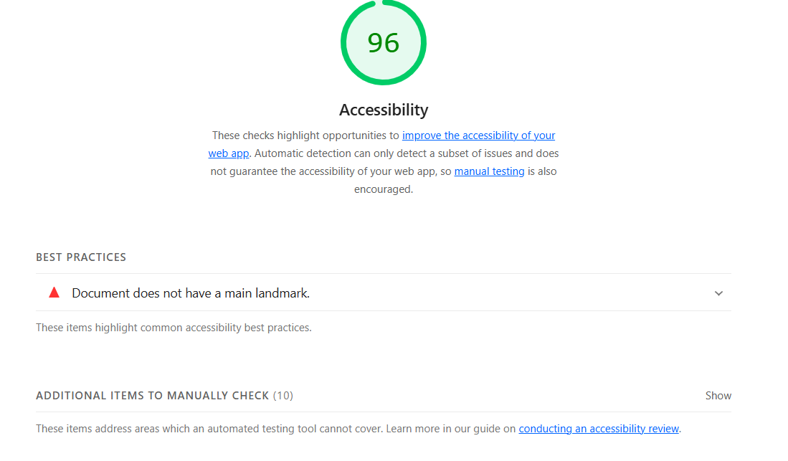
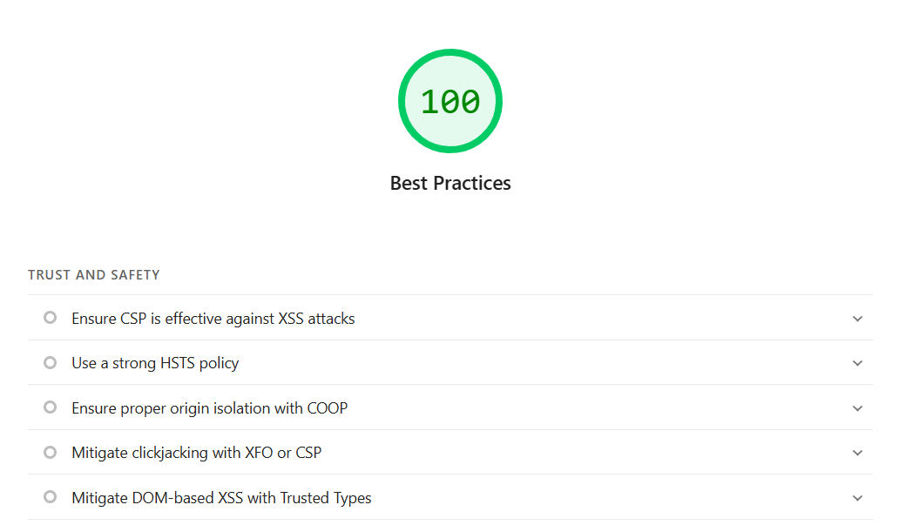

# Министерство образования Республики Беларусь

<p align="center">Учреждение образования</p>
<p align="center">"Брестский Государственный технический университет"</p>
<p align="center">Кафедра ИИТ</p>
<br><br><br><br><br><br>
<p align="center"><strong>Лабораторная работа №8</strong></p>
<p align="center"><strong>По дисциплине:</strong> "Веб-технологии"</p>
<p align="center"><strong>Тема:</strong> "Качество и деплой: тесты, Docker, CI/CD, Lighthouse"</p>
<br><br><br><br><br><br>
<p align="right"><strong>Выполнил:</strong></p>
<p align="right">Студент 4 курса</p>
<p align="right">Группы АС-63</p>
<p align="right">Соколова М.А.</p>
<p align="right"><strong>Проверил:</strong></p>
<p align="right">Несюк А.Н.</p>
<br><br><br><br><br>
<p align="center"><strong>Брест 2025</strong></p>

---

## Цель работы

- Настроить unit/integration/e2e тесты (по мере необходимости).

- Подготовить Dockerfile и docker‑compose для локального запуска.

- Собрать базовый pipeline в GitHub Actions.

---

## Вариант №19

Тестирование и деплой дневника.

---

## Описание проекта

Приложение для личного дневника (вариант 19). Пользователь может создавать, просматривать, редактировать и удалять записи (дата, текст, теги). Данные хранятся в localStorage. Дизайн: современный с Tailwind CSS, иконками (react-icons), responsivity.

### 1. Структура проекта

task_08/
├── doc/                  # Документация и артефакты
│   ├── README.md         # Файл с инструкциями
│   ├── report.html       # Отчёт Lighthouse (HTML)
│   ├── img               # Изображения
│   │   ├── performance.png   # Скриншот Performance из Lighthouse
│   │   ├── accessibility.png # Скриншот Accessibility
│   │   ├── best-practices.png # Скриншот Best Practices
│   │   └── seo.png           # Скриншот SEO
├── src/                  # Основной код проекта
│   ├── .eslintrc.json    # Конфиг ESLint
│   ├── .prettierrc       # Конфиг Prettier
│   ├── .husky/           # Pre-commit hooks
│   │   └── pre-commit    # Скрипт для lint/test перед коммитом
│   ├── .github/          # CI/CD
│   │   └── workflows/
│   │       └── ci-cd.yml # GitHub Actions workflow
│   ├── Dockerfile        # Multi-stage Dockerfile для билда и Nginx
│   ├── docker-compose.yml# Для локального запуска
│   ├── craco.config.js   # Конфиг CRACO для Tailwind
│   ├── tailwind.config.js# Конфиг Tailwind CSS
│   ├── postcss.config.js # Конфиг PostCSS
│   ├── tsconfig.json     # TypeScript конфиг (strict: true)
│   ├── package.json      # Зависимости и скрипты (start, build, test, lint, format)
│   ├── src/              # Исходный код
│   │   ├── App.tsx       # Основной компонент с роутером
│   │   ├── index.tsx     # Entry point (с Sentry, если бонус)
│   │   ├── index.css     # Импорт Tailwind
│   │   ├── reportWebVitals.ts # Web Vitals
│   │   ├── components/   # Компоненты
│   │   │   ├── Entry.ts  # Интерфейс Entry
│   │   │   ├── EntryList.tsx # Список записей (карточки, иконки)
│   │   │   └── EntryForm.tsx # Форма создания/редактирования
│   │   └── __tests__/    # Unit/integration тесты
│   │       ├── EntryList.test.tsx
│   │       └── EntryForm.test.tsx
│   └── cypress/          # E2E тесты
│       ├── config.ts     # Конфиг Cypress
│       └── e2e/          # Тесты
│           └── diary.cy.ts # Тесты на создание/редактирование
└── .gitignore            # Игнор node_modules, build и т.д.

## Требования к окружению

- Node.js (версия LTS, рекомендуется 20.x или выше).
- npm (устанавливается вместе с Node.js).
- VS Code или аналогичный редактор с расширениями ESLint, Prettier, Docker и GitHub Actions.

## Запуск приложения

Локальный запуск в режиме разработки:

```text
npm start
```

Приложение доступно по адресу <http://localhost:3000>.

Сборка для продакшена:

```text
npm run build
```

Результат в папке build. Для тестирования используйте статический сервер, например:

```text
npx serve -s build
```

Запуск в Docker:

```text
docker-compose up --build
```

Приложение доступно по адресу <http://localhost:3000>. Для остановки: docker-compose down.

## Тестирование

Unit- и integration-тесты (Jest с React Testing Library):

```text
npm test
```

Покрытие: рендер компонентов, взаимодействие с формой, работа с localStorage.

E2E-тесты (Cypress):

```text
npx cypress open
```

Откроется GUI для запуска тестов (сценарии на создание и редактирование записей).
Для автоматического запуска: npx cypress run.

## Непрерывная интеграция (CI)

Настроена с использованием GitHub Actions. Файл конфигурации: '.github/workflows/ci.yml'. Workflow включает:

- Установка зависимостей (npm ci).
- Линтинг кода (npm run lint).
- Запуск тестов (npm test -- --watchAll=false).
- Сборку приложения (npm run build).

## Оценка качества (Lighthouse)

Оценка произведена с использованием инструмента Lighthouse. Результаты:

- Performance: 83 (скриншот: ).
- Accessibility: 96 (скриншот: ).
- Best Practices: 100 (скриншот: ).
- SEO: 100 (скриншот: ).

Полный отчёт: report.html.

## Вывод

В ходе выполнения лабораторной работы №08 "Тестирование и деплой дневника" было разработано одностраничное веб-приложение (SPA) на базе React с использованием TypeScript. Приложение позволяет создавать, просматривать, редактировать и удалять записи дневника с хранением данных в localStorage. Дизайн реализован с помощью Tailwind CSS, включая responsivity, иконки и анимации.
