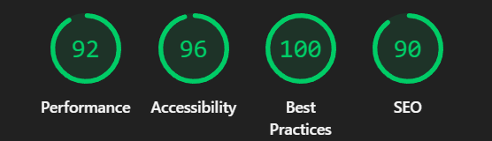
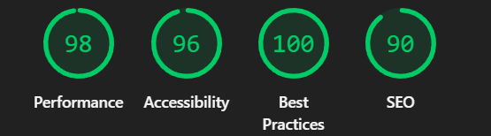
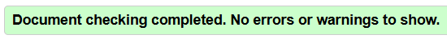

# Архитектура вёрстки проекта "Коллекция гаджетов"

## Общий подход

- **Adaptive Design**: Адаптивная вёрстка с использованием современных CSS-технологий
- **CSS Grid + Flexbox**: Комбинированное использование для построения сложных макетов
- **Mobile First**: Подход "сначала мобильные" с прогрессивным улучшением для десктопов
- **CSS Custom Properties**: Динамическое управление стилями через переменные

## Ключевые структурные элементы

### Flexbox контейнеры

- **Навигация**: `.nav` - горизонтальное выравнивание логотипа и меню
- **Список навигации**: `.nav-list` - горизонтальное меню с отступами
- **Заголовок карточки**: `.card-header` - выравнивание заголовка и кнопки подсказки
- **Действия карточки**: `.card-actions` - горизонтальное расположение кнопок
- **Поля формы**: `.field` - вертикальное расположение label, input и small

### CSS Grid области

- **Сетка карточек**: `.cards` - адаптивная сетка карточек гаджетов

```css
grid-template-columns: repeat(auto-fit, minmax(280px, 1fr))
```

- **Адаптивные колонки**:
  - Мобильные: 1 колонка (minmax 280px)
  - Десктопы: автоматическое заполнение доступного пространства

## Система тем

### Светлая тема (по умолчанию)

```css
:root {
  --bg: #f5f7fa;
  --text: #111;
  --card: rgba(255,255,255,0.92);
  --accent: #007aff;
  --border: #dcdfe4;
  --shadow: 0 14px 40px rgba(0,0,0,.12);
}
```

### Тёмная тема

```css
[data-theme="dark"] {
  --bg: #0e1117;
  --text: #eaeaea;
  --card: rgba(30,30,30,0.95);
  --accent: #4da3ff;
  --border: #2a2f3a;
  --shadow: 0 18px 48px rgba(0,0,0,.6);
}
```

## Компоненты интерфейса

### Табы (Tabs)

- Семантическая разметка с `role="tablist"`, `role="tab"`
- Индикатор выбранного таба через `border-bottom`
- Сохранение состояния в localStorage

### Карточки (Cards)

- Эффект подъёма при наведении: `transform: translateY(-6px)`
- Плавные переходы: `transition: transform .3s ease`
- Интерактивные элементы:
  - Кнопка подсказки с CSS-tooltip
  - Лайки с подсчётом и сохранением
  - Удаление карточек

### Tooltip

- Чисто CSS реализация через псевдоэлемент `::after`
- Позиционирование относительно родителя
- Плавное появление: `transition: opacity .2s ease`

### Форма обратной связи

- Валидация в реальном времени
- Отключение кнопки при невалидных данных
- Сообщение об успешной отправке

## Адаптивность

### Базовые стили (Mobile)

- Отступы: `padding: 0 1rem`
- Размеры шрифтов: оптимизированы для мобильных
- Карточки: занимают всю доступную ширину

### Десктопные улучшения

- Максимальная ширина контейнера: `max-width: 1100px`
- Сетка карточек: адаптивное количество колонок
- Увеличенные отступы секций

## JavaScript функциональность

### Состояние приложения

- Тема оформления (light/dark)
- Выбранный бренд в табах
- Количество лайков для каждого гаджета

### Обработчики событий

1. Переключение темы
2. Фильтрация карточек по бренду
3. Управление лайками
4. Удаление карточек
5. Валидация формы

## Особенности доступности

- **ARIA атрибуты**: `role`, `aria-selected`, `aria-label`, `aria-expanded`
- **Семантические теги**: `article`, `header`, `main`, `section`, `nav`
- **Клавиатурная навигация**: все интерактивные элементы доступны с клавиатуры
- **Фокус-индикаторы**: визуальное выделение для `:focus`

## Оптимизация производительности

- **Эффекты**: Аппаратное ускорение для трансформаций
- **Шрифты**: Системные шрифты для быстрой загрузки
- **Тени**: Оптимизированные тени для разных тем
- **Backdrop-filter**: Эффект размытия фона для заголовка

## Архитектурные решения

1. **Разделение ответственности**:

   - HTML: Структура и семантика
   - CSS: Внешний вид и адаптивность
   - JavaScript: Интерактивность и состояние

2. **Модульность**:

   - Компонентный подход к карточкам
   - Изолированные стили для компонентов
   - Независимые обработчики событий

3. **Масштабируемость**:

   - Легко добавлять новые бренды
   - Простое расширение функциональности карточек
   - Гибкая система тем

## Lighthouse

## Mobile



## Desktop



## Валидаторы HTML/CSS

## HTML

- Проходит проверку W3C Validator без ошибок
- Корректная семантическая структура
- Валидные атрибуты ARIA



### CSS

- Соответствие стандартам CSS3
- Корректное использование custom properties
- Поддержка современных браузеров


## Ссылка на проект

[Site](https://stis25.github.io/Web_Task02/)
