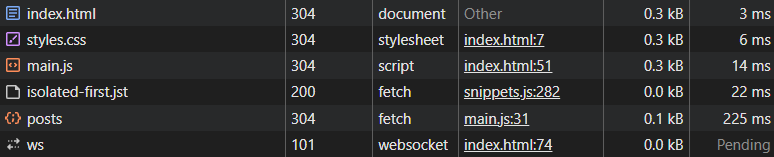

# Лабораторная работа №3. Асинхронность и HTTP-кэш

## Описание

В рамках данной лабораторной работы реализовано веб-приложение **«Список киберспортивных турниров»**, демонстрирующее:

* загрузку данных с внешнего API,
* пагинацию на стороне клиента,
* поиск и фильтрацию,
* кэширование данных,
* управление асинхронными запросами,
* отмену запросов,
* автоматические повторные попытки (retry),
* таймауты запросов,
* обработку ошибок,
* улучшения пользовательского интерфейса (UX).

В качестве источника данных используется публичный mock-API
**JSONPlaceholder**, данные которого логически адаптированы под тематику турниров.

## 1. Цель работы

* Освоить работу с `async/await` и `fetch`.
* Научиться обрабатывать сетевые и HTTP-ошибки.
* Реализовать отмену запросов с помощью `AbortController`.
* Реализовать механизм повторных попыток (retry) с бэкоффом.
* Изучить принципы клиентского кэширования.
* Реализовать UI-состояния загрузки, ошибки и пустого результата.
* Создать отзывчивый и удобный интерфейс.

## 2. Используемые технологии

* JavaScript (ES2020+)
* Fetch API
* AbortController
* HTML5 / CSS3
* JSONPlaceholder (mock API)
* In-memory cache (`Map` + TTL)
* async / await

## 3. Структура проекта

```text
project/
│── index.html
│── styles.css
└── main.js
```

## 4. Реализованный функционал

## 4.1. Загрузка списка элементов

Запрос к API:

```http
GET https://jsonplaceholder.typicode.com/posts
```

Из полученных данных формируется список из **20 киберспортивных турниров**
с полями:

* название турнира,
* игровая дисциплина (CS, Dota 2, LoL),
* описание.

Данные отображаются постранично (пагинация на клиенте).

## 4.2. Пагинация

* 5 элементов на страницу
* кнопки **Prev / Next**
* защита от выхода за границы
* отображение текущей страницы:

```text
Страница X из Y
```

## 4.3. Состояния интерфейса (UI states)

Реализованы следующие состояния интерфейса:

1. **Loading** — skeleton-заглушки во время загрузки
2. **Content** — успешная загрузка данных
3. **Empty** — если по фильтру ничего не найдено
4. **Error** — при сетевых или серверных ошибках

Переключение состояний происходит автоматически.

## 4.4. Поиск и фильтрация

Реализованы:

* поиск по названию турнира,
* фильтрация по игровой дисциплине,
* сброс страницы при изменении условий.

Каждый новый ввод или фильтр:

* инициирует новый запрос,
* отменяет предыдущий запрос,
* предотвращает гонки данных.

---

## 4.5. Функция fetchWithRetry

Ключевая функция проекта:

```js
fetchWithRetry(url, { retries, backoffMs, timeoutMs })
```

Реализовано:

* автоматические повторы при ошибках,
* задержка между повторами (retry),
* таймаут запроса через `AbortController`,
* корректная обработка ошибок.

Логика работы:

1. Выполняется запрос.
2. При ошибке — повтор с задержкой.
3. При превышении лимита — ошибка пробрасывается в UI.

## 4.6. Таймауты запросов

Каждый запрос ограничен по времени:

```js
setTimeout(() => controller.abort(), timeoutMs);
```

Если сервер не отвечает — запрос отменяется и запускается retry.

## 4.7. Отмена предыдущих запросов

При каждом новом поиске или переключении страницы:

```js
if (controller) controller.abort();
```

Это исключает:

* наложение ответов,
* устаревшие данные,
* лишние обновления интерфейса.

## 4.8. Кэширование данных (Map + TTL)

Используется in-memory кэш:

```js
Map<key, { data, exp }>
```

Параметры:

* TTL: **60 секунд**
* ключ формируется из:

  * поискового запроса,
  * фильтра,
  * номера страницы.

Алгоритм:

1. Проверяется наличие данных в кэше.
2. Если данные актуальны — используются без запроса.
3. Если устарели — выполняется новый запрос.
4. Кнопка **Refresh** игнорирует кэш.

## 4.9. Кнопка Refresh

Кнопка **«Обновить данные»**:

* принудительно загружает данные с сервера,
* игнорирует кэш,
* используется для демонстрации работы TTL и retry.

## 4.10. Примеры запросов




## 5. Обработка ошибок

Обрабатываются следующие типы ошибок:

## 1 AbortError

Причина: отмена запроса
→ запрос корректно прерывается без краша UI

## 2 Сетевые ошибки

Например: отсутствие соединения
→ отображается сообщение об ошибке загрузки

## 3 HTTP-ошибки

Например 4xx / 5xx
→ отображается статус ошибки

## 4 Прочие ошибки

→ универсальное сообщение об ошибке

## 6. Демонстрация кэширования (DevTools)

## 6.1. Первый запрос

* статус **200**
* данные получены с сервера
* отображается в Network

## 6.2. Повторный запрос

* запрос не выполняется
* данные берутся из кэша
* Network остаётся пустым

## 7. Публикация проекта

Проект опубликован с помощью **GitHub Pages**.
Доступен по ссылке:
[https://stis25.github.io/Web_Task03/](https://stis25.github.io/Web_Task03/)

## 8. Проверка на соответствие требованиям

| Требование                         | Выполнено |
| ---------------------------------- | --------- |
| Загрузка данных с API              | ✔         |
| Loading / Error / Empty            | ✔         |
| Поиск                              | ✔         |
| Фильтрация                         | ✔         |
| Пагинация                          | ✔         |
| Таймауты                           | ✔         |
| Retry                              | ✔         |
| AbortController                    | ✔         |
| Управление конкурентными запросами | ✔         |
| Кэш Map + TTL                      | ✔         |
| Refresh (игнор кэша)               | ✔         |
| async / await                      | ✔         |
| try / catch / finally              | ✔         |
| UX-улучшения                       | ✔         |
| README                             | ✔         |

## 9. Вывод

В ходе выполнения лабораторной работы было разработано веб-приложение, демонстрирующее:

* работу с асинхронными HTTP-запросами,
* отмену запросов,
* ретраи и таймауты,
* клиентское кэширование,
* поиск и фильтрацию,
* пагинацию,
* грамотное управление UI-состояниями.

## 10. Примечание

* Источник данных: JSONPlaceholder
* Количество элементов: 20
* Элементов на странице: 5
* Клиент: HTML / CSS / чистый JavaScript
