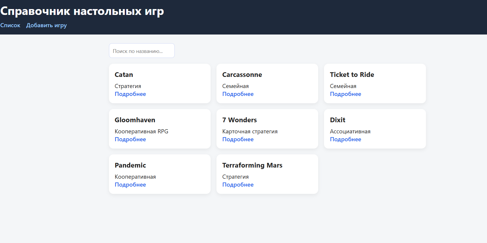
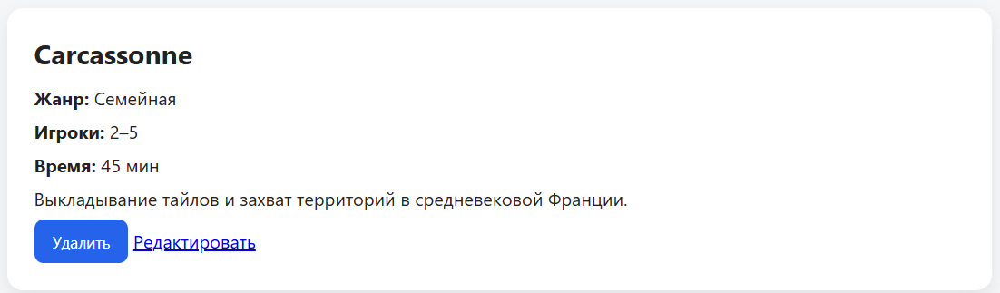
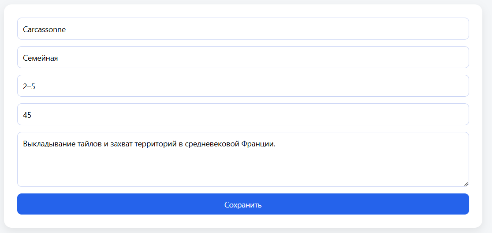
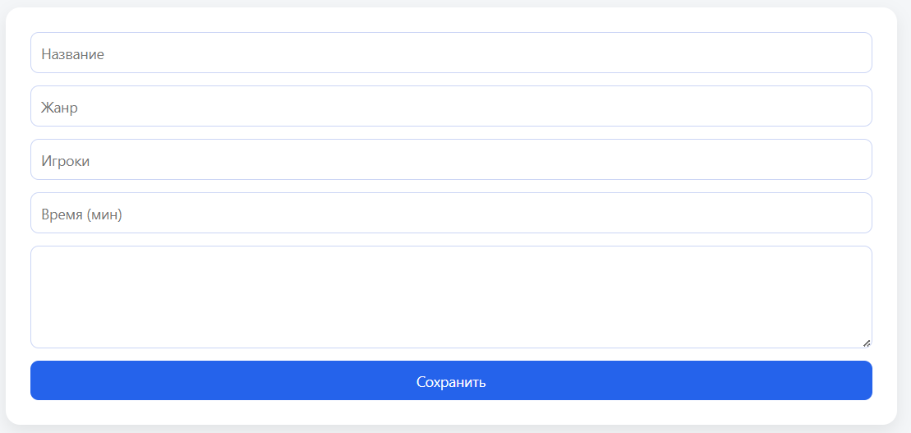

# Лабораторная работа №2. Веб-технологии

Министерство образования Республики Беларусь

Учреждение образования

«Брестский государственный технический университет»

Кафедра ИИТ

      

<strong>Лабораторная работа №3</strong>

<strong>По дисциплине:</strong> «Веб-технологии»

<strong>Тема:</strong>REST‑клиент SPA: список/детализация/CRUD, маршрутизация (без фреймворков)

      

<strong>Выполнил:</strong>

Студент 4 курса

Группы АС-63

Тунчик Антон Дмитриевич

 

<strong>Проверил:</strong>

Несюк А. Н.

     

<strong>Брест 2025</strong>

---

## Цель работы

- Реализовать простой SPA без фреймворков с маршрутизацией и состояниями загрузки/ошибок.
- Выполнить CRUD к учебному API (реальному или mock).

---

## Вариант №21

Справочник настольных игр: список игр, детальная страница, форма добавления/редактирования

## Ход выполнения работы

## 1. Структура проекта

* `index.html` — основной HTML-файл
* `styles.css` — стили
* `main.js` — точка входа, подписка на hashchange/load
* `router.js` — маршрутизатор hash → render
* `api.js` — mock API через json-server
* `views/` — папка с модулями:

  * `list.js` — список игр с поиском
  * `detail.js` — детальная страница игры
  * `form.js` — форма добавления/редактирования игры
* `db.json` — исходные данные для json-server

### 2. Реализованные маршруты

| Хэш                | Назначение                        |
| ------------------ | --------------------------------- |
| `#/items`          | Страница со списком всех игр      |
| `#/items/:id`      | Детальная страница выбранной игры |
| `#/new`            | Форма добавления новой игры       |
| `#/items/:id/edit` | Форма редактирования игры         |

### 3. Скриншоты работы приложения

| Описание                               | Скриншот                          |
| -------------------------------------- | --------------------------        |
| Загрузка списка игр                    |         |
| Детальная страница игры                |    |
| Форма редактирования игры              | |
| Форма добавления игры                  |          |

---

## Функциональность

* Полный CRUD: создание, просмотр, редактирование, удаление игр
* Состояния: загрузка, пустой список, ошибка
* Уведомления (toast) при успешных действиях
* Поиск игр с сохранением параметра в hash
* Адаптивная вёрстка с сеткой (Grid) и поддержкой мобильных устройств
* Чистый vanilla JS, ES6-модули
* Семантически корректная разметка и модульная архитектура

## Таблица критериев

| Критерий                                  | Выполнено |
| ----------------------------------------- | --------- |
| Hash-маршрутизация без библиотек          | Yes       |
| ES6-модули                                | Yes       |
| Состояния loading / empty / error         | Yes       |
| Формы создания и редактирования           | Yes       |
| Уведомления о действиях (toast)           | Yes       |
| Использование json-server / mock API      | Yes       |
| Адаптивная вёрстка (Grid + media queries) | Yes       |
| Чистый vanilla JS (без фреймворков)       | Yes       |
| Поиск с сохранением query в hash          | Yes       |

## Ссылка на проект

[stis25.github.io/Web_Task04/](stis25.github.io/Web_Task04/)
