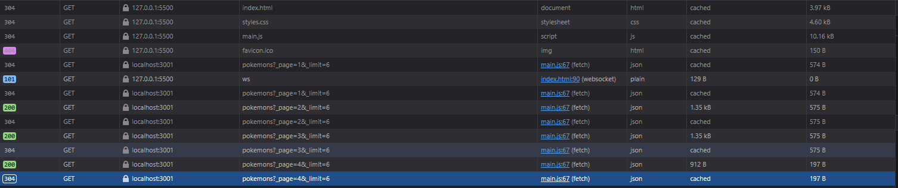

# Лабораторная работа №3. Асинхронность и HTTP‑кэш (fetch, AbortController, ретраи)

## 📘 Описание

В рамках данной лабораторной работы реализовано веб‑приложение «Каталог покемонов», демонстрирующее:

- загрузку данных с API,
- серверную пагинацию,
- поиск,
- кэширование,
- управление асинхронностью,
- отмену запросов,
- ретраи с экспоненциальным бэкоффом,
- обработку ошибок,
- улучшения UX.

Приложение работает на основе mock‑API, поднятого через **json-server 0.17.4**.

---

## 🎯 1. Цель работы

- Освоить работу с `async/await`, `Promise`, `fetch`.
- Научиться обрабатывать сетевые ошибки.
- Реализовать отмену запросов через `AbortController`.
- Реализовать автоматические повторные попытки (retry) и таймауты.
- Понять принципы HTTP-кэширования.
- Создать удобный клиент с UI-состояниями.

---

## 🔧 2. Используемые технологии

- JavaScript (ES2020+)
- Fetch API
- AbortController
- HTML/CSS
- json-server v0.17.4 (mock API)
- In-memory cache (Map + TTL)
- async/await

---

## 📁 3. Структура проекта

```text
project/
│── index.html
│── styles.css
└── scripts/
    └── main.js
```

Сервер запускается командой:

```bush
npx json-server --watch db.json --port 3001
```

---

## 📌 4. Реализованный функционал

### ✔ 4.1. Загрузка списка элементов

Запрос:

```bush
GET /pokemons?_page=1&_limit=6
```

json-server возвращает заголовок:

```bush
X-Total-Count: 20
```

На его основе рассчитывается количество страниц:

```js
totalPages = Math.ceil(totalCount / itemsPerPage)
```

Реализована серверная пагинация:

- кнопки Prev/Next,
- блокировка на границах,
- счётчик страниц: *Page X of Y*.

---

### ✔ 4.2. Состояния интерфейса

Реализованы 4 UI состояния:

1. **Loading** — показывается во время запроса  
2. **Content** — успешная загрузка  
3. **Empty** — если запрос вернул пустой список  
4. **Error** — при сетевых или серверных ошибках  

Переключение между состояниями полностью автоматизировано.

---

### ✔ 4.3. Поиск с дебаунсом

Поле поиска обрабатывается с задержкой в 300 мс:

```js
debounce(fn, 300)
```

Это предотвращает лишние запросы во время быстрого ввода.

Каждый новый ввод **отменяет предыдущий запрос** через:

```js
this.lastController.abort();
```

---

### ✔ 4.4. Функция fetchWithRetry (ретраи + таймаут + отмена)

Одна из ключевых частей проекта:

```js
fetchWithRetry(url, { retries, backoffMs, timeoutMs })
```

Реализовано:

- автоматические повторы при ошибках,
- экспоненциальный бэкофф:

  ```js
  delay = backoffMs * 2^(attempt-1)
  ```

- таймаут запроса через AbortController,
- отмена предыдущих запросов,
- визуальный индикатор retry.

Возвращает:

```js
{ data, headers }
```

---

### ✔ 4.5. Таймауты запросов

Каждый запрос ограничивается временем:

```js
setTimeout(() => controller.abort(), timeoutMs)
```

Если сервер зависает — запрос автоматически прерывается и переходит в retry.

---

### ✔ 4.6. Отмена предыдущих запросов

При поиске или смене страницы:

```js
if (this.lastController) this.lastController.abort();
```

Это исключает гонки данных и повышает отзывчивость интерфейса.

---

### ✔ 4.7. Кэширование (in-memory Map + TTL)

Кэш хранится в:

```js
Map<url, { data, totalCount, timestamp }>
```

TTL = **30 секунд**

Алгоритм:

1. Проверяется кэш по ключу URL.  
2. Если данные свежие — возвращаются без запроса.  
3. Если устарели — выполняется новый запрос.  
4. Кнопка **Refresh** игнорирует кэш.

Для отладки выводится:

```bush
Cache SET <url>
Cache HIT <url>
```

---

### ✔ 4.8. Кнопка Refresh

Принудительно обновляет данные:

```js
this.loadPokemons(true);
```

Полезно для демонстрации:

- обновления данных,
- работы TTL,
- сравнения с кэшированием.

---

### ✔ 4.9. Индикатор повторных загрузок (retry)

При повторной попытке:

```bush
Retrying... (2)
Retrying... (3)
```

Индикатор показывает , что работает алгоритм retry/backoff.

---

### ⚠ 5. Обработка ошибок

Ошибки разделяются по типам:

#### 1) AbortError

Причина: отменён запрос  
→ Показывается сообщение *"Request was cancelled"*

#### 2) Сетевые ошибки (TypeError)

Например отключён сервер  
→ *"Network error: check server/connection."*

#### 3) Ошибки HTTP 4xx/5xx

Например:

```bush
HTTP 500: Internal Server Error
```

→ *"Server error: ..."*

#### 4) Прочие ошибки

→ *"Failed to load Pokémon data"*

---

## 🔍 6. Демонстрация кэширования (DevTools)

### 6.1. Первый запрос

- статус **200**
- пришёл с сервера
- есть `X-Total-Count`

### 6.2. Второй запрос

- в Network **нет запроса**
- в консоли видно:

```text
Cache HIT ...
```



---

## 🎯 7. Проверка на соответствие требованиям

| Требование | Выполнено |
|-----------|-----------|
| Загрузка данных | ✔ |
| Состояния loading/error/empty/content | ✔ |
| Поиск | ✔ |
| Пагинация | ✔ |
| Таймауты | ✔ |
| Retry с эксп. бэкоффом | ✔ |
| AbortController | ✔ |
| Конкурентные запросы | ✔ |
| Кэш Map + TTL | ✔ |
| Refresh (игнор кэша) | ✔ |
| Debounce | ✔ |
| Retry indicator | ✔ |
| try/catch/finally | ✔ |
| UX улучшения | ✔ |
| README | ✔ (этот файл) |

---

## 🏁 8. Вывод

В ходе выполнения лабораторной работы было разработано полнофункциональное приложение, демонстрирующее:

- обработку асинхронных операций,
- отменяемые запросы,
- ретраи и таймауты,
- клиентское кэширование,
- серверную пагинацию,
- грамотное управление UI состояниями.

---

## 📌 9. Приложение

db.json содержит 20 покемонов  
Пагинация — 6 элементов на страницу  
Клиент — html/css + чистый JS  
API — json-server 0.17.4

---
