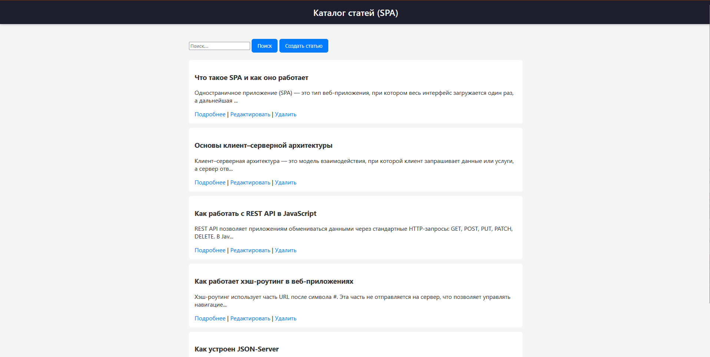
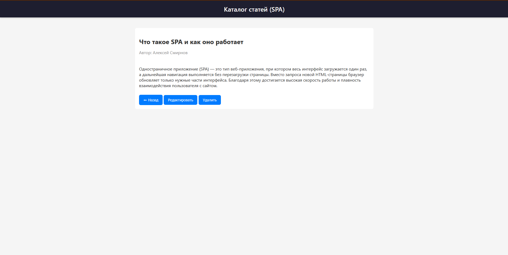
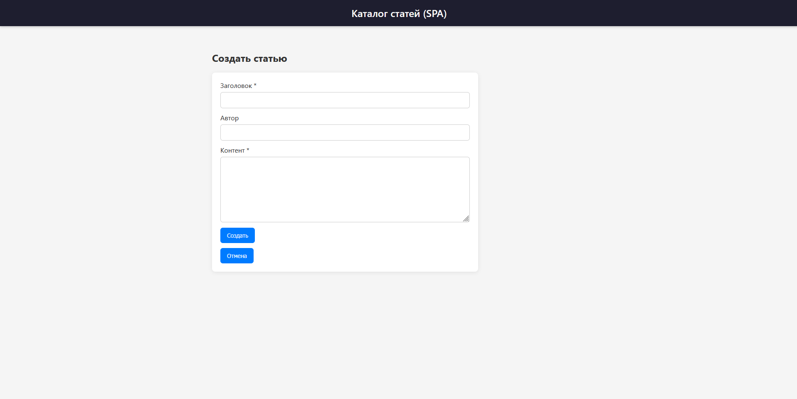
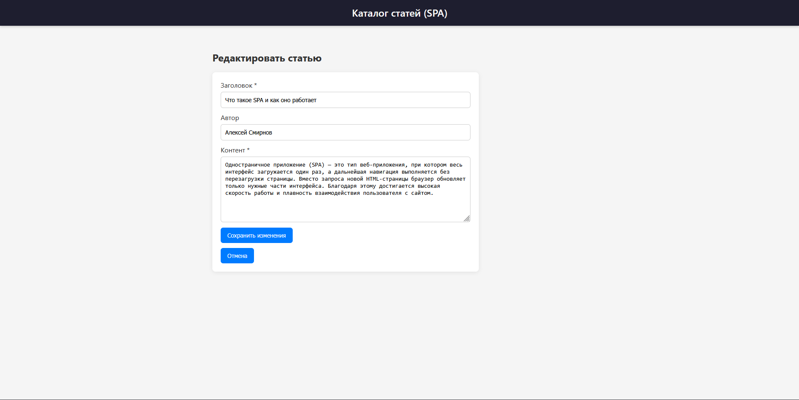
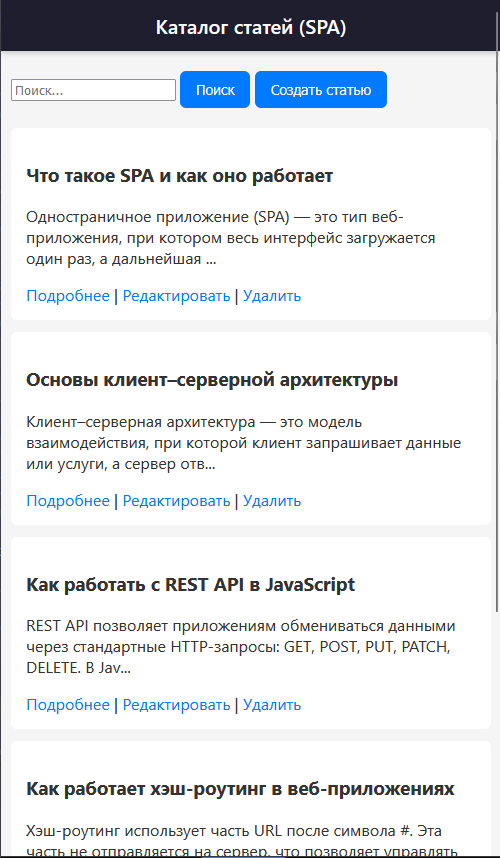

# 📘 Лабораторная работа №4

**Студент:** Ващук Анатолий
**Вариант:** 1. Каталог статей/новостей: список, деталь, форма создания/редактирования.

---

## 📌 1. Цель работы

Разработать одностраничное приложение (SPA) «Каталог статей», реализующее работу с REST API без использования фреймворков.  
Приложение должно включать список статей, страницу детали, форму создания/редактирования и выполнять CRUD‑операции.

---

## 📌 2. Основные задачи

- Реализовать хэш-маршрутизацию без библиотек.
- Настроить взаимодействие с REST API (json-server).
- Создать интерфейсы:
  - список статей,
  - просмотр статьи,
  - создание статьи,
  - редактирование статьи.
- Реализовать состояния загрузки и ошибок.
- Добавить поиск по заголовку.
- Выполнить CRUD (Create, Read, Update, Delete).
- Организовать проект на модулях.

---

## 📁 3. Структура проекта

```
project/
│── index.html
│── style.css
│── main.js
│
├── api/
│   └── api.js
│
├── router/
│   └── router.js
│
└── views/
    ├── listView.js
    ├── detailView.js
    └── formView.js
```

---

## 🌐 4. Используемое API

Для разработки используется json-server:

```
json-server --watch db.json --port 3000
```

Пример db.json:

```json
{
  "items": [
    {
      "id": "3aa0",
      "title": "sfsdf",
      "author": "sdf",
      "content": "sdf"
    }
  ]
}
```

Доступные эндпоинты:

| Метод | URL          | Описание                |
|-------|--------------|-------------------------|
| GET   | /items       | Получить список статей |
| GET   | /items/:id   | Получить статью по id   |
| POST  | /items       | Создать статью          |
| PATCH | /items/:id   | Обновить статью         |
| DELETE| /items/:id   | Удалить статью          |

---

## 🚏 5. Маршрутизация

Маршрутизация выполнена через `location.hash`.

| Маршрут             | Описание               |
|---------------------|------------------------|
| `#/items`           | Список статей          |
| `#/items/:id`       | Детальная страница     |
| `#/new`             | Создание статьи        |
| `#/items/:id/edit`  | Редактирование статьи  |

Пример маршрутов:

```js
addRoute("/items", ({ query }) => renderListView({ query }));
addRoute("/items/:id", ({ params }) => renderDetailView({ params }));
addRoute("/new", () => renderFormView({ params: {} }));
addRoute("/items/:id/edit", ({ params }) => renderFormView({ params }));
```

---

## 📄 6. Экран списка статей

Возможности:
✔ загрузка списка  
✔ поиск по заголовку (`?search=`)  
✔ удаление статьи
✔ редактирование статьи
✔ навигация в детали  
✔ кнопка "Создать"

Поиск:

```js
items = await getItems(query);
```

Пустое состояние:

```
Нет статей
[ поле поиска ] [ Поиск ] [ Создать статью ]
```

---

## 📄 7. Экран просмотра статьи

Реализовано:

- отображение заголовка, автора и полного текста
- кнопка «Назад»
- кнопка «Редактировать»
- кнопка «Удалить»

Пример удаления:

```js
await deleteItem(id);
navigateTo("#/items");
```

---

## 📝 8. Экран создания / редактирования

Форма общая для обоих режимов.

Возможности:

- обязательные поля: `title`, `content`
- валидация
- блокировка кнопки во время сохранения
- кнопка «Отмена»

---

## 🔍 9. Поиск

Поиск работает через строку запроса в хэше:

```
#/items?search=текст
```

Реализация:

```js
if (query.search) {
  items = items.filter(item =>
    item.title.toLowerCase().includes(query.search.toLowerCase())
  );
}
```

---

## ⚙ 10. Примеры CRUD-запросов

GET список

```js
getItems();
```

POST создание

```js
createItem({ title, author, content });
```

PATCH обновление

```js
updateItem(id, data);
```

DELETE удаление

```js
deleteItem(id);
```

---

## 🖼 11. Скриншоты

### 1. Главная страница - Список статей



### 2. Детальная страница



### 3. Создание инструмента



### 4. Редактирование



### 7. Адаптивный дизайн



---

## 12. Ссылка на публикацию

GitHub Pages: https://skevet-avramuk.github.io/WT_AS_LAB_04

## 📌 12. Вывод

В ходе лабораторной работы было создано SPA‑приложение на чистом JavaScript с поддержкой маршрутизации и CRUD.  
Приложение взаимодействует с REST API через json-server и поддерживает просмотр, создание, редактирование, удаление и поиск статей.  
Реализованы состояния загрузки, ошибки и пустого списка.

---
