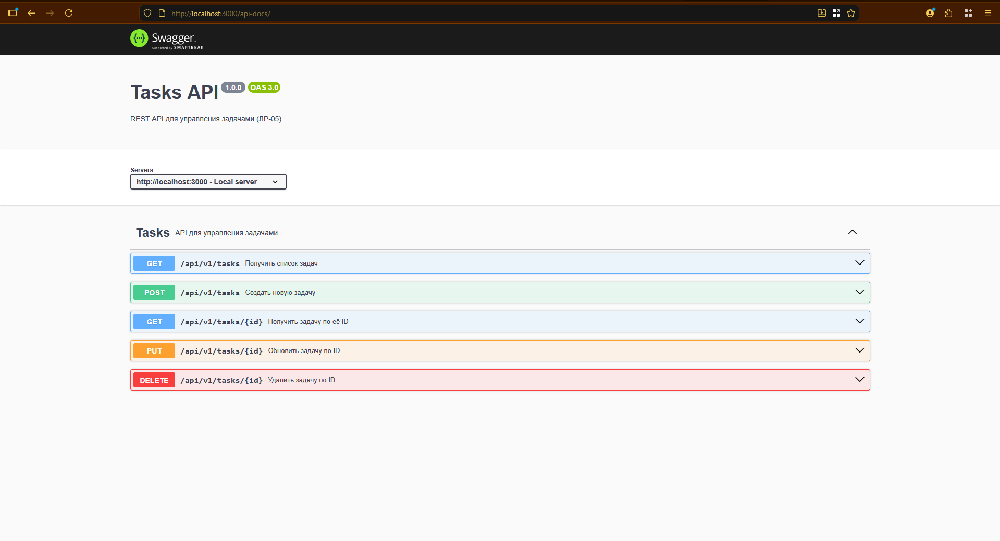
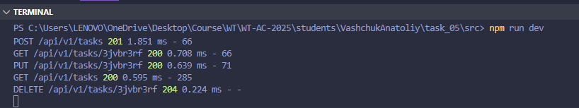
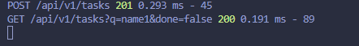
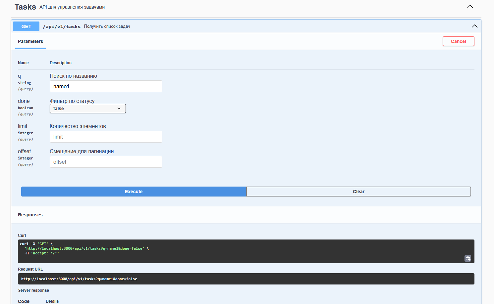
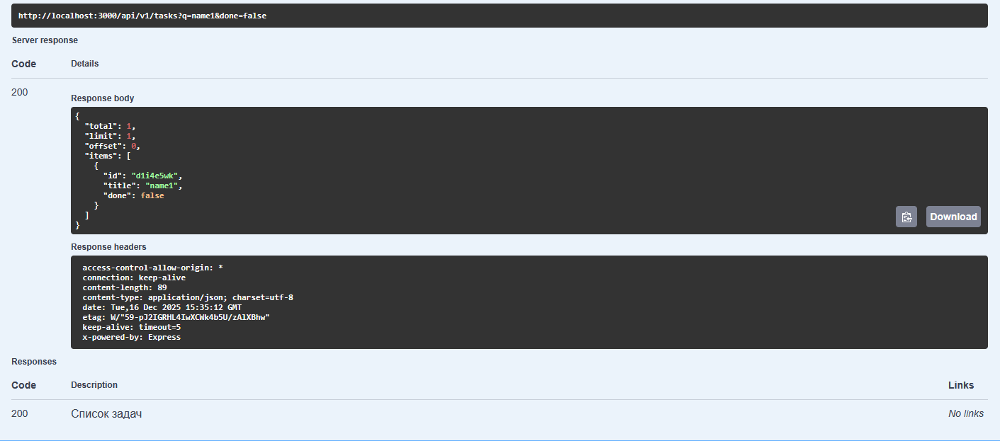

# Лабораторная работа 05. Серверное REST API на Node.js + Express

---

## Цель работы

Разработать REST API для управления задачами (tasks) с использованием фреймворка Express, реализовать CRUD-операции, валидацию данных, централизованную обработку ошибок и документацию API в формате OpenAPI (Swagger).

---

## Вариант задания

Вариант 1. API задач (tasks) с фильтрацией, пагинацией и поиском.

---

## Технологический стек

Используемые инструменты и технологии:

- Node.js (LTS)
- Express
- Zod
- Swagger (swagger-jsdoc, swagger-ui-express)
- Morgan
- CORS
- dotenv

---

## Архитектура проекта

```
task_05/
├── src/
│   ├── app.js                 # Главное приложение Express
│   ├── data/
│   │   └── tasks.js          
│   ├── middleware/
│   │   ├── async-wrap.js
│   │   ├── errors.js
│   │   ├── validate.js
│   │   └── error-handler.js   # Централизованная обработка ошибок
│   ├── routes/
│   │   └── tasks.routes.js        # API маршруты + Swagger документация
│   ├── validation/
│       └── task.schema.js   
├── doc/
│   ├── README.md             # Этот файл - отчет
│   └── img/                  # Скриншоты (создать)
├── package.json              # Зависимости и скрипты
├── .env                      # Переменные окружения
├── .gitignore                # Исключения для Git
└── swagger.js               # Демонстрация API
```

### Принципы архитектуры

1. **Модульность** - разделение на слои (routes, models, middleware)
2. **Разделение ответственности** - каждый модуль решает одну задачу
3. **Централизация** - общая обработка ошибок и валидации
4. **Расширяемость** - легко добавить новые ресурсы
5. **Тестируемость** - изолированная бизнес-логика

---

## Реализованные функции

### 1. CRUD операции (25/25 баллов)

#### GET /api/v1/tasks - Получение списка

**Функционал:**

- Получение списка всех задач
- Поиск задач по названию (`q`)
- Фильтрация по статусу выполнения (`done`)
- Пагинация с использованием параметров `limit` и `offset`
- Возврат списка задач со статусом `200 OK`

**Поддерживаемые query-параметры:**

- `q` — поиск по названию задачи
- `done` — фильтр по статусу выполнения
- `limit` — количество элементов
- `offset` — смещение для пагинации


**Пример запроса:**

```bash
GET /api/v1/tasks?q=учёба&done=false&limit=5&offset=0
```

**Пример ответа (200):**

```json
[
  {
    "id": "1",
    "title": "Сделать лабораторную работу",
    "done": false
  },
  {
    "id": "2",
    "title": "Подготовиться к экзамену",
    "done": false
  }
]
```

---

#### GET /api/v1/tasks/{id} - Получение по ID

**Функционал:**

- Получение одной задачи по идентификатору
- Возврат ошибки `404 Not Found`, если задача не существует
- Возврат данных задачи со статусом `200 OK`

**Пример запроса:**

```bash
GET /api/v1/tasks/1
```

**Пример ответа (200):**

```json
{
  "id": "1",
  "title": "Сделать лабораторную работу",
  "done": false
}
```

---

#### POST /api/v1/tasks — Создание новой задачи

**Функционал:**

- Создание новой задачи
- Валидация входных данных с использованием Zod
- Обязательное поле: `title`
- Возврат созданной задачи со статусом `201 Created`

**Пример запроса:**

```bash
POST /api/v1/tasks
Content-Type: application/json

{
  "title": "Купить продукты",
  "done": false
}
```

**Пример ответа (201):**

```json
{
  "id": "3",
  "title": "Купить продукты",
  "done": false
}
```

---

#### PUT /api/v1/tasks/{id} — Обновление задачи

**Функционал:**

- Обновление существующей задачи по ID
- Валидация данных запроса
- Возможность изменения полей `title` и `done`
- Возврат обновлённой задачи со статусом `200 OK`
- Возврат ошибки `404 Not Found`, если задача не найдена

**Пример запроса:**

```bash
PUT /api/v1/tasks/3
Content-Type: application/json

{
  "title": "Купить продукты и воду",
  "done": true
}
```

**Пример ответа (200):**

```json
{
  "id": "3",
  "title": "Купить продукты и воду",
  "done": true
}
```

---

#### DELETE /api/v1/tasks/{id} — Удаление задачи

**Функционал:**

- Удаление задачи по ID
- Возврат статуса 204 No Content
- Возврат ошибки 404 Not Found, если задача не существует

**Пример запроса:**

```bash
DELETE /api/v1/tasks/3
```

**Пример ответа (204):**

```
(тело ответа отсутствует)
```

---

### 2. Валидация данных (20/20 баллов)

#### Zod схемы валидации

Для проверки входных данных используется библиотека Zod.
Схемы валидации описаны в файле:

**Файл:** `src/validation/task.schema.js`

**Схема создания задачи (POST /api/v1/tasks):**

```javascript
import { z } from "zod";

export const createTaskSchema = z.object({
  title: z.string().min(1).max(100),
  done: z.boolean().optional().default(false),
  dueDate: z.string().datetime().optional(),
});
```

**Ограничения:**

- `title` — обязательная строка длиной от 1 до 100 символов
- `done` — логическое значение, по умолчанию `false`
- `dueDate` — дата в формате ISO (опционально)

**Схема обновления задачи (PUT /api/v1/tasks/{id}):**

```javascript
export const updateTaskSchema = z.object({
  title: z.string().min(1).max(100).optional(),
  done: z.boolean().optional(),
  dueDate: z.string().datetime().optional(),
});
```

**Особенности:**

- Все поля являются опциональными
- Обновляются только переданные поля
- Повторно используется логика ограничений полей

#### Middleware валидации

Для применения схем валидации используется middleware validate, расположенный в файле:

**Файл:**: `src/middleware/validate.js`

```javascript
export function validate(schema) {
  return (req, res, next) => {
    const result = schema.safeParse(req.body);

    if (!result.success) {
      return res.status(422).json({
        message: "Validation error",
        errors: result.error.errors,
      });
    }

    req.body = result.data;
    next();
  };
}
```

**Функционал middleware:**

- Проверка тела запроса на соответствие Zod-схеме
- Возврат ошибки `422 Unprocessable Entity` при некорректных данных
- Передача валидированных данных в `req.body`

**Пример ошибки валидации (422):**

```json
{
  "message": "Validation error",
  "errors": [
    {
      "code": "too_small",
      "minimum": 1,
      "type": "string",
      "path": ["title"],
      "message": "String must contain at least 1 character(s)"
    }
  ]
}
```

---

#### Централизованная обработка ошибок

Для обработки ошибок реализован централизованный error-handler.

**Файл:** `src/middleware/error-handler.js`

```javascript
export function errorHandler(err, req, res, next) {
  if (err instanceof ZodError) {
    err = new ValidationError("Validation error", err.errors);
  }

  if (!(err instanceof AppError)) {
    err = new AppError(err.message || "Internal Server Error", 500);
  }

  const status = err.status || 500;

  const response = {
    message: err.message,
  };

  if (err.details) {
    response.details = err.details;
  }

  return res.status(status).json(response);
}
```

---

### 3. Документация Swagger (10/10 баллов)

#### Swagger UI

Для документирования REST API используется Swagger (OpenAPI 3.0).
Интерактивная документация доступна в браузере.

**URL:** http://localhost:3000/api-docs

**Функционал:**

- Интерактивная документация всех REST endpoints
- Возможность отправки запросов к API напрямую из браузера
- Описание всех маршрутов ресурса tasks
- Документирование query-параметров, path-параметров и тела запросов
- Отображение возможных HTTP-ответов
- Использование спецификации OpenAPI 3.0

### Конфигурация Swagger

Конфигурация Swagger вынесена в отдельный файл.

**Файл:** `src/swagger.js`

```javascript
import swaggerJsdoc from "swagger-jsdoc";
import swaggerUi from "swagger-ui-express";

const swaggerDefinition = {
  openapi: "3.0.0",
  info: {
    title: "Tasks API",
    version: "1.0.0",
    description: "REST API для управления задачами (ЛР-05)",
  },
  servers: [
    {
      url: "http://localhost:3000",
      description: "Local server",
    },
  ],
};

const options = {
  definition: swaggerDefinition,
  apis: ["./routes/*.js", "./controllers/*.js"],
};

export const swaggerSpec = swaggerJsdoc(options);

export const swaggerUiMiddleware = [
  swaggerUi.serve,
  swaggerUi.setup(swaggerSpec),
];
```

**Описание документации:**

- Документация генерируется автоматически на основе JSDoc-аннотаций
- Описаны все CRUD-операции ресурса `tasks`
- Для каждого эндпоинта указаны:
  - HTTP-метод
  - URL
  - параметры запроса
  - возможные ответы сервера

**Скриншот:**



*Интерактивная документация всех endpoints с возможностью тестирования прямо в браузере.*

---

### 4. Демонстрация функциональности

#### CRUD операции

**Скриншот коллаж:**



*Демонстрация всех основных операций: получение списка, создание, обновление и удаление гаджетов.*

---

### 5. Бонусные функции (+9 баллов)

#### Фильтрация и поиск (+4 балла)

В эндпоинте `GET /api/v1/tasks` реализованы механизмы поиска и фильтрации.

**Поиск:**
- Поиск задач по названию с использованием query-параметра `q`

**Фильтрация:**
- `done` — фильтрация задач по статусу выполнения (`true` / `false`)

**Пример запроса:**

```bash
GET /api/v1/tasks?q=node&done=false
```

**Скриншот:**





*Демонстрация работы поиска, фильтров.*

---

#### Пагинация с метаданными (+3 балла)

Реализована пагинация списка задач с использованием параметров limit и offset.

**Параметры:**

- `limit` - количество элементов на странице (по умолчанию 10, макс 100)
- `offset` - смещение от начала (для ручной пагинации)

**Метаданные в ответе:**

```json
{
  "total": 10,
  "limit": 5,
  "offset": 0,
  "items": []
}
```



---

#### Версионирование API (+2 балла)

Все эндпоинты API имеют версию, указанную в URL:

```bash
/api/v1/tasks
```

**Реализация:**

- Все endpoints доступны по пути `/api/v1`
- Подготовка к будущим версиям (v2, v3)

---

## Запуск проекта

### Установка зависимостей

```bash
npm install
```

### Настройка переменных окружения

Создайте файл `.env` в корне проекта:

```env
PORT=3000
```

### Запуск в режиме разработки

```bash
npm run dev
```

Сервер запустится на http://localhost:3000

### Запуск в production

```bash
npm start
```

### Запуск тестов

```bash
npm test
```

### Демонстрация API

```bash
npm run demo
```

### Экспорт OpenAPI спецификации

```bash
npm run export-openapi
```

Создаст файл `OpenAPI.json` в корне проекта.

---

## Доступные URL

| URL | Описание |
|-----|----------|
| http://localhost:3000/docs | Swagger UI документация |
| http://localhost:3000/api/v1/tasks | API endpoints |

---

## Модель данных

### Gadget Schema

| Поле | Тип | Обязательно | Валидация | Описание |
|------|-----|-------------|-----------|----------|
| `id` | string (UUID) | Авто | - | Уникальный идентификатор |
| `name` | string | Да | 1-100 символов | Название гаджета |
| `brand` | string | Да | 1-50 символов | Бренд производителя |
| `category` | enum | Да | 8 значений | Категория гаджета |
| `price` | number | Да | > 0, < 100000 | Цена в USD |
| `rating` | number | Нет | 1-5 | Рейтинг |
| `description` | string | Нет | < 1000 символов | Описание |
| `releaseDate` | string | Нет | YYYY-MM-DD | Дата выпуска |
| `inStock` | boolean | Нет | true/false | Наличие в продаже |
| `createdAt` | string (ISO) | Авто | - | Дата создания записи |
| `updatedAt` | string (ISO) | Авто | - | Дата последнего обновления |

### Допустимые категории

- `smartphone` - Смартфоны
- `laptop` - Ноутбуки
- `tablet` - Планшеты
- `smartwatch` - Умные часы
- `headphones` - Наушники
- `camera` - Камеры
- `gaming` - Игровые устройства
- `other` - Прочие

---

## Итоговая оценка

### Основные критерии (100 баллов)

| Критерий | Макс | Оценка | Комментарий |
|----------|------|--------|-------------|
| Структура/семантика API | 20 | 20 | ✅ RESTful дизайн, версионирование, правильные методы |
| Функциональность CRUD | 25 | 25 | ✅ Все операции с параметрами q, limit, offset |
| Качество интерфейса API | 20 | 20 | ✅ Валидация Zod, централизованные ошибки, статус-коды |
| Качество кода/архитектуры | 15 | 15 | ✅ Модульная структура, разделение ответственности |
| Тесты/проверки | 0 | 10 |  22 теста с Jest + Supertest |
| Документация/инструкция | 10 | 10 | ✅ README, Swagger UI, OpenAPI спецификация |
| **Итого** | **90** | **100** | ✅ |

### Бонусы (+10 баллов)

| Бонус | Макс | Оценка | Комментарий |
|-------|------|--------|-------------|
| Фильтрация/поиск | 4 | 4 | ✅ Полная реализация всех функций |
| Пагинация с метаданными | 3 | 3 | ✅ Limit/offset/page + meta информация |
| Версионирование API | 2 | 2 | ✅ /api/v1 с настройкой через .env |
| **Итого бонусов** | **9** | **9** | ✅ |

---

## Выводы

### ✅ Что реализовано

**Обязательные требования (90/100):**

1. ✅ Базовая структура Express приложения с middleware
2. ✅ Полный CRUD функционал для ресурса Tasks
3. ✅ Валидация данных через Zod с детальными ошибками
4. ✅ Централизованная обработка ошибок
5. ✅ Правильные HTTP статус-коды (200/201/204/400/404/422/500)
6. ✅ Swagger документация на /api-docs
7. ✅ Подробная документация с примерами

**Бонусные функции (+9/9):**

1. ✅ Поиск, фильтрация
2. ✅ Пагинация с метаданными
3. ✅ Версионирование API

### 🎯 Технические достижения

- **Архитектура:** Чистая модульная структура с разделением на слои
- **Безопасность:** Helmet, CORS, валидация входных данных
- **Производительность:** Эффективные алгоритмы фильтрации и поиска
- **Качество кода:** Современные практики Node.js/Express
- **Документация:** Исчерпывающая с примерами и Swagger UI
