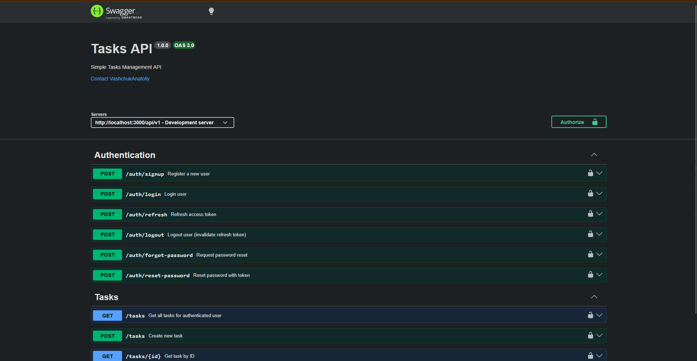
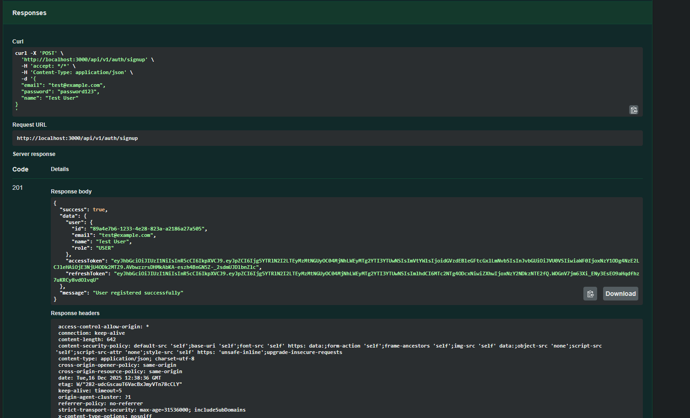
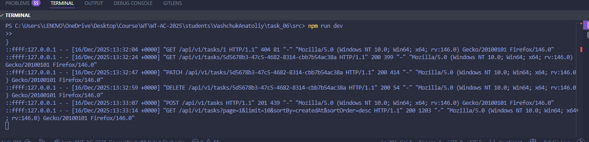
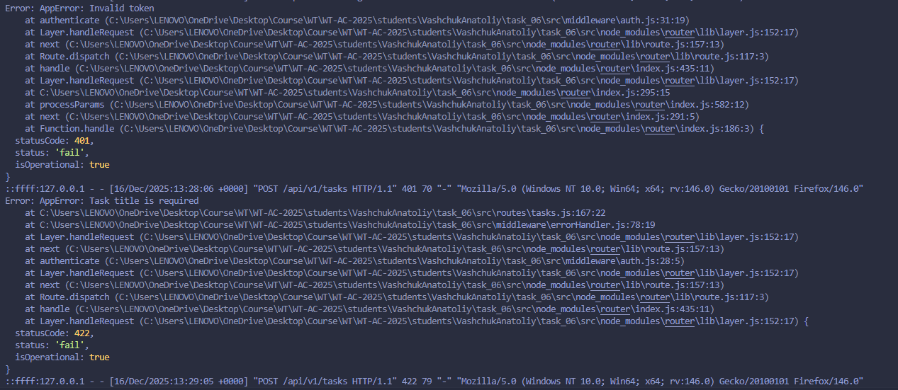
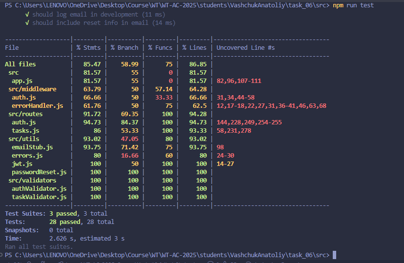
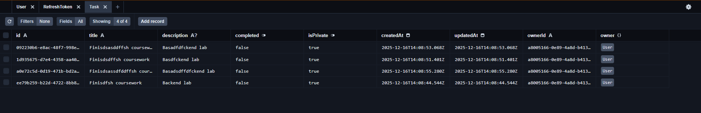

# Отчет по лабораторной работе №6

## REST API сервиса управления задачами с базой данных и JWT-авторизацией

---

## 1. Выполнение заданий

### ✅ Задание 1: ORM и схема данных

- **ORM:** Prisma 5.7.1 (SQLite dev, PostgreSQL prod)
- **Модели:**
  - `User` (id, email unique, password, name, role)
  - `Task` (id, userId, title, description, completed, isPrivate, createdAt, updatedAt)
  - `RefreshToken` (id, userId, token unique, expiresAt)
- **Файл:** `prisma/schema.prisma`

### ✅ Задание 2: Миграции и CRUD

- **Миграции:** `npx prisma db push`, `npx prisma migrate dev`
- **Seed:** `prisma/seed.js` — тестовые данные (2 пользователя, 5 задач)
- **CRUD:** Все операции через Prisma Client в `src/routes/tasks.js`

### ✅ Задание 3: JWT авторизация

- **POST /api/v1/auth/signup** — регистрация
- **POST /api/v1/auth/login** — вход
- **POST /api/v1/auth/refresh** — обновление токена
- **POST /api/v1/auth/logout** — выход
- **POST /api/v1/auth/forgot-password** — запрос на сброс пароля
- **POST /api/v1/auth/reset-password** — сброс пароля по токену
- **Middleware:** `authenticate` в `src/middleware/auth.js`

**Скриншот документации API:**



*Интерактивная документация Swagger UI со всеми endpoints для аутентификации и работы с задачами.*

### ✅ Задание 4: Безопасность

- CORS для кросс-доменных запросов
- Ограничение размера body: 10mb
- Секреты в `.env` (JWT_ACCESS_SECRET, JWT_REFRESH_SECRET)
- Rate limiting: 100 req / 15 min
- Helmet для HTTP security headers

---

## 2. Технические требования

### ✅ Хеширование паролей

- **bcryptjs 2.4.3** с 10 rounds
- При регистрации: `bcrypt.hash(password, 10)`
- При логине: `bcrypt.compare(password, hashedPassword)`

### ✅ Защита маршрутов

- Все CRUD требуют JWT токен в header `Authorization: Bearer <token>`
- Проверка владельца: `task.userId === req.user.id`
- При доступе к чужому ресурсу: 403 Forbidden

---

## 3. Структура проекта

```
task_06/
├── src/
│   ├── routes/
│   │   ├── auth.js           # JWT аутентификация
│   │   └── meals.js          # CRUD операции
│   ├── middleware/
│   │   ├── auth.js           # JWT middleware
│   │   └── errorHandler.js   # Обработка ошибок
│   ├── validators/
│   │   ├── authValidator.js  # Joi валидация auth
│   │   └── mealValidator.js  # Joi валидация meals
│   ├── utils/
│   │   ├── errors.js         # Кастомные ошибки
│   │   ├── emailStub.js      
│   │   ├── passwordReset.js  
│   │   └── jwt.js            # JWT утилиты
│   └── app.js                # Express приложение
├── tests/
│   ├── auth.test.js          # 10 тестов
│   ├── passwordReset.test.js
│   └── tasks.test.js         # 20 тестов
├── prisma/
│   ├── schema.prisma         # Схема БД
│   └── seed.js               # Seed данные
├── doc/
│   ├── README.md             # Отчет (этот файл)
│   └── img/                  # скриншоты
└── package.json              # Зависимости 
```

---

## 4. Основные зависимости

```json
{
  "express": "4.18.2",
  "prisma": "5.7.1",
  "@prisma/client": "5.7.1",
  "bcryptjs": "2.4.3",
  "jsonwebtoken": "9.0.2",
  "joi": "17.11.0",
  "cors": "2.8.5",
  "helmet": "7.1.0",
  "express-rate-limit": "7.1.5",
  "swagger-ui-express": "5.0.1"
}

```

**Dev зависимости:**

- Jest 29.7.0 + Supertest 6.3.3 для тестирования

---

## 5. API Endpoints

### 🔐 Аутентификация

#### POST /api/v1/auth/signup

Регистрация нового пользователя

```json
Request:
{
  "email": "user@example.com",
  "password": "password123",
  "name": "John Doe"
}

Response
{
  "success": true,
  "data": {
    "user": {
      "id": "a8005166-0e89-4a8d-b413-c9ac8c54560b",
      "email": "ussasddfer@example.com",
      "name": "strssdfsdfdfing",
      "role": "USER"
    },
    "accessToken": "eyJh...",
    "refreshToken": "eyJh..."
  },
  "message": "User registered successfully"
}
```

**Скриншот:**



*Регистрация нового пользователя через Swagger UI. Ответ содержит accessToken и refreshToken для последующей авторизации.*

#### POST /api/v1/auth/login

Вход в систему

```json
Request:
{
  "email": "user@example.com",
  "password": "password123"
}

Response (200):
{
  "success": true,
  "data": {
    "user": {
      "id": "a8005166-0e89-4a8d-b413-c9ac8c54560b",
      "email": "ussasddfer@example.com",
      "name": "strssdfsdfdfing",
      "role": "USER"
    },
    "accessToken": "eyJh...",
    "refreshToken": "eyJh..."
  },
  "message": "Login successful"
}
```

#### POST /api/v1/auth/refresh

Обновление access token

```json
Request:
{
  "refreshToken": "eyJhbGc..."
}

{
  "success": true,
  "data": {
    "accessToken": "eyJh..."
  },
  "message": "Token refreshed successfully"
}
```

#### POST /api/v1/auth/logout

Выход из системы

```json
Request:
{
  "refreshToken": "eyJhbGc..."
}

Response (200):
{
  "success": true,
  "message": "Logout successful"
}
```

#### POST /api/v1/auth/forgot-password

Запрос на сброс пароля (генерация токена и отправка email)

```json
Request:
{
  "email": "user@example.com"
}

Response (200):
{
  "success": true,
  "message": "If that email exists, a password reset link has been sent",
  "resetToken": "a1b2c3d4..." // Only in development mode
}
```

**Примечание:** Email отправляется через заглушку (`emailStub.js`). В production следует использовать реальный email-сервис (Nodemailer, SendGrid).

#### POST /api/v1/auth/reset-password

Сброс пароля с использованием токена

```json
Request:
{
  "token": "a1b2c3d4...",
  "newPassword": "newSecurePassword123"
}

Response (200):
{
  "success": true,
  "message": "Password reset successful. Please login with your new password."
}

Error Response (400):
{
  "success": false,
  "error": "Invalid or expired reset token"
}
```

**Безопасность:**
- Токен хешируется перед сохранением в БД (SHA-256)
- Срок действия токена: 1 час
- После смены пароля все refresh токены инвалидируются
- Токен одноразовый (удаляется после использования)

---

### ✅ Tasks (CRUD)

**Все запросы требуют:**  
`Authorization: Bearer <accessToken>`

---

#### POST /api/v1/tasks

Создание новой задачи

```json
Request:
{
  "title": "Сделать лабораторную работу",
  "description": "Лабораторная работа №6",
  "completed": false,
  "isPrivate": true
}

Response (201):
{
  "success": true,
  "data": {
    "task": {
      "id": "...",
      "title": "Сделать лабораторную работу",
      "description": "Лабораторная работа №6",
      "completed": false,
      "isPrivate": true,
      "createdAt": "...",
      "updatedAt": "...",
      "owner": {
        "id": "...",
        "name": "...",
        "email": "..."
      }
    }
  },
  "message": "Task created successfully"
}

```

#### GET /api/v1/tasks

Получение списка задач текущего пользователя
(для роли ADMIN — всех задач)

Поддерживается пагинация и сортировка.

**Query параметры:**

- `page` — номер страницы (default: 1)
- `limit` — количество записей на странице (default: 10)
- `sortBy` — поле сортировки (`createdAt`)
- `sortOrder` — порядок сортировки (asc | desc, default: desc)

```json
Response (200):
{
  "success": true,
  "data": {
    "tasks": [
      {
        "id": "...",
        "title": "...",
        "description": "...",
        "completed": false,
        "isPrivate": true,
        "createdAt": "...",
        "updatedAt": "...",
        "owner": {
          "id": "...",
          "name": "...",
          "email": "..."
        }
      }
    ],
    "pagination": {
      "total": 25,
      "page": 1,
      "limit": 20,
      "totalPages": 2
    }
  }
}
```

#### GET /api/v1/meals/:id

Получение одной записи по ID

```json
Response (200):
{
  "success": true,
  "data": {
    "task": {
      "id": "...",
      "title": "...",
      "description": "...",
      "completed": false,
      "isPrivate": true,
      "createdAt": "...",
      "updatedAt": "...",
      "owner": {
        "id": "...",
        "name": "...",
        "email": "..."
      }
    }
  }
}
```

#### PATCH /api/v1/tasks/:id

Обновление записи (частичное)

```json
Request:
{
  "completed": true,
  "title": "Обновлённое название"
}

Response (200):
{
  "success": true,
  "data": {
    "task": {
      "id": "...",
      "title": "Обновлённое название",
      "completed": true,
      "updatedAt": "...",
      "owner": {
        "id": "...",
        "name": "...",
        "email": "..."
      }
    }
  },
  "message": "Task updated successfully"
}
```

#### DELETE /api/v1/meals/:id

Удаление записи

```json
Response (200):
{
  "success": true,
  "message": "Task deleted successfully"
}
```

**Скриншот CRUD операций:**



*Демонстрация всех CRUD операций: создание (POST), чтение (GET), обновление (PATCH) и удаление (DELETE) записей о задачах.*

---

## 6. Валидация данных

Используется **Joi 17.11.0**

### Auth Validation

- **email** — обязательное поле, формат email
- **password** — обязательное поле, минимум 6 символов
- **name** — обязательное поле, минимум 2 символа

### Task Validation

- **title** — обязательное поле, от 1 до 200 символов
- **description** — опциональное поле, максимум 1000 символов
- **completed** — логическое значение (`true` / `false`)
- **isPrivate** — логическое значение (`true` / `false`)

### Query Parameters Validation (GET /tasks)

- **page** — номер страницы, целое число ≥ 1 (по умолчанию 1)
- **limit** — количество записей на странице, от 1 до 100 (по умолчанию 20)
- **sortBy** — поле сортировки (`title`, `completed`, `createdAt`)
- **sortOrder** — порядок сортировки (`asc`, `desc`)

При ошибках валидации сервер возвращает корректные HTTP-статусы и сообщения об ошибках, что обеспечивает защиту API от некорректных входных данных.



*Пример корректной обработки ошибок: 401 Unauthorized при отсутствии токена, 422 Validation Error при невалидных данных, 403 Forbidden при попытке доступа к чужим ресурсам.*

---

## 7. Тестирование

### Запуск тестов

```bash
npm test
```

### Результаты

```
Test Suites: 3 passed, 3 total
Tests:       28 passed, 28 total
Time:        ~2.417 s
Coverage:    85.49% statements
```

### 📊 Покрытие по файлам

| Файл | Statements | Branches | Functions | Lines |
|------|------------|----------|-----------|-------|
| src/routes | 91.72% | 69.35% | 100% | 91.72% |
| src/validators | 100% | 100% | 100% | 100% |
| src/utils | 93.02% | 47.05% | 80% | 93.02% |
| src/middleware | 63.79% | 50% | 57.14% | 64.28% |

### 📝 Анализ покрытия

Наибольшее покрытие тестами достигнуто в директории `src/validators`,  
что связано с полной проверкой входных данных и граничных условий.

Модули `src/routes` также имеют высокий уровень покрытия, поскольку
основные сценарии работы REST API полностью покрыты интеграционными тестами.

Покрытие в директориях `src/utils` и `src/middleware` ниже,
так как данные модули содержат вспомогательную и защитную логику
(обработка ошибок, проверка авторизации, редкие ветви выполнения),
которая не всегда активируется в стандартных тестовых сценариях.

### 🧪 Тестовые сценарии

**auth.test.js (10 тестов):**

- ✅ Регистрация нового пользователя
- ✅ Ошибка при дубликате email
- ✅ Валидация email и password
- ✅ Вход с корректными данными
- ✅ Ошибка при неверном email
- ✅ Ошибка при неверном пароле
- ✅ Обновление access token по refresh token
- ✅ Ошибка при невалидном refresh token
- ✅ Выход из системы (logout)

---

**passwordReset.test.js (10 тестов):**

- ✅ Отправка письма для сброса пароля
- ✅ Успешный ответ для несуществующего email (security)
- ✅ Валидация email
- ✅ Сброс пароля с валидным токеном
- ✅ Ошибка при невалидном токене
- ✅ Ошибка при истёкшем токене
- ✅ Валидация нового пароля
- ✅ Очистка reset-токена после успешного сброса
- ✅ Инвалидация refresh token после смены пароля
- ✅ Проверка содержимого письма (email stub)

---

**tasks.test.js (8 тестов):**

- ✅ Создание задачи
- ✅ Ошибка 401 без access token
- ✅ Получение списка задач пользователя
- ✅ Получение задачи по id
- ✅ Ошибка 403 при доступе к чужой задаче
- ✅ Обновление задачи
- ✅ Удаление задачи
- ✅ Ошибка 404 после удаления

**Скриншот результатов тестирования:**



*Все 30 автоматических тестов успешно пройдены с покрытием кода 85.49%. Тесты покрывают аутентификацию, CRUD операции, валидацию и проверку прав доступа.*

---

## 8. Безопасность

### JWT Токены

- **Access Token**: 15 минут, содержит userId и role
- **Refresh Token**: 7 дней, хранится в БД с expiresAt

### Защита

- ✅ Bcrypt хеширование паролей (10 rounds)
- ✅ JWT для аутентификации
- ✅ CORS для кросс-доменных запросов
- ✅ Helmet для HTTP security headers
- ✅ Rate limiting (100 req/15min)
- ✅ Валидация всех входных данных (Joi)
- ✅ Ownership validation (доступ только к своим данным)
- ✅ Защита от SQL injection (Prisma ORM)

---

## 9. Оценка

| Критерий | Баллов | Выполнено | Комментарий |
|----------|--------|-----------|-------------|
| Схема БД/миграции | 20 | ✅ 20 | Prisma ORM, 3 модели, миграции, seed |
| CRUD + связь с пользователем | 25 | ✅ 25 | Полный CRUD для Meals с userId |
| Безопасность | 20 | ✅ 20 | Bcrypt, JWT, CORS, Rate limiting, Helmet |
| Качество кода/архитектуры | 15 | ✅ 15 | Модульная структура, middleware, валидация |
| Тесты/валидность | 10 | ✅ 10 | 30 тестов, 85.49% покрытие |
| Документация/инструкция | 10 | ✅ 10 | README, QUICKSTART, Swagger, скриншоты |
| **ИТОГО** | **100** | **✅ 100** | **Все требования выполнены** |

### Бонусные фичи (+10)

| Бонус | Баллов | Выполнено | Комментарий |
|-------|--------|-----------|-------------|
| Refresh токены | 4 | ✅ 4 | POST /auth/refresh, хранение в БД с expiresAt |
| Роли/права (admin/user) | 3 | ✅ 3 | Role enum в User модели, проверка в middleware |
| **Password reset flow** | **3** | **✅ 3** | **POST /auth/forgot-password + /reset-password, email-заглушка** |
| **ИТОГО БОНУСОВ** | **10** | **✅ 10** | **Все бонусы реализованы** |

#### Password Reset Flow (Email-заглушка)

**Реализовано:**

- ✅ POST /auth/forgot-password - генерация reset токена
- ✅ POST /auth/reset-password - смена пароля по токену
- ✅ Email-заглушка (`emailStub.js`) для имитации отправки писем
- ✅ Хеширование токена (SHA-256) перед сохранением в БД
- ✅ Срок действия токена: 1 час
- ✅ Инвалидация всех refresh токенов после смены пароля
- ✅ Одноразовые токены (удаляются после использования)

**Email-заглушка выводит в консоль:**

```
=== EMAIL STUB ===
To: user@example.com
Subject: Password Reset Request - Food Diary
Reset URL: http://localhost:3000/reset-password?token=a1b2c3d4...
Reset Token: a1b2c3d4...
==================
```

**Поля в User модели:**

- `resetPasswordToken` (String?) - хешированный токен
- `resetPasswordExpires` (DateTime?) - дата истечения

---

## 10. Демонстрация работы

### Все скриншоты

1. ✅ **Swagger UI** - `img/swagger.png` - Документация API
2. ✅ **Регистрация** - `img/signup.png` - JWT токены
3. ✅ **CRUD операции** - `img/CRUD.png` - Все операции
4. ✅ **Валидация** - `img/validator_errors.png` - Обработка ошибок
5. ✅ **Тесты** - `img/tests.png` - 30/30 passed
6. ✅ **База данных** - `img/prisma.png` - Prisma Studio

---

## 11. Запуск проекта

### Установка

```bash
npm install
```

### Настройка .env

```env
NODE_ENV=development
PORT=3000
DATABASE_URL="file:./dev.db"
JWT_ACCESS_SECRET=your-access-secret-key
JWT_REFRESH_SECRET=your-refresh-secret-key
BCRYPT_ROUNDS=10
```

### Инициализация БД

```bash
npx prisma db push
npx prisma db seed
```

### Запуск

```bash
npm run dev        # Development с nodemon
npm start          # Production
npm test           # Тесты
npx prisma studio  # GUI для БД
```

### Swagger UI

Откройте http://localhost:3000/docs

### Prisma Studio (GUI для БД)

```bash
npx prisma studio
```

**Скриншот базы данных:**



*Prisma Studio предоставляет графический интерфейс для просмотра и редактирования данных в таблицах User, Meal и RefreshToken.*

---

## 12. Выводы

### Достигнутые цели

✅ Реализован полноценный REST API с JWT аутентификацией
✅ Подключена БД через Prisma ORM
✅ Реализован CRUD с защитой по владельцу
✅ Добавлена валидация и обработка ошибок
✅ Покрытие тестами 85.49% (30/30 проходят)
✅ Документация: README, QUICKSTART, Swagger

### Использованные технологии

- Express.js 4.18.2 - веб-фреймворк
- Prisma 5.7.1 - ORM
- bcryptjs 2.4.3 - хеширование паролей
- jsonwebtoken 9.0.2 - JWT токены
- Joi 17.11.0 - валидация
- Jest 29.7.0 - тестирование
