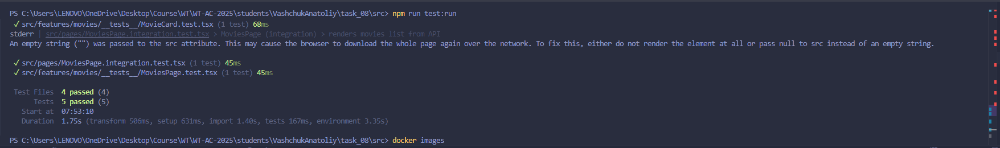
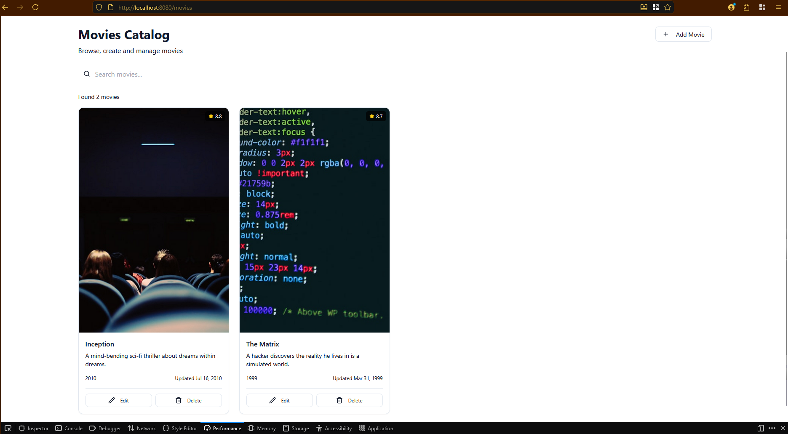
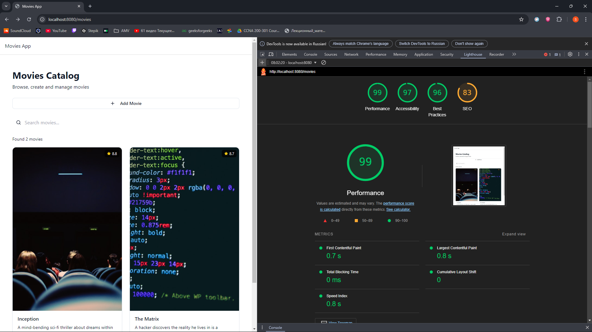

# Лабораторная работа №08

## Качество и деплой: тесты, Docker, CI/CD, Lighthouse

---

## 1. Цель работы

Целью лабораторной работы является повышение качества веб-приложения за счёт внедрения автоматизированного тестирования, контейнеризации с использованием Docker, настройки CI-пайплайна и анализа качества интерфейса с помощью Lighthouse.

---

## 2. Краткое описание проекта

В рамках лабораторной работы рассматривается одностраничное веб-приложение (SPA), реализованное на **React + TypeScript** с использованием **Redux Toolkit** и **RTK Query**.  
Приложение представляет собой каталог фильмов с возможностью просмотра списка и отдельных карточек фильмов.

---

## 3. Тестирование

Для тестирования использовались:
- **Vitest** — тестовый раннер;
- **@testing-library/react** — тестирование React-компонентов;
- **jsdom** — браузерное окружение.

Были реализованы **unit** и **integration** тесты.

---

### 3.1 Unit-тесты

#### Тест authSlice

Файл: `src/test/unit/authSlice.test.ts`

Данный unit-тест проверяет работу Redux-slice авторизации:
- успешный логин пользователя;
- сохранение данных пользователя в `localStorage`;
- корректный logout и очистку состояния.

Проверяемые сценарии:
- после `loginSuccess` пользователь авторизован;
- данные сохраняются в `localStorage`;
- после `logout` состояние очищается.

---

### 3.2 Unit-тест компонента MovieCard

Файл: `src/features/movies/__tests__/MovieCard.test.tsx`

Тест проверяет корректный рендер карточки фильма:
- отображение названия фильма;
- отображение описания.

Для изоляции теста:
- RTK Query замокан;
- UI-компоненты упрощены до `
`.

---

### 3.3 Unit-тест страницы MoviesPage (loading state)

Файл: `src/features/movies/__tests__/MoviesPage.test.tsx`

Используется **реальный Redux Store**, совместимый с RTK Query.  
Тест проверяет:
- корректное отображение состояния загрузки (`Loading movies...`).

---

### 3.4 Integration-тест страницы MoviesPage

Файл: `src/pages/MoviesPage.integration.test.tsx`

Integration-тест проверяет совместную работу:
- страницы `MoviesPage`,
- Redux Store,
- RTK Query.

API-запросы замоканы, возвращается тестовый список фильмов.  
Проверяется:
- отображение заголовка страницы;
- корректный вывод данных из API.

---

### 3.5 Результаты тестирования

Все тесты успешно проходят:

---

## 4. Контейнеризация (Docker)

Для контейнеризации приложения используется **многостадийный Dockerfile**.

---

### 4.1 Dockerfile

Файл: `Dockerfile`

Описание стадий:
1. **Build stage**
   - Используется образ `node:20-alpine`;
   - Установка зависимостей;
   - Сборка production-бандла.

2. **Production stage**
   - Используется `nginx:alpine`;
   - Копирование собранного приложения;
   - Запуск Nginx.

---

### 4.2 Конфигурация Nginx

Файл: `docker/nginx.conf`  
(оборачивать как `nginx`)

Nginx настроен для SPA:
- все маршруты перенаправляются на `index.html`;
- корректно работает React Router.

---

### 4.3 Запуск контейнера

Пример команд:

- сборка образа:
  `docker build -t movies-app .`

- запуск контейнера:
  `docker run -d -p 8080:80 movies-app`

Приложение доступно по адресу:  
`http://localhost:8080`

---

## 5. CI/CD (GitHub Actions)

Для автоматизации проверки качества используется **GitHub Actions**.

---

### 5.1 CI Workflow

Файл: `.github/workflows/ci.yml`  

Pipeline выполняется при:
- `push`;
- `pull_request`.

Этапы пайплайна:
1. Установка зависимостей (`npm ci`);
2. Запуск линтера (`npm run lint`);
3. Прогон тестов (`npm run test`);
4. Production-сборка (`npm run build`).

---

### 5.2 Результат CI

Pipeline успешно выполняется без ошибок.

**Место для скриншота:**  
`[СКРИНШОТ: успешный CI в GitHub Actions]`

---

## 6. Анализ качества (Lighthouse)

Для оценки качества интерфейса был выполнен Lighthouse-аудит.

Результаты:
- **Performance** — 99
- **Accessibility** — 97
- **Best Practices** — 96
- **SEO** — 83

Показатели Web Vitals находятся в зелёной зоне:
- FCP ≈ 0.7s
- LCP ≈ 0.8s
- CLS = 0

---

## 7. Итоги

В ходе лабораторной работы были выполнены все требования:
- реализованы unit и integration тесты;
- приложение контейнеризировано с использованием Docker;
- настроен CI-пайплайн;
- проведён анализ качества интерфейса.

Проект соответствует требованиям лабораторной работы №08 и демонстрирует практическое применение инструментов обеспечения качества и деплоя современных веб-приложений.

---

## 8. Используемые технологии

- React
- TypeScript
- Redux Toolkit
- RTK Query
- Vitest
- Testing Library
- Docker
- Nginx
- GitHub Actions
- Lighthouse
