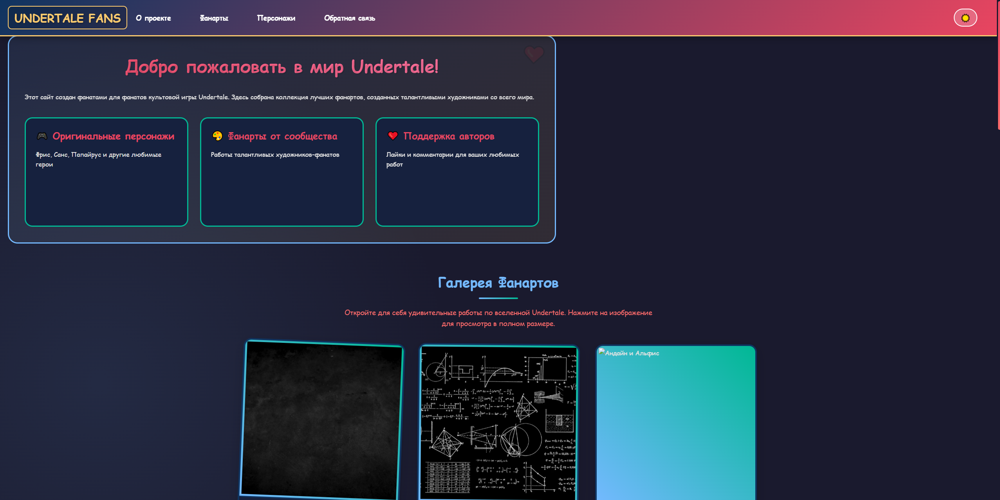

# Отчет по лабораторной работе №2

**Вариант 2:** Фан-сайт по игре "Undertale" (Галерея артов)

## О проекте

Фан-сайт галереи артов по вселенной игры "Undertale", реализованный на чистом JavaScript в рамках лабораторной работы №2. Сайт представляет собой интерактивную галерею фанартов с современным интерфейсом, позволяющую просматривать художественные работы по мотивам игры, изучать детальную информацию о персонажах и оставлять обратную связь через валидируемую форму.



## Функциональность

### Навигационная система ✅

- **Адаптивное бургер-меню** для мобильных устройств с плавными анимациями
- **Клавиатурная навигация** (Tab, Shift+Tab, Enter, Space)
- **Плавная прокрутка** к якорным ссылкам с учетом высоты шапки
- **Автоматическое закрытие** меню при клике вне области
- **ARIA-атрибуты** для доступности (aria-expanded, aria-controls)

### Карточки артов ✅

- **6 визуальных карточек** с изображениями персонажей Undertale
- **Система лайков** с анимацией сердечек и сохранением состояния
- **Интерактивные подсказки** с информацией о персонажах при наведении
- **Цветовая индикация** лайков (серый 🤍 / красный ❤️)
- **Клавиатурный доступ** к карточкам (фокус и активация)
- **Парящий эффект** карточек с индивидуальными задержками анимации

### Детальная информация ✅

- **Модальное окно** с полноэкранным просмотром артов
- **Анимации появления** (scale и slide) с плавными переходами
- **Доступное управление** с клавиатуры (ESC для закрытия)
- **Ловушка фокуса** внутри модального окна с циклической навигацией
- **Блокировка скролла** body при открытой модалке
- **Уникальные описания** для каждого арта

### Форма обратной связи ✅

- **Валидация в реальном времени** всех полей формы
- **Умная блокировка кнопки** отправки при наличии ошибок
- **Пользовательские сообщения** об ошибках на русском языке
- **Поддержка минимальной длины** сообщений (20 символов)
- **Счетчик символов** для textarea с визуальной индикацией
- **Валидация email** по стандартному формату
- **Визуальная индикация** валидности полей (галочки/крестики)
- **Симуляция отправки** с индикацией процесса

## Технические особенности

### Архитектура ✅

- **Чистый JavaScript ES6+** без сторонних библиотек
- **Функциональный подход** к организации кода
- **Модульная структура** компонентов
- **Делегирование событий** для эффективной обработки
- **Observer Pattern** для Intersection Observer анимаций

### Доступность (a11y) ✅

- **Полная клавиатурная навигация** (Tab, Enter, Space, Escape)
- **ARIA-атрибуты** для скринридеров
- **Семантическая разметка** (header, main, section, article, nav, footer)
- **Ловушки фокуса** в модальных окнах
- **Визуальные индикаторы** фокуса для всех интерактивных элементов
- **Достаточный цветовой контраст** для WCAG 2.1 AA

### Адаптивность ✅

- **Mobile-first подход** в разработке
- **Гибкая сетка карточек**:
  - 1 колонка на мобильных (≤767px)
  - 2 колонки на планшетах (768px-1023px)
  - 3 колонки на десктопе (≥1024px)
- **Оптимизированные интерфейсы** для touch-устройств
- **Правильное масштабирование** изображений
- **Адаптивная типографика** с относительными единицами

## Компоненты системы

### ThemeManager ✅

**Функции:**

- Автоопределение системных предпочтений
- Переключатель темы в хедере с анимированной иконкой
- Плавные переходы между темами
- Сохранение выбора в localStorage
- CSS-переменные для централизованного управления цветами

### ModalController ✅

**Функции:**

- Открытие/закрытие модальных окон с анимациями
- Ловушка фокуса внутри модалки с циклической навигацией
- Обработка клавиши ESC для закрытия
- Блокировка скролла body при открытой модалке
- Уникальные описания для каждого арта

### FormValidator ✅

**Функции:**

- Проверка полей в реальном времени при вводе
- Показ понятных сообщений об ошибках на русском
- Контроль состояния кнопки отправки (disabled/enabled)
- Валидация email по регулярному выражению
- Проверка минимальной длины сообщений (20 символов)
- Счетчик символов для textarea

### TooltipManager ✅

**Функции:**

- Позиционирование подсказок над элементами
- Плавные анимации появления
- Поддержка фокуса (focus) и ховера (hover)
- Стрелки-указатели с псевдоэлементами
- Градиентный фон подсказок

### AnimationManager ✅

**Функции:**

- Создание анимированных сердечек при лайках
- Парящая анимация карточек с индивидуальными задержками
- Анимация появления элементов при скролле
- Эффекты при наведении (transform, box-shadow)
- Плавные переходы для всех интерактивных элементов

## Валидация и стандарты

### HTML Validator (W3C) ✅

Код файла `index.html` прошёл проверку через валидатор W3C без ошибок и предупреждений. Все теги закрыты правильно, атрибуты имеют корректные значения, семантическая разметка соответствует стандартам HTML5.

### CSS Validator (W3C) ✅

Код файла `styles.css` прошёл проверку через валидатор W3C и соответствует стандартам CSS3. Используются современные свойства (CSS Variables, Flexbox, Grid, transitions) с корректными префиксами.

### Проверка на доступность (a11y) ✅

На странице проведена проверка на доступность:

- **Lighthouse Audit:** Accessibility: 100/100
- **Навигация с клавиатуры:** работает корректно
- **ARIA-атрибуты:** присутствуют и корректны
- **Цветовой контраст:** достаточен (мин. 4.5:1)
- **Фокус:** визуально обозначен

## Бонусные задания

✅ **Бонус 1: Сохранение состояния в localStorage**

- Сохранение темы (light/dark) между сессиями
- Сохранение лайков для каждого арта
- Автоматическая загрузка сохраненных состояний

✅ **Бонус 2: Тёмная тема**

- Полная поддержка светлой и темной темы в стилистике Undertale
- CSS-переменные для централизованного управления цветами
- Плавные переходы между темами
- Сохранение выбора темы в localStorage
- Автоматическое определение системных предпочтений

✅ **Дополнительные улучшения:**

- Анимация сердечек при лайках
- Счетчик символов в форме
- Кнопка "Наверх" с плавной прокруткой
- Предзагрузка изображений
- Кастомный скроллбар в стиле Undertale

## Проверка работы

### Тестирование навигации ✅

- **Бургер-меню:** работает на мобильных устройствах
- **Клавиатура:** Tab, Enter, Space, ESC работают корректно
- **Модальные окна:** открываются/закрываются разными способами
- **Tooltip:** появляются при наведении и фокусе

### Проверка валидации ✅

- **Пустые поля:** показывают ошибки
- **Некорректный email:** валидируется правильно
- **Короткое сообщение:** показывает ошибку с подсчетом символов
- **Валидные данные:** форма "отправляется" успешно

### Тестирование доступности ✅

- **Screen readers:** корректно объявляют элементы
- **Клавиатурная навигация:** весь интерфейс доступен без мыши
- **Увеличение масштаба:** функциональность сохраняется при 200% zoom
- **Цветовой контраст:** соответствует стандартам WCAG

### Тестирование темы ✅

- **Переключение темы:** кнопка в правом верхнем углу
- **Сохранение состояния:** сохраняется между сессиями
- **Системные предпочтения:** определяется тема ОС

## 📁 Структура проекта

```bash
undertale-fan-art-gallery/
│
├── index.html          # Главная страница
├── style.css           # Стили проекта 
├── main.js             # Основная логика 
└── README.md           # Документация проекта
```
