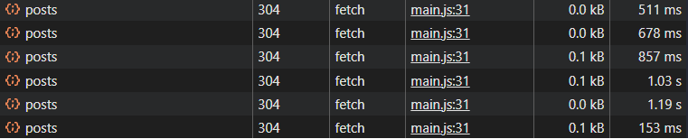

# Архитектура вёрстки проекта "Новостной клиент с кэшированием"

## Общий подход

- **Adaptive Design**: Адаптивная вёрстка с использованием современных CSS-технологий
- **CSS Grid + Flexbox**: Комбинированное использование для построения сложных макетов
- **Mobile First**: Подход "сначала мобильные" с прогрессивным улучшением для десктопов
- **CSS Custom Properties**: Динамическое управление стилями через переменные

## Ключевые структурные элементы

### Flexbox контейнеры

- **Шапка**: `.header` - центрирование заголовка и подзаголовка
- **Панель управления**: `.search-box` - горизонтальное выравнивание элементов управления
- **Статусные сообщения**: `.status > div` - выравнивание иконок и текста
- **Статистика**: `.stats` - распределение элементов статистики
- **Карточка новости**: `.news-card` - вертикальное расположение контента
- **Подвал карточки**: `.news-footer` - горизонтальное выравнивание категории и ID

### CSS Grid области

- **Сетка новостей**: `.news-grid` - адаптивная сетка карточек новостей

```css
grid-template-columns: repeat(auto-fill, minmax(300px, 1fr))
```

- **Адаптивные колонки**:
  - Мобильные: 1 колонка (minmax 300px)
  - Планшеты: 2 колонки
  - Десктопы: автоматическое заполнение доступного пространства

## Система дизайна

### Цветовая палитра

```css
:root {
  --основной-цвет: #4361ee;
  --основной-темный: #3a56d4;
  --вторичный-цвет: #7209b7;
  --опасный-цвет: #f72585;
  --светлый-фон: #f8f9fa;
  --темный-текст: #212529;
  --серый-цвет: #6c757d;
  --цвет-границы: #dee2e6;
  --тень: 0 2px 10px rgba(0, 0, 0, 0.1);
}
```

### Типографика

- **Основной шрифт**: Системные шрифты (Segoe UI, Roboto, Helvetica Neue)
- **Заголовки**: 2.5rem (десктоп), 2rem (мобильные)
- **Основной текст**: 1rem с line-height 1.6
- **Контрастность**: Соответствует WCAG AA стандартам

## Компоненты интерфейса

### Панель управления

- Поиск по тексту с плейсхолдером
- Фильтр по категориям с выпадающим списком
- Кнопки действий с иконками Font Awesome
- Адаптивное расположение элементов

### Индикаторы состояния

- **Загрузка**: CSS-спиннер с анимацией вращения
- **Ошибка**: Иконка восклицательного знака с сообщением
- **Пусто**: Иконка пустого ящика с подсказкой
- **Уведомления**: Всплывающие сообщения в правом верхнем углу

### Карточки новостей

- Эффект подъёма при наведении: `transform: translateY(-5px)`
- Градиентный фон для изображений категорий
- Иконки категорий с Font Awesome
- Плавные переходы: `transition: transform 0.3s`

### Пагинация

- Навигация "предыдущая/следующая" страница
- Отображение текущей позиции
- Отключение кнопок на крайних страницах
- Адаптивное расположение на мобильных

## Адаптивность

### Базовые стили (Mobile ≤ 768px)

- Отступы: `padding: 15px`
- Заголовок: `font-size: 2rem`
- Одноколоночная сетка
- Вертикальное расположение элементов управления
- Центрирование статистики

### Десктопные улучшения (> 768px)

- Отступы: `padding: 20px`
- Заголовок: `font-size: 2.5rem`
- Многоколоночная сетка новостей
- Горизонтальное расположение элементов управления
- Распределенная статистика

### Переходные состояния

- Медиазапросы для плавных переходов
- Сохранение читаемости на всех размерах экрана
- Адаптивные размеры кнопок и полей ввода

## JavaScript функциональность

### Состояние приложения

- Новости и отфильтрованные данные
- Текущая страница пагинации
- Статус загрузки и текущий запрос
- Кэш с временной меткой и счетчиком сохранений

### Система кэширования

- LocalStorage с TTL (5 минут)
- Подсчет сохраненных запросов
- Возможность игнорирования кэша
- Очистка кэша по требованию

### Механизмы надежности

- Повторные попытки запросов (3 попытки)
- Экспоненциальная задержка между попытками
- Таймауты запросов (5 секунд)
- Отмена через AbortController
- Имитация API с вероятностью ошибок для демонстрации

### Обработка ошибок

- Детализированные сообщения об ошибках
- Кнопка повтора при неудачных запросах
- Уведомления о статусе операций
- Безопасная обработка прерванных запросов

## Особенности доступности

### ARIA атрибуты

- `role="alert"` для сообщений об ошибках
- `role="list"` и `role="listitem"` для сетки новостей
- `aria-label` для всех интерактивных элементов
- `aria-hidden="true"` для декоративных иконок

### Семантическая разметка

- `<article>` для карточек новостей
- `<header>`, `<main>`, `<footer>` для структуры страницы
- `<section>` для логических разделов
- `<button>` для всех интерактивных действий

### Клавиатурная навигация

- Фокус-индикаторы для всех интерактивных элементов
- Управление с клавиатуры (Tab, Enter, Space)
- Логический порядок фокусировки
- Соответствие WCAG 2.1 стандартам

### Адаптивность для людей с ограниченными возможностями

- Высокий контраст текста и фона
- Увеличение шрифта без потери функциональности
- Альтернативный текст для иконок
- Управление без использования мыши

## Оптимизация производительности

### Загрузка ресурсов

- Системные шрифты для быстрого отображения
- Font Awesome через CDN с preconnect
- Ленивая загрузка изображений (при наличии реальных)
- Минималистичный CSS без избыточных стилей

### Рендеринг

- CSS Grid для эффективного расположения
- CSS-переменные для динамического изменения тем
- Аппаратное ускорение трансформаций
- Оптимизированные анимации с `transform` и `opacity`

### JavaScript оптимизации

- Делегирование событий
- Эффективная фильтрация на клиенте
- Пагинация для ограничения DOM-элементов
- Мемоизация повторяющихся вычислений

## Архитектурные решения

### Разделение ответственности

- **HTML**: Семантическая структура и доступность
- **CSS**: Внешний вид и адаптивность
- **JavaScript**: Логика приложения и управление состоянием

### Компонентный подход

- Изолированные стили для каждого компонента
- Независимые обработчики событий
- Повторное использование компонентов
- Легкое добавление новых функций

### Масштабируемость

- Легко добавлять новые категории новостей
- Расширяемая система фильтрации
- Модульная структура кода
- Поддержка различных источников данных

## Механизмы работы

### Жизненный цикл приложения

1. Инициализация и загрузка кэша
2. Настройка обработчиков событий
3. Первичная загрузка данных
4. Обработка пользовательских действий
5. Управление состоянием интерфейса

### Поток данных

- Пользовательский ввод → фильтрация → отображение
- Запрос данных → кэширование → обновление UI
- Действия пользователя → обновление состояния → рендеринг

### Обработка асинхронных операций

- Promise-цепочки для последовательных операций
- Async/await для читаемости кода
- Обработка ошибок на каждом уровне
- Отмена долгих операций по требованию

## Запросы


