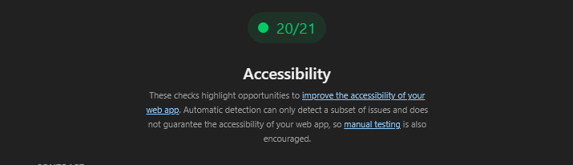
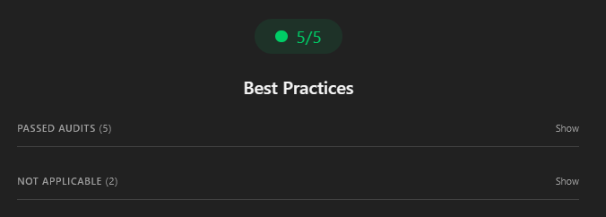
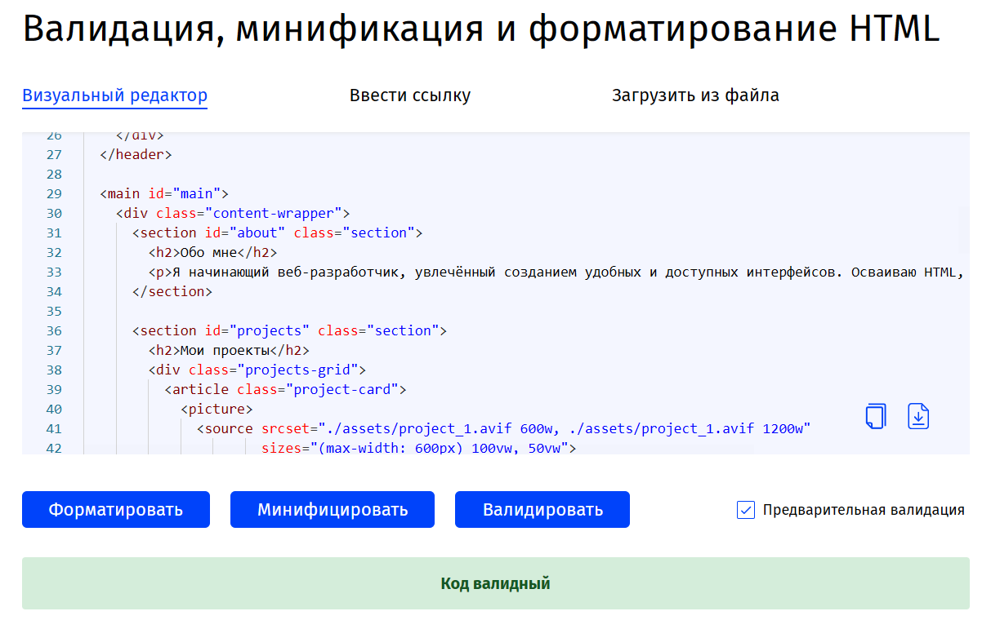
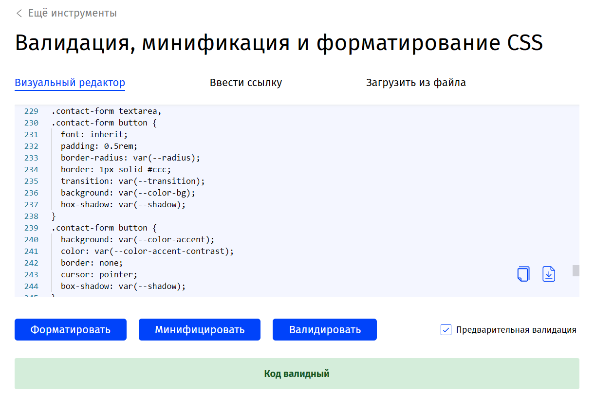
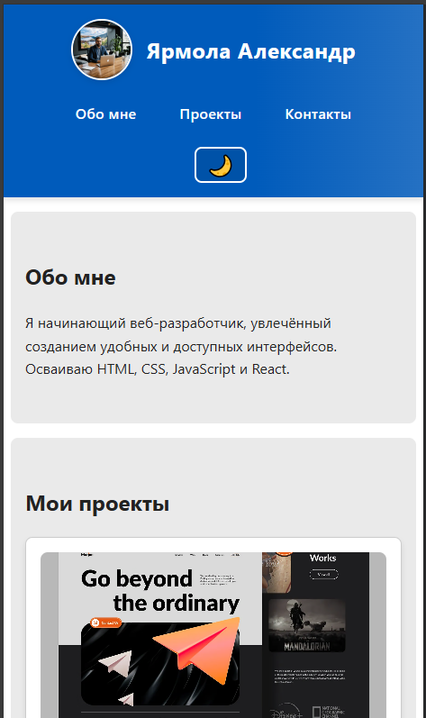
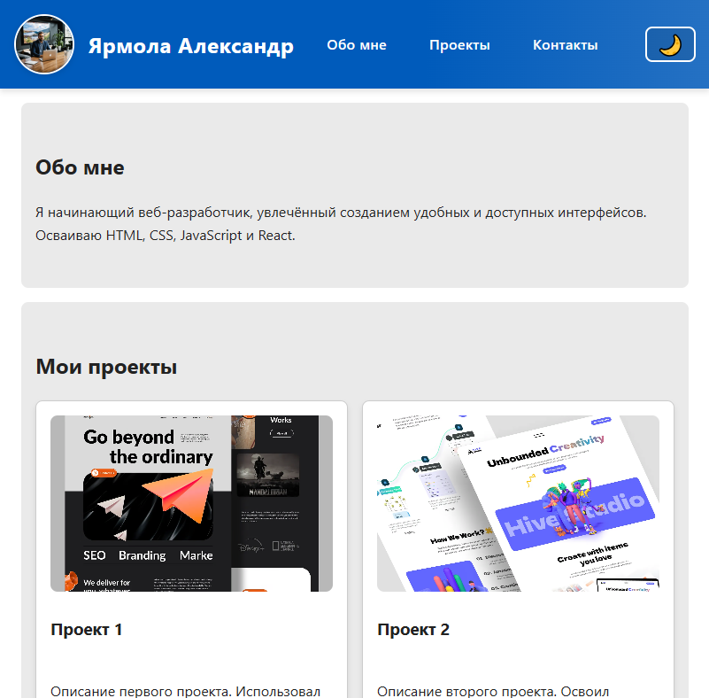
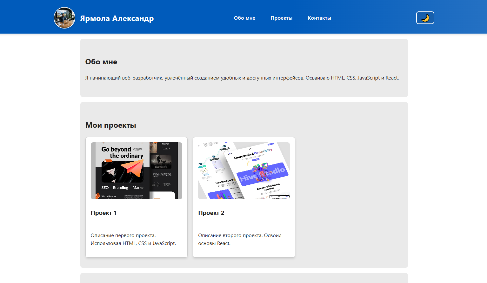

# Лабораторная работа 01. Личный сайт-резюме

## Описание

Одностраничный сайт-резюме с адаптивной вёрсткой, семантикой HTML5 и акцентом на доступность.

## Структура проекта

- `src/index.html` — разметка страницы
- `src/styles.css` — стили и адаптив
- `src/assets/` — изображения
- `doc/readme.md` — отчет

## Скриншоты

- Lighthouse Accessibility:  
  
- Lighthouse Best Practices:  
  
- Валидатор HTML:  
  
- Валидатор CSS:  
  
- Адаптив:  
  
  
  
  