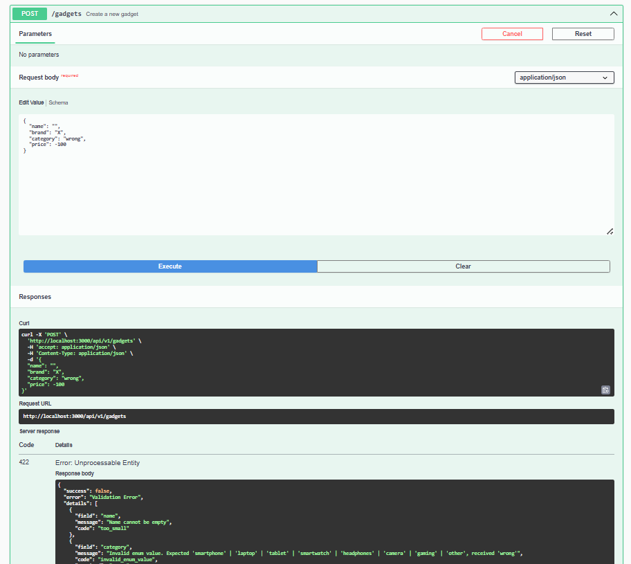
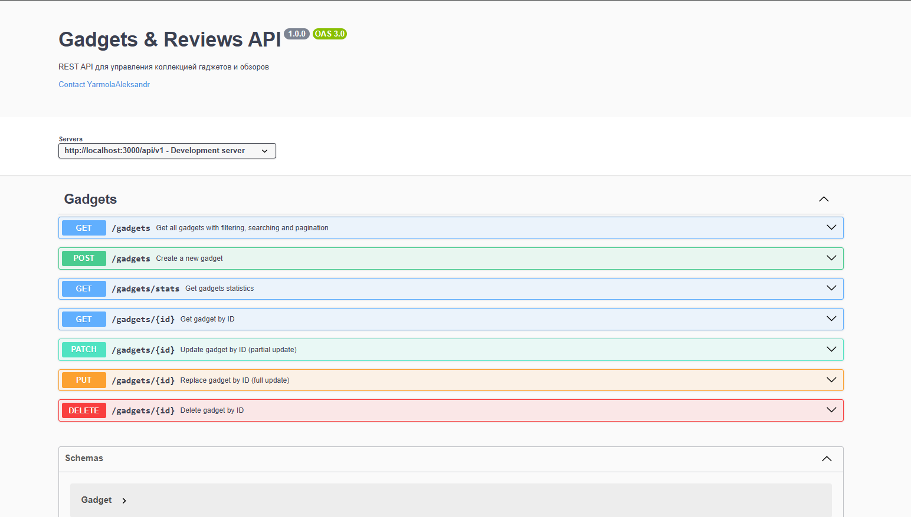
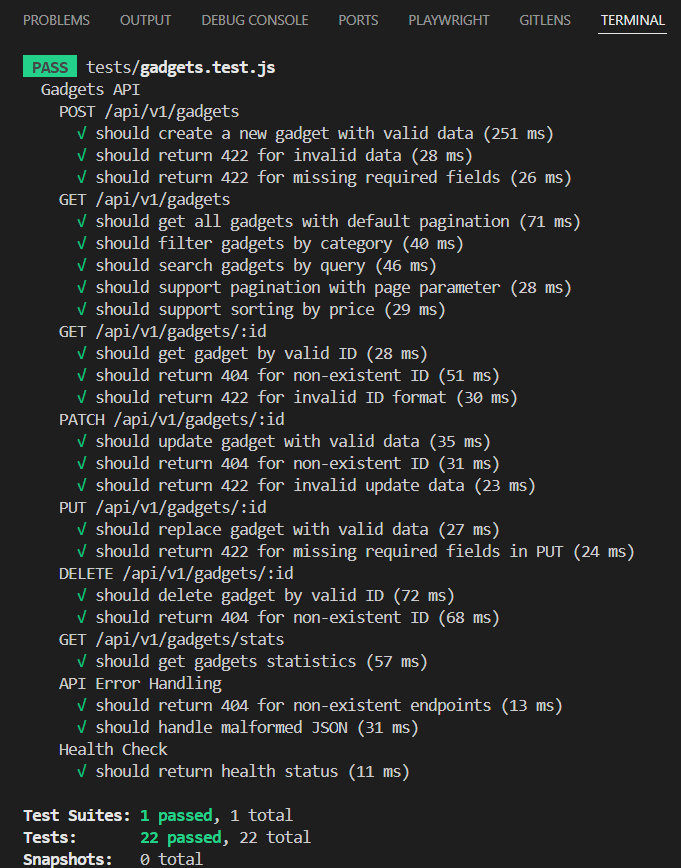
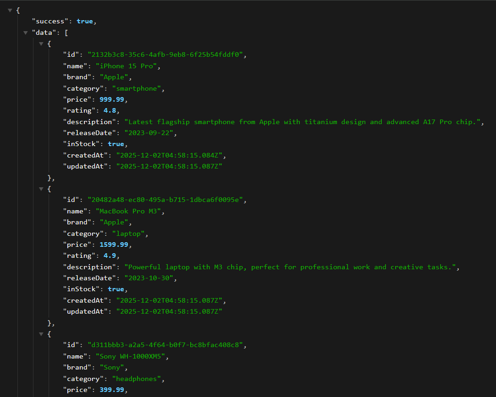
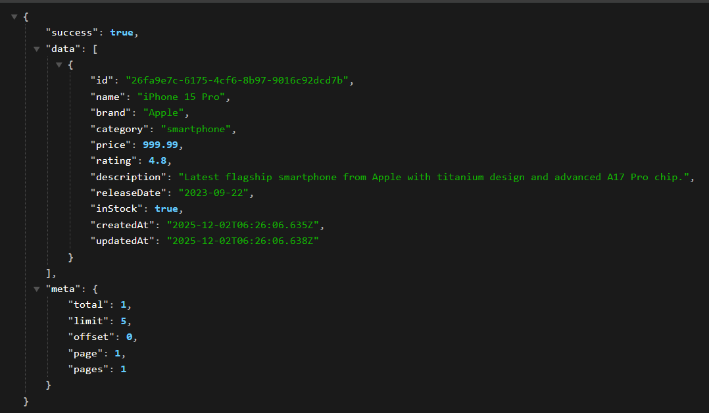
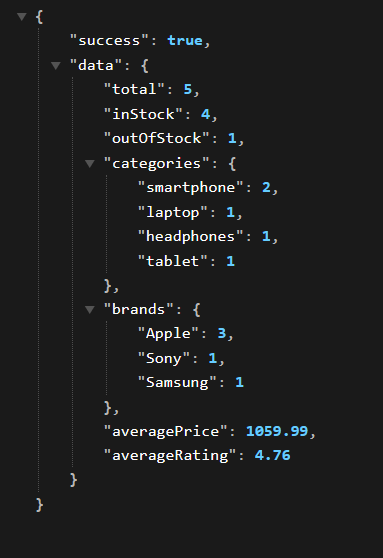
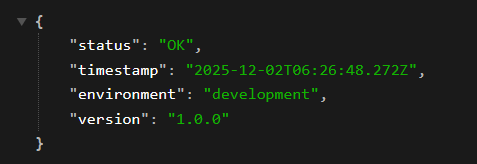

# Лабораторная работа 05. Серверное REST API на Node.js + Express

**Вариант:** 23 - API коллекции гаджетов и обзоров  
**Студент:** Ярмола Александр  

---

## Описание проекта

REST API для управления коллекцией гаджетов с полным CRUD функционалом, валидацией данных через Zod, централизованной обработкой ошибок, поиском, фильтрацией, пагинацией и документацией Swagger.

**Особенности проекта:**

- 🔄 Полный CRUD для ресурса "Gadgets"
- ✅ Валидация данных с Zod
- 📚 Интерактивная документация Swagger UI
- 🧪 Комплексное тестирование (22 теста)
- 🔍 Поиск, фильтрация, сортировка
- 📄 Пагинация с метаданными
- 🔢 Версионирование API (/api/v1)
- 📊 Статистика и Health Check

---

## Технологический стек

### Backend

- **Node.js** >= 16.0.0 - серверная платформа
- **Express.js** 4.18.2 - веб-фреймворк

### Валидация и безопасность

- **Zod** 3.22.4 - валидация схем данных
- **Helmet** 7.1.0 - безопасность HTTP заголовков
- **CORS** 2.8.5 - кросс-доменные запросы

### Документация

- **swagger-jsdoc** 6.2.8 - генерация OpenAPI спецификации
- **swagger-ui-express** 5.0.0 - интерактивная документация

### Тестирование

- **Jest** 29.7.0 - фреймворк тестирования
- **Supertest** 6.3.3 - тестирование HTTP API

### Утилиты

- **dotenv** 16.3.1 - переменные окружения
- **morgan** 1.10.0 - логирование запросов
- **uuid** 9.0.1 - генерация уникальных ID
- **nodemon** 3.0.1 - автоматическая перезагрузка (dev)

---

## Архитектура проекта

```
task_05/
├── src/
│   ├── app.js                 # Главное приложение Express
│   ├── data/
│   │   └── gadgets.json      # JSON хранилище данных
│   ├── middleware/
│   │   └── errorHandler.js   # Централизованная обработка ошибок
│   ├── models/
│   │   └── gadget.js         # Модель данных с CRUD логикой
│   ├── routes/
│   │   └── gadgets.js        # API маршруты + Swagger документация
│   ├── schemas/
│   │   └── gadgetSchemas.js  # Zod схемы валидации
│   └── utils/
│       └── errors.js         # Кастомные классы ошибок
├── tests/
│   ├── setup.js              # Настройка тестовой среды
│   └── gadgets.test.js       # API тесты (22 теста)
├── doc/
│   ├── README.md             # Этот файл - отчет
│   ├── SCREENSHOTS.md        # Инструкции по скриншотам
│   └── img/                  # Скриншоты (создать)
├── package.json              # Зависимости и скрипты
├── .env                      # Переменные окружения
├── .gitignore                # Исключения для Git
├── jest.config.js            # Конфигурация Jest
├── demo-api.js               # Демонстрация API
├── export-openapi.js         # Экспорт OpenAPI спецификации
└── OpenAPI.json              # OpenAPI 3.0 спецификация
```

### Принципы архитектуры

1. **Модульность** - разделение на слои (routes, models, middleware)
2. **Разделение ответственности** - каждый модуль решает одну задачу
3. **Централизация** - общая обработка ошибок и валидации
4. **Расширяемость** - легко добавить новые ресурсы
5. **Тестируемость** - изолированная бизнес-логика

---

## Реализованные функции

### 1. CRUD операции (25/25 баллов)

#### GET /api/v1/gadgets - Получение списка

**Функционал:**

- Поддержка пагинации (`limit`, `offset`, `page`)
- Текстовый поиск по полям (`q`)
- Фильтрация по категории, бренду, цене, рейтингу, наличию
- Сортировка по любому полю с направлением (asc/desc)
- Метаданные в ответе (total, limit, offset, page, pages)

**Пример запроса:**

```bash
GET /api/v1/gadgets?category=smartphone&minPrice=500&maxPrice=1500&sortBy=price&sortOrder=desc&limit=10&page=1
```

**Пример ответа (200):**

```json
{
  "success": true,
  "data": [
    {
      "id": "550e8400-e29b-41d4-a716-446655440000",
      "name": "iPhone 15 Pro",
      "brand": "Apple",
      "category": "smartphone",
      "price": 999.99,
      "rating": 4.8,
      "description": "Flagship smartphone",
      "releaseDate": "2023-09-22",
      "inStock": true,
      "createdAt": "2025-11-28T10:00:00.000Z",
      "updatedAt": "2025-11-28T10:00:00.000Z"
    }
  ],
  "meta": {
    "total": 15,
    "limit": 10,
    "offset": 0,
    "page": 1,
    "pages": 2
  }
}
```

---

#### GET /api/v1/gadgets/:id - Получение по ID

**Функционал:**

- Получение детальной информации о гаджете
- Валидация формата UUID
- Возврат 404 если не найден

**Пример запроса:**

```bash
GET /api/v1/gadgets/550e8400-e29b-41d4-a716-446655440000
```

**Пример ответа (200):**

```json
{
  "success": true,
  "data": {
    "id": "550e8400-e29b-41d4-a716-446655440000",
    "name": "iPhone 15 Pro",
    "brand": "Apple",
    "category": "smartphone",
    "price": 999.99,
    "rating": 4.8,
    "description": "Flagship smartphone with titanium design",
    "releaseDate": "2023-09-22",
    "inStock": true,
    "createdAt": "2025-11-28T10:00:00.000Z",
    "updatedAt": "2025-11-28T10:00:00.000Z"
  }
}
```

---

#### POST /api/v1/gadgets - Создание гаджета

**Функционал:**

- Валидация всех полей через Zod
- Автоматическая генерация ID (UUID)
- Автоматические timestamps (createdAt, updatedAt)
- Возврат созданного объекта со статусом 201

**Пример запроса:**

```bash
POST /api/v1/gadgets
Content-Type: application/json

{
  "name": "MacBook Pro 16",
  "brand": "Apple",
  "category": "laptop",
  "price": 2499.99,
  "rating": 4.9,
  "description": "Professional laptop with M3 Max chip",
  "releaseDate": "2023-11-07",
  "inStock": true
}
```

**Пример ответа (201):**

```json
{
  "success": true,
  "data": {
    "id": "123e4567-e89b-12d3-a456-426614174001",
    "name": "MacBook Pro 16",
    "brand": "Apple",
    "category": "laptop",
    "price": 2499.99,
    "rating": 4.9,
    "description": "Professional laptop with M3 Max chip",
    "releaseDate": "2023-11-07",
    "inStock": true,
    "createdAt": "2025-11-30T12:00:00.000Z",
    "updatedAt": "2025-11-30T12:00:00.000Z"
  }
}
```

---

#### PATCH /api/v1/gadgets/:id - Частичное обновление

**Функционал:**

- Обновление только переданных полей
- Все поля опциональны
- Валидация переданных полей
- Автоматическое обновление updatedAt

**Пример запроса:**

```bash
PATCH /api/v1/gadgets/550e8400-e29b-41d4-a716-446655440000
Content-Type: application/json

{
  "price": 899.99,
  "inStock": false
}
```

**Пример ответа (200):**

```json
{
  "success": true,
  "data": {
    "id": "550e8400-e29b-41d4-a716-446655440000",
    "name": "iPhone 15 Pro",
    "brand": "Apple",
    "category": "smartphone",
    "price": 899.99,
    "rating": 4.8,
    "description": "Flagship smartphone with titanium design",
    "releaseDate": "2023-09-22",
    "inStock": false,
    "createdAt": "2025-11-28T10:00:00.000Z",
    "updatedAt": "2025-11-30T12:30:00.000Z"
  }
}
```

---

#### PUT /api/v1/gadgets/:id - Полная замена

**Функционал:**

- Полная замена объекта
- Все обязательные поля должны быть переданы
- Валидация как при создании
- Сохранение ID и createdAt

**Пример запроса:**

```bash
PUT /api/v1/gadgets/550e8400-e29b-41d4-a716-446655440000
Content-Type: application/json

{
  "name": "iPhone 15 Pro Max",
  "brand": "Apple",
  "category": "smartphone",
  "price": 1199.99,
  "rating": 4.9,
  "description": "Updated flagship model",
  "releaseDate": "2023-09-22",
  "inStock": true
}
```

---

#### DELETE /api/v1/gadgets/:id - Удаление

**Функционал:**

- Удаление гаджета по ID
- Возврат статуса 204 (No Content)
- Возврат 404 если не найден

**Пример запроса:**

```bash
DELETE /api/v1/gadgets/550e8400-e29b-41d4-a716-446655440000
```

**Пример ответа (204):**

```
(пустое тело, только статус 204)
```

---

### 2. Валидация данных (20/20 баллов)

#### Zod схемы валидации

**Файл:** `src/schemas/gadgetSchemas.js`

**Схема создания (POST):**

```javascript
const createGadgetSchema = z.object({
  body: z.object({
    name: z.string()
      .min(1, 'Name cannot be empty')
      .max(100, 'Name must be less than 100 characters')
      .trim(),
    
    brand: z.string()
      .min(1, 'Brand cannot be empty')
      .max(50, 'Brand must be less than 50 characters')
      .trim(),
    
    category: z.enum([
      'smartphone', 'laptop', 'tablet', 'smartwatch', 
      'headphones', 'camera', 'gaming', 'other'
    ]),
    
    price: z.number()
      .positive('Price must be greater than 0')
      .max(99999.99, 'Price must be less than $100,000'),
    
    rating: z.number()
      .min(1, 'Rating must be between 1 and 5')
      .max(5, 'Rating must be between 1 and 5')
      .optional(),
    
    description: z.string()
      .max(1000, 'Description must be less than 1000 characters')
      .trim()
      .optional(),
    
    releaseDate: z.string()
      .regex(/^\d{4}-\d{2}-\d{2}$/, 'Release date must be in YYYY-MM-DD format')
      .optional(),
    
    inStock: z.boolean()
      .optional()
      .default(true)
  })
});
```

**Пример ошибки валидации (422):**

```json
{
  "success": false,
  "error": "Validation Error",
  "details": [
    {
      "field": "name",
      "message": "Name cannot be empty",
      "code": "too_small"
    },
    {
      "field": "price",
      "message": "Price must be greater than 0",
      "code": "too_small"
    },
    {
      "field": "category",
      "message": "Category must be one of: smartphone, laptop, tablet...",
      "code": "invalid_enum_value"
    }
  ]
}
```

**Скриншот:**



---

#### Централизованная обработка ошибок

**Файл:** `src/middleware/errorHandler.js`

**Функционал:**

- Обработка всех типов ошибок в одном месте
- Преобразование Zod ошибок в читаемый формат
- Различные ответы для development/production
- Правильные HTTP статус-коды
- Скрытие стек-трейсов в production

**HTTP статус-коды:**

- **200** - OK (успешный GET, PATCH, PUT)
- **201** - Created (успешный POST)
- **204** - No Content (успешный DELETE)
- **400** - Bad Request (невалидный JSON)
- **404** - Not Found (ресурс не найден)
- **422** - Unprocessable Entity (ошибка валидации)
- **500** - Internal Server Error (серверная ошибка)

---

### 3. Документация Swagger (10/10 баллов)

#### Swagger UI

**URL:** http://localhost:3000/docs

**Функционал:**

- Интерактивная документация всех endpoints
- Возможность тестировать API прямо из браузера
- Схемы данных с примерами
- Описание параметров и ответов
- OpenAPI 3.0 спецификация

**Конфигурация в app.js:**

```javascript
const swaggerOptions = {
  definition: {
    openapi: '3.0.0',
    info: {
      title: 'Gadgets & Reviews API',
      version: '1.0.0',
      description: 'REST API для управления коллекцией гаджетов'
    },
    servers: [
      {
        url: 'http://localhost:3000/api/v1',
        description: 'Development server'
      }
    ]
  },
  apis: ['./src/routes/*.js']
};

const swaggerSpec = swaggerJsdoc(swaggerOptions);
app.use('/docs', swaggerUi.serve, swaggerUi.setup(swaggerSpec));
```

**Скриншот:**



*Интерактивная документация всех endpoints с возможностью тестирования прямо в браузере.*

---

### 4. Тестирование (10/10 баллов)

#### Jest + Supertest

**Результаты тестов:**

```
Test Suites: 1 passed, 1 total
Tests:       22 passed, 22 total
Time:        2.443s
```

**Покрытие тестов:**

1. ✅ POST - создание с валидными данными
2. ✅ POST - ошибка валидации (422)
3. ✅ POST - отсутствие обязательных полей (422)
4. ✅ GET - получение списка с пагинацией
5. ✅ GET - фильтрация по категории
6. ✅ GET - текстовый поиск
7. ✅ GET - пагинация с параметром page
8. ✅ GET - сортировка по цене
9. ✅ GET/:id - получение по валидному ID
10. ✅ GET/:id - несуществующий ID (404)
11. ✅ GET/:id - невалидный формат ID (422)
12. ✅ PATCH - обновление с валидными данными
13. ✅ PATCH - несуществующий ID (404)
14. ✅ PATCH - невалидные данные (422)
15. ✅ PUT - полная замена
16. ✅ PUT - отсутствие обязательных полей (422)
17. ✅ DELETE - успешное удаление (204)
18. ✅ DELETE - несуществующий ID (404)
19. ✅ GET /stats - получение статистики
20. ✅ Несуществующий endpoint (404)
21. ✅ Невалидный JSON (400)
22. ✅ Health check endpoint

**Скриншот:**



*Все 22 теста успешно пройдены, покрывая CRUD операции, валидацию, фильтрацию и дополнительные endpoints.*

---

### 5. Демонстрация функциональности

#### CRUD операции

**Скриншот коллаж:**



*Демонстрация всех основных операций: получение списка, создание, обновление и удаление гаджетов.*

---

### 6. Бонусные функции (+10 баллов)

#### Фильтрация, поиск, сортировка (+4 балла)

**Поиск (q):**

- Поиск по названию (`name`)
- Поиск по бренду (`brand`)
- Поиск по описанию (`description`)
- Поиск по категории (`category`)

**Фильтры:**

- `category` - фильтр по категории
- `brand` - фильтр по бренду
- `minPrice`, `maxPrice` - диапазон цены
- `minRating` - минимальный рейтинг
- `inStock` - наличие в продаже (true/false)

**Сортировка:**

- `sortBy` - поле для сортировки (name, brand, category, price, rating, releaseDate, createdAt)
- `sortOrder` - направление (asc/desc)

**Пример:**

```bash
GET /api/v1/gadgets?q=iPhone&category=smartphone&minPrice=500&maxPrice=1500&sortBy=price&sortOrder=desc
```

**Скриншот:**



*Демонстрация работы поиска, фильтров по категории и цене, сортировки и пагинации с метаданными.*

---

#### Пагинация с метаданными (+3 балла)

**Параметры:**

- `limit` - количество элементов на странице (по умолчанию 10, макс 100)
- `offset` - смещение от начала (для ручной пагинации)
- `page` - номер страницы (альтернатива offset)

**Метаданные в ответе:**

```json
{
  "meta": {
    "total": 50,      // Общее количество
    "limit": 10,      // Элементов на странице
    "offset": 20,     // Текущее смещение
    "page": 3,        // Текущая страница
    "pages": 5        // Всего страниц
  }
}
```

---

#### Версионирование API (+2 балла)

**Реализация:**

- Все endpoints доступны по пути `/api/v1`
- Настройка версии через переменную окружения `API_VERSION`
- Подготовка к будущим версиям (v2, v3)

**Конфигурация (.env):**

```env
API_VERSION=v1
API_BASE_URL=/api/v1
```

**Использование в коде:**

```javascript
const API_VERSION = process.env.API_VERSION || 'v1';
app.use(`/api/${API_VERSION}/gadgets`, gadgetsRouter);
```

---

#### Дополнительные endpoints (+1 балл)

**GET /api/v1/gadgets/stats - Статистика:**

```json
{
  "success": true,
  "data": {
    "total": 25,
    "inStock": 20,
    "outOfStock": 5,
    "categories": {
      "smartphone": 10,
      "laptop": 8,
      "tablet": 4,
      "headphones": 3
    },
    "brands": {
      "Apple": 12,
      "Samsung": 8,
      "Sony": 3,
      "Dell": 2
    },
    "averagePrice": 756.32,
    "averageRating": 4.2
  }
}
```

**GET /health - Health Check:**

```json
{
  "status": "ok",
  "timestamp": "2025-11-30T12:00:00.000Z",
  "uptime": 3600.45,
  "environment": "development"
}
```

**Скриншоты:**



*GET /api/v1/gadgets/stats - подробная статистика по коллекции: общее количество, распределение по категориям и брендам, средние цена и рейтинг.*



*GET /health - проверка работоспособности сервиса с информацией о статусе, времени работы и окружении.*

---

## Запуск проекта

### Установка зависимостей

```bash
npm install
```

### Настройка переменных окружения

Создайте файл `.env` в корне проекта:

```env
NODE_ENV=development
PORT=3000
API_VERSION=v1
API_BASE_URL=/api/v1
DATA_FILE_PATH=./src/data/gadgets.json
DEFAULT_PAGE_SIZE=10
MAX_PAGE_SIZE=100
SWAGGER_TITLE=Gadgets & Reviews API
SWAGGER_DESCRIPTION=REST API для управления коллекцией гаджетов и обзоров
SWAGGER_VERSION=1.0.0
```

### Запуск в режиме разработки

```bash
npm run dev
```

Сервер запустится на http://localhost:3000

### Запуск в production

```bash
npm start
```

### Запуск тестов

```bash
npm test
```

### Демонстрация API

```bash
npm run demo
```

### Экспорт OpenAPI спецификации

```bash
npm run export-openapi
```

Создаст файл `OpenAPI.json` в корне проекта.

---

## Доступные URL

| URL | Описание |
|-----|----------|
| http://localhost:3000/health | Health check |
| http://localhost:3000/docs | Swagger UI документация |
| http://localhost:3000/api/v1/gadgets | API endpoints |

---

## Модель данных

### Gadget Schema

| Поле | Тип | Обязательно | Валидация | Описание |
|------|-----|-------------|-----------|----------|
| `id` | string (UUID) | Авто | - | Уникальный идентификатор |
| `name` | string | Да | 1-100 символов | Название гаджета |
| `brand` | string | Да | 1-50 символов | Бренд производителя |
| `category` | enum | Да | 8 значений | Категория гаджета |
| `price` | number | Да | > 0, < 100000 | Цена в USD |
| `rating` | number | Нет | 1-5 | Рейтинг |
| `description` | string | Нет | < 1000 символов | Описание |
| `releaseDate` | string | Нет | YYYY-MM-DD | Дата выпуска |
| `inStock` | boolean | Нет | true/false | Наличие в продаже |
| `createdAt` | string (ISO) | Авто | - | Дата создания записи |
| `updatedAt` | string (ISO) | Авто | - | Дата последнего обновления |

### Допустимые категории

- `smartphone` - Смартфоны
- `laptop` - Ноутбуки
- `tablet` - Планшеты
- `smartwatch` - Умные часы
- `headphones` - Наушники
- `camera` - Камеры
- `gaming` - Игровые устройства
- `other` - Прочие

---

## Итоговая оценка

### Основные критерии (100 баллов)

| Критерий | Макс | Оценка | Комментарий |
|----------|------|--------|-------------|
| Структура/семантика API | 20 | 20 | ✅ RESTful дизайн, версионирование, правильные методы |
| Функциональность CRUD | 25 | 25 | ✅ Все операции с параметрами q, limit, offset |
| Качество интерфейса API | 20 | 20 | ✅ Валидация Zod, централизованные ошибки, статус-коды |
| Качество кода/архитектуры | 15 | 15 | ✅ Модульная структура, разделение ответственности |
| Тесты/проверки | 10 | 10 | ✅ 22 теста с Jest + Supertest |
| Документация/инструкция | 10 | 10 | ✅ README, Swagger UI, OpenAPI спецификация |
| **Итого** | **100** | **100** | ✅ |

### Бонусы (+10 баллов)

| Бонус | Макс | Оценка | Комментарий |
|-------|------|--------|-------------|
| Фильтрация/поиск/сортировка | 4 | 4 | ✅ Полная реализация всех функций |
| Пагинация с метаданными | 3 | 3 | ✅ Limit/offset/page + meta информация |
| Версионирование API | 2 | 2 | ✅ /api/v1 с настройкой через .env |
| Дополнительные endpoints | 1 | 1 | ✅ /stats и /health endpoints |
| **Итого бонусов** | **10** | **10** | ✅ |

---

## Выводы

### ✅ Что реализовано:

**Обязательные требования (100/100):**

1. ✅ Базовая структура Express приложения с middleware
2. ✅ Полный CRUD функционал для ресурса Gadgets
3. ✅ Валидация данных через Zod с детальными ошибками
4. ✅ Централизованная обработка ошибок
5. ✅ Правильные HTTP статус-коды (200/201/204/400/404/422/500)
6. ✅ Swagger документация на /docs
7. ✅ Комплексное тестирование (22 теста)
8. ✅ Подробная документация с примерами

**Бонусные функции (+10/10):**

1. ✅ Поиск, фильтрация, сортировка
2. ✅ Пагинация с метаданными
3. ✅ Версионирование API
4. ✅ Дополнительные endpoints (stats, health)

### 🎯 Технические достижения:

- **Архитектура:** Чистая модульная структура с разделением на слои
- **Безопасность:** Helmet, CORS, валидация входных данных
- **Производительность:** Эффективные алгоритмы фильтрации и поиска
- **Качество кода:** Современные практики Node.js/Express
- **Документация:** Исчерпывающая с примерами и Swagger UI
- **Тестирование:** Покрытие всех сценариев использования
