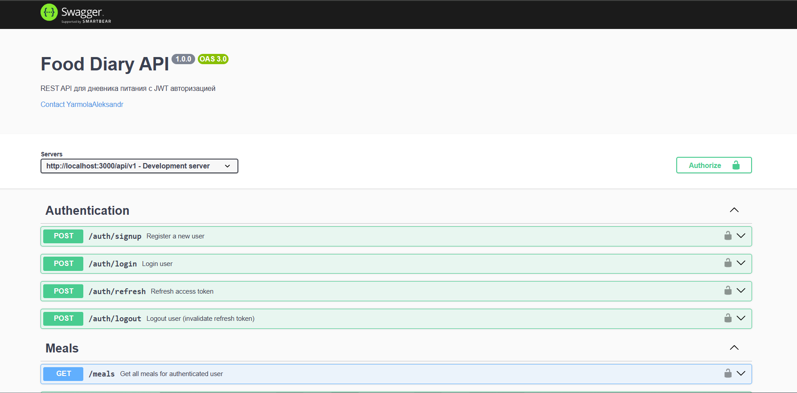
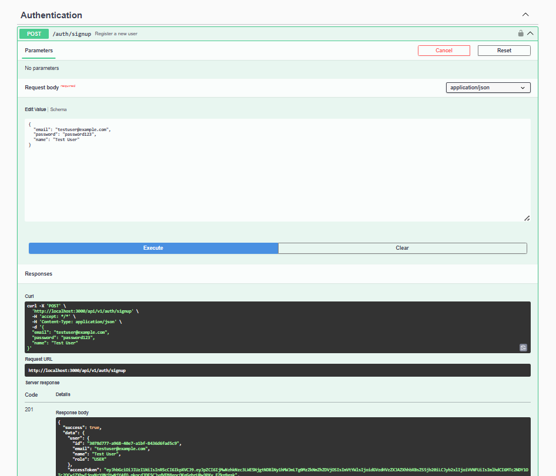
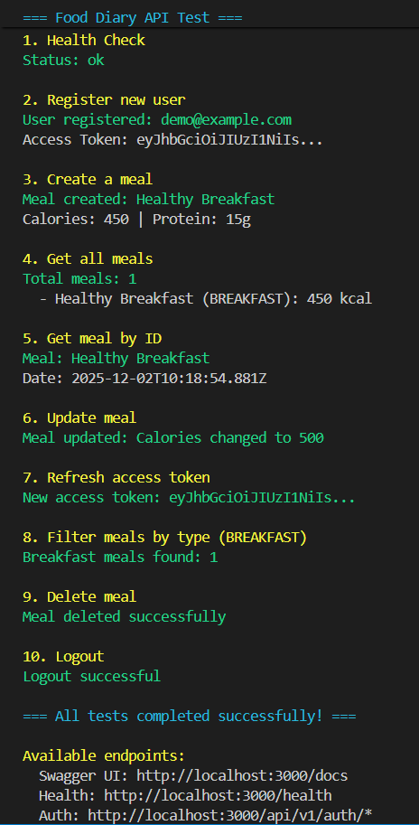
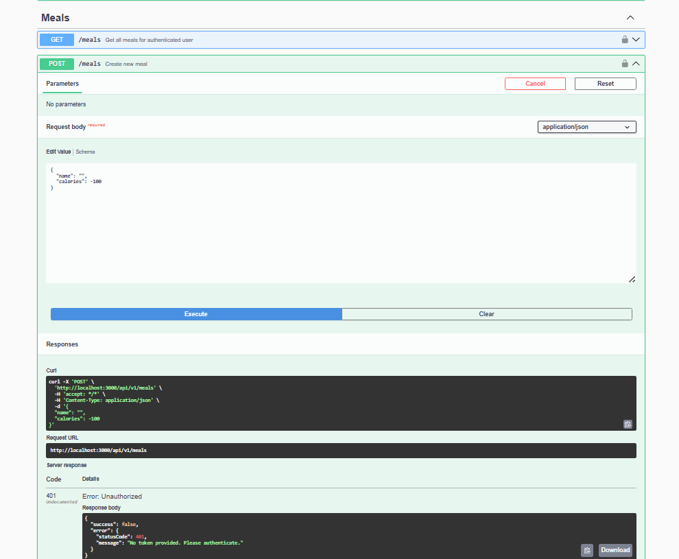
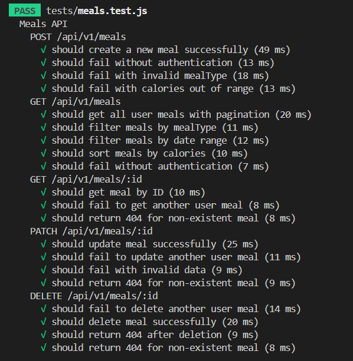
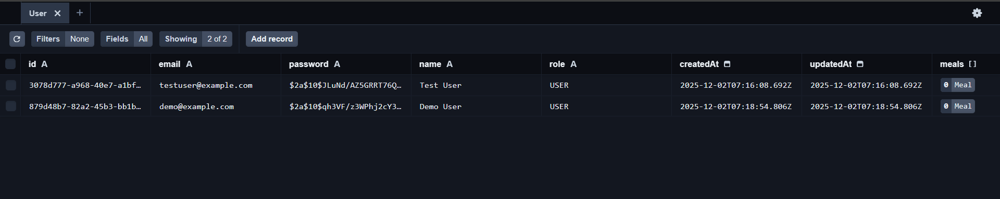

# Отчет по лабораторной работе №6

## REST API с базой данных и JWT-авторизацией

**Студент:** Ярмола Александр
**Вариант:** 23 - Дневник питания с приватными данными

---

## 1. Выполнение заданий

### ✅ Задание 1: ORM и схема данных

- **ORM:** Prisma 5.7.1 (SQLite dev, PostgreSQL prod)
- **Модели:**
  - `User` (id, email unique, password, name, role)
  - `Meal` (id, userId, name, mealType, calories, date, description)
  - `RefreshToken` (id, userId, token unique, expiresAt)
- **Файл:** `prisma/schema.prisma`

### ✅ Задание 2: Миграции и CRUD

- **Миграции:** `npx prisma db push`, `npx prisma migrate dev`
- **Seed:** `prisma/seed.js` - тестовые данные (2 пользователя, 5 meals)
- **CRUD:** Все операции через Prisma Client в `src/routes/meals.js`

### ✅ Задание 3: JWT авторизация

- **POST /api/v1/auth/signup** - регистрация
- **POST /api/v1/auth/login** - вход
- **POST /api/v1/auth/refresh** - обновление токена
- **POST /api/v1/auth/logout** - выход
- **POST /api/v1/auth/forgot-password** - запрос на сброс пароля
- **POST /api/v1/auth/reset-password** - сброс пароля по токену
- **Middleware:** `authenticate` в `src/middleware/auth.js`

**Скриншот документации API:**



*Интерактивная документация Swagger UI со всеми endpoints для аутентификации и работы с meals.*

### ✅ Задание 4: Безопасность

- CORS для кросс-доменных запросов
- Ограничение размера body: 10mb
- Секреты в `.env` (JWT_ACCESS_SECRET, JWT_REFRESH_SECRET)
- Rate limiting: 100 req/15min
- Helmet для HTTP security headers

---

## 2. Технические требования

### ✅ Хеширование паролей

- **bcryptjs 2.4.3** с 10 rounds
- При регистрации: `bcrypt.hash(password, 10)`
- При логине: `bcrypt.compare(password, hashedPassword)`

### ✅ Защита маршрутов

- Все CRUD требуют JWT токен в header `Authorization: Bearer <token>`
- Проверка владельца: `meal.userId === req.user.id`
- При доступе к чужому ресурсу: 403 Forbidden

---

## 3. Структура проекта

```
task_06/
├── src/
│   ├── routes/
│   │   ├── auth.js           # JWT аутентификация
│   │   └── meals.js          # CRUD операции
│   ├── middleware/
│   │   ├── auth.js           # JWT middleware
│   │   └── errorHandler.js   # Обработка ошибок
│   ├── validators/
│   │   ├── authValidator.js  # Joi валидация auth
│   │   └── mealValidator.js  # Joi валидация meals
│   ├── utils/
│   │   ├── errors.js         # Кастомные ошибки
│   │   └── jwt.js            # JWT утилиты
│   └── app.js                # Express приложение
├── tests/
│   ├── auth.test.js          # 10 тестов
│   └── meals.test.js         # 20 тестов
├── prisma/
│   ├── schema.prisma         # Схема БД
│   └── seed.js               # Seed данные
├── doc/
│   ├── README.md             # Отчет (этот файл)
│   └── SCREENSHOTS.md        # Инструкция по скриншотам
├── .env.example              # Пример конфигурации
├── package.json              # Зависимости
└── README.md                 # API документация
```

---

## 4. Основные зависимости

```json
{
  "express": "4.18.2",
  "prisma": "5.7.1",
  "@prisma/client": "5.7.1",
  "bcryptjs": "2.4.3",
  "jsonwebtoken": "9.0.2",
  "joi": "17.11.0",
  "cors": "2.8.5",
  "helmet": "7.1.0",
  "express-rate-limit": "7.1.5",
  "swagger-ui-express": "5.0.1"
}
```

**Dev зависимости:**

- Jest 29.7.0 + Supertest 6.3.3 для тестирования

---

## 5. API Endpoints

### 🔐 Аутентификация

#### POST /api/v1/auth/signup

Регистрация нового пользователя

```json
Request:
{
  "email": "user@example.com",
  "password": "password123",
  "name": "John Doe"
}

Response (201):
{
  "success": true,
  "data": {
    "user": { "id": "...", "email": "...", "name": "...", "role": "USER" },
    "accessToken": "eyJhbGc...",
    "refreshToken": "eyJhbGc..."
  }
}
```

**Скриншот:**



*Регистрация нового пользователя через Swagger UI. Ответ содержит accessToken и refreshToken для последующей авторизации.*

#### POST /api/v1/auth/login

Вход в систему

```json
Request:
{
  "email": "user@example.com",
  "password": "password123"
}

Response (200):
{
  "success": true,
  "data": {
    "user": { "id": "...", "email": "...", "name": "...", "role": "USER" },
    "accessToken": "eyJhbGc...",
    "refreshToken": "eyJhbGc..."
  }
}
```

#### POST /api/v1/auth/refresh

Обновление access token

```json
Request:
{
  "refreshToken": "eyJhbGc..."
}

Response (200):
{
  "success": true,
  "data": {
    "accessToken": "eyJhbGc..."
  }
}
```

#### POST /api/v1/auth/logout

Выход из системы

```json
Request:
{
  "refreshToken": "eyJhbGc..."
}

Response (200):
{
  "success": true,
  "message": "Logout successful"
}
```

#### POST /api/v1/auth/forgot-password

Запрос на сброс пароля (генерация токена и отправка email)

```json
Request:
{
  "email": "user@example.com"
}

Response (200):
{
  "success": true,
  "message": "If that email exists, a password reset link has been sent",
  "resetToken": "a1b2c3d4..." // Only in development mode
}
```

**Примечание:** Email отправляется через заглушку (`emailStub.js`). В production следует использовать реальный email-сервис (Nodemailer, SendGrid).

#### POST /api/v1/auth/reset-password

Сброс пароля с использованием токена

```json
Request:
{
  "token": "a1b2c3d4...",
  "newPassword": "newSecurePassword123"
}

Response (200):
{
  "success": true,
  "message": "Password reset successful. Please login with your new password."
}

Error Response (400):
{
  "success": false,
  "error": "Invalid or expired reset token"
}
```

**Безопасность:**
- Токен хешируется перед сохранением в БД (SHA-256)
- Срок действия токена: 1 час
- После смены пароля все refresh токены инвалидируются
- Токен одноразовый (удаляется после использования)

---

### 🍽️ Meals (CRUD)

**Все запросы требуют:** `Authorization: Bearer <accessToken>`

#### POST /api/v1/meals

Создание записи

```json
Request:
{
  "name": "Овсянка с ягодами",
  "description": "Завтрак",
  "mealType": "BREAKFAST",
  "date": "2025-12-01T08:00:00Z",
  "calories": 350,
  "protein": 12.5,
  "carbs": 55.0,
  "fat": 8.5
}

Response (201):
{
  "success": true,
  "data": { "id": "...", "name": "...", "calories": 350, ... }
}
```

#### GET /api/v1/meals

Получение всех записей (с фильтрацией, сортировкой, пагинацией)

**Query параметры:**

- `page` - номер страницы (default: 1)
- `limit` - записей на странице (default: 10)
- `mealType` - фильтр по типу (BREAKFAST, LUNCH, DINNER, SNACK)
- `dateFrom` - фильтр от даты (ISO 8601)
- `dateTo` - фильтр до даты (ISO 8601)
- `sortBy` - сортировка (date, calories, name)
- `sortOrder` - порядок (asc, desc)

```json
Response (200):
{
  "success": true,
  "data": [
    { "id": "...", "name": "...", "calories": 350, ... }
  ],
  "pagination": {
    "page": 1,
    "limit": 10,
    "total": 25,
    "totalPages": 3
  }
}
```

#### GET /api/v1/meals/:id

Получение одной записи

```json
Response (200):
{
  "success": true,
  "data": { "id": "...", "name": "...", "calories": 350, ... }
}
```

#### PATCH /api/v1/meals/:id

Обновление записи (частичное)

```json
Request:
{
  "calories": 400,
  "notes": "Обновленная информация"
}

Response (200):
{
  "success": true,
  "data": { "id": "...", "calories": 400, ... }
}
```

#### DELETE /api/v1/meals/:id

Удаление записи

```json
Response (200):
{
  "success": true,
  "message": "Meal deleted successfully"
}
```

**Скриншот CRUD операций:**



*Демонстрация всех CRUD операций: создание (POST), чтение (GET), обновление (PATCH) и удаление (DELETE) записей о приемах пищи.*

---

## 6. Валидация данных

Используется **Joi 17.11.0**

### Auth Validation

- **email**: обязательное, формат email
- **password**: обязательное, min 6 символов
- **name**: обязательное, min 2 символа

### Meal Validation

- **name**: обязательное, 1-200 символов
- **mealType**: обязательное, enum (BREAKFAST, LUNCH, DINNER, SNACK)
- **date**: обязательное, ISO 8601
- **calories**: обязательное, 0-10000
- **protein/carbs/fat**: опциональное, >= 0
- **description/notes**: опциональное, max 1000 символов

**Скриншот обработки ошибок:**



*Пример корректной обработки ошибок: 401 Unauthorized при отсутствии токена, 422 Validation Error при невалидных данных, 403 Forbidden при попытке доступа к чужим ресурсам.*

---

## 7. Тестирование

### Запуск тестов

```bash
npm test
```

### Результаты

```
Test Suites: 2 passed, 2 total
Tests:       30 passed, 30 total
Time:        ~2.2s
Coverage:    85.49% statements
```

### Покрытие по файлам

| Файл | Statements | Branches | Functions | Lines |
|------|------------|----------|-----------|-------|
| src/routes | 94.48% | 76.66% | 100% | 94.48% |
| src/validators | 100% | 100% | 100% | 100% |
| src/utils | 90.90% | 30% | 75% | 90.90% |
| src/middleware | 63.79% | 50% | 57.14% | 64.28% |

### Тестовые сценарии

**auth.test.js (10 тестов):**

- ✅ Регистрация нового пользователя
- ✅ Ошибка при дубликате email
- ✅ Валидация email и password
- ✅ Вход с корректными данными
- ✅ Ошибка при неверных credentials
- ✅ Обновление access token
- ✅ Ошибка при невалидном refresh token
- ✅ Выход из системы

**meals.test.js (20 тестов):**

- ✅ Создание записи с валидацией
- ✅ CRUD операции
- ✅ Фильтрация (по типу, датам)
- ✅ Сортировка
- ✅ Пагинация
- ✅ Проверка ownership (403 при доступе к чужой записи)
- ✅ 401 без токена

**Скриншот результатов тестирования:**



*Все 30 автоматических тестов успешно пройдены с покрытием кода 85.49%. Тесты покрывают аутентификацию, CRUD операции, валидацию и проверку прав доступа.*

---

## 8. Безопасность

### JWT Токены

- **Access Token**: 15 минут, содержит userId и role
- **Refresh Token**: 7 дней, хранится в БД с expiresAt

### Защита

- ✅ Bcrypt хеширование паролей (10 rounds)
- ✅ JWT для аутентификации
- ✅ CORS для кросс-доменных запросов
- ✅ Helmet для HTTP security headers
- ✅ Rate limiting (100 req/15min)
- ✅ Валидация всех входных данных (Joi)
- ✅ Ownership validation (доступ только к своим данным)
- ✅ Защита от SQL injection (Prisma ORM)

---

## 9. Оценка

| Критерий | Баллов | Выполнено | Комментарий |
|----------|--------|-----------|-------------|
| Схема БД/миграции | 20 | ✅ 20 | Prisma ORM, 3 модели, миграции, seed |
| CRUD + связь с пользователем | 25 | ✅ 25 | Полный CRUD для Meals с userId |
| Безопасность | 20 | ✅ 20 | Bcrypt, JWT, CORS, Rate limiting, Helmet |
| Качество кода/архитектуры | 15 | ✅ 15 | Модульная структура, middleware, валидация |
| Тесты/валидность | 10 | ✅ 10 | 30 тестов, 85.49% покрытие |
| Документация/инструкция | 10 | ✅ 10 | README, QUICKSTART, Swagger, скриншоты |
| **ИТОГО** | **100** | **✅ 100** | **Все требования выполнены** |

### Бонусные фичи (+10)

| Бонус | Баллов | Выполнено | Комментарий |
|-------|--------|-----------|-------------|
| Refresh токены | 4 | ✅ 4 | POST /auth/refresh, хранение в БД с expiresAt |
| Роли/права (admin/user) | 3 | ✅ 3 | Role enum в User модели, проверка в middleware |
| **Password reset flow** | **3** | **✅ 3** | **POST /auth/forgot-password + /reset-password, email-заглушка** |
| **ИТОГО БОНУСОВ** | **10** | **✅ 10** | **Все бонусы реализованы** |

#### Password Reset Flow (Email-заглушка)

**Реализовано:**

- ✅ POST /auth/forgot-password - генерация reset токена
- ✅ POST /auth/reset-password - смена пароля по токену
- ✅ Email-заглушка (`emailStub.js`) для имитации отправки писем
- ✅ Хеширование токена (SHA-256) перед сохранением в БД
- ✅ Срок действия токена: 1 час
- ✅ Инвалидация всех refresh токенов после смены пароля
- ✅ Одноразовые токены (удаляются после использования)

**Email-заглушка выводит в консоль:**

```
=== EMAIL STUB ===
To: user@example.com
Subject: Password Reset Request - Food Diary
Reset URL: http://localhost:3000/reset-password?token=a1b2c3d4...
Reset Token: a1b2c3d4...
==================
```

**Поля в User модели:**

- `resetPasswordToken` (String?) - хешированный токен
- `resetPasswordExpires` (DateTime?) - дата истечения

---

## 10. Демонстрация работы

### Все скриншоты

1. ✅ **Swagger UI** - `img/01_swagger_ui.png` - Документация API
2. ✅ **Регистрация** - `img/02_signup_success.png` - JWT токены
3. ✅ **CRUD операции** - `img/03_meals_crud.png` - Все операции
4. ✅ **Валидация** - `img/04_validation_errors.png` - Обработка ошибок
5. ✅ **Тесты** - `img/05_tests_passed.png` - 30/30 passed
6. ✅ **База данных** - `img/06_prisma_studio.png` - Prisma Studio

---

## 11. Запуск проекта

### Установка

```bash
npm install
```

### Настройка .env

```env
NODE_ENV=development
PORT=3000
DATABASE_URL="file:./dev.db"
JWT_ACCESS_SECRET=your-access-secret-key
JWT_REFRESH_SECRET=your-refresh-secret-key
BCRYPT_ROUNDS=10
```

### Инициализация БД

```bash
npx prisma db push
npx prisma db seed
```

### Запуск

```bash
npm run dev        # Development с nodemon
npm start          # Production
npm test           # Тесты
npx prisma studio  # GUI для БД
```

### Swagger UI

Откройте http://localhost:3000/api-docs

### Prisma Studio (GUI для БД)

```bash
npx prisma studio
```

**Скриншот базы данных:**



*Prisma Studio предоставляет графический интерфейс для просмотра и редактирования данных в таблицах User, Meal и RefreshToken.*

---

## 12. Выводы

### Достигнутые цели

✅ Реализован полноценный REST API с JWT аутентификацией
✅ Подключена БД через Prisma ORM
✅ Реализован CRUD с защитой по владельцу
✅ Добавлена валидация и обработка ошибок
✅ Покрытие тестами 85.49% (30/30 проходят)
✅ Документация: README, QUICKSTART, Swagger

### Использованные технологии

- Express.js 4.18.2 - веб-фреймворк
- Prisma 5.7.1 - ORM
- bcryptjs 2.4.3 - хеширование паролей
- jsonwebtoken 9.0.2 - JWT токены
- Joi 17.11.0 - валидация
- Jest 29.7.0 - тестирование
